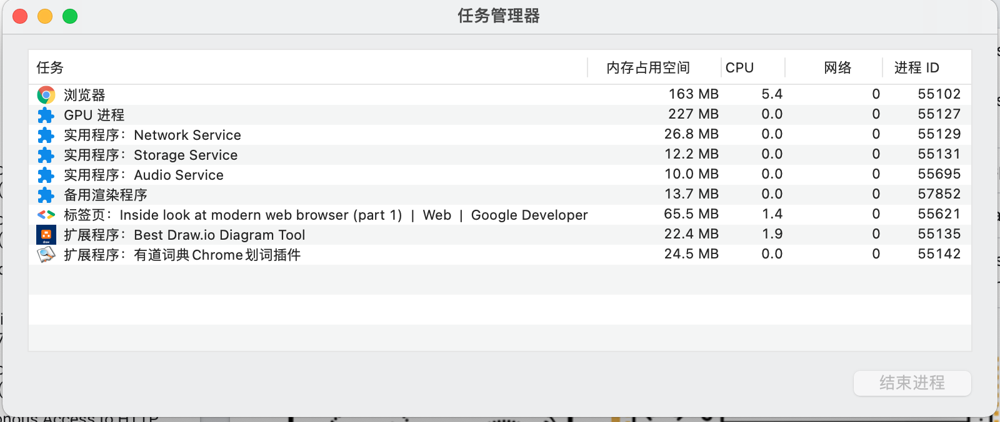
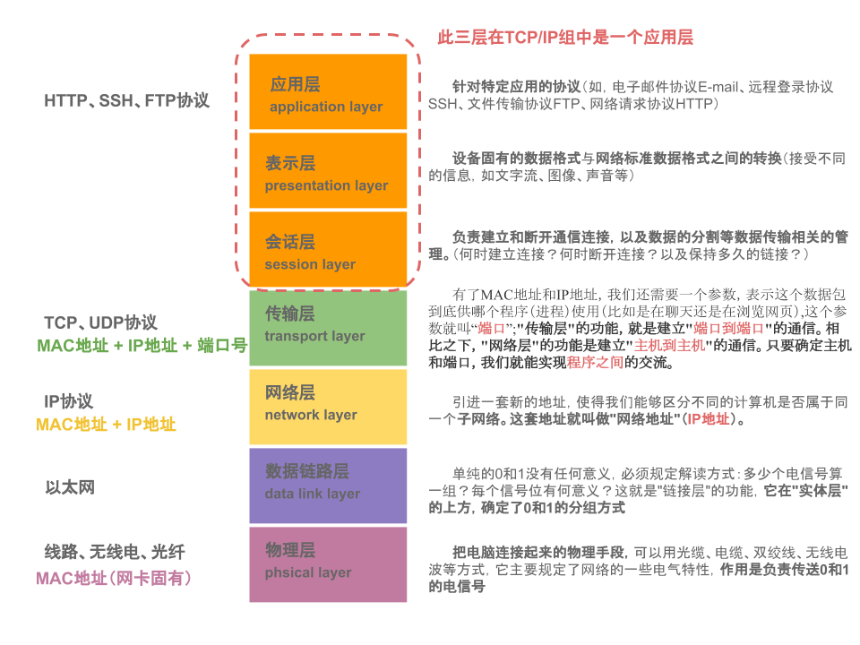
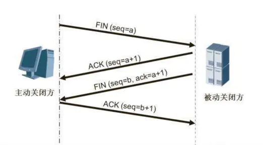
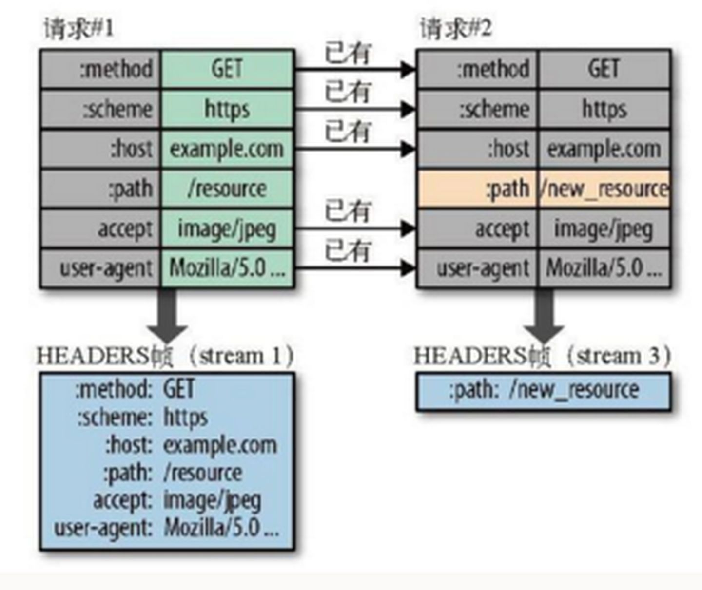

# 浏览器工作原理
- [浏览器工作原理](#浏览器工作原理)
  - [1. 浏览器的多进程架构](#1-浏览器的多进程架构)
  - [2. JS执行机制和V8](#2-js执行机制和v8)
    - [2.1. 栈和堆](#21-栈和堆)
    - [2.2. 垃圾回收](#22-垃圾回收)
      - [2.2.1. 调用栈中的数据是如何回收的](#221-调用栈中的数据是如何回收的)
      - [2.2.2. 堆中的数据是如何回收的](#222-堆中的数据是如何回收的)
    - [2.3. 编译器和解释器：V8是如何执行一段JavaScript代码的](#23-编译器和解释器v8是如何执行一段javascript代码的)
      - [2.3.1. 编译器和解释器](#231-编译器和解释器)
      - [2.3.2. V8 是如何执行一段 JavaScript 代码的](#232-v8-是如何执行一段-javascript-代码的)
    - [2.4. JavaScript 的性能优化](#24-javascript-的性能优化)
  - [3. 循环系统](#3-循环系统)
    - [3.1. 消息队列中的任务类型](#31-消息队列中的任务类型)
    - [3.2. 如何安全退出](#32-如何安全退出)
    - [3.3. 如何处理高优先级的任务](#33-如何处理高优先级的任务)
    - [3.4. 如何解决单个任务执行时长过久的问题](#34-如何解决单个任务执行时长过久的问题)
    - [3.5. 宏任务](#35-宏任务)
    - [3.6. 微任务](#36-微任务)
  - [4. 网络](#4-网络)
    - [4.1. 浏览器端发起 HTTP 请求流程](#41-浏览器端发起-http-请求流程)
    - [4.2. TCP的三次握手和四次挥手](#42-tcp的三次握手和四次挥手)
    - [4.3. http1.1](#43-http11)
    - [4.4. http2](#44-http2)
    - [4.5. http3](#45-http3)
    - [4.6. https](#46-https)
  - [5. 页面渲染过程](#5-页面渲染过程)
    - [5.1. 构建 DOM 树](#51-构建-dom-树)
    - [5.2. 样式计算（Recalculate Style）](#52-样式计算recalculate-style)
    - [5.3. 布局阶段](#53-布局阶段)
    - [5.4. 分层](#54-分层)
    - [5.5. 图层绘制](#55-图层绘制)
    - [5.6. 栅格化（raster）操作](#56-栅格化raster操作)
    - [5.5. 合成和显示](#55-合成和显示)
  - [6. 浏览器安全](#6-浏览器安全)
  - [7. 参考资料](#7-参考资料)

## 1. 浏览器的多进程架构

  

从图中可以看出， Chrome 浏览器包括：1 个浏览器（Browser）主进程、1 个 GPU 进程、1 个网络（NetWork）进程、多个渲染进程和多个插件进程。

1. 浏览器进程。主要负责界面显示、用户交互、子进程管理，同时提供存储等功能。
2. 渲染进程。核心任务是将 HTML、CSS 和 JavaScript 转换为用户可以与之交互的网页，排版引擎 Blink 和 JavaScript 引擎 V8 都是运行在该进程中，默认情况下，Chrome 会为每个 Tab 标签创建一个渲染进程。出于安全考虑，渲染进程都是运行在沙箱模式下。
3. GPU 进程。其实，Chrome 刚开始发布的时候是没有 GPU 进程的。而 GPU 的使用初衷是为了实现 3D CSS 的效果，只是随后网页、Chrome 的 UI 界面都选择采用 GPU 来绘制，这使得 GPU 成为浏览器普遍的需求。最后，Chrome 在其多进程架构上也引入了 GPU 进程。
4. 网络进程。主要负责页面的网络资源加载，之前是作为一个模块运行在浏览器进程里面的，直至最近才独立出来，成为一个单独的进程。插件进程。主要是负责插件的运行，因插件易崩溃，所以需要通过插件进程来隔离，以保证插件进程崩溃不会对浏览器和页面造成影响。  

下图是一个打开了 1 个页面的进程情况

  

在 2016 年，Chrome 官方团队使用“面向服务的架构”（Services Oriented Architecture，简称 SOA）的思想设计了新的 Chrome 架构。也就是说 Chrome 整体架构会朝向现代操作系统所采用的“面向服务的架构” 方向发展，原来的各种模块会被重构成独立的服务（Service），每个服务（Service）都可以在独立的进程中运行，访问服务（Service）必须使用定义好的接口，通过 IPC 来通信，从而构建一个更内聚、松耦合、易于维护和扩展的系统，更好实现 Chrome 简单、稳定、高速、安全的目标。  


## 2. JS执行机制和V8

### 2.1. 栈和堆

原始类型的数据是存放在栈中，引用类型的数据是存放在堆中的。堆中的数据是通过引用和变量关联起来的。也就是说，JavaScript 的变量是没有数据类型的，值才有数据类型，变量可以随时持有任何类型的数据。  

因为 JavaScript 引擎需要用栈来维护程序执行期间上下文的状态，如果栈空间大了话，所有的数据都存放在栈空间里面，那么会影响到上下文切换的效率，进而又影响到整个程序的执行效率。  

JavaScript 引擎正是利用栈的这种结构来管理执行上下文的。在执行上下文创建好后，JavaScript 引擎会将执行上下文压入栈中，通常把这种用来管理执行上下文的栈称为执行上下文栈，又称调用栈。  

### 2.2. 垃圾回收

使用的是自动垃圾回收的策略，如 JavaScript、Java、Python 等语言，产生的垃圾数据是由垃圾回收器来释放的，并不需要手动通过代码来释放。  

#### 2.2.1. 调用栈中的数据是如何回收的

原始类型的数据被分配到栈中，引用类型的数据会被分配到堆中。当 foo 函数执行结束之后，foo 函数的执行上下文会从堆中被销毁掉

```js

function foo(){
    var a = 1
    var b = {name:"AA"}
    function showName(){
      var c = 2
      var d = {name:"BB"}
    }
    showName()
}
foo()
```

如果执行到 showName 函数时，那么 JavaScript 引擎会创建 showName 函数的执行上下文，并将 showName 函数的执行上下文压入到调用栈中，最终执行到 showName 函数时，与此同时，还有一个记录当前执行状态的指针（称为 ESP），指向调用栈中 showName 函数的执行上下文，表示当前正在执行 showName 函数。  

当 showName 函数执行完成之后，函数执行流程就进入了 foo 函数，那这时就需要销毁 showName 函数的执行上下文了。JavaScript 会将 ESP 下移到 foo 函数的执行上下文，这个下移操作就是销毁 showName 函数执行上下文的过程。  


#### 2.2.2. 堆中的数据是如何回收的

当上面那段代码的 foo 函数执行结束之后，ESP 应该是指向全局执行上下文的，那这样的话，showName 函数和 foo 函数的执行上下文就处于无效状态了，不过保存在堆中的两个对象依然占用着空间, 要回收堆中的垃圾数据，就需要用到 JavaScript 中的垃圾回收器了。  

代际假说（The Generational Hypothesis）的内容，这是垃圾回收领域中一个重要的术语，后续垃圾回收的策略都是建立在该假说的基础之上的，所以很是重要。代际假说有以下两个特点：  

- 第一个是大部分对象在内存中存在的时间很短，简单来说，就是很多对象一经分配内存，很快就变得不可访问；  
- 第二个是不死的对象，会活得更久。  

在 V8 中会把堆分为新生代和老生代两个区域，新生代中存放的是生存时间短的对象，老生代中存放的生存时间久的对象。  

新生区通常只支持 1～8M 的容量，而老生区支持的容量就大很多了。对于这两块区域，V8 分别使用两个不同的垃圾回收器，以便更高效地实施垃圾回收。  

- 副垃圾回收器，主要负责新生代的垃圾回收。  
- 主垃圾回收器，主要负责老生代的垃圾回收。  

> 垃圾回收器的工作流程  

 V8 把堆分成两个区域——新生代和老生代，并分别使用两个不同的垃圾回收器。其实不论什么类型的垃圾回收器，它们都有一套共同的执行流程。  

- 第一步是标记空间中活动对象和非活动对象。所谓活动对象就是还在使用的对象，非活动对象就是可以进行垃圾回收的对象。
- 第二步是回收非活动对象所占据的内存。其实就是在所有的标记完成之后，统一清理内存中所有被标记为可回收的对象。
- 第三步是做内存整理。一般来说，频繁回收对象后，内存中就会存在大量不连续空间，我们把这些不连续的内存空间称为内存碎片。当内存中出现了大量的内存碎片之后，如果需要分配较大连续内存的时候，就有可能出现内存不足的情况。所以最后一步需要整理这些内存碎片，但这步其实是可选的，因为有的垃圾回收器不会产生内存碎片，比如副垃圾回收器。  

> **副垃圾回收器**

副垃圾回收器主要负责新生区的垃圾回收。而通常情况下，大多数小的对象都会被分配到新生区，所以说这个区域虽然不大，但是垃圾回收还是比较频繁的。  

新生代中用 Scavenge 算法来处理。所谓 Scavenge 算法，是把新生代空间对半划分为两个区域，一半是对象区域，一半是空闲区域，如下图所示：


新加入的对象都会存放到对象区域，当对象区域快被写满时，就需要执行一次垃圾清理操作。  
在垃圾回收过程中，首先要对对象区域中的垃圾做标记；标记完成之后，就进入垃圾清理阶段，副垃圾回收器会把这些存活的对象复制到空闲区域中，同时它还会把这些对象有序地排列起来，所以这个复制过程，也就相当于完成了内存整理操作，复制后空闲区域就没有内存碎片了。  

完成复制后，对象区域与空闲区域进行角色翻转，也就是原来的对象区域变成空闲区域，原来的空闲区域变成了对象区域。这样就完成了垃圾对象的回收操作，同时这种角色翻转的操作还能让新生代中的这两块区域无限重复使用下去。  

由于新生代中采用的 Scavenge 算法，所以每次执行清理操作时，都需要将存活的对象从对象区域复制到空闲区域。但复制操作需要时间成本，如果新生区空间设置得太大了，那么每次清理的时间就会过久，所以为了执行效率，一般新生区的空间会被设置得比较小。  

也正是因为新生区的空间不大，所以很容易被存活的对象装满整个区域。为了解决这个问题，JavaScript 引擎采用了对象晋升策略，也就是经过两次垃圾回收依然还存活的对象，会被移动到老生区中。  

> **主垃圾回收器**  

主垃圾回收器主要负责老生区中的垃圾回收。除了新生区中晋升的对象，一些大的对象会直接被分配到老生区。因此老生区中的对象有两个特点，一个是对象占用空间大，另一个是对象存活时间长。  

由于老生区的对象比较大，若要在老生区中使用 Scavenge 算法进行垃圾回收，复制这些大的对象将会花费比较多的时间，从而导致回收执行效率不高，同时还会浪费一半的空间。因而，主垃圾回收器是采用标记 - 清除（Mark-Sweep）的算法进行垃圾回收的。  

- 首先是标记过程阶段。标记阶段就是从一组根元素开始，递归遍历这组根元素，在这个遍历过程中，能到达的元素称为活动对象，没有到达的元素就可以判断为垃圾数据。

- 垃圾的清除过程。它和副垃圾回收器的垃圾清除过程完全不同，你可以理解这个过程是清除掉红色标记数据的过程.  


不过对一块内存多次执行标记 - 清除算法后，会产生大量不连续的内存碎片。而碎片过多会导致大对象无法分配到足够的连续内存，于是又产生了另外一种算法——标记 - 整理（Mark-Compact），这个标记过程仍然与标记 - 清除算法里的是一样的，但后续步骤不是直接对可回收对象进行清理，而是让所有存活的对象都向一端移动，然后直接清理掉端边界以外的内存。


> **全停顿**  

由于 JavaScript 是运行在主线程之上的，一旦执行垃圾回收算法，都需要将正在执行的 JavaScript 脚本暂停下来，待垃圾回收完毕后再恢复脚本执行。我们把这种行为叫做全停顿（Stop-The-World）。  

为了降低老生代的垃圾回收而造成的卡顿，V8 将标记过程分为一个个的子标记过程，同时让垃圾回收标记和 JavaScript 应用逻辑交替进行，直到标记阶段完成，我们把这个算法称为增量标记（Incremental Marking）算法。  


使用增量标记算法，可以把一个完整的垃圾回收任务拆分为很多小的任务，这些小的任务执行时间比较短，可以穿插在其他的 JavaScript 任务中间执行，这样当执行动画效果时，就不会让用户因为垃圾回收任务而感受到页面的卡顿了。  

### 2.3. 编译器和解释器：V8是如何执行一段JavaScript代码的

#### 2.3.1. 编译器和解释器

按语言的执行流程，可以把语言划分为编译型语言和解释型语言。  

编译型语言在程序执行之前，需要经过编译器的编译过程，并且编译之后会直接保留机器能读懂的二进制文件，这样每次运行程序时，都可以直接运行该二进制文件，而不需要再次重新编译了。  
比如 C/C++、GO 等都是编译型语言。而由解释型语言编写的程序，在每次运行时都需要通过解释器对程序进行动态解释和执行。比如 Python、JavaScript 等都属于解释型语言。  


#### 2.3.2. V8 是如何执行一段 JavaScript 代码的


> **1. 生成抽象语法树（AST）和执行上下文**  

代码经过[javascript-ast](https://resources.jointjs.com/demos/javascript-ast)处理后，生成的 AST 结构.  

AST 是非常重要的一种数据结构，在很多项目中有着广泛的应用。其中最著名的一个项目是 Babel。Babel 是一个被广泛使用的代码转码器，可以将 ES6 代码转为 ES5 代码，这意味着你可以现在就用 ES6 编写程序，而不用担心现有环境是否支持 ES6。Babel 的工作原理就是先将 ES6 源码转换为 AST，然后再将 ES6 语法的 AST 转换为 ES5 语法的 AST，最后利用 ES5 的 AST 生成 JavaScript 源代码。  

除了 Babel 外，还有 ESLint 也使用 AST。ESLint 是一个用来检查 JavaScript 编写规范的插件，其检测流程也是需要将源码转换为 AST，然后再利用 AST 来检查代码规范化的问题。  

生成 AST 需要经过两个阶段: 先分词，再解析  

- 第一阶段是分词（tokenize），又称为词法分析，其作用是将一行行的源码拆解成一个个 token。所谓 token，指的是语法上不可能再分的、最小的单个字符或字符串。你可以参考下图来更好地理解什么 token。  

- 第二阶段是解析（parse），又称为语法分析，其作用是将上一步生成的 token 数据，根据语法规则转为 AST。如果源码符合语法规则，这一步就会顺利完成。但如果源码存在语法错误，这一步就会终止，并抛出一个“语法错误”。  

> **2. 生成字节码**  

解释器Ignition 会根据 AST 生成字节码，并解释执行字节码。  

其实一开始 V8 并没有字节码，而是直接将 AST 转换为机器码，由于执行机器码的效率是非常高效的，所以这种方式在发布后的一段时间内运行效果是非常好的。但是随着 Chrome 在手机上的广泛普及，特别是运行在 512M 内存的手机上，内存占用问题也暴露出来了，因为 V8 需要消耗大量的内存来存放转换后的机器码。为了解决内存占用问题，V8 团队大幅重构了引擎架构，引入字节码，并且抛弃了之前的编译器，最终花了将进四年的时间，实现了现在的这套架构。  

字节码就是介于 AST 和机器码之间的一种代码。但是与特定类型的机器码无关，字节码需要通过解释器将其转换为机器码后才能执行。  

字节码和机器码占用空间对比:机器码所占用的空间远远超过了字节码，所以使用字节码可以减少系统的内存使用。  


> **3. 执行代码**

1. 如果有一段第一次执行的字节码，解释器 Ignition 会逐条解释执行。在 Ignition 执行字节码的过程中，如果发现有热点代码（HotSpot），比如一段代码被重复执行多次，这种就称为热点代码，那么后台的编译器 TurboFan 就会把该段热点的字节码编译为高效的机器码，然后当再次执行这段被优化的代码时，只需要执行编译后的机器码就可以了，这样就大大提升了代码的执行效率。  

2. 即时编译（JIT）,指解释器 Ignition 在解释执行字节码的同时，收集代码信息，当它发现某一部分代码变热了之后，TurboFan 编译器把热点的字节码转换为机器码，并把转换后的机器码保存起来，以备下次使用。  


### 2.4. JavaScript 的性能优化

1. 提升单次脚本的执行速度，避免 JavaScript 的长任务霸占主线程，这样可以使得页面快速响应交互；
2. 避免大的内联脚本，因为在解析 HTML 的过程中，解析和编译也会占用主线程；
3. 减少 JavaScript 文件的容量，因为更小的文件会提升下载速度，并且占用更低的内存。

## 3. 循环系统


渲染进程专门有一个 IO 线程用来接收其他进程传进来的消息，接收到消息之后，会将这些消息组装成任务发送给渲染主线程.  

### 3.1. 消息队列中的任务类型

内部消息类型: 如输入事件（鼠标滚动、点击、移动）、微任务、文件读写、WebSocket、JavaScript 定时器等等。  

与页面相关的事件: 如 JavaScript 执行、解析 DOM、样式计算、布局计算、CSS 动画等。  

### 3.2. 如何安全退出

当页面主线程执行完成之后，又该如何保证页面主线程能够安全退出呢？Chrome 是这样解决的，确定要退出当前页面时，页面主线程会设置一个退出标志的变量，在每次执行完一个任务时，判断是否有设置退出标志。  

```c
TaskQueue task_queue；
void ProcessTask();
bool keep_running = true;
void MainThread(){
  for(;;){
    Task task = task_queue.takeTask();
    ProcessTask(task);
    if(!keep_running) //如果设置了退出标志，那么直接退出线程循环
        break; 
  }
}
```

### 3.3. 如何处理高优先级的任务

如果 DOM 发生变化，采用同步通知的方式，会影响当前任务的执行效率；如果采用异步方式，又会影响到监控的实时性。那该如何权衡效率和实时性呢？针对这种情况，微任务就应用而生了.  

通常我们把消息队列中的任务称为宏任务，每个宏任务中都包含了一个微任务队列，在执行宏任务的过程中，如果 DOM 有变化，那么就会将该变化添加到微任务列表中，这样就不会影响到宏任务的继续执行，因此也就解决了执行效率的问题。  

等宏任务中的主要功能都直接完成之后，这时候，渲染引擎并不着急去执行下一个宏任务，而是执行当前宏任务中的微任务，因为 DOM 变化的事件都保存在这些微任务队列中，这样也就解决了实时性问题。  

### 3.4. 如何解决单个任务执行时长过久的问题

因为所有的任务都是在单线程中执行的，所以每次只能执行一个任务，而其他任务就都处于等待状态。如果其中一个任务执行时间过久，那么下一个任务就要等待很长时间。  

如果在执行动画过程中，其中有个 JavaScript 任务因执行时间过久，占用了动画单帧的时间，这样会给用户制造了卡顿的感觉，这当然是极不好的用户体验。针对这种情况，JavaScript 可以通过回调功能来规避这种问题，也就是让要执行的 JavaScript 任务滞后执行。  

把异步回调函数封装成一个宏任务，添加到消息队列尾部，当循环系统执行到该任务的时候执行回调函数。setTimeout 和 XMLHttpRequest 的回调函数都是通过这种方式来实现的。  

### 3.5. 宏任务

- 渲染事件（如解析 DOM、计算布局、绘制）；
- 用户交互事件（如鼠标点击、滚动页面、放大缩小等）；
- JavaScript 脚本执行事件；
- 网络请求完成、文件读写完成事件。

消息队列中宏任务的执行过程:

1. 先从多个消息队列中选出一个最老的任务，这个任务称为 oldestTask；
2. 然后循环系统记录任务开始执行的时间，并把这个 oldestTask 设置为当前正在执行的任务；
3. 当任务执行完成之后，删除当前正在执行的任务，并从对应的消息队列中删除掉这个 oldestTask；
4. 最后统计执行完成的时长等信息。

### 3.6. 微任务

微任务就是一个需要异步执行的函数，执行时机是在主函数执行结束之后、当前宏任务结束之前。  

产生微任务有两种方式:

1. 第一种方式是使用 MutationObserver 监控某个 DOM 节点，然后再通过 JavaScript 来修改这个节点，或者为这个节点添加、删除部分子节点，当 DOM 节点发生变化时，就会产生 DOM 变化记录的微任务。
2. 第二种方式是使用 Promise，当调用 Promise.resolve() 或者 Promise.reject() 的时候，也会产生微任务。

在当前宏任务中的 JavaScript 快执行完成时，也就在 JavaScript 引擎准备退出全局执行上下文并清空调用栈的时候，JavaScript 引擎会检查全局执行上下文中的微任务队列，然后按照顺序执行队列中的微任务。  

如果在执行微任务的过程中，产生了新的微任务，同样会将该微任务添加到微任务队列中，V8 引擎一直循环执行微任务队列中的任务，直到队列为空才算执行结束。也就是说在执行微任务过程中产生的新的微任务并不会推迟到下个宏任务中执行，而是在当前的宏任务中继续执行。  

- 微任务和宏任务是绑定的，每个宏任务在执行时，会创建自己的微任务队列。
- 微任务的执行时长会影响到当前宏任务的时长。比如一个宏任务在执行过程中，产生了 100 个微任务，执行每个微任务的时间是 10 毫秒，那么执行这 100 个微任务的时间就是 1000 毫秒，也可以说这 100 个微任务让宏任务的执行时间延长了 1000 毫秒。所以你在写代码的时候一定要注意控制微任务的执行时长。
- 在一个宏任务中，分别创建一个用于回调的宏任务和微任务，无论什么情况下，微任务都早于宏任务执行。

> **监听 DOM 变化方法**  

Mutation Event 由于同步调用 JavaScript 而造成的性能问题，从 DOM4 开始，推荐使用 MutationObserver 来代替 Mutation Event。MutationObserver API 可以用来监视 DOM 的变化，包括属性的变化、节点的增减、内容的变化等。  

1. MutationObserver 将响应函数改成异步调用，可以不用在每次 DOM 变化都触发异步调用，而是等多次 DOM 变化后，一次触发异步调用，并且还会使用一个数据结构来记录这期间所有的 DOM 变化。这样即使频繁地操纵 DOM，也不会对性能造成太大的影响。
2. 在每次 DOM 节点发生变化的时候，渲染引擎将变化记录封装成微任务，并将微任务添加进当前的微任务队列中。这样当执行到检查点的时候，V8 引擎就会按照顺序执行微任务了。  

MutationObserver 采用了“异步 + 微任务”的策略。

- 通过异步操作解决了同步操作的性能问题；
- 通过微任务解决了实时性的问题。  

## 4. 网络

七层网络协议


五层网络协议



> **1. 应用层**  

在操作系统之上，直接使用软件获取相关的网络服务，一般协议由提供相关服务的软件实现。  

1）WEB服务: WEB服务一般由浏览器提供，其包含了3个关键技术  

1.1）HTTP协议：超文本传输协议，规定了文本传输的格式，默认端口【80】,底下采用了TCP协议传输  
1.2）HTML：超文本标记语言，只是一门语言，用来标记文字图片等该何如显示  
1.3）URL：统一资源定位符，规定了网络上资源的标记方式  

2）DNS服务: 用于解析域名的IP地址，默认使用端口【53】,传输层采用UDP协议实现。  

解析方式有递归解析和迭代解析，使用本地缓存和路由器缓存提高效率。  

3）FTP文件传输服务: 用于实现不同网络主机间的文件传输需求，使用FTP协议实现，默认端口【20】（用于数据连接，每一个文本都需要重新建立一次连接）【21】（用于命令传输），底下采用了TCP协议传输.  
如果采用TFTP协议实现，则底下采用的是UDP协议传输，其支持的命令操作较少。  

4）电子邮件服务: 电子邮件服务一般由电子邮件相关软件实现，采用端口【25】  

邮件传输协议有两种选择，SMTP（只支持传输纯文本）, MIME（支持多媒体类型传输）  
访问邮件服务器也有两种方式，POP-3（简单上传下载），IMAP-4（可以在邮件服务器中直接对邮件进行操作）  

5）远程桌面服务: 使用TELNET协议实现，默认端口【23】, 底下使用TCP协议传输  

6）DHCP: DHCP是动态主机配置协议，用于主机的网络配置服务，可以动态的为客户端配置路由器地址，IP地址，服务器地址等。在一开始时，客户机还没有一个IP地址，需要把一个DHCP请求报文广播出去，DHCP服务器接收到请求，同样把带有配置信息的报文广播发送回去，客户机接收配置完毕后就进入了绑定状态，不再接受配置报文信息。当IP过期时，需要再次发送请求.  

7）SNMP: SNMP用于网络管理服务，用来检测统计网络流量等.  

> **2. 传输层**  

解决源主机到目的主机之间端到端的通信，主要涉及的有TCP和UDP两个协议，此层一般由操作系统负责管理和实现。  
在本层中一个套接字地址为IP地址+端口号，一个网络进程的通信标志为：传输协议+本地IP+本地端口+目的IP+目的端口。  
无论是TCP和UDP报文，都可以统一称为TPDU传输协议数据单元。  

1）端口号分配  

熟知端口号 0~2^10-1 ：服务器默认的全局端口号， 一般由系统固定分配  
注册端口号 2^10~2^12-1  和 临时端口号 2^12~2^16-1 ：这些都是用户请求时，系统给用户动态分配和回收的  

2）多路复用与多路分解  

传输层允许多个应用层使用不同的端口号同时进行消息发送。在发送端，传输层依照不同的端口号替数据进行包装递交给网络层，在接收端，传输层依照不同端口号将数据正确转交给相应的程序  

3）TCP与UDP  

传输层协议有TCP和UDP可以选择。  

TCP：面向连接和字节流，有确认机制，重发机制，流量控制，拥塞控制，建立连接需要3次握手，断开连接需要四次挥手。  
UDP：无连接，无确认机制、重传机制，开销低，速率高，可用于多播和组播.  

> **3. 网络层**  

解决的是源主机-路由器-路由器-目的主机之间的点对点传播，路由器在网络中也可以看成一个具有ip地址的主机。  

1）IP协议  

网络层的数据传输协议，对来自TCP | UDP 数据报文进一步封装和分组，转交给数据链路层。  
IP协议是无连接不可靠的，当发现分组出错或者丢失，会发送一个ICMP差错报文，但是是由上一层协议负责是否要重发。  
涉及的有：IP地址分类，子网划分，分组格式，路由转发算法，IPV6等。  

2）ARP协议  

ARP协议使用解析IP地址对应的物理地址（6字节）的。RARP则相反，是用来解析物理地址对应的IP地址的。ARP报文无需IP协议封装。  

3）NAT(网络地址转换Network Address Translation)  

当你在局域网上访问局域网内的内容时，用的是诸如172.31,192.168等局域网IP，这在公网上进行访问时，是不被允许的，因为公网上的IP是唯一的，而局域网地址在不同的局域网下却是可以重复。但是公网的地址是紧缺的，不可能为每个局域网内的用户都分配一个公网IP，这时就需要使用NAT地址转换技术了。  

当用户访问公网时，执行NAT协议的路由器就会从自己的公网IP池为用户分配一个临时的公网IP，并将用户报文中的内部地址修改成公网地址进行发送。当接收时，该路由器又会把报文中的公网地址修改回内网地址，将其传送回用户。所以，有时你会发现自己的公网IP发生了变化。  

4）ICMP  

ICMP是互联网控制报文协议，可以用来查看和控制IP分组在网络传播情况，其报文需要经过IP协议的封装。  
最常见的ping命令就是发送一条ICMP的查询报文。  

> **4. 数据链路层**  

数据链路层要讨论是数据帧（1bit）级别的传输问题。  

数据链路拥有帧同步（错误重发），差错控制（海明码和CRC纠错），流量与拥塞控制等功能。  

> **5. 物理层**  

物理层考虑是如何将采集的信号转化为二进制数据，用什么介质传输信号等等。  

| 层 | 典型设备 | 中间设备 | 数据单元 | 网络协议 |
| --- | --- | --- | --- | --- |
| 物理层 | 中继器、集线器、使用了光纤、 同轴电缆、双绞线……  | 中继器、集线器 | 数据位（bit）binary digit 二进制数据的缩写 | 无 |
| 数据链路层 | 网卡、网桥、交换机 | 网桥、交换机 | 数据帧 （Frame） | ARQ、SW、CSMA/CD、PPP、HDLC、ATM |
| 网络层 | 路由器、防火墙、多层交换机 | 路由器 | 数据包（Packet） | IP、ARP 、RARP 、ICMP 、ICMPv6、IGMP、RIP 、OSPF 、BGP |
| 传输层 | 进程和端口 | 四层路由器 | 数据段 （Segment） | TCP  UDP |
| 应用层 | 应用程序，如FTP，SMTP ，HTTP | 网关 | 报文（message） | DHCP、DNS、FTP、HTTP、POP3、SMTP 、SSH 、TELNET |

### 4.1. 浏览器端发起 HTTP 请求流程

1. 域名解析
2. 发起TCP的3次握手
3. 建立TCP连接后发起http请求
4. 服务器响应http请求，浏览器得到html代码
5. 浏览器解析html代码，并请求html代码中的资源（如js、css、图片等）
6. 浏览器对页面进行渲染呈现给用户


> 域名解析  

1. 浏览器会检查缓存中有没有这个域名对应的解析过的IP地址，如果缓存中有，这个解析过程就将结束。浏览器缓存域名也是有限制的，不仅浏览器缓存大小有限制，而且缓存的时间也有限制，通常情况下为几分钟到几小时不等，域名被缓存的时间限制可以通过TTL(Time-To-Live)属性来设置.
2. 如果浏览器自身的缓存里面没有找到对应的条目，那么Chrome会搜索操作系统自身的DNS缓存,如果找到且没有过期则停止搜索解析到此结束.
3. 如果在系统的DNS缓存也没有找到，那么尝试读取hosts文件，看看这里面有没有该域名对应的IP地址，如果有则解析成功。
4. 如果在hosts文件中也没有找到对应的条目，浏览器就会发起一个DNS的系统调用，就会向本地配置的首选DNS服务器（一般是电信运营商提供的）发起域名解析请求。 运营商dns --> 根域名服务器 --> 顶级域名服务器 --> 域名注册商服务器.

### 4.2. TCP的三次握手和四次挥手

> 三次握手（three-way handshaking）  

1.背景：TCP位于传输层，作用是提供可靠的字节流服务，为了准确无误地将数据送达目的地，TCP协议采纳三次握手策略。  

2.原理：  

1）发送端首先发送一个带有SYN（synchronize）标志地数据包给接收方。  
2）接收方接收后，回传一个带有SYN/ACK标志的数据包传递确认信息，表示我收到了。  
3）最后，发送方再回传一个带有ACK标志的数据包，代表我知道了，表示"握手"结束。  


> 四次挥手（Four-Way-Wavehand）  

1.意义：当被动方收到主动方的FIN报文通知时，它仅仅表示主动方没有数据再发送给被动方了。但未必被动方所有的数据都完整的发送给了主动方，所以被动方不会马上关闭SOCKET,它可能还需要发送一些数据给主动方后，再发送FIN报文给主动方，告诉主动方同意关闭连接，所以这里的ACK报文和FIN报文多数情况下都是分开发送的。  

2.原理：

1）第一次挥手：Client发送一个FIN，用来关闭Client到Server的数据传送，Client进入FIN_WAIT_1状态。  

2）第二次挥手：Server收到FIN后，发送一个ACK给Client，确认序号为收到序号+1（与SYN相同，一个FIN占用一个序号），Server进入CLOSE_WAIT状态。  

3）第三次挥手：Server发送一个FIN，用来关闭Server到Client的数据传送，Server进入LAST_ACK状态。  

4）第四次挥手：Client收到FIN后，Client进入TIME_WAIT状态，接着发送一个ACK给Server，确认序号为收到序号+1，Server进入CLOSED状态，完成四次挥手。  



### 4.3. http1.1

> 1. 改进持久连接  

HTTP/1.0 每进行一次 HTTP 通信，都需要经历建立 TCP 连接、传输 HTTP 数据和断开 TCP 连接三个阶段.  

为了解决这个问题，HTTP/1.1 中增加了持久连接的方法，它的特点是在一个 TCP 连接上可以传输多个 HTTP 请求，只要浏览器或者服务器没有明确断开连接，那么该 TCP 连接会一直保持。  

HTTP 的持久连接可以有效减少 TCP 建立连接和断开连接的次数，这样的好处是减少了服务器额外的负担，并提升整体 HTTP 的请求时长。  

持久连接在 HTTP/1.1 中是默认开启的，所以你不需要专门为了持久连接去 HTTP 请求头设置信息，如果你不想要采用持久连接，可以在 HTTP 请求头中加上Connection: close。目前浏览器中对于同一个域名，默认允许同时建立 6 个 TCP 持久连接。  

> 2. 不成熟的 HTTP 管线化  

持久连接虽然能减少 TCP 的建立和断开次数，但是它需要等待前面的请求返回之后，才能进行下一次请求。如果 TCP 通道中的某个请求因为某些原因没有及时返回，那么就会阻塞后面的所有请求，这就是著名的队头阻塞的问题。  

HTTP/1.1 中试图通过管线化的技术来解决队头阻塞的问题。HTTP/1.1 中的管线化是指将多个 HTTP 请求整批提交给服务器的技术，虽然可以整批发送请求，不过服务器依然需要根据请求顺序来回复浏览器的请求。FireFox、Chrome 都做过管线化的试验，但是由于各种原因，它们最终都放弃了管线化技术。  

> 3. 提供虚拟主机的支持

在 HTTP/1.0 中，每个域名绑定了一个唯一的 IP 地址，因此一个服务器只能支持一个域名。但是随着虚拟主机技术的发展，需要实现在一台物理主机上绑定多个虚拟主机，每个虚拟主机都有自己的单独的域名，这些单独的域名都公用同一个 IP 地址。  
因此，HTTP/1.1 的请求头中增加了 Host 字段，用来表示当前的域名地址，这样服务器就可以根据不同的 Host 值做不同的处理。

> 4. 对动态生成的内容提供了完美支持  

在设计 HTTP/1.0 时，需要在响应头中设置完整的数据大小，如Content-Length: 901，这样浏览器就可以根据设置的数据大小来接收数据。不过随着服务器端的技术发展，很多页面的内容都是动态生成的，因此在传输数据之前并不知道最终的数据大小，这就导致了浏览器不知道何时会接收完所有的文件数据。  

HTTP/1.1 通过引入 Chunk transfer 机制来解决这个问题，服务器会将数据分割成若干个任意大小的数据块，每个数据块发送时会附上上个数据块的长度，最后使用一个零长度的块作为发送数据完成的标志。这样就提供了对动态内容的支持。  

> 5. 客户端 Cookie、安全机制  

服务器接收到浏览器提交的信息之后，查询后台，验证用户登录信息是否正确，如果正确的话，会生成一段表示用户身份的字符串，并把该字符串写到响应头的 Set-Cookie 字段里，如下所示，然后把响应头发送给浏览器。  

```text
Set-Cookie: UID=3431uad;
```

浏览器在接收到服务器的响应头后，开始解析响应头，如果遇到响应头里含有 Set-Cookie 字段的情况，浏览器就会把这个字段信息保存到本地。比如把UID=3431uad保持到本地。

当用户再次访问时，浏览器会发起 HTTP 请求，但在发起请求之前，浏览器会读取之前保存的 Cookie 数据，并把数据写进请求头里的 Cookie 字段里（如下所示），然后浏览器再将请求头发送给服务器。

```text
Cookie: UID=3431uad;
```

服务器在收到 HTTP 请求头数据之后，就会查找请求头里面的“Cookie”字段信息，当查找到包含UID=3431uad的信息时，服务器查询后台，并判断该用户是已登录状态，然后生成含有该用户信息的页面数据，并把生成的数据发送给浏览器。  

> HTTP/1.1 的主要问题: 对带宽的利用率却并不理想

带宽是指每秒最大能发送或者接收的字节数。我们把每秒能发送的最大字节数称为上行带宽，每秒能够接收的最大字节数称为下行带宽。  

HTTP/1.1 很难将带宽用满。比如我们常说的 100M 带宽，实际的下载速度能达到 12.5M/S，而采用 HTTP/1.1 时，也许在加载页面资源时最大只能使用到 2.5M/S，很难将 12.5M 全部用满。  

主要是由以下三个原因导致的:  

1. TCP 的慢启动.  
一旦一个 TCP 连接建立之后，就进入了发送数据状态，刚开始 TCP 协议会采用一个非常慢的速度去发送数据，然后慢慢加快发送数据的速度，直到发送数据的速度达到一个理想状态，我们把这个过程称为慢启动。慢启动会带来性能问题，是因为页面中常用的一些关键资源文件本来就不大，如 HTML 文件、CSS 文件和 JavaScript 文件，通常这些文件在 TCP 连接建立好之后就要发起请求的，但这个过程是慢启动，所以耗费的时间比正常的时间要多很多，这样就推迟了宝贵的首次渲染页面的时长了。  

2. 同时开启了多条 TCP 连接，那么这些连接会竞争固定的带宽。  

当带宽充足时，每条连接发送或者接收速度会慢慢向上增加；而一旦带宽不足时，这些 TCP 连接又会减慢发送或者接收的速度。比如一个页面有 200 个文件，使用了 3 个 CDN，那么加载该网页的时候就需要建立 6 * 3，也就是 18 个 TCP 连接来下载资源；在下载过程中，当发现带宽不足的时候，各个 TCP 连接就需要动态减慢接收数据的速度。因为有的 TCP 连接下载的是一些关键资源，如 CSS 文件、JavaScript 文件等，而有的 TCP 连接下载的是图片、视频等普通的资源文件，但是多条 TCP 连接之间又不能协商让哪些关键资源优先下载，这样就有可能影响那些关键资源的下载速度了。  

3. HTTP/1.1 队头阻塞的问题。  

HTTP/1.1 中使用持久连接时，虽然能公用一个 TCP 管道，但是在一个管道中同一时刻只能处理一个请求，在当前的请求没有结束之前，其他的请求只能处于阻塞状态。这意味着我们不能随意在一个管道中发送请求和接收内容。队头阻塞使得这些数据不能并行请求，所以队头阻塞是很不利于浏览器优化的。  

### 4.4. http2

HTTP/2 使用了多路复用技术，可以将请求分成一帧一帧的数据去传输，这样带来了一个额外的好处，就是当收到一个优先级高的请求时，比如接收到 JavaScript 或者 CSS 关键资源的请求，服务器可以暂停之前的请求来优先处理关键资源的请求。  

> 多路复用的实现


HTTP/2 添加了一个二进制分帧层.  

- 首先，浏览器准备好请求数据，包括了请求行、请求头等信息，如果是 POST 方法，那么还要有请求体。  
- 这些数据经过二进制分帧层处理之后，会被转换为一个个带有请求 ID 编号的帧，通过协议栈将这些帧发送给服务器。  
- 服务器接收到所有帧之后，会将所有相同 ID 的帧合并为一条完整的请求信息。  
- 然后服务器处理该条请求，并将处理的响应行、响应头和响应体分别发送至二进制分帧层。
- 同样，二进制分帧层会将这些响应数据转换为一个个带有请求 ID 编号的帧，经过协议栈发送给浏览器。  
- 浏览器接收到响应帧之后，会根据 ID 编号将帧的数据提交给对应的请求。  

> HTTP/2 其他特性  

1. 可以设置请求的优先级  

由浏览器根据资源类型、在发起 GET 请求时自动向 HTTP/2 的 PRIORITY 帧中追加优先级信息，对前端开发者来说是不透明的。HTML > CSS > Blocking Script > Font >= Image >= Async Script。  

这是应用协议层的事儿，需要前（浏览器）、后（Web Server，如 nginx）两端的支持。  

可以在Chrome 开发者工具中network里查看有关优先级的显示：priority。  

参考资料：https://blog.cloudflare.com/better-http-2-prioritization-for-a-faster-web/

2. 服务器推送

当用户请求一个 HTML 页面之后，服务器知道该 HTML 页面会引用几个重要的 JavaScript 文件和 CSS 文件，那么在接收到 HTML 请求之后，附带将要使用的 CSS 文件和 JavaScript 文件一并发送给浏览器，这样当浏览器解析完 HTML 文件之后，就能直接拿到需要的 CSS 文件和 JavaScript 文件，这对首次打开页面的速度起到了至关重要的作用。  

HTTP/2 服务器推送实现参考资料： https://www.ruanyifeng.com/blog/2018/03/http2_server_push.html

3. 头部压缩  

- HTTP/2在客户端和服务器端使用“首部表”来跟踪和存储之前发送的键－值对，对于相同的数据，不再通过每次请求和响应发送；
- 首部表在HTTP/2的连接存续期内始终存在，由客户端和服务器共同渐进地更新;
- 每个新的首部键－值对要么被追加到当前表的末尾，要么替换表中之前的值。



参考资料：https://imququ.com/post/header-compression-in-http2.html  

### 4.5. http3

> **HTTP/2的缺陷**  

> 1. TCP 的队头阻塞  

在 TCP 传输过程中，由于单个数据包的丢失而造成的阻塞称为 TCP 上的队头阻塞。  

HTTP/2 是怎么传输多路请求的, 可以参考下图：


通过该图，我们知道在 HTTP/2 中，多个请求是跑在一个 TCP 管道中的，如果其中任意一路数据流中出现了丢包的情况，那么就会阻塞该 TCP 连接中的所有请求。这不同于 HTTP/1.1，使用 HTTP/1.1 时，浏览器为每个域名开启了 6 个 TCP 连接，如果其中的 1 个 TCP 连接发生了队头阻塞，那么其他的 5 个连接依然可以继续传输数据。  
所以随着丢包率的增加，HTTP/2 的传输效率也会越来越差。有测试数据表明，当系统达到了 2% 的丢包率时，HTTP/1.1 的传输效率反而比 HTTP/2 表现得更好。  

> 2. TCP 建立连接的延时  

网络延迟又称为 RTT（Round Trip Time）。我们把从浏览器发送一个数据包到服务器，再从服务器返回数据包到浏览器的整个往返时间称为 RTT.  


1. 在建立 TCP 连接的时候，需要和服务器进行三次握手来确认连接成功，也就是说需要在消耗完 1.5 个 RTT 之后才能进行数据传输。
2. 进行 TLS 连接，TLS 有两个版本——TLS1.2 和 TLS1.3，每个版本建立连接所花的时间不同，大致是需要 1～2 个 RTT，关于 HTTPS 我们到后面到安全模块再做详细介绍。
总之，在传输数据之前，我们需要花掉 3～4 个 RTT。  

> 3. TCP 协议僵化  

TCP 协议存在队头阻塞和建立连接延迟等缺点，那我们是不是可以通过改进 TCP 协议来解决这些问题呢? 非常困难。之所以这样，主要有两个原因。  

1. 中间设备的僵化。要搞清楚什么是中间设备僵化，我们先要弄明白什么是中间设备。我们知道互联网是由多个网络互联的网状结构，为了能够保障互联网的正常工作，我们需要在互联网的各处搭建各种设备，这些设备就被称为中间设备。

2. 操作系统也是导致 TCP 协议僵化的另外一个原因。因为 TCP 协议都是通过操作系统内核来实现的，应用程序只能使用不能修改。通常操作系统的更新都滞后于软件的更新，因此要想自由地更新内核中的 TCP 协议也是非常困难的。  

> **QUIC 协议**  

基于 UDP 实现了类似于 TCP 的多路数据流、传输可靠性等功能, 把这套功能称为 QUIC(Quick UDP Internet Connection: https://cloud.tencent.com/developer/article/1405624) 协议。关于 HTTP/2 和 HTTP/3 协议栈的比较，你可以参考下图：  


QUIC协议就是基于UDP重新实现了一遍HTTP2的特性。用一个等式来描述就是 QUIC = UDP + TLS + HTTP2  

HTTP/3 中的 QUIC 协议集合了以下几点功能。  

- 实现了类似 TCP 的流量控制、传输可靠性的功能。虽然 UDP 不提供可靠性的传输，但 QUIC 在 UDP 的基础之上增加了一层来保证数据可靠性传输。它提供了数据包重传、拥塞控制以及其他一些 TCP 中存在的特性.  
- 集成了 TLS 加密功能。目前 QUIC 使用的是 TLS1.3，相较于早期版本 TLS1.3 有更多的优点，其中最重要的一点是减少了握手所花费的 RTT 个数。  
- 实现了 HTTP/2 中的多路复用功能。和 TCP 不同，QUIC 实现了在同一物理连接上可以有多个独立的逻辑数据流（如下图）。实现了数据流的单独传输，就解决了 TCP 中队头阻塞的问题。  


- 实现了快速握手功能。由于 QUIC 是基于 UDP 的，所以 QUIC 可以实现使用 0-RTT 或者 1-RTT 来建立连接，这意味着 QUIC 可以用最快的速度来发送和接收数据，这样可以大大提升首次打开页面的速度。

> **HTTP/3 的挑战**  

1. 从目前的情况来看，服务器和浏览器端都没有对 HTTP/3 提供比较完整的支持。Chrome 虽然在数年前就开始支持 Google 版本的 QUIC，但是这个版本的 QUIC 和官方的 QUIC 存在着非常大的差异。

2. 部署 HTTP/3 也存在着非常大的问题。因为系统内核对 UDP 的优化远远没有达到 TCP 的优化程度，这也是阻碍 QUIC 的一个重要原因。

3. 中间设备僵化的问题。这些设备对 UDP 的优化程度远远低于 TCP，据统计使用 QUIC 协议时，大约有 3%～7% 的丢包率。

### 4.6. https

https协议需要到ca申请证书；http是超文本传输协议，信息是明文传输，https 则是具有安全性的ssl加密传输协议；http和https使用的是完全不同的连接方式，用的端口也不一样，前者是80，后者是443；http的连接很简单，是无状态的，HTTPS协议是由SSL+HTTP协议构建的可进行加密传输、身份认证的网络协议。  

> **在 HTTP 协议栈中引入安全层**  


> **对称加密和非对称加密搭配使用**  

在传输数据阶段依然使用对称加密，但是对称加密的密钥我们采用非对称加密来传输。  


1. 首先浏览器向服务器发送对称加密套件列表、非对称加密套件列表和随机数 client-random；
2. 服务器保存随机数 client-random，选择对称加密和非对称加密的套件，然后生成随机数 service-random，向浏览器发送选择的加密套件、service-random 和公钥；
3. 浏览器保存公钥，并生成随机数 pre-master，然后利用公钥对 pre-master 加密，并向服务器发送加密后的数据；
4. 最后服务器拿出自己的私钥，解密出 pre-master 数据，并返回确认消息。  

服务器和浏览器就有了共同的 client-random、service-random 和 pre-master，然后服务器和浏览器会使用这三组随机数生成对称密钥，因为服务器和浏览器使用同一套方法来生成密钥，所以最终生成的密钥也是相同的。  

有了对称加密的密钥之后，双方就可以使用对称加密的方式来传输数据了。  
需要特别注意的一点，pre-master 是经过公钥加密之后传输的，所以黑客无法获取到 pre-master，这样黑客就无法生成密钥，也就保证了黑客无法破解传输过程中的数据了。  

> **添加数字证书**  

通过对称和非对称混合方式，我们完美地实现了数据的加密传输。不过这种方式依然存在着问题，比如我要打开淘宝的官网，但是黑客通过 DNS 劫持将淘宝官网的 IP 地址替换成了黑客的 IP 地址，这样我访问的其实是黑客的服务器了，黑客就可以在自己的服务器上实现公钥和私钥，而对浏览器来说，它完全不知道现在访问的是个黑客的站点。  
所以我们还需要服务器向浏览器提供证明“我就是我”。  

对于浏览器来说，数字证书有两个作用：一个是通过数字证书向浏览器证明服务器的身份，另一个是数字证书里面包含了服务器公钥。  


1. 服务器没有直接返回公钥给浏览器，而是返回了数字证书，而公钥正是包含在数字证书中的；
2. 在浏览器端多了一个证书验证的操作，验证了证书之后，才继续后续流程。  

> **浏览器如何验证数字证书**  

浏览器接收到数字证书之后，会对数字证书进行验证。首先浏览器读取证书中相关的明文信息，采用 CA 签名时相同的 Hash 函数来计算并得到信息摘要 A；然后再利用对应 CA 的公钥解密签名数据，得到信息摘要 B；对比信息摘要 A 和信息摘要 B，如果一致，则可以确认证书是合法的，即证明了这个服务器是极客时间的；同时浏览器还会验证证书相关的域名信息、有效时间等信息。  


## 5. 页面渲染过程

构建 DOM 树、样式计算、布局阶段、分层、绘制、分块、光栅化和合成。  

### 5.1. 构建 DOM 树

构建 DOM 树的输入内容是一个 HTML 文件，然后经由 HTML 解析器解析，最终输出树状结构的 DOM。


### 5.2. 样式计算（Recalculate Style）

构建 DOM 树的输入内容是一个非常简单的 HTML 文件，然后经由 HTML 解析器解析，最终输出树状结构的 DOM。

1. 把 CSS 转换为浏览器能够理解的结构

CSS 样式来源主要有三种：

- 通过 link 引用的外部 CSS 文件  
- <style>标记内的 CSS
- 元素的style 属性内嵌的 CSS  

当渲染引擎接收到 CSS 文本时，会执行一个转换操作，将 CSS 文本转换为浏览器可以理解的结构——styleSheets。  

2. 转换样式表中的属性值，使其标准化  

CSS 文本中有很多属性值，如 2em、blue、bold，这些类型数值不容易被渲染引擎理解，所以需要将所有值转换为渲染引擎容易理解的、标准化的计算值，这个过程就是属性值标准化。  


3. 计算出 DOM 树中每个节点的具体样式  

- 首先是 CSS 继承。CSS 继承就是每个 DOM 节点都包含有父节点的样式。

- 第二个规则是样式层叠。层叠是 CSS 的一个基本特征，它是一个定义了如何合并来自多个源的属性值的算法。

### 5.3. 布局阶段

构建布局树，浏览器大体上完成了下面这些工作：  

- 遍历 DOM 树中的所有可见节点，并把这些节点加到布局树中；  
- 而不可见的节点会被布局树忽略掉，如 head 标签下面的全部内容，再比如 body.p.span 这个元素，因为它的属性包含 dispaly:none，所以这个元素也没有被包进布局树。  


### 5.4. 分层

渲染引擎还需要为特定的节点生成专用的图层，并生成一棵对应的图层树（LayerTree），Chrome 的“开发者工具”，选择“Layers”标签，就可以可视化页面的分层情况。  

浏览器的页面实际上被分成了很多图层，这些图层叠加后合成了最终的页面。下面我们再来看看这些图层和布局树节点之间的关系  


并不是布局树的每个节点都包含一个图层，如果一个节点没有对应的层，那么这个节点就从属于父节点的图层。如上图中的 span 标签没有专属图层，那么它们就从属于它们的父节点图层。  

满足下面两点中任意一点的元素就可以被提升为单独的一个图层。  

> **第一点，拥有层叠上下文属性的元素会被提升为单独的一层。**  

页面是个二维平面，但是层叠上下文能够让 HTML 元素具有三维概念，这些 HTML 元素按照自身属性的优先级分布在垂直于这个二维平面的 z 轴上。定位属性的元素、定义透明属性的元素、使用 CSS 滤镜的元素等，都拥有层叠上下文属性。  


> **第二点，需要剪裁（clip）的地方也会被创建为图层。**

把 div 的大小限定为 200 * 200 像素，而 div 里面的文字内容比较多，文字所显示的区域肯定会超出 200 * 200 的面积，这时候就产生了剪裁，渲染引擎会把裁剪文字内容的一部分用于显示在 div 区域,出现这种裁剪情况的时候，渲染引擎会为文字部分单独创建一个层，如果出现滚动条，滚动条也会被提升为单独的层。  

### 5.5. 图层绘制

渲染引擎实现图层的绘制, 会把一个图层的绘制拆分成很多小的绘制指令，然后再把这些指令按照顺序组成一个待绘制列表。  

### 5.6. 栅格化（raster）操作

绘制列表只是用来记录绘制顺序和绘制指令的列表，而实际上绘制操作是由渲染引擎中的合成线程来完成的。  

通常一个页面可能很大，但是用户只能看到其中的一部分，我们把用户可以看到的这个部分叫做视口（viewport）。  
在有些情况下，有的图层可以很大，比如有的页面你使用滚动条要滚动好久才能滚动到底部，但是通过视口，用户只能看到页面的很小一部分，所以在这种情况下，要绘制出所有图层内容的话，就会产生太大的开销，而且也没有必要。  
基于这个原因，合成线程会将图层划分为图块（tile），这些图块的大小通常是 256x256 或者 512x512。  

合成线程会按照视口附近的图块来优先生成位图，实际生成位图的操作是由栅格化来执行的。所谓栅格化，是指将图块转换为位图。而图块是栅格化执行的最小单位。渲染进程维护了一个栅格化的线程池，所有的图块栅格化都是在线程池内执行的。  

栅格化过程都会使用 GPU 来加速生成，使用 GPU 生成位图的过程叫快速栅格化，或者 GPU 栅格化，生成的位图被保存在 GPU 内存中。  


### 5.5. 合成和显示

一旦所有图块都被光栅化，合成线程就会生成一个绘制图块的命令——“DrawQuad”，然后将该命令提交给浏览器进程。  

浏览器进程里面有一个叫 viz 的组件，用来接收合成线程发过来的 DrawQuad 命令，然后根据 DrawQuad 命令，将其页面内容绘制到内存中，最后再将内存显示在屏幕上。到这里，经过这一系列的阶段，编写好的 HTML、CSS、JavaScript 等文件，经过浏览器就会显示出漂亮的页面了。  


一个完整的渲染流程大致可总结为如下：

1. 渲染进程将 HTML 内容转换为能够读懂的 DOM 树结构。
2. 渲染引擎将 CSS 样式表转化为浏览器可以理解的 styleSheets，计算出 DOM 节点的样式。
3. 创建布局树，并计算元素的布局信息。
4. 对布局树进行分层，并生成分层树。
5. 为每个图层生成绘制列表，并将其提交到合成线程。
6. 合成线程将图层分成图块，并在光栅化线程池中将图块转换成位图。
7. 合成线程发送绘制图块命令 DrawQuad 给浏览器进程。
8. 浏览器进程根据 DrawQuad 消息生成页面，并显示到显示器上.

## 6. 浏览器安全


## 7. 参考资料

https://developers.google.com/web/updates/2018/07/page-lifecycle-api  
https://developers.google.com/web/updates/2018/09/inside-browser-part1  
https://developers.google.com/web/updates/2018/09/inside-browser-part2  
https://developers.google.com/web/updates/2018/09/inside-browser-part3  
https://developers.google.com/web/updates/2018/09/inside-browser-part4  
https://time.geekbang.org/column/article/113513  
