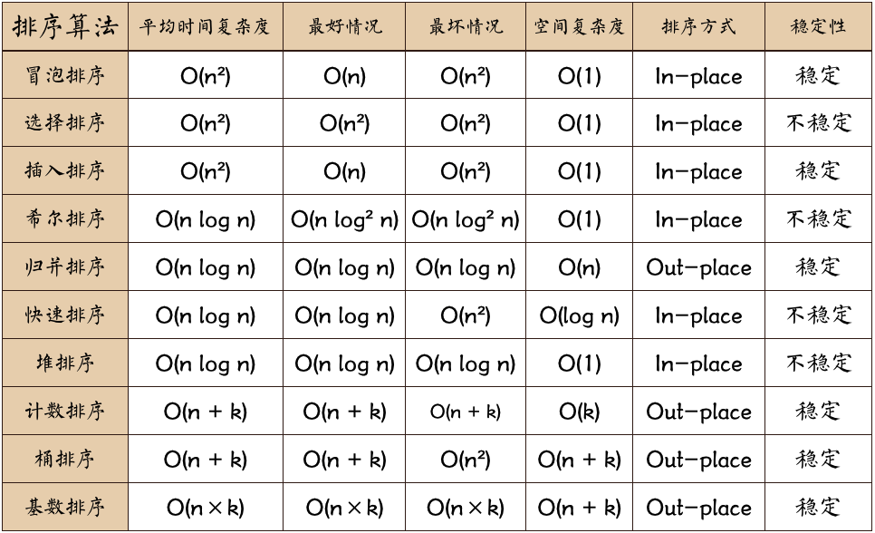

# 数据结构/算法

- [数据结构/算法](#数据结构算法)
  - [1. 用js 实现栈，队列，链表](#1-用js-实现栈队列链表)
  - [2. 树, 红黑树](#2-树-红黑树)
  - [3. 常见排序算法的思路和复杂度](#3-常见排序算法的思路和复杂度)
  - [4. 二叉树前序/中序/后序遍历](#4-二叉树前序中序后序遍历)
  - [5. 深度优先/广度优先](#5-深度优先广度优先)
  - [6. 动态规划](#6-动态规划)
  - [面试题](#面试题)
    - [1. 递归, 尾递归优化](#1-递归-尾递归优化)
    - [2. 链表排序(JS合并两个排序的链表)](#2-链表排序js合并两个排序的链表)
    - [3. 冒泡、 选择、插入、快排、](#3-冒泡-选择插入快排)
      - [1. 冒泡排序（Bubble Sort）](#1-冒泡排序bubble-sort)
      - [2. 选择排序（Selection Sort）](#2-选择排序selection-sort)
      - [3. 插入排序（Insertion Sort）](#3-插入排序insertion-sort)
      - [4. 快速排序（Quick Sort）](#4-快速排序quick-sort)
    - [4. 写版本号排序的代码（及优化），时间复杂度](#4-写版本号排序的代码及优化时间复杂度)
    - [5. 动态规划求解最多有几种方案求解硬币找零问题](#5-动态规划求解最多有几种方案求解硬币找零问题)
    - [6. 给了一个数组求两数相加和等于 m 总共有多少种可能性](#6-给了一个数组求两数相加和等于-m-总共有多少种可能性)
    - [7. 请实现如下的函数，可以批量请求数据，所有的 URL 地址在 urls 参数中，同时可以通过 max 参数控制请求的并发度，当所有请求结束之后，需要执行 callback 函数。发请求的函数可以直接使用 fetch 即可](#7-请实现如下的函数可以批量请求数据所有的-url-地址在-urls-参数中同时可以通过-max-参数控制请求的并发度当所有请求结束之后需要执行-callback-函数发请求的函数可以直接使用-fetch-即可)
    - [8. [-1,-2,8,9,-10] 求最大子段和](#8--1-289-10-求最大子段和)
    - [9. 链表环检测](#9-链表环检测)
    - [11. 一个完全二叉树，全部是大于 0 的整数，给出一个整数N，问从二叉树的根部开始向下，存不存在一个路径，使路径上所有的点的和是 N](#11-一个完全二叉树全部是大于-0-的整数给出一个整数n问从二叉树的根部开始向下存不存在一个路径使路径上所有的点的和是-n)
    - [12. N 级台阶，一次只能跳 3 级 4 级或者 5 级，请问一种有多少种跳法](#12-n-级台阶一次只能跳-3-级-4-级或者-5-级请问一种有多少种跳法)
    - [13. 算法题，给一个字符串，给出该字符串字符的所有排列组合方式](#13-算法题给一个字符串给出该字符串字符的所有排列组合方式)
    - [15. 给定一个包含 n + 1 个整数的数组 nums ，其数字都在 [1, n] 范围内（包括 1 和 n），可知至少存在一个重复的整数。假设 nums 只有 一个重复的整数 ，返回 这个重复的数](#15-给定一个包含n--1-个整数的数组nums-其数字都在1-n范围内包括-1-和-n可知至少存在一个重复的整数假设-nums-只有-一个重复的整数-返回这个重复的数)
    - [16. 1000 万 ip 地址，设计一个系统最快的查出某个 ip 地址在不在其中](#16-1000-万-ip-地址设计一个系统最快的查出某个-ip-地址在不在其中)
    - [17. hashMap 的实现原理](#17-hashmap-的实现原理)
    - [18. 算法: 回文数字判断,要尽可能高效的算法](#18-算法-回文数字判断要尽可能高效的算法)
    - [19. 手写数组去重](#19-手写数组去重)
    - [20. 大数相乘](#20-大数相乘)
    - [21. 判断对称二叉树](#21-判断对称二叉树)
    - [22. 从数组里获取是哪个乘积最大的三个数](#22-从数组里获取是哪个乘积最大的三个数)
    - [23. 数组的最大子序和](#23-数组的最大子序和)
    - [24. 实现koa洋葱模型](#24-实现koa洋葱模型)
    - [25. js 求开方](#25-js-求开方)
    - [26. js 构建二叉树数据结构并实现翻转操作](#26-js-构建二叉树数据结构并实现翻转操作)

## 1. 用js 实现栈，队列，链表

栈

```js
class Stack {
  constructor() {
    this.stack = [];
  }
  push(item) {
    this.stack.push(item);
  }
  pop() {
    this.stack.pop();
  }
  peek() {
    return this.stack[this.getCount() - 1];
  }
  getCount() {
    return this.stack.length;
  }
  isEmpty() {
    return this.getCount() === 0;
  }
}
```

队列

```js
// 单链队列
class Queue {
  constructor() {
    this.queue = [];
  }
  enQueue(item) {
    this.queue.push(item);
  }
  deQueue() {
    return this.queue.shift();
  }
  getHeader() {
    return this.queue[0];
  }
  getLength() {
    return this.queue.length;
  }
  isEmpty() {
    return this.getLength() === 0;
  }
}
```

链表

```js
// 单向链表
class Node {
  constructor(v, next) {
    this.value = v;
    this.next = next;
  }
}
class LinkList {
  constructor() {
    // 链表长度
    this.size = 0;
    // 虚拟头部
    this.dummyNode = new Node(null, null);
  }
  find(header, index, currentIndex) {
    if (index === currentIndex) return header;
    return this.find(header.next, index, currentIndex + 1);
  }
  addNode(v, index) {
    this.checkIndex(index);
    // 当往链表末尾插入时，prev.next 为空
    // 其他情况时，因为要插入节点，所以插入的节点
    // 的 next 应该是 prev.next
    // 然后设置 prev.next 为插入的节点
    let prev = this.find(this.dummyNode, index, 0);
    prev.next = new Node(v, prev.next);
    this.size++;
    return prev.next;
  }
  insertNode(v, index) {
    return this.addNode(v, index);
  }
  addToFirst(v) {
    return this.addNode(v, 0);
  }
  addToLast(v) {
    return this.addNode(v, this.size);
  }
  removeNode(index, isLast) {
    this.checkIndex(index);
    index = isLast ? index - 1 : index;
    let prev = this.find(this.dummyNode, index, 0);
    let node = prev.next;
    prev.next = node.next;
    node.next = null;
    this.size--;
    return node;
  }
  removeFirstNode() {
    return this.removeNode(0);
  }
  removeLastNode() {
    return this.removeNode(this.size, true);
  }
  checkIndex(index) {
    if (index < 0 || index > this.size) throw Error("Index error");
  }
  getNode(index) {
    this.checkIndex(index);
    if (this.isEmpty()) return;
    return this.find(this.dummyNode, index, 0).next;
  }
  isEmpty() {
    return this.size === 0;
  }
  getSize() {
    return this.size;
  }
}
```

## 2. 树, 红黑树

红黑树： https://blog.csdn.net/weixin_33910460/article/details/88018205  

## 3. 常见排序算法的思路和复杂度

https://www.cnblogs.com/AlbertP/p/10847627.html  

代码路径：DataStructure/3-sort  

## 4. 二叉树前序/中序/后序遍历

可以以根节点的位置为参考来记遍历方式，在第一个为先序，中间为中序，最后为后序；  
即：先序： 根左右；中序：左根右；后序：左右根。  

https://blog.csdn.net/weixin_44873331/article/details/108157676  

## 5. 深度优先/广度优先

深度优先遍历DFS：主要思路是从图中一个未访问的顶点 V 开始，沿着一条路一直走到底，然后从这条路尽头的节点回退到上一个节点，再从另一条路开始走到底...，不断递归重复此过程，直到所有的顶点都遍历完成，它的特点是不撞南墙不回头，先走完一条路，再换一条路继续走。  

广度优先遍历BFS，指的是从图的一个未遍历的节点出发，先遍历这个节点的相邻节点，再依次遍历每个相邻节点的相邻节点。  

递归版本

```js
// 查找dom节点
// 递归版本
function breadthFirstSearch(node) {
  var nodes = [];
  var i = 0;
  if (!(node == null)) {
    nodes.push(node);
    breadthFirstSearch(node.nextElementSibling);
    node = nodes[i++];
    breadthFirstSearch(node.firstElementChild);
  }
  return nodes;
}

// 非递归版本
const breadth = (node) => {
  const result = [];
  const stack = [];
  if (node) {
    stack.push(node);
    while (stack.length) {
      // 队列：取第一个
      const item = stack.shift();
      result.push(item.name);
      const children = item.children;
      for (let i = 0; i < children.length; i++) {
        stack.push(children[i]);
      }
    }
  }
  return result;
};
```

```js
// 查找dom节点
// 递归版本
function deepFirstSearch(node, nodeList = []) {
  if (node) {
    nodeList.push(node);
    const children = node.children;
    for (let i = 0; i < children.length; i++)
      //每次递归的时候将 需要遍历的节点 和 节点所存储的数组传下去
      deepFirstSearch(children[i], nodeList);
  }
  return nodeList;
}

// 非递归版本
function deepFirstSearch(node) {
  const nodes = [];
  if (node != null) {
    const stack = [];
    stack.push(node);
    while (stack.length != 0) {
      const item = stack.pop();
      nodes.push(item);
      const children = item.children;
      for (let i = children.length - 1; i >= 0; i--) stack.push(children[i]);
    }
  }
  return nodes;
}
```

## 6. 动态规划

https://zhuanlan.zhihu.com/p/126361983  

```js
var coinChange = function (coins, amount) {
  let dp = new Array(amount + 1).fill(Infinity);
  dp[0] = 0;

  for (let i = 1; i <= amount; i++) {
    for (let coin of coins) {
      if (i - coin >= 0) {
        dp[i] = Math.min(dp[i], dp[i - coin] + 1);
      }
    }
  }

  return dp[amount] === Infinity ? -1 : dp[amount];
};

const coins = [1, 2, 5, 6];
const amount = 23;

const value = coinChange(coins, amount);
console.log('value', value); // 6+6+6+5
```

## 面试题

### 1. 递归, 尾递归优化

尾递归是递归的一种优化算法，递归函数执行时会形成一个调用函数，当子一层的函数代码执行完成之后，父一层的函数才会销毁调用记录，这样就形成了调用栈，栈的叠加可能会产生内存溢出。而尾递归函数的每子一层函数不再需要使用父一层的函数执行完毕就会销毁栈记录，避免了内存溢出，节省了内存空间。  

普通线性递归运算  

```js
function f (n) {
    return (n == 1) ? 1 : n * f (n - 1);
}
console.log(f(5));  //120
```

尾递归算法后，则可以使用以下方法。

```js
function f (n, a) {
    return (n == 1) ? a : f (n - 1, a * n);
}
console.log(f(5, 1));  //120
```

尾递归也是递归的一种类型，不过其算法具有迭代算法的特征。上面的阶乘尾递归可以改写为下面的迭代循环。

```js
var n = 5;
var w = 1;
for (var i = 1; i <= 5; i ++) {
    w = w * i;
}
console.log(w);
```

尾递归由于直接返回值，不需要保存临时变量，所以性能不会产生线性增加，同时 JavaScript 引擎会将尾递归形式优化成非递归形式。  
  
递归与迭代都是循环的一种，简单比较如下：

- 在程序结构上，递归是重复调用函数自身实现循环，迭代是通过循环结构实现。
- 在结束方式上，递归当满足终止条件时会逐层返回再结束，迭代直接使用计数器结束循环。
- 在执行效率上，迭代的效率明显高于递归。因为递归需要占用大量系统资源，如果递归深度很大，系统资源可能会不够用。
- 在编程实现上，递归可以很方便的把数学公式转换为程序，易理解，易编程。迭代虽然效率高，不需要系统开销，但不容易理解，编写复杂问题时比较麻烦。

以斐波那契数列为例说明。  

递归函数计算: 一个阶乘函数，计算n的阶乘，最多需要保存n个调用记录，复杂度 O(n)

```js
function Fibonacci (n) {
  if ( n <= 1 ) {return 1};

  return Fibonacci(n - 1) + Fibonacci(n - 2);
}
Fibonacci(10) // 89
Fibonacci(100) // 超时
Fibonacci(500) // 超时
```

尾递归，只保留一个调用记录，复杂度 O(1) 。

```js
function Fibonacci2 (n , ac1 = 1 , ac2 = 1) {
  if( n <= 1 ) {return ac2};

  return Fibonacci2 (n - 1, ac2, ac1 + ac2);
}

Fibonacci2(100) // 573147844013817200000
Fibonacci2(1000) // 7.0330367711422765e+208
Fibonacci2(10000) // Infinity
```

迭代算法来设计斐波那契数列

```js
const fibonacci = function (n) {
    const a = [0, 1];  //记录数列的数组，第1、2个元素值确定
    for (let i = 2; i <= n; i ++) {  //从第 3 个数字开始循环
        a.push(a[i - 2] + a[i - 1]);  //计算新数字，并推入数组
    }
    return a[n];  //返回指定位数的数列结果
};
console.log(fibonacci(19));  //4181
```

为了避免重复计算，可以利用一个对象来保存已经求解过的 f(n)。当递归调用到 f(n) 时，先判断是否求解过了。

```js
const finbonacci = (function () {
    const memo = [0, 1];
    const fib = function (n) {
        let result = memo[n];
        if (typeof result !== 'number') {
            result = fib(n - 1) + fib(n - 2);
            memo[n] = result;
        }
        return result;
    };
    return fib;
}());
console.log(finbonacci(100));  //354224848179262000000
```

### 2. 链表排序(JS合并两个排序的链表)

```js
var mergeTwoLists = function(l1, l2) {
    var newNode = new ListNode(null);
    if(l1 == null) return l2;
    if(l2 == null) return l1;
    if(l1 == null && l2 == null) return null;
    if(l1.val < l2.val){
        newNode = l1;
        newNode.next = mergeTwoLists(l1.next,l2);
    }else{
        newNode = l2;
        newNode.next = mergeTwoLists(l1,l2.next);
    }
  return newNode;
};
```

### 3. 冒泡、 选择、插入、快排、

在v8引擎中，对sort方法提供了2种排序算法：插入排序及快排序。  
当数组长度小于等于10的时候，采用插入排序，大于10的时候，采用快排。  
对于长度大于1000的数组，采用的是快排与插入排序混合的方式进行排序的，因为，当数据量很小的时候，插入排序效率优于快排。  

参考：https://www.cnblogs.com/AlbertP/p/10847627.html  



名词解释：  
n: 数据规模  
k: "桶"的个数  
In-place: 占用常数内存，不占用额外内存  
Out-place: 占用额外内存  
稳定性：排序后2个相等键值的顺序和排序之前它们的顺序相同  

#### 1. 冒泡排序（Bubble Sort）

1. 先建立一个外部循环为总比较次数 再写一个内循环为两两比较的次数
2. 第一个内循环结束应将数组中最大的数排在了数组的最右边
3. 经过arr.length-1次循环 数组中的元素按照从小到大的顺序排列


```js
function bubbleSort(arr) {
  const len = arr.length;
  for (let i = 0; i < len; i++) {
    for (let j = 0; j < len - 1 - i; j++) {
      //相邻元素两两对比
      if (arr[j] > arr[j + 1]) {
        [arr[j + 1], arr[j]] = [arr[j], arr[j + 1]];
      }
    }
  }
  return arr;
}

const arr = [1, 4, 2, 5, 7, 10, 5, 2];
console.log(bubbleSort(arr));  // [1, 2, 2, 4, 5, 5, 7, 10]
```

#### 2. 选择排序（Selection Sort）

选择排序（Selection Sort）与冒泡排序类似，也是依次对相邻的数进行两两比较。不同之处在于，它不是每比较一次就调换位置，而是一轮比较完毕，找到最大值（或最小值）之后，将其放在正确的位置，其他数的位置不变。  

1. 遍历数组，设置最小值的索引为 0，
2. 如果取出的值比当前最小值小，就替换最小值索引，遍历完成后，将第一个元素和最小值索引上的值交换。
3. 如上操作后，第一个元素就是数组中的最小值，下次遍历就可以从索引 1 开始重复上述操作。


```js
function selectionSort(arr) {
  const len = arr.length;
  let minIndex;
  for (let i = 0; i < len - 1; i++) {
    minIndex = i;
    for (let j = i + 1; j < len; j++) {
      if (arr[j] < arr[minIndex]) {
        //寻找最小的数
        minIndex = j; //将最小数的索引保存
      }
    }
    [arr[i], arr[minIndex]] = [arr[minIndex], arr[i]];
  }
  return arr;
}

const arr = [1, 4, 2, 5, 7, 10, 5, 2];
console.log(selectionSort(arr)); // [1, 2, 2, 4, 5, 5, 7, 10]
```

#### 3. 插入排序（Insertion Sort）

1. 从第一个元素开始，该元素可以认为已经被排序；
2. 取出当前元素的后一个元素，在已经排序的元素序列中从后向前循环一遍；
3. 如果该元素（已排序的元素）大于新元素，将该元素移到下一位置；
4. 重复步骤3，直到找到已排序的元素小于或者等于新元素的位置；
5. 将新元素插入到该位置后；
6. 重复步骤2~5。


```js
function insertSort(arr) {
  let current, preIndex;
  const len = arr.length;
  for (let i = 1; i < len; i++) {
    // 当前元素的前一个元素下标
    preIndex = i - 1;
    // 将需要排序的元素用current保存起来以免因下面下标变化而取错值
    current = arr[i];
    // 开始内部循环将第一个值开始排序,终止条件为当前元素下标大于数组的第0位,并且当前元素大于前一个元素,否则的话将前一个元素赋值给当前元素（arr[preIndex+1]）
    // 然后将前一个元素下标-1 继续向前比较
    while (preIndex >= 0 && current < arr[preIndex]) {
      arr[preIndex + 1] = arr[preIndex];
      preIndex--;
    }
    // 当current大于前一个元素时 把保存起来的current赋值给arr[preIndex]
    arr[preIndex + 1] = current;
  }
  return arr;
}

const arr = [1, 4, 2, 5, 7, 10, 5, 2];
console.log(insertSort(arr)); // [1, 2, 2, 4, 5, 5, 7, 10]
```

#### 4. 快速排序（Quick Sort）

https://segmentfault.com/a/1190000017814119  


1. 从数组中选择一个元素作为基准点。  
2. 排序数组，所有比基准值小的元素摆放在左边，而大于基准值的摆放在右边。每次分割结束以后基准值会插入到中间去。  
3. 最后利用递归，将摆放在左边的数组和右边的数组在进行一次上述的1和2操作。  

```js
var quickSort = function(arr) {
  if (arr.length <= 1) {
    return arr;
  }
  var pivotIndex = Math.floor(arr.length / 2);
  var pivot = arr.splice(pivotIndex, 1)[0];
  var left = [];
  var right = [];

  for (var i = 0; i < arr.length; i++) {
    if (arr[i] < pivot) {
      left.push(arr[i]);
    } else {
      right.push(arr[i]);
    }
  }
  return quickSort(left).concat([pivot], quickSort(right));
};
```

```js
function swap(A, i, j) {
  [A[i], A[j]] = [A[j], A[i]];
}

/**
 *
 * @param {*} A  数组
 * @param {*} p  起始下标
 * @param {*} r  结束下标 + 1
 */
function divide(A, p, r) {
  // 基准点
  const x = A[r - 1];
  // i初始化是-1，也就是起始下标的前一个
  let i = p - 1;
  for (let j = p; j < r - 1; j++) {
    // 如果比基准点小就i++，然后交换元素位置
    if (A[j] <= x) {
      i++;
      swap(A, i, j);
    }
  }
  // 最后将基准点插入到i+1的位置
  swap(A, i + 1, r - 1);
  // 返回最终指针i的位置
  return i + 1;
}

/**
 * 主程序主要是通过递归去重复的调用进行拆分，一直拆分到只有一个数字。
 * @param {*} A  数组
 * @param {*} p  起始下标
 * @param {*} r  结束下标 + 1
 */
function quickSort(A, p = 0, r) {
  r = r || A.length;
  if (p < r - 1) {
    const q = divide(A, p, r);
    quickSort(A, p, q);
    quickSort(A, q + 1, r);
  }
  return A;
}

const arr = [1, 4, 2, 5, 7, 10, 5, 2];
console.log(quickSort(arr)); // [1, 2, 2, 4, 5, 5, 7, 10]
```

### 4. 写版本号排序的代码（及优化），时间复杂度

```js
function sortVersion(list) {
  // sort 快速排序 O(logn)  https://segmentfault.com/a/1190000010648740
  list.sort((a, b) => getVersionValue(a) - getVersionValue(b));
  return list;
}

// 1.1.1 => 10101 /  1.10.10 => 11010
function getVersionValue(str) {
  const [x, y, z] = str.split(".");
  return x * Math.pow(10, 4) + y * Math.pow(10, 2) + z;
}

const list = ["4.3.17", "4.3.16", "4.3.9"];

console.log(sortVersion(list)); // [ '4.3.9', '4.3.16', '4.3.17' ]
```

### 5. 动态规划求解最多有几种方案求解硬币找零问题

参考：https://leetcode-cn.com/problems/coin-lcci/  

参考：https://www.cnblogs.com/jaxu/p/11418039.html  

动态规划（Dynamic Programming，DP）是一种将复杂问题分解成更小的子问题来解决的优化算法。  

### 6. 给了一个数组求两数相加和等于 m 总共有多少种可能性

```js
// 给一个数组（其元素不重复），求所有元素相加为某个值的2个元素对的下标对
// eg: [2, 9, 3, 10, 8, 1, 22] 目标值11，有[[0, 1], [2, 4], [3, 5]]

// 将数组排序，然后定义两个指针，一个指针i从左向右，另一个从j右向左。
// ①如果data[i]+data[j] < tager ,则++i
// ②如果data[i]+data[j] > tager ,则–j
// ③如果data[i]+data[j] > tager ,则就找到
// 由于排序的最佳时间复杂度为O(nlogn)，两个指针的遍历时间复杂度为O(n)。所以总的时间复杂度为O(nlogn)
function f(arr, target) {
  const a = arr.slice().sort((a, b) => a - b);
  const len = a.length;
  const key = []; //存放最后的元素组
  const val = []; //存放最后的下标组
  if (len <= 1) return;
  let i = 0;
  let j = len - 1;
  while (i < j) {
    if (a[i] + a[j] < target) {
      i++;
    } else if (a[i] + a[j] > target) {
      j--;
    } else {
      val.push([a[i], a[j]]);
      key.push([i, j]);
      i++;
      j--;
    }
  }
  // 如果只要下标组，则：return key;
  return {
    key,
    val,
  };
}

function findNum2(arr, target) {
  const len = arr.length;
  const key = []; //存放最后的元素组
  const val = []; //存放最后的下标组
  if (len <= 1) return;
  for (let i = 0; i < len; i++) {
    const diff = target - arr[i];
    // 从i+1开始查询是否存在diff的值（下标）
    const index = arr.slice(i + 1).findIndex((i) => i === diff);
    if (index !== -1) {
      key.push([i, i + 1 + index]);
      val.push([arr[i], arr[i + 1 + index]]);
    }
  }
  // 如果只要下标组，则：return key;
  return {
    key,
    val,
  };
}

// 下面是测试
const arr = [2, 9, 3, 10, 8, 1, 22];
const target = 11;
console.log(f(arr, target));
// {
//     key: [ [ 0, 5 ], [ 1, 4 ], [ 2, 3 ] ], // key 不对
//     val: [ [ 1, 10 ], [ 2, 9 ], [ 3, 8 ] ]
// }
console.log(findNum2(arr, target));
// {
//     key: [ [ 0, 1 ], [ 2, 4 ], [ 3, 5 ] ],
//     val: [ [ 2, 9 ], [ 3, 8 ], [ 10, 1 ] ]
//  }
```

### 7. 请实现如下的函数，可以批量请求数据，所有的 URL 地址在 urls 参数中，同时可以通过 max 参数控制请求的并发度，当所有请求结束之后，需要执行 callback 函数。发请求的函数可以直接使用 fetch 即可

```js
function sendRequest(urls, num, callback) {
  let res = [];
  function request(res) {
    console.log("urls.length", urls.length, "res", res);
    urls.length
      ? Promise.all(urls.splice(0, num).map((url) => fetch(url))).then((r) =>
          request(res.concat(r))
        )
      : callback(res);
  }
  request(res);
}

const fetch = function (idx) {
  return new Promise((resolve) => {
    console.log(`start request ${idx}`);
    // const timeout = parseInt(Math.random() * 1e4);
    setTimeout(() => {
      // console.log(`end request ${idx}`);
      resolve(idx);
      // }, timeout);
    }, 1000);
  });
};

const max = 4;
const urls = Array.from({ length: 12 }, (v, k) => k + 1);

const callback = () => {
  console.log("run callback");
};

sendRequest(urls, max, callback);
```

### 8. [-1,-2,8,9,-10] 求最大子段和

LeetCode的一道算法题：给定一个整数数组 nums ，找到一个具有最大和的连续子数组（子数组最少包含一个元素），返回其最大和。  

参考：https://leetcode-cn.com/problems/maximum-subarray/solution/zui-da-zi-xu-he-by-leetcode-solution/  

```js
var maxSubArray = function (nums) {
  let pre = 0,
    maxAns = nums[0];
  nums.forEach((x) => {
    pre = Math.max(pre + x, x);
    maxAns = Math.max(maxAns, pre);
  });
  return maxAns;
};

console.log(maxSubArray([-1, -2, 8, 9, -10]));
```

### 9. 链表环检测

参考： https://segmentfault.com/a/1190000018439965  

1. 创建哈希表,不过会占用较大的空间,不是最佳方法.( 时间复杂度O(n) )  

遍历链表,将链表各节点添加至哈希表中,添加前判断此节点是否已存在哈希表中,存在的话说明链表中存在环.  

2. 给节点添加visited访问标记 (时间复杂度O(n)), 不需要额外的空间  

遍历链表,每访问一个新节点,使其visited为1,每次访问节点前先判断其visited是否为1,为1则是已访问过的节点,说明链表中存在环.  

3. 快慢指针法,设定快指针fast,慢指针slow,每次循环快指针fast移动两个位置,慢指针移动一个位置  
(时间复杂度 O(n)) 需要额外的空间  

### 11. 一个完全二叉树，全部是大于 0 的整数，给出一个整数N，问从二叉树的根部开始向下，存不存在一个路径，使路径上所有的点的和是 N

二叉树遍历：https://www.php.cn/js-tutorial-455348.html  

### 12. N 级台阶，一次只能跳 3 级 4 级或者 5 级，请问一种有多少种跳法

```js

function jumpFloor(n) {
  if (n < 3) return 1;
  if (n === 3 || n === 4|| n === 5|| n === 6) return 1;
  if (n === 7) return 2;
  return jumpFloor(n - 3) + jumpFloor(n - 4) + jumpFloor(n - 5);
}
console.log(jumpFloor(8)) // 3
console.log(jumpFloor(9)) // 3
console.log(jumpFloor(10)) // 4
console.log(jumpFloor(11)) // 6
console.log(jumpFloor(12)) // 8
```

### 13. 算法题，给一个字符串，给出该字符串字符的所有排列组合方式

参考：https://blog.csdn.net/qq_32657025/article/details/79506033  

```js
// 递归。abc的所有组合值可以分为以下部分：
// 1. a+ 剩余字母组合值；
// 2. b+ 剩余字母组合值；
// 3. c+ 剩余字母组合值；

function combination(str) {
  if (str.length == 1) {
    return [str];
  }
  let res = [];
  for (let i = 0; i < str.length; i++) {
    let restStr = str.slice(0, i) + str.slice(i + 1);
    let restArr = combination(restStr);
    restArr = restArr.map((x) => str[i] + x);
    res = res.concat(restArr);
  }
  return res;
}

console.log(combination("abc")); // 3*2
```

### 15. 给定一个包含 n + 1 个整数的数组 nums ，其数字都在 [1, n] 范围内（包括 1 和 n），可知至少存在一个重复的整数。假设 nums 只有 一个重复的整数 ，返回 这个重复的数

参考：https://leetcode-cn.com/problems/find-the-duplicate-number/solution/xun-zhao-zhong-fu-shu-by-leetcode-solution/  

### 16. 1000 万 ip 地址，设计一个系统最快的查出某个 ip 地址在不在其中

参考：https://time.geekbang.org/column/article/42733  

IP地址转换为32位无符号整数，排序，二分查找

### 17. hashMap 的实现原理

参考：https://zhuanlan.zhihu.com/p/127147909

### 18. 算法: 回文数字判断,要尽可能高效的算法

https://www.cnblogs.com/weiqinl/p/10968659.html  

```js
var isPalindrome = function(x) {
    if ( x < 0 ) return false
    let str = '' + x
    return Array.from(str).reverse().join('') === str
};
```

以中间数为节点，判断左右两边首尾是否相等

```js
/**
 * 以中间数为节点，判断左右两边首尾是否相等
 * @param {number} x
 * @return {boolean}
 */
var isPalindrome = function(x) {
    x = '' + x
    for(let i = 0 ; i < x.length/2; i++) {
        if (x[i] !== x[x.length - i - 1]) {
            return false
        }
    }
    return true
};
```

### 19. 手写数组去重

```js
function norepeat(arr) {
    for(var i = 0; i < arr.length-1; i++){
        for(var j = i+1; j < arr.length; j++){
            if(arr[i]==arr[j]){
                arr.splice(j,1); 
                j--;
            }
        }
    }
    return arr;
}
```

### 20. 大数相乘

https://blog.csdn.net/weixin_34061482/article/details/88766482  

```js
var multiply = function(num1, num2) {
  if(isNaN(num1) || isNaN(num2)) return '' //判断输入是不是数字
  var len1 = num1.length,
    len2 = num2.length
  var ans = []
  for (var i = len1 - 1; i >= 0; i--) {    //这里倒过来遍历很妙,不需要处理进位了
    for (var j = len2 - 1; j >= 0; j--) {
      var index1 = i + j
      var index2 = i + j + 1
      var mul = num1[i] * num2[j] + (ans[index2] || 0)
      ans[index1] = Math.floor(mul / 10) + (ans[index1] || 0)
      ans[index2] = mul % 10
    }
  }
  var result = ans.join('')
    //这里结果有可能会是多个零的情况，需要转成数字判断
    return +result === 0 ? '0' : result.replace(/^0+/,'')
}
```

### 21. 判断对称二叉树

实现思路:

1. 判断根节点相同
2. 左子树的右节点和右子树的左节点相同
3. 右子树的左节点和左子树的右节点相同

```js
// 判断对称二叉树
function isSymmetricalTree(node1, node2) {
  //判断两个节点都是否为空
  if (!node1 && !node2) {
    return true;
  }
  //判断两个节点是否存在一个为空
  if (!node1 || !node2) {
    return false;
  }
  //判断两个节点是否相同
  if (node1.val != node2.val) {
    return false;
  }
  return isSymmetricalTree(node1.left, node2.right) && isSymmetricalTree(node1.right, node2.left);
}
```

### 22. 从数组里获取是哪个乘积最大的三个数

```js
// 因为是3个数的乘积，只要一个6位数(3个正数，3个负数)的数组就可以把正数和负数的结果分别算出来。
// 解法如下: 先添加六个数到新数组里面，每次遍历的新数值都去判断最大的和最小的数是否可以替换，可替换就对其排序，直到遍历结束。用最后面两个（可能是负数）的数乘以第一个，去对比最大三个数相乘的结果，返回乘积更大的值。
function maximumProduct(nums) {
  let sum = 1,
    arr = [],
    len = nums.length;
  for (let i = 0; i < len; i++) {
    if (arr.length < 6) {
      arr[i] = nums[i];
    } else {
      if (nums[i] > arr[2]) {
        arr[2] = nums[i];
      }
      if (nums[i] < arr[3]) {
        arr[3] = nums[i];
      }
    }
    arr.sort((a, b) => b - a);
  }
  for (let i in arr) {
    if (i < 3) {
      sum *= arr[i];
    }
  }
  len = arr.length;
  if (len >= 3) {
    let sum2 = arr[len - 2] * arr[len - 1] * arr[0];
    sum = sum > sum2 ? sum : sum2;
  }
  return sum;
}
```

### 23. 数组的最大子序和

输入: [-2,1,-3,4,-1,2,1,-5,4],  
输出: 6  
解释: 连续子数组 [4,-1,2,1] 的和最大，为 6。  

思路：初始化sum和max为nums[0]，遍历数组，遍历到i时，若sum大于等于0，则sum加上nums[i]并赋给sum，否则将sum置为nums[i]，并将sum和max进行比较，较大值置为max，继续向下遍历数组。  

```js
/**
 * @param {number[]} nums
 * @return {number}
 */
var maxSubArray = function(nums) {
    let len = nums.length;
    let sum = nums[0], max = nums[0];
    for(let i = 1; i < len; i++) {
        sum = sum > 0? sum+nums[i] : nums[i];
        max = Math.max(sum, max);
    }
    return max;
};
```

### 24. 实现koa洋葱模型

```js
function compose(middlewarw) {
  return function(cb) {
    function dispatch(index){
      let fn = middlewarw[index];
      let next = ()=>dispatch(index+1); // 下一次的函数执行
      // 如果不存在下一个函数了，拿到传参里面的函数执行，这里需要保证传参是一个函数，对应的是redux里面的dispatch参数
      typeof fn === 'function' ? fn(next)() : cb() 
    }
    
    // 最终返回一个函数
    return ()=> dispatch(0);
    
  }
};

// redux的中间件是这样实现compose函数的：
function compose(middlewarw) {
  return middlewarw.reduce((total, next) => (...args) => total(next(...args)));
}
```

### 25. js 求开方

```js
// 使用二分查找，取左右两个数的中间值作为游标去寻找最接近的平方根数，当左边的数大于右边的数时，返回右边的数减1当有小数点的话向下取整
function sqrt(x) {
  let lo = 0,
    value = x,
    mid;
  // 设置精度
  while (lo - value <= 0) {
    mid = Math.ceil((lo + value) / 2);
    if (mid * mid == x) return mid;
    if (mid * mid < x) {
      lo = mid + 1;
    } else {
      value = mid - 1;
    }
  }
  return value;
}
```

### 26. js 构建二叉树数据结构并实现翻转操作

```js
//二叉搜索树结构(BST)
function BinarySearchTree() {
  //每一个节点的数据结构
  function Node(key) {
    this.key = key;
    this.left = null;
    this.right = null;
  }
  this.root = null;
  //向树中插入值
  this.insert = function (key) {
    var node = new Node(key);
    if (this.root === null) {
      this.root = node;
    } else {
      this.insertNode(this.root, node);
    }
  };
  //插入节点辅助函数
  this.insertNode = function (node, newNode) {
    if (newNode.key < node.key) {
      if (node.left === null) {
        node.left = newNode;
      } else {
        this.insertNode(node.left, newNode);
      }
    } else {
      if (node.right === null) {
        node.right = newNode;
      } else {
        this.insertNode(node.right, newNode);
      }
    }
  };
  //先序遍历 根左右
  this.preOrder = function (node, res = []) {
    if (node !== null) {
      res.push(node.key);
      this.preOrder(node.left, res);
      this.preOrder(node.right, res);
      return res;
    }
  };
  //中序遍历 左根右
  this.inOrder = function (node, res = []) {
    if (node !== null) {
      this.inOrder(node.left, res);
      res.push(node.key);
      this.inOrder(node.right, res);
      return res;
    }
  };
  //后序遍历 左右根
  this.postOrder = function (node, res = []) {
    if (node !== null) {
      this.postOrder(node.left, res);
      this.postOrder(node.right, res);
      res.push(node.key);
      return res;
    }
  };
  //查找树中最大值
  this.min = function (node) {
    if (node) {
      while (node && node.left) {
        node = node.left;
      }
      return node.key;
    }
    return null;
  };
  //查找树中的最大值
  this.max = function (node) {
    if (node) {
      while (node && node.right) {
        node = node.right;
      }
      return node.key;
    }
    return null;
  };
  //查找一个特定的值
  this.search = function (key) {
    return this.searchNode(this.root, key);
  };
  //查找一个特定的值的辅助函数
  this.searchNode = function (node, key) {
    if (node === null) {
      return false;
    }
    if (node.key === key) {
      return true;
    }
    if (node.key < key) {
      return this.searchNode(node.right, key);
    }
    if (node.key > key) {
      return this.searchNode(node.left, key);
    }
  };
  //移除某一个节点
  this.remove = function (key) {
    this.root = this.removeNode(this.root, key);
  };
  this.removeNode = function (node, key) {
    if (node === null) {
      return null;
    }
    if (node.key < key) {
      this.removeNode(node.right, key);
    } else if (node.key > key) {
      this.removeNode(node.left, key);
    } else {
      if (node.left === null && node.right === null) {
        return null;
      } else if (node.left === null) {
        return node.right;
      } else if (node.right === null) {
        return node.left;
      } else {
        var tempNode = this.findMinNode(node.right);
        node.key = tempNode.key;
        node.right = this.removeNode(node.right, tempNode.key);
        return node;
      }
    }
  };
  this.findMinNode = function (node) {
    while (node && node.left) {
      node = node.left;
    }
    return node;
  };

  // 二叉树翻转: 如果根节点不为空，左右节点交换
  this.invertTree = function (root) {
    if (root !== null) {
      [root.left, root.right] = [root.right, root.left];
      invertTree(root.left);
      invertTree(root.right);
    }
    return root;
  };
}
```
