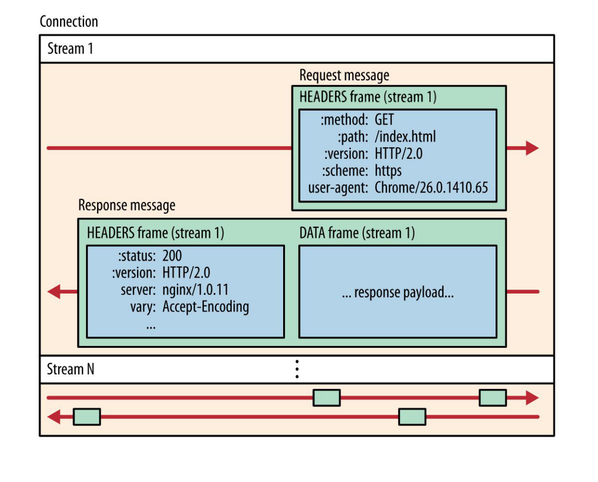
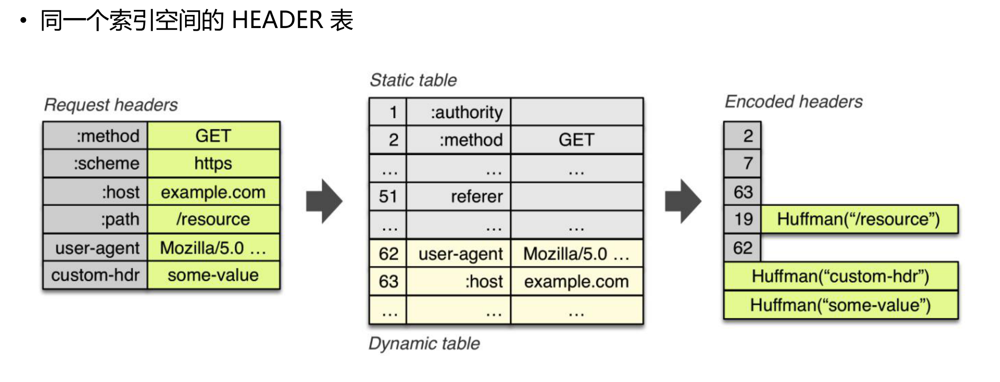
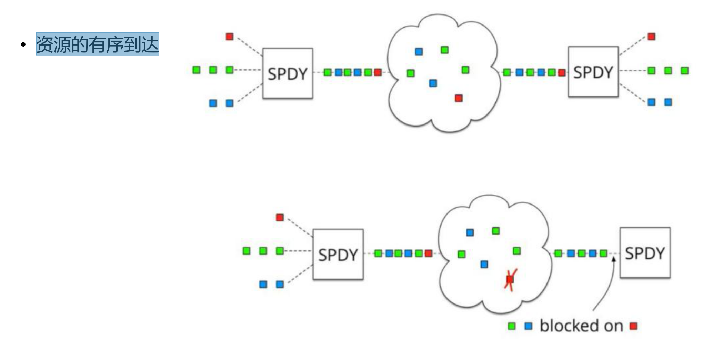
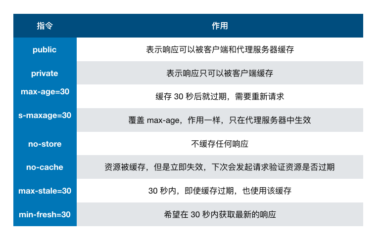

# 网络

- [网络](#网络)
  - [1. TCP/UDP](#1-tcpudp)
  - [2. TLS/SSL](#2-tlsssl)
  - [3. HTTP1.1](#3-http11)
  - [4. HTTP2](#4-http2)
  - [5. HTTP3](#5-http3)
  - [6. HTTPS](#6-https)
  - [7. 浏览器缓存](#7-浏览器缓存)
  - [8. DNS](#8-dns)
  - [9. CDN](#9-cdn)
  - [面试题](#面试题)
    - [1. HTTPS 和 HTTP 的区别](#1-https-和-http-的区别)
    - [2. 从输入URL，到页面展示发生了什么](#2-从输入url到页面展示发生了什么)
    - [3. TCP的3次握手和4次挥手](#3-tcp的3次握手和4次挥手)
    - [4. 请求头有哪些信息？各自的作用是什么？](#4-请求头有哪些信息各自的作用是什么)
    - [5. xss、xsrf 防御手段](#5-xssxsrf-防御手段)
    - [6. http和websocket的联系和区别](#6-http和websocket的联系和区别)

## 1. TCP/UDP

TCP---传输控制协议,提供的是面向连接、可靠的字节流服务。当客户和服务器彼此交换数据前，必须先在双方之间建立一个TCP连接，之后才能传输数据。TCP提供超时重发，丢弃重复数据，检验数据，流量控制等功能，保证数据能从一端传到另一端。  

UDP---用户数据报协议，是一个简单的面向数据报的运输层协议。UDP不提供可靠性，它只是把应用程序传给IP层的数据报发送出去，但是并不能保证它们能到达目的地。由于UDP在传输数据报前不用在客户和服务器之间建立一个连接，且没有超时重发等机制，故而传输速度很快。

TCP与UDP基本区别

1. 基于连接与无连接
2. TCP要求系统资源较多，UDP较少；
3. UDP程序结构较简单
4. 流模式（TCP）与数据报模式(UDP);
5. TCP保证数据正确性，UDP可能丢包
6. TCP保证数据顺序，UDP不保证

UDP应用场景：效率要求相对高，对准确性要求相对低的场景。举几个例子：QQ聊天、在线视频、网络语音电话（即时通讯，速度要求高，但是出现偶尔断续不是太大问题，并且此处完全不可以使用重发机制）、广播通信（广播、多播）。

## 2. TLS/SSL

SSL：（Secure Socket Layer，安全套接字层），位于可靠的面向连接的网络层协议和应用层协议之间的一种协议层。SSL通过互相认证、使用数字签名确保完整性、使用加密确保私密性，以实现客户端和服务器之间的安全通讯。该协议由两层组成：SSL记录协议和SSL握手协议。

TLS：（Transport Layer Security，传输层安全协议），用于两个应用程序之间提供保密性和数据完整性。该协议由两层组成：TLS记录协议和TLS握手协议。

## 3. HTTP1.1

HTTP/1.1 为网络效率做了大量的优化，最核心的有如下三种方式：

1. 增加了持久连接；
2. 浏览器为每个域名最多同时维护 6 个 TCP 持久连接；
3. 使用 CDN 的实现域名分片机制。

HTTP/1.1 所存在的一些主要问题：

1. 对带宽的利用率却并不理想：慢启动和 TCP 连接之间相互竞争带宽是由于 TCP 本身的机制导致的；
2. 队头阻塞是由于 HTTP/1.1 的机制导致的。阻塞请求的因素有很多，并且都是一些不确定性的因素，假如有的请求被阻塞了 5 秒，那么后续排队的请求都要延迟等待 5 秒，在这个等待的过程中，带宽、CPU 都被白白浪费了。

## 4. HTTP2

HTTP/2 的思路就是一个域名只使用一个 TCP 长连接来传输数据，这样整个页面资源的下载过程只需要一次慢启动，同时也避免了多个 TCP 连接竞争带宽所带来的问题。  

> HTTP/2 的多路复用  


HTTP/2 使用了多路复用技术，可以将请求分成一帧一帧的数据去传输，这样带来了一个额外的好处，就是当收到一个优先级高的请求时，比如接收到 JavaScript 或者 CSS 关键资源的请求，服务器可以暂停之前的请求来优先处理关键资源的请求。  

优先级: HTML > CSS > Blocking Script > Font >= Image >= Async Script。  

之所以可以随意发送，是因为每份数据都有对应的 ID，浏览器接收到之后，会筛选出相同 ID 的内容，将其拼接为完整的 HTTP 响应数据。  

HTTP/2 核心概念：

1. 连接 Connection：1个 TCP 连接，包含一个 或者多个 Stream
2. 数据流 Stream：一个双向通讯数据流，包含 1 条或者多条 Message
3. 消息 Message：对应 HTTP/1 中的请求或者 响应，包含一条或者多条 Frame
4. 数据帧 Frame：最小单位，以二进制压缩格 式存放 HTTP/1 中的内容



Stream 特性

1. 一条 TCP 连接上，可以并发存在多个处于 OPEN 状态的 Stream
2. 客户端或者服务器都可以创建新的 Stream
3. 客户端或者服务器都可以首先关闭 Stream
4. 同一条 Stream 内的 Frame 帧是有序的
5. 从 Stream ID 的值可以轻易分辨 PUSH 消息
6. 所有为发送 HEADER/DATA 消息而创建的流，从1、3、5 等递增奇数开始
7. 所有为发送 PUSH 消息而创建的流，从 2、4、6 等递增偶数开始

Message 特性

1. 一条 HTTP Message 由 1 个 HEADER（可能含有 0 个或者多个持续帧构成） 及 0 个或者多个 DATA 帧构成
2. HEADER 消息同时包含 HTTP/1.1 中的 start line 与 headers 部分
3. 取消 HTTP/1.1 中的不定长 Chunk 消息


从图中可以看出，通过引入二进制分帧层，就实现了 HTTP 的多路复用技术。

1. 首先，浏览器准备好请求数据，包括了请求行、请求头等信息，如果是 POST 方法，那么还要有请求体。这些数据经过二进制分帧层处理之后，会被转换为一个个带有请求 ID 编号的帧，通过协议栈将这些帧发送给服务器。
2. 服务器接收到所有帧之后，会将所有相同 ID 的帧合并为一条完整的请求信息。
3. 然后服务器处理该条请求，并将处理的响应行、响应头和响应体分别发送至二进制分帧层。
4. 同样，二进制分帧层会将这些响应数据转换为一个个带有请求 ID 编号的帧，经过协议栈发送给浏览器。
5. 浏览器接收到响应帧之后，会根据 ID 编号将帧的数据提交给对应的请求。

> HPACK 头部压缩

三种压缩方式：

1. 静态字典（静态字典的 index索引）
2. 动态字典(之后传输，只传输不一样的数据，例如path)
3. 压缩算法：Huffman 编码（最高压缩比 8:5，Huffman 编码(Huffman 树)：出现概率较大的符号采用较短的编码，概率较小的符号采用较长的编码）



> 服务器推送

1. 提前将资源推送至浏览器缓存
2. 特性: 推送可以基于已经发送的请求，例如客户端请求 html，主动推送 js 文件
3. 实现方式

- 推送资源必须对应一个请求
- 请求由服务器端PUSH_PROMISE 帧发送
- 响应在偶数 ID 的 STREAM 中发送

> HTTP/2 应用层流控, HTTP/2 中的流控制既针对单个 Stream，也针对整个 TCP 连接

1. 客户端与服务器都具备流量控制能力
2. 单向流控制：发送和接收独立设定流量控制
3. 以信用为基础：接收端设定上限，发送端应当遵循接收端发出的指令
4. 流量控制窗口（流或者连接）的初始值是 65535 字节
5. 只有 DATA 帧服从流量控制
6. 流量控制不能被禁用

> 多路复用与 TCP 的队头阻塞问题

在 HTTP/2 中，多个请求是跑在一个 TCP 管道中的，如果其中任意一路数据流中出现了丢包的情况，那么就会阻塞该 TCP 连接中的所有请求。  



## 5. HTTP3

基于 UDP 实现了类似于 TCP 的多路数据流、传输可靠性等功能，我们把这套功能称为 QUIC 协议。


1. 实现了类似 TCP 的流量控制、传输可靠性的功能。虽然 UDP 不提供可靠性的传输，但 QUIC 在 UDP 的基础之上增加了一层来保证数据可靠性传输。它提供了数据包重传、拥塞控制以及其他一些 TCP 中存在的特性。
2. 集成了 TLS 加密功能。目前 QUIC 使用的是 TLS1.3，相较于早期版本 TLS1.3 有更多的优点，其中最重要的一点是减少了握手所花费的 RTT 个数。
3. 实现了 HTTP/2 中的多路复用功能。和 TCP 不同，QUIC 实现了在同一物理连接上可以有多个独立的逻辑数据流（如下图）。实现了数据流的单独传输，就解决了 TCP 中队头阻塞的问题。
4. 实现了快速握手功能。由于 QUIC 是基于 UDP 的，所以 QUIC 可以实现使用 0-RTT 或者 1-RTT 来建立连接，这意味着 QUIC 可以用最快的速度来发送和接收数据，这样可以大大提升首次打开页面的速度。


## 6. HTTPS

在传输数据阶段使用对称加密，但是对称加密的密钥采用非对称加密来传输。  

证书验证阶段

1. 浏览器发起 HTTPS 请求
2. 服务端返回 HTTPS 证书
3. 客户端验证证书是否合法，如果不合法则提示告警

数据传输阶段

1. 当证书验证合法后，在本地生成随机数
2. 通过公钥加密随机数，并把加密后的随机数传输到服务端
3. 服务端通过私钥对随机数进行解密
4. 服务端通过客户端传入的随机数构造对称加密算法，对返回结果内容进行加密后传输
5. 为什么数据传输是用对称加密？  
首先，非对称加密的加解密效率是非常低的，而 http 的应用场景中通常端与端之间存在大量的交互，非对称加密的效率是无法接受的；另外，在 HTTPS 的场景中只有服务端保存了私钥，一对公私钥只能实现单向的加解密，所以 HTTPS 中内容传输加密采取的是对称加密，而不是非对称加密。

## 7. 浏览器缓存

从缓存位置上来说分为四种，并且各自有优先级，当依次查找缓存且都没有命中的时候，才会去请求网络  

1. Service Worker
2. Memory Cache：内存缓存虽然读取高效，可是缓存持续性很短，会随着进程的释放而释放。 一旦我们关闭 Tab 页面，内存中的缓存也就被释放了。
3. Disk Cache：存储在硬盘中的缓存，读取速度慢点，但是什么都能存储到磁盘中，比之 Memory Cache 胜在容量和存储时效性上。
4. Push Cache：是 HTTP/2 中的内容，当以上三种缓存都没有命中时，它才会被使用。并且缓存时间也很短暂，只在会话（Session）中存在，一旦会话结束就被释放。
5. 网络请求：大部分的接口都应该选择好缓存策略。  

> 1. 强缓存  

设置两种 HTTP Header 实现：Expires 和 Cache-Control 。强缓存表示在缓存期间不需要请求，state code 为 200。  

```http
Expires: Wed, 22 Oct 2018 08:41:00 GMT
```

Expires 是 HTTP/1 的产物，表示资源会在 Wed, 22 Oct 2018 08:41:00 GMT 后过期，需要再次请求。并且 Expires 受限于本地时间，如果修改了本地时间，可能会造成缓存失效。  

```http
Cache-control: max-age=30
```

Cache-Control 出现于 HTTP/1.1，优先级高于 Expires 。该属性值表示资源会在 30 秒后过期，需要再次请求。



no-cache 和 no-store 都是 HTTP 协议头 Cache-Control 的值。区别是：  

no-store: 彻底禁用缓冲，所有内容都不会被缓存到缓存或临时文件中。  

no-cache: 在浏览器使用缓存前，会往返对比 ETag，如果 ETag 没变，返回 304，则使用缓存。  

> 2. 协商缓存

如果缓存过期了，就需要发起请求验证资源是否有更新。协商缓存可以通过设置两种 HTTP Header 实现：Last-Modified 和 ETag 。

当浏览器发起请求验证资源时，如果资源没有做改变，那么服务端就会返回 304 状态码，并且更新浏览器缓存有效期。

**1. Last-Modified 和 If-Modified-Since**  

Last-Modified 表示本地文件最后修改日期，If-Modified-Since 会将 Last-Modified 的值发送给服务器，询问服务器在该日期后资源是否有更新，有更新的话就会将新的资源发送回来，否则返回 304 状态码。  

但是 Last-Modified 存在一些弊端：

1. 如果本地打开缓存文件，即使没有对文件进行修改，但还是会造成 Last-Modified 被修改，服务端不能命中缓存导致发送相同的资源
2. 因为 Last-Modified 只能以秒计时，如果在不可感知的时间内修改完成文件，那么服务端会认为资源还是命中了，不会返回正确的资源  

因为以上这些弊端，所以在 HTTP / 1.1 出现了 ETag 。

**2. ETag 和 If-None-Match**

ETag 类似于文件指纹，If-None-Match 会将当前 ETag 发送给服务器，询问该资源 ETag 是否变动，有变动的话就将新的资源发送回来。并且 ETag 优先级比 Last-Modified 高。  

参考：https://www.jianshu.com/p/54cc04190252  
https://www.jianshu.com/p/5b8d61afe52d  
https://juejin.cn/book/6844733763675488269/section/6844733763771990029  


## 8. DNS

## 9. CDN

## 面试题

### 1. HTTPS 和 HTTP 的区别

### 2. 从输入URL，到页面展示发生了什么  

### 3. TCP的3次握手和4次挥手

### 4. 请求头有哪些信息？各自的作用是什么？

https://blog.csdn.net/qq_42820268/article/details/82424353  

### 5. xss、xsrf 防御手段

https://time.geekbang.org/column/article/154110  

> xss  跨站脚本攻击Cross Site Scripting

1. 对输入脚本进行过滤或转码
2. 实施严格的 CSP(内容安全策略) 可以有效地防范 XSS 攻击，具体来讲 CSP 有如下几个功能：限制加载其他域下的资源文件，这样即使黑客插入了一个 JavaScript 文件，这个 JavaScript 文件也是无法被加载的；禁止向第三方域提交数据，这样用户数据也不会外泄；禁止执行内联脚本和未授权的脚本；还提供了上报机制，这样可以帮助我们尽快发现有哪些 XSS 攻击，以便尽快修复问题。
3. 使用 HttpOnly 属性

> xsrf  

全称是 Cross-site request forgery，所以又称为“跨站请求伪造”，是指黑客引诱用户打开黑客的网站，在黑客的网站中，利用用户的登录状态发起的跨站请求。简单来讲，CSRF 攻击就是黑客利用了用户的登录状态，并通过第三方的站点来做一些坏事。

1. 充分利用好 Cookie 的 SameSite 属性
2. 验证请求的来源站点: 验证请求的来源站点
3. CSRF Token  

### 6. http和websocket的联系和区别

https://zhuanlan.zhihu.com/p/113286469  

HTTP 协议有一个缺陷：通信只能由客户端发起，做不到服务器主动向客户端推送信息。  

Websocket协议解决了服务器与客户端全双工通信的问题。  
