# 前端总结

- [前端总结](#前端总结)
  - [1. 类型](#1-类型)
    - [1.1. 原始（Primitive）类型](#11-原始primitive类型)
    - [1.2. 对象（Object）类型](#12-对象object类型)
    - [1.3. typeof vs instanceof](#13-typeof-vs-instanceof)
    - [1.4. 类型转换](#14-类型转换)
      - [转Boolean](#转boolean)
      - [对象转原始类型](#对象转原始类型)
    - [1.5. 四则运算符](#15-四则运算符)
    - [1.6. 比较运算符](#16-比较运算符)
  - [2. this](#2-this)
    - [bind](#bind)
  - [3. == vs ===](#3--vs-)
  - [4. 闭包](#4-闭包)
  - [5. JavaScript 原型](#5-javascript-原型)
    - [5.1. __proto__  constructor prototype](#51-proto--constructor-prototype)
      - [5.1.1. __proto__](#511-proto)
      - [5.1.2. constructor和prototype](#512-constructor和prototype)
    - [5.2. 原型链](#52-原型链)
    - [5.3. ES6 class 和构造器的关系](#53-es6-class-和构造器的关系)
      - [5.3.1. ES6 class](#531-es6-class)
      - [5.3.2. extends 继承](#532-extends-继承)
    - [5.4. 原型继承](#54-原型继承)
    - [5.5. 和原型相关语法特性](#55-和原型相关语法特性)
      - [5.5.1. new 运算符原理](#551-new-运算符原理)
      - [5.5.2. instanceof 运算符原理](#552-instanceof-运算符原理)
    - [5.6. 原型污染](#56-原型污染)
      - [5.6.1. 性能问题](#561-性能问题)
      - [5.6.2. 导致意外的逻辑 bug](#562-导致意外的逻辑-bug)
      - [5.6.3. 预防原型污染](#563-预防原型污染)
        - [Object.create(null)](#objectcreatenull)
        - [Object.freeze(obj)](#objectfreezeobj)
  - [6. 手写promise](#6-手写promise)
    - [then 的链式调用&值穿透特性](#then-的链式调用值穿透特性)
    - [测试 Promise 是否符合规范](#测试-promise-是否符合规范)
    - [Promise 的 API](#promise-的-api)
      - [Promise.resolve](#promiseresolve)
      - [Promise.reject](#promisereject)
      - [Promise.prototype.catch](#promiseprototypecatch)
      - [Promise.prototype.finally](#promiseprototypefinally)
      - [Promise.all](#promiseall)
      - [Promise.race](#promiserace)
  - [7. 手写 call、apply 及 bind 函数](#7-手写-callapply-及-bind-函数)
    - [7.1. call](#71-call)
    - [7.2. apply](#72-apply)
    - [7.3. bind](#73-bind)
  - [8. 垃圾回收机制](#8-垃圾回收机制)
    - [8.1. 基本的垃圾回收算法](#81-基本的垃圾回收算法)
    - [8.2. 新生代和老生代算法](#82-新生代和老生代算法)
  - [9. 浏览器缓存机制](#9-浏览器缓存机制)
    - [9.1. 缓存位置](#91-缓存位置)
      - [9.1.1. Service Worker](#911-service-worker)
        - [如何使用](#如何使用)
        - [注意事项](#注意事项)
        - [Service Worker优势及典型应用场景](#service-worker优势及典型应用场景)
      - [9.1.2. Memory Cache](#912-memory-cache)
      - [9.1.3. Disk Cache](#913-disk-cache)
      - [9.1.4. Push Cache](#914-push-cache)
        - [实现方法](#实现方法)
      - [9.1.5. 网络请求](#915-网络请求)
    - [9.2. 缓存过程分析](#92-缓存过程分析)
    - [9.3. 强缓存](#93-强缓存)
      - [9.3.1. Expires](#931-expires)
      - [9.3.2. Cache-Control](#932-cache-control)
    - [9.4. 协商缓存](#94-协商缓存)
      - [9.4.1. Last-Modified和If-Modified-Since](#941-last-modified和if-modified-since)
      - [9.4.2. ETag和If-None-Match](#942-etag和if-none-match)
    - [9.5. 缓存机制](#95-缓存机制)
    - [9.6. 实际场景应用缓存策略](#96-实际场景应用缓存策略)
      - [9.6.1. 频繁变动的资源](#961-频繁变动的资源)
      - [9.6.2. 不常变化的资源](#962-不常变化的资源)
    - [9.7. 用户行为对浏览器缓存的影响](#97-用户行为对浏览器缓存的影响)
  - [10. https http1 http2 http3](#10-https-http1-http2-http3)
    - [10.1. http1.x](#101-http1x)
    - [10.2. http2](#102-http2)
      - [10.2.1. 二进制传输](#1021-二进制传输)
      - [10.2.2. 多路复用](#1022-多路复用)
      - [10.2.3. Header 压缩](#1023-header-压缩)
      - [10.2.4. Server Push](#1024-server-push)
    - [10.3. http3](#103-http3)
      - [10.3.1. QUIC](#1031-quic)
    - [10.4. https](#104-https)
  - [11. 浏览器渲染原理](#11-浏览器渲染原理)
    - [11.1. 构建DOM树](#111-构建dom树)
    - [11.2. 构建CSSOM树](#112-构建cssom树)
    - [11.3. 生成render树](#113-生成render树)
    - [11.4. Layout 布局](#114-layout-布局)
    - [11.5. Paint 绘制](#115-paint-绘制)
    - [11.6. Compositing 合成](#116-compositing-合成)
    - [11.7. Reflowing and Repainting](#117-reflowing-and-repainting)
  - [12. webpack5](#12-webpack5)
    - [12.1. 功能清除](#121-功能清除)
    - [12.2. 长期缓存](#122-长期缓存)
    - [12.3. 持久缓存](#123-持久缓存)
    - [12.4. 模块联邦 Module Federation](#124-模块联邦-module-federation)
  - [13. react](#13-react)
    - [13.1 原理（virtual DOM, Diff算法, fiber）](#131-原理virtual-dom-diff算法-fiber)
      - [13.1.1. Virtual DOM 和Diff算法](#1311-virtual-dom-和diff算法)
      - [13.1.2. Fiber Reconciler](#1312-fiber-reconciler)
    - [13.2. react hooks](#132-react-hooks)
    - [13.3.  react router](#133--react-router)
      - [13.3.1. Router](#1331-router)
      - [13.3.2. Link](#1332-link)
      - [13.3.3. Switch](#1333-switch)
    - [13.4. 常见用法](#134-常见用法)
      - [13.4.1. Error Boundaries](#1341-error-boundaries)
      - [13.4.2. React.Lazy和React.Suspense](#1342-reactlazy和reactsuspense)
        - [13.4.2.1. import原理](#13421-import原理)
        - [13.4.2.2. React.Lazy原理](#13422-reactlazy原理)
        - [13.4.2.3. React.Suspense原理](#13423-reactsuspense原理)
      - [13.4.3. ReactDOM.createPortal](#1343-reactdomcreateportal)
      - [13.4.4. HOC](#1344-hoc)
    - [13.5. redux](#135-redux)
    - [13.6. mobx](#136-mobx)
  - [14. 设计模式](#14-设计模式)
    - [14.1. 单例模式](#141-单例模式)
    - [14.2. 策略模式](#142-策略模式)
    - [14.3. 代理模式](#143-代理模式)
    - [14.4. 迭代器模式](#144-迭代器模式)
    - [14.5. 发布-订阅模式](#145-发布-订阅模式)
    - [14.6. 命令模式](#146-命令模式)
    - [14.7. 组合模式](#147-组合模式)
    - [14.8. 模板方法模式](#148-模板方法模式)
    - [14.9. 享元模式](#149-享元模式)
    - [14.10. 职责链模式](#1410-职责链模式)
    - [14.11. 中介者模式](#1411-中介者模式)
    - [14.12. 装饰者模式](#1412-装饰者模式)
    - [14.13. 外观模式](#1413-外观模式)
  - [15. 常见数据结构](#15-常见数据结构)
    - [15.1. 栈](#151-栈)
    - [15.2. 队列](#152-队列)
    - [15.3. 链表](#153-链表)
    - [15.4. 树](#154-树)
      - [15.4.1. 二叉树](#1541-二叉树)
      - [15.4.2. 二分搜索树](#1542-二分搜索树)
      - [15.4.3. 实现树的遍历](#1543-实现树的遍历)
      - [15.4.4. AVL树](#1544-avl树)
    - [15.5. Trie 字典树](#155-trie-字典树)
    - [15.6. 并查集](#156-并查集)
    - [15.7. 堆](#157-堆)
  - [16. 常见算法](#16-常见算法)
    - [16.1. 深度优先遍历（DFS）和广度优先遍历（BFS）](#161-深度优先遍历dfs和广度优先遍历bfs)
      - [16.1.1. 深度优先遍历（DFS）](#1611-深度优先遍历dfs)
      - [16.1.2. 广度优先遍历（BFS）](#1612-广度优先遍历bfs)
    - [16.2. 动态规划](#162-动态规划)
    - [16.3. 贪心算法](#163-贪心算法)
    - [16.4. 分治算法](#164-分治算法)
    - [16.5. 回溯算法](#165-回溯算法)
  - [17. 源码学习](#17-源码学习)
    - [17.1. react](#171-react)
    - [17.2. react router](#172-react-router)
    - [17.3. antd design](#173-antd-design)
    - [17.4. qiankun](#174-qiankun)
  - [18. 前端多项目管理工具lerna](#18-前端多项目管理工具lerna)

## 1. 类型

### 1.1. 原始（Primitive）类型

在 JS 中，存在着 6 种原始值，分别是：  

- boolean  
- null  
- undefined  
- number  
- string  
- symbol  

首先原始类型存储的都是值，是没有函数可以调用的，比如 undefined.toString().  

'1'.toString() 是可以使用的。其实在这种情况下，'1' 已经不是原始类型了，而是被强制转换成了 String 类型也就是对象类型，所以可以调用 toString 函数。  

其中 JS 的 number 类型是浮点类型的，在使用中会遇到某些 Bug，比如 0.1 + 0.2 !== 0.3.  

另外对于 null 来说，很多人会认为他是个对象类型，其实这是错误的。虽然 typeof null 会输出 object，但是这只是 JS 存在的一个悠久 Bug。在 JS 的最初版本中使用的是 32 位系统，为了性能考虑使用低位存储变量的类型信息，000 开头代表是对象，然而 null 表示为全零，所以将它错误的判断为 object 。虽然现在的内部类型判断代码已经改变了，但是对于这个 Bug 却是一直流传下来。  

### 1.2. 对象（Object）类型

在 JS 中，除了原始类型那么其他的都是对象类型了。对象类型和原始类型不同的是，原始类型存储的是值，对象类型存储的是地址（指针）。  

当你创建了一个对象类型的时候，计算机会在内存中帮我们开辟一个空间来存放值，但是我们需要找到这个空间，这个空间会拥有一个地址（指针）。  

对于常量 a 来说，假设内存地址（指针）为 #001，那么在地址 #001 的位置存放了值 []，常量 a 存放了地址（指针） #001. 将变量赋值给另外一个变量时，复制的是原本变量的地址（指针），也就是说当前变量 b 存放的地址（指针）也是 #001，当我们进行数据修改的时候，就会修改存放在地址（指针） #001 上的值，也就导致了两个变量的值都发生了改变。  

```js
const a = [];
const b = a;
b.push(1);

console.log("a=", a, "b=", b); // a= [ 1 ] b= [ 1 ]
```

看函数参数是对象的情况  

```js
function test(person) {
  person.age = 26;
  person = {
    name: "yyy",
    age: 30,
  };

  return person;
}
const p1 = {
  name: "yck",
  age: 25,
};
const p2 = test(p1);
console.log(p1); // { name: 'yck', age: 26 }
console.log(p2); // { name: 'yyy', age: 30 }
```

person 拥有了一个新的地址（指针），也就和 p1 没有任何关系了，导致了最终两个变量的值是不相同的。  

### 1.3. typeof vs instanceof

typeof 对于原始类型来说，除了 null 都可以显示正确的类型

```js
typeof 1 // 'number'
typeof '1' // 'string'
typeof undefined // 'undefined'
typeof true // 'boolean'
typeof Symbol() // 'symbol'
```

typeof 对于对象来说，除了函数都会显示 object，所以说 typeof 并不能准确判断变量到底是什么类型  

```js
typeof [] // 'object'
typeof {} // 'object'
typeof console.log // 'function'
```

想判断一个对象的正确类型，这时候可以考虑使用 instanceof，因为内部机制是通过原型链来判断的  

```js
const Person = function () {};
const p1 = new Person();
p1 instanceof Person; // true

const str = "hello world";
str instanceof String; // false

const str1 = new String("hello world");
str1 instanceof String; // true
```

对于原始类型来说，你想直接通过 instanceof 来判断类型是不行的，当然我们还是有办法让 instanceof 判断原始类型的

Symbol.hasInstance 其实就是一个能让我们自定义 instanceof 行为的东西，以上代码等同于 typeof 'hello world' === 'string'，所以结果自然是 true 了。这其实也侧面反映了一个问题， instanceof 也不是百分之百可信的。

```js
class PrimitiveString {
  static [Symbol.hasInstance](x) {
    return typeof x === 'string'
  }
}
console.log('hello world' instanceof PrimitiveString) // true
```

### 1.4. 类型转换

在 JS 中类型转换只有三种情况，分别是：

- 转换为布尔值
- 转换为数字
- 转换为字符串  

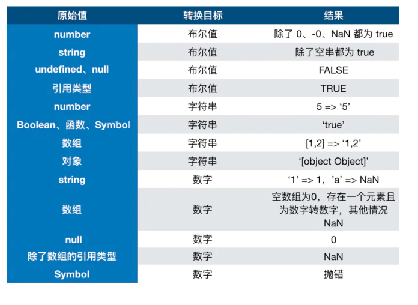

#### 转Boolean

在条件判断时，除了 undefined， null， false， NaN， ''， 0， -0，其他所有值都转为 true，包括所有对象。  

#### 对象转原始类型

对象在转换类型的时候，会调用内置的 [[ToPrimitive]] 函数，对于该函数来说，算法逻辑一般来说如下：  

- 如果已经是原始类型了，那就不需要转换了
- 如果需要转字符串类型就调用 x.toString()，转换为基础类型的话就返回转换的值。不是字符串类型的话就先调用 valueOf，结果不是基础类型的话再调用 toString
- 调用 x.valueOf()，如果转换为基础类型，就返回转换的值
- 如果都没有返回原始类型，就会报错

可以重写 Symbol.toPrimitive ，该方法在转原始类型时调用优先级最高。

```js
let a = {
  valueOf() {
    return 0
  },
  toString() {
    return '1'
  },
  [Symbol.toPrimitive]() {
    return 2
  }
}
1 + a // => 3
```

### 1.5. 四则运算符

- 运算中其中一方为字符串，那么就会把另一方也转换为字符串
- 如果一方不是字符串或者数字，那么会将它转换为数字或者字符串  

```js
1 + '1' // '11'          将数字 1 转换为字符串，得到结果 '11'
true + true // 2         将 true 转为数字 1
4 + [1,2,3] // "41,2,3"  将数组通过 toString 转为字符串 1,2,3，得到结果 41,2,3
```

加法还需要注意这个表达式 'a' + + 'b'

```js
'a' + + 'b' // -> "aNaN"
```

因为 + 'b' 等于 NaN，所以结果为 "aNaN"，你可能也会在一些代码中看到过 + '1' 的形式来快速获取 number 类型。  

### 1.6. 比较运算符

1. 如果是对象，就通过 toPrimitive 转换对象
2. 如果是字符串，就通过 unicode 字符索引来比较  

```js
[2, 1] > [2, 0]  // true
```

## 2. this

如何正确判断 this？箭头函数的 this 是什么？  

```js
function foo() {
  console.log(this.a);
}
var a = 1;
foo();

const obj = {
  a: 2,
  foo: foo,
};
obj.foo();

const c = new foo();
```

- 对于直接调用 foo 来说，不管 foo 函数被放在了什么地方，this 一定是 window
- 对于 obj.foo() 来说，我们只需要记住，谁调用了函数，谁就是 this，所以在这个场景下 foo 函数中的 this 就是 obj 对象
- 对于 new 的方式来说，this 被永远绑定在了 c 上面，不会被任何方式改变 this  

箭头函数中的 this  

```js
function a() {
  return () => {
    return () => {
      console.log(this === global); // true(node 环境global)
    };
  };
}
console.log(a()()());
```

箭头函数其实是没有 this 的，箭头函数中的 this 只取决包裹箭头函数的第一个普通函数的 this。在这个例子中，因为包裹箭头函数的第一个普通函数是 a，所以此时的 this 是 window。另外对箭头函数使用 bind 这类函数是无效的。  

### bind

对于这些函数来说，this 取决于第一个参数，如果第一个参数为空，那么就是 window。  

如果对一个函数进行多次 bind，那么上下文会是什么呢？  

```js
let a = {};
let fn = function () {
  console.log(this);
};
fn.bind().bind(a)(); // => window
```

可以把上述代码转换成另一种形式

```js
// fn.bind().bind(a) 等于
let fn2 = function fn1() {
  return function() {
    return fn.apply()
  }.apply(a)
}
fn2()
```

不管我们给函数 bind 几次，fn 中的 this 永远由第一次 bind 决定，所以结果永远是 window。  

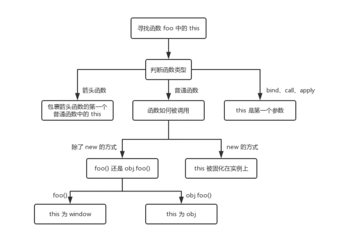

## 3. == vs ===

对于 == 来说，如果对比双方的类型不一样的话，就会进行类型转换  

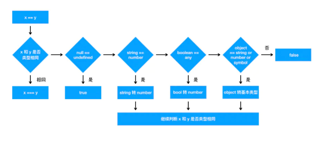

## 4. 闭包

闭包的定义：函数 A 内部有一个函数 B，函数 B 可以访问到函数 A 中的变量，那么函数 B 就是闭包。

```js
function A() {
  let a = 1;
  window.B = function () {
    console.log(a);
  };
}
A();
B(); // 1
```

在 JS 中，闭包存在的意义就是让我们可以间接访问函数内部的变量。  

```js
for (var i = 1; i <= 5; i++) {
  setTimeout(function timer() {
    console.log(i)
  }, i * 1000)
}
```

setTimeout 是个异步函数，所以会先把循环全部执行完毕，这时候 i 就是 6 了，所以会输出一堆 6。  

解决办法有三种，第一种是使用闭包的方式  

```js
for (var i = 1; i <= 5; i++) {
  (function (j) {
    setTimeout(function timer() {
      console.log(j);
    }, j * 1000);
  })(i);
}
```

首先使用了立即执行函数将 i 传入函数内部，这个时候值就被固定在了参数 j 上面不会改变，当下次执行 timer 这个闭包的时候，就可以使用外部函数的变量 j，从而达到目的。  

第二种就是使用 setTimeout 的第三个参数，这个参数会被当成 timer 函数的参数传入。  

```js
for (var i = 1; i <= 5; i++) {
  setTimeout(
    function timer(j) {
      console.log(j)
    },
    i * 1000,
    i
  )
}
```

第三种就是使用 let 定义 i 来解决问题了

```js
for (let i = 1; i <= 5; i++) {
  setTimeout(function timer() {
    console.log(i)
  }, i * 1000)
}
```

由于 let i = xxx 为块级别作用域，因而这一情况下的循环展开结果为：

```js
{
    let i = 1;
    setTimeout( timer, 1 * 1000 );
}
{
    let i = 2;
    setTimeout( timer, 2 * 1000 );
}
{
    let i = 3;
    setTimeout( timer, 3 * 1000 );
}
```

## 5. JavaScript 原型

参考[资料](https://juejin.cn/post/6844904053651030030)  demo路径：demos/5-prototype  

### 5.1. __proto__  constructor prototype

#### 5.1.1. __proto__

任何一个对象都有原型，可以通过非标准属性 __proto__ 来访问一个对象的原型：  

```js
// 纯对象的原型默认是个空对象
console.log({}.__proto__); // => {}
```

```js
function Student(name, grade) {
  this.name = name;
  this.grade = grade;
}

const stu = new Student("xiaoMing", 6);
// Student 类型实例的原型，默认也是一个空对象
console.log(stu.__proto__); // => Student {}
```

__proto__ 是非标准属性，要访问一个对象的原型，建议使用 ES6 新增的 Reflect.getPrototypeOf 或者 Object.getPrototypeOf() 方法。

```js
{}.__proto__ === Object.getPrototypeOf({}); // => true
```

可以通过对 __proto__ 属性直接赋值的方式修改对象的原型，更推荐的做法是使用使用 ES6 的 Reflect.setPrototypeOf 或 Object.setPrototypeOf。不论哪一种方式，被设置的值的类型只能是对象或者 null，其它类型不起作用：  

```js
const obj = { name: 'xiaoMing' };
// 原型为空对象
console.log(obj.__proto__); // => {}

obj.__proto__ = 666;
// 非对象和 null 不生效
console.log(obj.__proto__); // => {}

// 设置原型为对象
obj.__proto__ = { a: 1 };
console.log(obj.__proto__); // => { a: 1 }
console.log(Reflect.getPrototypeOf(obj)); // => { a: 1 }
```

如果一个对象的 __proto__ 属性被赋值为 null，这个时候它的原型确实已经被修改为 null 了，但是你想再通过对 __proto__ 赋值的方式设置原型时是无效的，这个时候 __proto__ 和一个普通属性没有区别，只能通过 Reflect.setPrototypeOf 或 Object.setPrototypeOf 才能修改原型。原型是对象内部的一个属性 [[prototype]]，而 Reflect.setPrototypeOf 之所以能修改原型是因为它是直接修改对象的原型属性，也就是内部直接对对象的 [[prototype]] 属性赋值，而不会通过 __proto__ 的 getter。  

```js
const obj = { name: 'xiaoming' };

obj.__proto__ = null;
// ! 为什么不是 null
console.log(obj.__proto__); // => undefined
// 说明确实将原型设置为 null 了
console.log(Reflect.getPrototypeOf(obj)); // => null

// 再次赋值为 null
obj.__proto__ = null;
// 黑人问号？？？咋不是之前的 undefined 呢？
console.log(obj.__proto__); // => null

obj.__proto__ = { a: 1 };
console.log(obj.__proto__); // => { a: 1 }   __proto__ 就像一个普通属性一样 obj.xxx = { a: 1 }
// 并没有将原型设置成功
console.log(Reflect.getPrototypeOf(obj)); // => null

Reflect.setPrototypeOf(obj, { b: 2 });
// __proto__ 被设置为 null 后，obj 的 __proto__ 属性和一个普通的属性没有区别
console.log(obj.__proto__); // => { a: 1 }
// 使用 Reflect.setPrototypeOf 是可以设置原型的
console.log(Reflect.getPrototypeOf(obj)); // => { b: 2 }
```

__proto__ 是个定义在 Object.prototype 上的访问器属性, 也就是使用getter 和 setter 定义的属性，通过 __proto__ 的 getter 我们可以获取到对象的[[Prototype]]，也就是原型。  

#### 5.1.2. constructor和prototype

在 JavaScript 中，函数都可以用作构造器。构造器我们也可以称之为类.任何构造器都有一个 prototype 属性，默认是一个空的纯对象，所有由构造器构造的实例的原型都是指向它。  

构造器的 prototype 属性默认是个空对象，注意这里说的空对象指的是该对象没有可遍历属性.  

构造器的 prototype 有一个 constructor 属性，指向构造器本身.  

```js
function Apple() {}
const apple = new Apple();
console.log(apple instanceof Apple); // => true

const apple1 = new Apple();
const apple2 = new Apple();
// 实例的原型即 apple1.__proto__
console.log(apple1.__proto__ === Apple.prototype); // => true
console.log(apple2.__proto__ === Apple.prototype); // => true
console.log(Apple.prototype); // => Apple {}
console.log(Object.keys(Apple.prototype)); // => []
console.log(Apple.prototype.__proto__ === {}.__proto__); // true
console.log(Apple.prototype.constructor === Apple); // => true
```  

constructor 属性是不可遍历的，可以理解为内部是这样定义该属性的：

```js
Object.defineProperty(Apple.prototype, 'constructor', {
  value: Student,
  writable: true,
  // 不可枚举，无法通过 Object.keys() 获取到
  enumerable: fasle,
});
```

__proto__ ，prototype，constructor，Apple函数，实例 apple 和原型对象 [[prototype]] 之间的关系：  

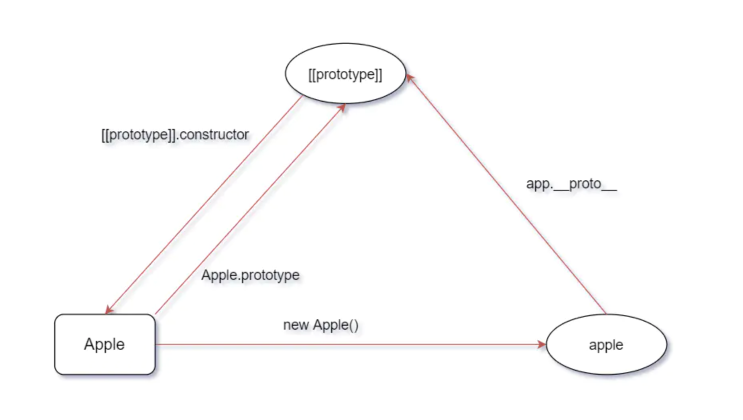

__proto__ 存在于所有的对象上，prototype 存在于所有的函数上，他俩的关系就是：函数的 prototype 是所有使用 new 这个函数构造的实例的 __proto__。函数也是对象，所以函数同时有 __proto__ 和prototype。  

### 5.2. 原型链

各个原型之间构成的链，称之为原型链。  

```js
function Student(name, grade) {
  this.name = name;
  this.grade = grade;
}

const stu = new Student();
console.log(stu.notExists); // => undefined
console.log(stu.__proto__.__proto__ === {}.__proto__); // => true
```

访问 stu.notExists 的整个过程是：

1. 先看 stu 上是否存在 notExists，不存在，所以看 stu.__proto__
2. stu.__proto__ 上也不存在 notExists 属性，再看 stu.__proto__.__proto__，其实就是纯对象的原型：Object.prototype
3. 纯对象的原型上也不存在 notExists 属性，再往上，到 stu.__proto__.__proto__.__proto__ 上去找，其实就是 null
4. null 不存在 notExists 属性，返回 undefined

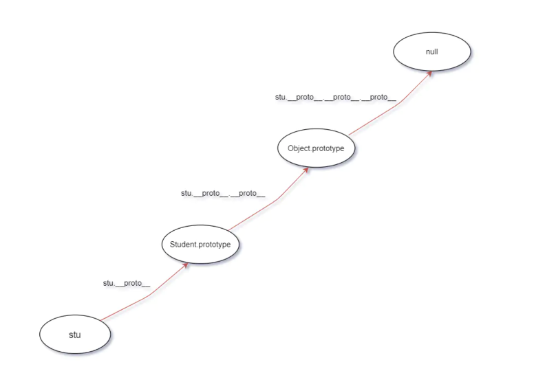

函数 Student 的原型链  

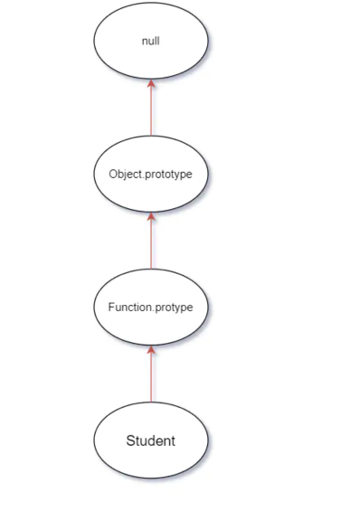

### 5.3. ES6 class 和构造器的关系

#### 5.3.1. ES6 class

ES6 class 就是构造器的语法糖。 babel 将 ES6 class 编译成了啥：

在线[babel](https://babeljs.io/repl#?browsers=defaults%2C%20not%20ie%2011%2C%20not%20ie_mob%2011&build=&builtIns=false&spec=false&loose=false&code_lz=MYGwhgzhAEDCCWAnUBTaBvAUNawD2AdhAC6ICuwxeiAFAB4A00Ank4gJQbY7TEAW8CADo60ALzQ6Abm45-goc3EsZPXgOGJliVdAC-mbgBNEYAO41OWNfiJ4QKISDwBzGgANA3K6AqOUAK6oHALQC45aBoAEnR5YTo9JnDIxT12QBh_wCllQBD9YLiNIUQ9aEAQt0AwdXd2XQMDIA&debug=false&forceAllTransforms=false&shippedProposals=false&circleciRepo=&evaluate=false&fileSize=false&timeTravel=false&sourceType=module&lineWrap=true&presets=env%2Ces2015-loose&prettier=false&targets=&version=7.12.12&externalPlugins=), presets选择es2005-loose  

原代码：

```js
class Circle {
  constructor(x, y, r) {
    this.x = x;
    this.y = y;
    this.r = r;
  }

  draw() {
    console.log(`画个坐标为 (${this.x}, ${this.y})，半径为 ${this.r} 的圆`);
  }
}
```

编译结果

```js
"use strict";
var Circle = /*#__PURE__*/function () {
  function Circle(x, y, r) {
    this.x = x;
    this.y = y;
    this.r = r;
  }

  var _proto = Circle.prototype;

  _proto.draw = function draw() {
    console.log("\u753B\u4E2A\u5750\u6807\u4E3A (" + this.x + ", " + this.y + ")\uFF0C\u534A\u5F84\u4E3A " + this.r + " \u7684\u5706");
  };

  return Circle;
}();
```

从上可以看出，ES6 的 class 就是构造器，class 上的方法定义在构造器的 prototype 上。  

#### 5.3.2. extends 继承

原代码:

```js
class Shape {
  constructor(x, y) {
    this.x = x;
    this.y = y;
  }
}

class Circle extends Shape {
  constructor(x, y, r) {
    super(x, y);
    this.r = r;
  }

  draw() {
    console.log(`画个坐标为 (${this.x}, ${this.y})，半径为 ${this.r} 的圆`);
  }
}
```

编译后

```js
"use strict";

function _inheritsLoose(subClass, superClass) {
  subClass.prototype = Object.create(superClass.prototype);
  subClass.prototype.constructor = subClass;
  // 让子类可以访问父类上的静态属性，其实就是定义在构造器自身上的属性
  subClass.__proto__ = superClass;
}

var Shape = function Shape(x, y) {
  this.x = x;
  this.y = y;
};

var Circle = /*#__PURE__*/ (function (_Shape) {
  _inheritsLoose(Circle, _Shape);

  function Circle(x, y, r) {
    var _this;
    // 组合继承: 子类构造器中调用了父类构造器并将 this 指向子类实例达到将父类的实例属性组合到子类实例上
    _this = _Shape.call(this, x, y) || this;
    _this.r = r;
    return _this;
  }

  var _proto = Circle.prototype;

  _proto.draw = function draw() {
    console.log(
      "\u753B\u4E2A\u5750\u6807\u4E3A (" +
        this.x +
        ", " +
        this.y +
        ")\uFF0C\u534A\u5F84\u4E3A " +
        this.r +
        " \u7684\u5706"
    );
  };

  return Circle;
})(Shape);
```

ES6 的 extends 实现的是原型继承 + 组合继承。  

### 5.4. 原型继承

对于类 A 和类 B，如果满足 A.prototype.__proto__ === B.prototype，那么 A 原型继承 B  

```js
function A() {}
function B() {
  this.b = "污染 A 的原型";
}

A.prototype = new B();
console.log(A.prototype.__proto__ === B.prototype); // => true
const a = new A();
const b = new B();
console.log(a instanceof A); // => true
console.log(a instanceof B); // => true
console.log(b instanceof B); // => true
console.log(A.prototype.constructor); // => [Function: B]
```

这种方式会导致 B 的实例属性污染 A 的原型。解决办法就是通过一个空的函数桥接一下，空的函数总不会有实例属性污染原型链  

```js
function A(p) {
  this.p = p;
}

function B() {
  this.b = "污染原型";
}

// 空函数
function Empty() {}

Empty.prototype = B.prototype;
A.prototype = new Empty();
// 修正 constructor 指向
A.prototype.constructor = A;

// 满足原型继承的定义
console.log(A.prototype.__proto__ === B.prototype); // => true

const a = new A("p");
console.log(a instanceof A); // => true

const b = new B();
console.log(b instanceof B); // => true

// a 也是 B 的实例
console.log(a instanceof B); // => true
console.log(a.__proto__.__proto__ === B.prototype); // => true
console.log(A.prototype.constructor); // => [Function: A]
```

### 5.5. 和原型相关语法特性

#### 5.5.1. new 运算符原理

```js
function isObject(value) {
  const type = typeof value;
  return value !== null && (type === "object" || type === "function");
}

/**
 * constructor 表示 new 的构造器
 * args 表示传给构造器的参数
 */
function New(constructor, ...args) {
  // new 的对象不是函数就抛 TypeError
  if (typeof constructor !== "function")
    throw new TypeError(`${constructor} is not a constructor`);

  // 创建一个原型为构造器的 prototype 的空对象 target
  const target = Object.create(constructor.prototype);
  // 将构造器的 this 指向上一步创建的空对象，并执行，为了给 this 添加实例属性
  const result = constructor.apply(target, args);

  // 上一步的返回如果是对象就直接返回，否则返回 target
  return isObject(result) ? result : target;
}

// 测试New
function Computer(brand) {
  this.brand = brand;
}

const c = New(Computer, "Apple");
console.log(c); // => Computer { brand: 'Apple' }
```

#### 5.5.2. instanceof 运算符原理

instanceof 用于判断对象是否是某个类的实例，obj instanceof 构造器 A，等同于判断 A 的 prototype 是不是 obj 的原型（也可能是二级原型）。

```js
function instanceOf(obj, constructor) {
  if (!isObject(constructor)) {
    throw new TypeError(`Right-hand side of 'instanceof' is not an object`);
  } else if (typeof constructor !== "function") {
    throw new TypeError(`Right-hand side of 'instanceof' is not callable`);
  }

  // isPrototypeOf() 方法用于测试一个对象是否存在于另一个对象的原型链上。
  return constructor.prototype.isPrototypeOf(obj);
}
```

### 5.6. 原型污染

[Lodash库爆出严重安全漏洞，波及400万+项目](https://mp.weixin.qq.com/s/tfZq2PZylGfMjOp8h8eeTw)  
[最新：Lodash 严重安全漏洞背后你不得不知道的 JavaScript 知识](https://juejin.cn/post/6844903887686598663)  

原型污染指的是：攻击者通过某种手段修改 JavaScript 对象的原型.  

#### 5.6.1. 性能问题

原型被污染会增加遍历的次数，每次访问对象自身不存在的属性时也要访问下原型上被污染的属性。

```js
// 原型被污染会增加遍历的次数，每次访问对象自身不存在的属性时也要访问下原型上被污染的属性。
Object.prototype.hack = "污染原型的属性";
const obj = { name: "xiaoHong", age: 18 };
for (const key in obj) {
  console.log('key=', key); // key= name / key= age / key= hack
  if (obj.hasOwnProperty(key)) {
    console.log(obj[key]); // xiaoHong / 18
  }
}
```

#### 5.6.2. 导致意外的逻辑 bug

```js
// node 安全漏洞案例
const express = require("express");
const bodyParser = require("body-parser");
const cookieParser = require("cookie-parser");
const path = require("path");

const isObject = (obj) => obj && obj.constructor && obj.constructor === Object;

function merge(a, b) {
  for (var attr in b) {
    if (isObject(a[attr]) && isObject(b[attr])) {
      merge(a[attr], b[attr]);
    } else {
      a[attr] = b[attr];
    }
  }
  return a;
}

function clone(a) {
  return merge({}, a);
}

// Constants
const PORT = 8080;
const HOST = "127.0.0.1";
const admin = {};

// App
const app = express();
app.use(bodyParser.json());
app.use(cookieParser());

app.use("/", express.static(path.join(__dirname, "views")));
app.post("/signup", (req, res) => {
  var body = JSON.parse(JSON.stringify(req.body));
  var copybody = clone(body);
  if (copybody.name) {
    res.cookie("name", copybody.name).json({
      done: "cookie set",
    });
  } else {
    res.json({
      error: "cookie not set",
    });
  }
});
app.get("/getFlag", (req, res) => {
  var аdmin = JSON.parse(JSON.stringify(req.cookies));
  if (admin.аdmin == 1) {
    res.send("hackim19{}");
  } else {
    res.send("You are not authorized");
  }
});
app.listen(PORT, HOST);
console.log(`Running on http://${HOST}:${PORT}`);

// 漏洞就在于 merge 函数上，我们可以这样攻击：
// curl -vv --header 'Content-type: application/json' -d '{"__proto__": {"admin": 1}}' 'http://127.0.0.1:4000/signup';
// curl -vv 'http://127.0.0.1/getFlag'
```

首先请求 /signup 接口，在 NodeJS 服务中，我们调用了有漏洞的 merge 方法，并通过 __proto__ 为 Object.prototype（因为 {}.__proto__ === Object.prototype） 添加上一个新的属性 admin，且值为 1。  
再次请求 getFlag 接口，访问了 Object 原型上的admin，条件语句 admin.аdmin == 1 为 true，服务被攻击。  

#### 5.6.3. 预防原型污染

其实原型污染大多发生在调用会修改或者扩展对象属性的函数时，例如 lodash 的 defaults，jquery 的 extend。预防原型污染最主要还是要有防患意识，养成良好的编码习惯。  

##### Object.create(null)

通过 Object.create(null) 创建没有原型的对象，即便你对它设置__proto__ 也没有用，因为它的原型一开始就是 null，没有 __proro__ 的 setter。

```js
const obj = Object.create(null);
obj.__proto__ = { hack: '污染原型的属性' };
const obj1 = {};
console.log(obj1.__proto__); // => {}
```

##### Object.freeze(obj)

Object.freeze(obj) 冻结对象 obj，被冻结的对象不能被修改属性，成为不可扩展对象。  

```js
const obj = Object.freeze({ name: 'xiaoHong' });
obj.xxx = 666;
console.log(obj); // => { name: 'xiaoHong' }
console.log(Object.isExtensible(obj)); // => false
obj.__proto__ = null; // => TypeError: #<Object> is not extensible
```

面试题：

```js
function Page() {
  return this.hosts;
}
Page.hosts = ["h1"];
Page.prototype.hosts = ["h2"];

const p1 = new Page();
const p2 = Page();

//  new 的时候如果 return 了对象，会直接拿这个对象作为 new 的结果，因此，p1 应该是 this.hosts 的结果，而在 new Page() 的时候，this 是一个以 Page.prototype 为原型的 target 对象，所以这里 this.hosts 可以访问到 Page.prototype.hosts 也就是 ['h2']。这样 p1 就是等于 ['h2']，['h2'] 没有 hosts 属性所以返回 undefined。
console.log(p1.hosts); // => undefiend

// p2 是直接调用 Page 构造函数的结果，直接调用 page 函数，这个时候 this 指向全局对象，全局对象并没 hosts 属性，因此返回 undefined，往 undefined 上访问 hosts 当然报错。
console.log(p2.hosts); // => cannot read property 'hosts' of undefined
```

## 6. 手写promise

参考：https://zhuanlan.zhihu.com/p/183801144  

结合[Promises/A+](https://promisesaplus.com/) 规范，可以分析出 Promise 的基本特征：  

1. promise 有三个状态：pending，fulfilled，or rejected；「规范 Promise/A+ 2.1」
2. new promise时， 需要传递一个executor()执行器，执行器立即执行；
3. executor接受两个参数，分别是resolve和reject；
4. promise 的默认状态是 pending；
5. promise 有一个value保存成功状态的值，可以是undefined/thenable/promise；「规范 Promise/A+ 1.3」
6. promise 有一个reason保存失败状态的值；「规范 Promise/A+ 1.5」
7. promise 只能从pending到rejected, 或者从pending到fulfilled，状态一旦确认，就不会再改变；
8. promise 必须有一个then方法，then 接收两个参数，分别是 promise 成功的回调 onFulfilled, 和 promise 失败的回调 onRejected；「规范 Promise/A+ 2.2」
9. 如果调用 then 时，promise 已经成功，则执行onFulfilled，参数是promise的value；
10. 如果调用 then 时，promise 已经失败，那么执行onRejected, 参数是promise的reason；
11. 如果 then 中抛出了异常，那么就会把这个异常作为参数，传递给下一个 then 的失败的回调onRejected；

勾勒下 Promise 的形状：

```js
// 三个状态：PENDING、FULFILLED、REJECTED
const PENDING = 'PENDING';
const FULFILLED = 'FULFILLED';
const REJECTED = 'REJECTED';

class MyPromise {
  constructor(executor) {
    // 默认状态为 PENDING
    this.status = PENDING;
    // 存放成功状态的值，默认为 undefined
    this.value = undefined;
    // 存放失败状态的值，默认为 undefined
    this.reason = undefined;

    // 调用此方法就是成功
    let resolve = (value) => {
      // 状态为 PENDING 时才可以更新状态，防止 executor 中调用了两次 resovle/reject 方法
      if(this.status ===  PENDING) {
        this.status = FULFILLED;
        this.value = value;
      }
    } 

    // 调用此方法就是失败
    let reject = (reason) => {
      // 状态为 PENDING 时才可以更新状态，防止 executor 中调用了两次 resovle/reject 方法
      if(this.status ===  PENDING) {
        this.status = REJECTED;
        this.reason = reason;
      }
    }

    try {
      // 立即执行，将 resolve 和 reject 函数传给使用者  
      executor(resolve,reject)
    } catch (error) {
      // 发生异常时执行失败逻辑
      reject(error)
    }
  }

  // 包含一个 then 方法，并接收两个参数 onFulfilled、onRejected
  then(onFulfilled, onRejected) {
    if (this.status === FULFILLED) {
      onFulfilled(this.value)
    }

    if (this.status === REJECTED) {
      onRejected(this.reason)
    }
  }
}
```

如果在 executor()中传入一个异步操作的话,试一下：  

```js
const promise = new Promise((resolve, reject) => {
  // 传入一个异步操作
  setTimeout(() => {
    resolve('成功');
  },1000);
}).then(
  (data) => {
    console.log('success', data)
  },
  (err) => {
    console.log('faild', err)
  }
)
```

执行测试脚本后发现，promise 没有任何返回。  

因为 promise 调用 then 方法时，当前的 promise 并没有成功，一直处于 pending 状态。所以如果当调用 then 方法时，当前状态是 pending，我们需要先将成功和失败的回调分别存放起来，在executor()的异步任务被执行时，触发 resolve 或 reject，依次调用成功或失败的回调。  

```js
const PENDING = "PENDING";
const FULFILLED = "FULFILLED";
const REJECTED = "REJECTED";

class MyPromise {
  constructor(executor) {
    this.status = PENDING;
    this.value = undefined;
    this.reason = undefined;
    // 存放成功的回调
    this.onResolvedCallbacks = [];
    // 存放失败的回调
    this.onRejectedCallbacks = [];

    let resolve = (value) => {
      if (this.status === PENDING) {
        this.status = FULFILLED;
        this.value = value;
        // 依次将对应的函数执行
        this.onResolvedCallbacks.forEach((fn) => fn());
      }
    };

    let reject = (reason) => {
      if (this.status === PENDING) {
        this.status = REJECTED;
        this.reason = reason;
        // 依次将对应的函数执行
        this.onRejectedCallbacks.forEach((fn) => fn());
      }
    };

    try {
      executor(resolve, reject);
    } catch (error) {
      reject(error);
    }
  }

  then(onFulfilled, onRejected) {
    if (this.status === FULFILLED) {
      onFulfilled(this.value);
    }

    if (this.status === REJECTED) {
      onRejected(this.reason);
    }

    if (this.status === PENDING) {
      // 如果promise的状态是 pending，需要将 onFulfilled 和 onRejected 函数存放起来，等待状态确定后，再依次将对应的函数执行
      this.onResolvedCallbacks.push(() => {
        onFulfilled(this.value);
      });

      // 如果promise的状态是 pending，需要将 onFulfilled 和 onRejected 函数存放起来，等待状态确定后，再依次将对应的函数执行
      this.onRejectedCallbacks.push(() => {
        onRejected(this.reason);
      });
    }
  }
}
```

### then 的链式调用&值穿透特性

promise 的优势在于可以链式调用。在我们使用 Promise 的时候，当 then 函数中 return 了一个值，不管是什么值，我们都能在下一个 then 中获取到，这就是所谓的then 的链式调用。  

而且，当我们不在 then 中放入参数，例：promise.then().then()，那么其后面的 then 依旧可以得到之前 then 返回的值，这就是所谓的值的穿透。  

如果每次调用 then 的时候，我们都重新创建一个 promise 对象，并把上一个 then 的返回结果传给这个新的 promise 的 then 方法，不就可以一直 then 下去了.  

再结合 [Promise/A+](https://promisesaplus.com/) 规范梳理一下思路：

1. then 的参数 onFulfilled 和 onRejected 可以缺省，如果 onFulfilled 或者 onRejected不是函数，将其忽略，且依旧可以在下面的 then 中获取到之前返回的值；「规范 Promise/A+ 2.2.1、2.2.1.1、2.2.1.2」
2. promise 可以 then 多次，每次执行完 promise.then 方法后返回的都是一个“新的promise"；「规范 Promise/A+ 2.2.7」
3. 如果 then 的返回值 x 是一个普通值，那么就会把这个结果作为参数，传递给下一个 then 的成功的回调中；
4. 如果 then 中抛出了异常，那么就会把这个异常作为参数，传递给下一个 then 的失败的回调中；「规范 Promise/A+ 2.2.7.2」
5. 如果 then 的返回值 x 是一个 promise，那么会等这个 promise 执行完，promise 如果成功，就走下一个 then 的成功；如果失败，就走下一个 then 的失败；如果抛出异常，就走下一个 then 的失败；「规范 Promise/A+ 2.2.7.3、2.2.7.4」
6. 如果 then 的返回值 x 和 promise 是同一个引用对象，造成循环引用，则抛出异常，把异常传递给下一个 then 的失败的回调中；「规范 Promise/A+ 2.3.1」
7. 如果 then 的返回值 x 是一个 promise，且 x 同时调用 resolve 函数和 reject 函数，则第一次调用优先，其他所有调用被忽略；「规范 Promise/A+ 2.3.3.3.3」

```js
const PENDING = "PENDING";
const FULFILLED = "FULFILLED";
const REJECTED = "REJECTED";

const resolvePromise = (promise2, x, resolve, reject) => {
  // 自己等待自己完成是错误的实现，用一个类型错误，结束掉 promise  Promise/A+ 2.3.1
  if (promise2 === x) {
    return reject(
      new TypeError("Chaining cycle detected for promise #<Promise>")
    );
  }
  // Promise/A+ 2.3.3.3.3 只能调用一次
  let called;
  // 后续的条件要严格判断 保证代码能和别的库一起使用
  if ((typeof x === "object" && x != null) || typeof x === "function") {
    try {
      // 为了判断 resolve 过的就不用再 reject 了（比如 reject 和 resolve 同时调用的时候）  Promise/A+ 2.3.3.1
      let then = x.then;
      if (typeof then === "function") {
        // 不要写成 x.then，直接 then.call 就可以了 因为 x.then 会再次取值，Object.defineProperty  Promise/A+ 2.3.3.3
        then.call(
          x,
          (y) => {
            // 根据 promise 的状态决定是成功还是失败
            if (called) return;
            called = true;
            // 递归解析的过程（因为可能 promise 中还有 promise） Promise/A+ 2.3.3.3.1
            resolvePromise(promise2, y, resolve, reject);
          },
          (r) => {
            // 只要失败就失败 Promise/A+ 2.3.3.3.2
            if (called) return;
            called = true;
            reject(r);
          }
        );
      } else {
        // 如果 x.then 是个普通值就直接返回 resolve 作为结果  Promise/A+ 2.3.3.4
        resolve(x);
      }
    } catch (e) {
      // Promise/A+ 2.3.3.2
      if (called) return;
      called = true;
      reject(e);
    }
  } else {
    // 如果 x 是个普通值就直接返回 resolve 作为结果  Promise/A+ 2.3.4
    resolve(x);
  }
};

class MyPromise {
  constructor(executor) {
    this.status = PENDING;
    this.value = undefined;
    this.reason = undefined;
    this.onResolvedCallbacks = [];
    this.onRejectedCallbacks = [];

    let resolve = (value) => {
      if (this.status === PENDING) {
        this.status = FULFILLED;
        this.value = value;
        this.onResolvedCallbacks.forEach((fn) => fn());
      }
    };

    let reject = (reason) => {
      if (this.status === PENDING) {
        this.status = REJECTED;
        this.reason = reason;
        this.onRejectedCallbacks.forEach((fn) => fn());
      }
    };

    try {
      executor(resolve, reject);
    } catch (error) {
      reject(error);
    }
  }

  then(onFulfilled, onRejected) {
    //解决 onFufilled，onRejected 没有传值的问题
    //Promise/A+ 2.2.1 / Promise/A+ 2.2.5 / Promise/A+ 2.2.7.3 / Promise/A+ 2.2.7.4
    onFulfilled = typeof onFulfilled === "function" ? onFulfilled : (v) => v;
    //因为错误的值要让后面访问到，所以这里也要跑出个错误，不然会在之后 then 的 resolve 中捕获
    onRejected =
      typeof onRejected === "function"
        ? onRejected
        : (err) => {
            throw err;
          };
    // 每次调用 then 都返回一个新的 promise  Promise/A+ 2.2.7
    let promise2 = new Promise((resolve, reject) => {
      if (this.status === FULFILLED) {
        //Promise/A+ 2.2.2
        //Promise/A+ 2.2.4 --- setTimeout
        setTimeout(() => {
          try {
            //Promise/A+ 2.2.7.1
            let x = onFulfilled(this.value);
            // x可能是一个proimise
            resolvePromise(promise2, x, resolve, reject);
          } catch (e) {
            //Promise/A+ 2.2.7.2
            reject(e);
          }
        }, 0);
      }

      if (this.status === REJECTED) {
        //Promise/A+ 2.2.3
        setTimeout(() => {
          try {
            let x = onRejected(this.reason);
            resolvePromise(promise2, x, resolve, reject);
          } catch (e) {
            reject(e);
          }
        }, 0);
      }

      if (this.status === PENDING) {
        this.onResolvedCallbacks.push(() => {
          setTimeout(() => {
            try {
              let x = onFulfilled(this.value);
              resolvePromise(promise2, x, resolve, reject);
            } catch (e) {
              reject(e);
            }
          }, 0);
        });

        this.onRejectedCallbacks.push(() => {
          setTimeout(() => {
            try {
              let x = onRejected(this.reason);
              resolvePromise(promise2, x, resolve, reject);
            } catch (e) {
              reject(e);
            }
          }, 0);
        });
      }
    });

    return promise2;
  }
}
```

### 测试 Promise 是否符合规范

首先，在 promise 实现的代码中，增加以下代码:

```js
Promise.defer = Promise.deferred = function () {
  let dfd = {};
  dfd.promise = new Promise((resolve,reject)=>{
      dfd.resolve = resolve;
      dfd.reject = reject;
  })
  return dfd;
}
```

安装测试脚本:

```text
npm install -g promises-aplus-tests
```

在对应的目录执行以下命令:

```text
promises-aplus-tests promise.js
```

由于原生的 Promise 是V8引擎提供的微任务，我们无法还原V8引擎的实现，所以这里使用 setTimeout 模拟异步，所以原生的是微任务，这里是宏任务。  

Promise A+ 规范3.1 中也提到了：这可以通过“宏任务”机制（例如setTimeout或setImmediate）或“微任务”机制（例如MutatonObserver或）来实现process.nextTick。  

如果你想实现 promise 的微任务，可以 mutationObserver 替代 seiTimeout 来实现微任务。  

### Promise 的 API

Promise.resolve()  
Promise.reject()  
Promise.prototype.catch()  
Promise.prototype.finally()  
Promise.all()  
Promise.race(）  

#### Promise.resolve

默认产生一个成功的 promise。

```js
static resolve(data){
  return new Promise((resolve,reject)=>{
    resolve(data);
  })
}
```

promise.resolve 是具备等待功能的。如果参数是 promise 会等待这个 promise 解析完毕，在向下执行，所以这里需要在 resolve 方法中做一个小小的处理：  

```js
let resolve = (value) => {
  // ======新增逻辑======
  // 如果 value 是一个promise，那我们的库中应该也要实现一个递归解析
  if(value instanceof Promise){
      // 递归解析 
      return value.then(resolve,reject)
  }
  // ===================
  if(this.status ===  PENDING) {
    this.status = FULFILLED;
    this.value = value;
    this.onResolvedCallbacks.forEach(fn=>fn());
  }
}
```

#### Promise.reject

默认产生一个失败的 promise，Promise.reject 是直接将值变成错误结果。

```js
static reject(reason){
  return new Promise((resolve,reject)=>{
    reject(reason);
  })
}
```

#### Promise.prototype.catch

Promise.prototype.catch 用来捕获 promise 的异常，就相当于一个没有成功的 then。

```js
Promise.prototype.catch = function(errCallback){
  return this.then(null,errCallback)
}
```

#### Promise.prototype.finally

finally 表示不是最终的意思，而是无论如何都会执行的意思。 如果返回一个 promise 会等待这个 promise 也执行完毕。如果返回的是成功的 promise，会采用上一次的结果；如果返回的是失败的 promise，会用这个失败的结果，传到 catch 中。  

```js
Promise.prototype.finally = function(callback) {
  return this.then((value)=>{
    return Promise.resolve(callback()).then(()=>value)
  },(reason)=>{
    return Promise.resolve(callback()).then(()=>{throw reason})
  })  
}
```

#### Promise.all

promise.all 是解决并发问题的，多个异步并发获取最终的结果（如果有一个失败则失败）。  

```js
Promise.all = function(values) {
  if (!Array.isArray(values)) {
    const type = typeof values;
    return new TypeError(`TypeError: ${type} ${values} is not iterable`)
  }
  return new Promise((resolve, reject) => {
    let resultArr = [];
    let orderIndex = 0;
    const processResultByKey = (value, index) => {
      resultArr[index] = value;
      if (++orderIndex === values.length) {
          resolve(resultArr)
      }
    }
    for (let i = 0; i < values.length; i++) {
      let value = values[i];
      if (value && typeof value.then === 'function') {
        value.then((value) => {
          processResultByKey(value, i);
        }, reject);
      } else {
        processResultByKey(value, i);
      }
    }
  });
}
```

#### Promise.race

Promise.race 用来处理多个请求，采用最快的（谁先完成用谁的）。  

```js
Promise.race = function(promises) {
  return new Promise((resolve, reject) => {
    // 一起执行就是for循环
    for (let i = 0; i < promises.length; i++) {
      let val = promises[i];
      if (val && typeof val.then === 'function') {
        val.then(resolve, reject);
      } else { // 普通值
        resolve(val)
      }
    }
  });
}
```

特别需要注意的是：因为Promise 是没有中断方法的，xhr.abort()、ajax 有自己的中断方法，axios 是基于 ajax 实现的；fetch 基于 promise，所以他的请求是无法中断的。  

可以使用 race 来自己封装中断方法  

```js
function wrap(promise) {
  // 在这里包装一个 promise，可以控制原来的promise是成功还是失败
  let abort;
  let newPromise = new Promise((resolve, reject) => { // defer 方法
      abort = reject;
  });
  let p = Promise.race([promise, newPromise]); // 任何一个先成功或者失败 就可以获取到结果
  p.abort = abort;
  return p;
}

const promise = new Promise((resolve, reject) => {
  setTimeout(() => { // 模拟的接口调用 ajax 肯定有超时设置
      resolve('成功');
  }, 1000);
});

let newPromise = wrap(promise);

setTimeout(() => {
  // 超过3秒 就算超时 应该让 proimise 走到失败态
  newPromise.abort('超时了');
}, 3000);

newPromise.then((data => {
    console.log('成功的结果' + data)
})).catch(e => {
    console.log('失败的结果' + e)
})
```

## 7. 手写 call、apply 及 bind 函数

### 7.1. call

- 首先 context 为可选参数，如果不传的话默认上下文为 window
- 接下来给 context 创建一个 fn 属性，并将值设置为需要调用的函数
- 因为 call 可以传入多个参数作为调用函数的参数，所以需要将参数剥离出来
- 然后调用函数并将对象上的函数删除

```js
Function.prototype.myCall = function (context) {
  // this指向调用myCall的对象
  if (typeof this !== "function") {
    throw new TypeError("Error");
  }
  context = context || window;
  context.fn = this;
  const args = [...arguments].slice(1);
  const result = context.fn(...args);
  delete context.fn;
  return result;
};
```

### 7.2. apply

apply和call实现类似，不同的就是参数的处理

```js
Function.prototype.myApply = function (context) {
  if (typeof this !== "function") {
    throw new TypeError("Error");
  }
  context = context || window;
  context.fn = this;
  let result;
  // 处理参数和 call 有区别
  if (arguments[1]) {
    result = context.fn(...arguments[1]);
  } else {
    result = context.fn();
  }
  delete context.fn;
  return result;
};
```

### 7.3. bind

bind 需要返回一个函数，需要判断一些边界问题  

bind 返回了一个函数，对于函数来说有两种方式调用，一种是直接调用，一种是通过 new 的方式  

- 对于直接调用来说，选择了 apply 的方式实现，但是对于参数需要注意以下情况：因为 bind 可以实现类似这样的代码 f.bind(obj, 1)(2)，所以我们需要将两边的参数拼接起来，于是就有了这样的实现 args.concat(...arguments)  

- 对于 new 的情况来说，不会被任何方式改变 this，所以对于这种情况我们需要忽略传入的 this  

```js
// bind后的函数会返回一个函数
Function.prototype.myBind = function (context) {
  if (typeof this !== "function") {
    throw new TypeError(this + "must be a function");
  }
  // 存储函数本身
  const _this = this;
  // 去除thisArg的其他参数 转成数组
  const args = [...arguments].slice(1);
  // 返回一个函数
  return function F() {
    // 可能返回了一个构造函数，可以 new F()，所以需要判断
    if (this instanceof F) {
      return new _this(...args, ...arguments);
    }
    return _this.apply(context, args.concat(...arguments));
  };
};
```

## 8. 垃圾回收机制

https://time.geekbang.org/column/article/131233

**垃圾回收**: JavaScript 中的内存管理是自动执行的，而且是不可见的。我们创建基本类型、对象、函数……所有这些都需要内存。  

**可达性**: 那些以某种方式可访问或可用的值，它们被保证存储在内存中。  

1. 有一组基本的固有可达值，由于显而易见的原因无法删除。例如:

  - 本地函数的局部变量和参数
  - 当前嵌套调用链上的其他函数的变量和参数
  - 全局变量
  - 还有一些其他的，内部的  

这些值称为根。  

2. 如果引用或引用链可以从根访问任何其他值，则认为该值是可访问的。

例如，如果局部变量中有对象，并且该对象具有引用另一个对象的属性，则该对象被视为可达性，它引用的那些也是可以访问的。JavaScript 引擎中有一个后台进程称为垃圾回收器，它监视所有对象，并删除那些不可访问的对象。  

下面是最简单的例子:

```js
// user 具有对象的引用
let user = {
  name: "John"
};
```


这里箭头表示一个对象引用。全局变量“user”引用对象 {name:“John”} (为了简洁起见，我们将其命名为John)。John 的 “name” 属性存储一个基本类型，因此它被绘制在对象中。  

如果 user 的值被覆盖，则引用丢失:

```js
user = null;
```

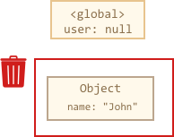

现在 John 变成不可达的状态，没有办法访问它，没有对它的引用。垃圾回收器将丢弃 John 数据并释放内存。  

**两个引用**  

将引用从 user 复制到 admin:

```js
// user具有对象的引用
let user = {
  name: "John"
};

let admin = user;
```


做同样的事情:

```js
user = null;
```

该对象仍然可以通过 admin 全局变量访问，所以它在内存中。如果我们也覆盖admin，那么它可以被释放。

**相互关联的对象**  

```js
function marry (man, woman) {
  woman.husban = man;
  man.wife = woman;

  return {
    father: man,
    mother: woman
  }
}

let family = marry({
  name: "John"
}, {
  name: "Ann"
})
```

函数 marry 通过给两个对象彼此提供引用来“联姻”它们，并返回一个包含两个对象的新对象。产生的内存结构:  


到目前为止，所有对象都是可访问的。现在让我们删除两个引用:

```js
delete family.father;
delete family.mother.husband;
```

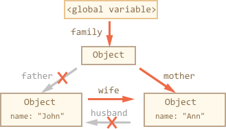

仅仅删除这两个引用中的一个是不够的，因为所有对象仍然是可访问的。  

但是如果我们把这两个都删除，那么我们可以看到 John 不再有传入的引用:  


输出引用无关紧要。只有传入的对象才能使对象可访问，因此，John 现在是不可访问的，并将从内存中删除所有不可访问的数据。  

垃圾回收之后：  


### 8.1. 基本的垃圾回收算法

基本的垃圾回收算法称为“标记-清除”，定期执行以下“垃圾回收”步骤:

- 垃圾回收器获取根并“标记”(记住)它们。
- 然后它访问并“标记”所有来自它们的引用。
- 然后它访问标记的对象并标记它们的引用。所有被访问的对象都被记住，以便以后不再访问同一个对象两次。
- 以此类推，直到有未访问的引用(可以从根访问)为止。
- 除标记的对象外，所有对象都被删除。  

第一步标记根


然后标记他们的引用


以及子孙代的引用

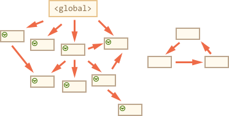

现在进程中不能访问的对象被认为是不可访问的，将被删除


JavaScript引擎应用了许多优化，使其运行得更快，并且不影响执行。一些优化:

- 分代回收——对象分为两组:“新对象”和“旧对象”。许多对象出现，完成它们的工作并迅速结 ，它们很快就会被清理干净。那些活得足够久的对象，会变“老”，并且很少接受检查。
- 增量回收——如果有很多对象，并且我们试图一次遍历并标记整个对象集，那么可能会花费一些时间，并在执行中会有一定的延迟。因此，引擎试图- 将垃圾回收分解为多个部分。然后，各个部分分别执行。这需要额外的标记来跟踪变化，这样有很多微小的延迟，而不是很大的延迟。
空闲时间收集——垃圾回收器只在 CPU 空闲时运行，以减少对执行的可能影响。

### 8.2. 新生代和老生代算法

1. minor gc是新生代的“复制”（Copying）算法：将现有的内存空间分为两快，每次只使用其中一块，在垃圾回收时将正在使用的内存中的存活对象复制到未被使用的内存块中，之后，清除正在使用的内存块中的所有对象，交换两个内存的角色，完成垃圾回收。

2. full gc的老年代，采取的“标记-整理”（Mark-Compact）算法，先需要从根节点开始对所有可达对象做一次标记，但之后，它并不简单地清理未标记的对象，而是将所有的存活对象压缩到内存的一端。之后，清理边界外所有的空间。这种方法既避免了碎片的产生，又不需要两块相同的内存空间，因此，其性价比比较高。

3. 区别：两者最大的区别在于前者是用空间换时间，后者则是用时间换空间。

- 前者在工作的时候是不没有独立的“mark”与“copy”阶段的，而是合在一起做一个动作，就叫scavenge（或evacuate，或者就叫copy）。也就是说，每发现一个这次收集中尚未访问过的活对象就直接copy到新地方，同时设置forwarding pointer。这样的工作方式就需要多一份空间。

- 后者在工作的时候则需要分别的mark与compact阶段，mark阶段用来发现并标记所有活的对象，然后compact阶段才移动对象来达到compact的目的。如果compact方式是sliding compaction，则在mark之后就可以按顺序一个个对象“滑动”到空间的某一侧。因为已经先遍历了整个空间里的对象图，知道所有的活对象了，所以移动的时候就可以在同一个空间内而不需要多一份空间。

参考资料：[谈谈 JS 垃圾回收机制](https://segmentfault.com/a/1190000018605776)  

## 9. 浏览器缓存机制

demo 路径： demos/9-cache  

浏览器的三级缓存原理：  

先去内存看，如果有，直接加载  
如果内存没有，择取硬盘获取，如果有直接加载  
如果硬盘也没有，那么就进行网络请求  
加载到的资源缓存到硬盘和内存  

### 9.1. 缓存位置

1. Service Worker  
2. Memory Cache  
3. Disk Cache  
4. Push Cache  
5. 网络请求  

#### 9.1.1. Service Worker

Service Worker 是运行在浏览器背后的独立线程，一般可以用来实现缓存功能。使用 Service Worker的话，传输协议必须为 HTTPS。因为 Service Worker 中涉及到请求拦截，所以必须使用 HTTPS 协议来保障安全。  

Service Worker 的缓存与浏览器其他内建的缓存机制不同，它可以让我们自由控制缓存哪些文件、如何匹配缓存、如何读取缓存，并且缓存是持续性的。  

Service Worker 实现缓存功能一般分为三个步骤：首先需要先注册 Service Worker，然后监听到 install 事件以后就可以缓存需要的文件，那么在下次用户访问的时候就可以通过拦截请求的方式查询是否存在缓存，存在缓存的话就可以直接读取缓存文件，否则就去请求数据.  

当 Service Worker 没有命中缓存的时候，我们需要去调用 fetch 函数获取数据。也就是说，如果我们没有在 Service Worker 命中缓存的话，会根据缓存查找优先级去查找数据。但是不管我们是从 Memory Cache 中还是从网络请求中获取的数据，浏览器都会显示我们是从 Service Worker 中获取的内容。  

##### 如何使用

[Service Worker API](https://developer.mozilla.org/zh-CN/docs/Web/API/Service_Worker_API)  

1. 注册Service worker 在你的index.html加入以下内容

```js
/* 判断当前浏览器是否支持serviceWorker */
if ('serviceWorker' in navigator) {
    /* 当页面加载完成就创建一个serviceWorker */
    window.addEventListener('load', function () {
        /* 创建并指定对应的执行内容 */
        /* scope 参数是可选的，可以用来指定你想让 service worker 控制的内容的子目录。 在这个例子里，我们指定了 '/'，表示 根网域下的所有内容。这也是默认值。 */
        navigator.serviceWorker.register('./serviceWorker.js', {scope: './'})
            .then(function (registration) {

                console.log('ServiceWorker registration successful with scope: ', registration.scope);
            })
            .catch(function (err) {

                console.log('ServiceWorker registration failed: ', err);
            });
    });
}
```

2. 安装worker：在我们指定的处理程序serviceWorker.js中书写对应的安装及拦截逻辑

```js
// 监听安装事件，install 事件一般是被用来设置你的浏览器的离线缓存逻辑
this.addEventListener('install', function (event) {
    /* 通过这个方法可以防止缓存未完成，就关闭serviceWorker */
    event.waitUntil(
        /* 创建一个名叫V1的缓存版本 */
        caches.open('v1').then(function (cache) {
            /* 指定要缓存的内容，地址为相对于跟域名的访问路径 */
            return cache.addAll([
                './index.html'
            ]);
        })
    );
});

/* 注册fetch事件，拦截全站的请求 */
this.addEventListener('fetch', function(event) {
  event.respondWith(
    // magic goes here
      
      /* 在缓存中匹配对应请求资源直接返回 */
    caches.match(event.request)
  );
});
```

##### 注意事项

1、Service Worker线程运行的是js，有着独立的js环境，不能直接操作DOM树，但可以通过postMessage与其服务的前端页面通信。  

2、Service Worker服务的不是单个页面，它服务的是当前网络path下所有的页面，只要当前path 的Service Worker被安装，用户访问当前path下的任意页面均会启动该Service Worker。当一段时间没有事件过来，浏览器会自动停止Service Worker来节约资源，所以Service Worker线程中不能保存需要持久化的信息。  

3、Service Worker安装是在后台悄悄执行，更新也是如此。每次新唤起Service Worker线程，它都会去检查Service Worker脚本是否有更新，如有一个字节的变化，它都会新起一个Service Worker线程类似于安装一样去安装新的Service Worker脚本，当旧的Service Worker所服务的页面都关闭后，新的Service Worker便会生效。  

##### Service Worker优势及典型应用场景

1、离线缓存：可以将H5应用中不变化的资源或者很少变化的资源长久的存储在用户端，提升加载速度、降低流量消耗、降低服务器压力。如中重度的H5游戏、框架数据独立的web资讯客户端、web邮件客户端等  

2、消息推送：激活沉睡的用户，推送即时消息、公告通知，激发更新等。如web资讯客户端、web即时通讯工具、h5游戏等运营产品。  

3、事件同步：确保web端产生的任务即使在用户关闭了web页面也可以顺利完成。如web邮件客户端、web即时通讯工具等。  

4、定时同步：周期性的触发Service Worker脚本中的定时同步事件，可借助它提前刷新缓存内容。如web资讯客户端。  

#### 9.1.2. Memory Cache

Memory Cache 也就是内存中的缓存，主要包含的是当前中页面中已经抓取到的资源,例如页面上已经下载的样式、脚本、图片等。读取内存中的数据肯定比磁盘快,内存缓存虽然读取高效，可是缓存持续性很短，会随着进程的释放而释放。 一旦我们关闭 Tab 页面，内存中的缓存也就被释放了。

那么既然内存缓存这么高效，我们是不是能让数据都存放在内存中呢？  
这是不可能的。计算机中的内存一定比硬盘容量小得多，操作系统需要精打细算内存的使用，所以能让我们使用的内存必然不多。  

当我们访问过页面以后，再次刷新页面，可以发现很多数据都来自于内存缓存  


内存缓存中有一块重要的缓存资源是preloader相关指令（例如<link rel="prefetch">）下载的资源。总所周知preloader的相关指令已经是页面优化的常见手段之一，它可以一边解析js/css文件，一边网络请求下一个资源。  

需要注意的事情是，内存缓存在缓存资源时并不关心返回资源的HTTP缓存头Cache-Control是什么值，同时资源的匹配也并非仅仅是对URL做匹配，还可能会对Content-Type，CORS等其他特征做校验。  

#### 9.1.3. Disk Cache

Disk Cache 也就是存储在硬盘中的缓存，读取速度慢点，但是什么都能存储到磁盘中，比之 Memory Cache 胜在容量和存储时效性上。  

在所有浏览器缓存中，Disk Cache 覆盖面基本是最大的。它会根据 HTTP Herder 中的字段判断哪些资源需要缓存，哪些资源可以不请求直接使用，哪些资源已经过期需要重新请求。并且即使在跨站点的情况下，相同地址的资源一旦被硬盘缓存下来，就不会再次去请求数据。绝大部分的缓存都来自 Disk Cache，关于 HTTP 的协议头中的缓存字段，我们会在下文进行详细介绍。  

浏览器会把哪些文件丢进内存中？哪些丢进硬盘中？  
关于这点，网上说法不一，不过以下观点比较靠得住：  

对于大文件来说，大概率是不存储在内存中的，反之优先  
当前系统内存使用率高的话，文件优先存储进硬盘  

#### 9.1.4. Push Cache

参考：[HTTP/2 服务器推送（Server Push）教程](https://www.ruanyifeng.com/blog/2018/03/http2_server_push.html), by  阮一峰  

Push Cache（推送缓存）是 HTTP/2 中的内容，当以上三种缓存都没有命中时，它才会被使用。它只在会话（Session）中存在，一旦会话结束就被释放，并且缓存时间也很短暂，在Chrome浏览器中只有5分钟左右，同时它也并非严格执行HTTP头中的缓存指令。  

[HTTP/2 push is tougher than I thought](https://jakearchibald.com/2017/h2-push-tougher-than-i-thought/) 这篇文章，文章中的几个结论：

所有的资源都能被推送，并且能够被缓存,但是 Edge 和 Safari 浏览器支持相对比较差。  
可以推送 no-cache 和 no-store 的资源。  
一旦连接被关闭，Push Cache 就被释放。  
多个页面可以使用同一个HTTP/2的连接，也就可以使用同一个Push Cache。这主要还是依赖浏览器的实现而定，出于对性能的考虑，有的浏览器会对相同域名但不同的tab标签使用同一个HTTP连接。  
Push Cache 中的缓存只能被使用一次。  
浏览器可以拒绝接受已经存在的资源推送。  
你可以给其他域名推送资源。  

##### 实现方法

服务器推送（server push）是 HTTP/2 协议里面，唯一一个需要开发者自己配置的功能。其他功能都是服务器和浏览器自动实现，不需要开发者关心。  


服务器推送（server push）指的是，还没有收到浏览器的请求，服务器就把各种资源推送给浏览器。  

比如，浏览器只请求了index.html，但是服务器把index.html、style.css、example.png全部发送给浏览器。这样的话，只需要一轮 HTTP 通信，浏览器就得到了全部资源，提高了性能。  

打开配置文件conf/conf.d/default.conf，将 443 端口的部分改成下面的样子。其实就是最后多了两行http2_push命令。它的意思是，如果用户请求根路径/，就推送style.css和example.png。  

```conf
server {
    listen 443 ssl http2;
    server_name  localhost;

    ssl                      on;
    ssl_certificate          /etc/nginx/certs/example.crt;
    ssl_certificate_key      /etc/nginx/certs/example.key;

    ssl_session_timeout  5m;

    ssl_ciphers HIGH:!aNULL:!MD5;
    ssl_protocols SSLv3 TLSv1 TLSv1.1 TLSv1.2;
    ssl_prefer_server_ciphers   on;

    location / {
      root   /usr/share/nginx/html;
      index  index.html index.htm;
      http2_push /style.css;
      http2_push /example.png;
    }
}
```

启动容器

```text
docker container run \
  --rm \
  --name mynginx \
  --volume "$PWD/html":/usr/share/nginx/html \
  --volume "$PWD/conf":/etc/nginx \
  -p 127.0.0.2:8080:80 \
  -p 127.0.0.2:8081:443 \
  -d \
  nginx
```

打开浏览器，访问 https://127.0.0.2:8081 。浏览器会提示证书不安全，不去管它，继续访问，就能看到网页了。  

网页上看不出来服务器推送，必须打开"开发者工具"，切换到 Network 面板，就可以看到其实只发出了一次请求，style.css和example.png都是推送过来的。  

  

查看完毕，关闭容器。

```text
docker container stop mynginx
```

上面的服务器推送，需要写在服务器的配置文件里面。这显然很不方便，每次修改都要重启服务，而且应用与服务器的配置不应该混在一起。  

服务器推送还有另一个实现方法，就是后端应用产生 HTTP 回应的头信息Link命令。服务器发现有这个头信息，就会进行服务器推送。[HTTP/2 Server Push with Node.js](https://blog.risingstack.com/node-js-http-2-push/)  [nodejs实现http2推送信息](https://cloud.tencent.com/developer/article/1582441)  

```js
const http2 = require("http2");
const server = http2.createSecureServer({ cert, key }, onRequest);

function push(stream, filePath) {
  const { file, headers } = getFile(filePath);
  const pushHeaders = { [HTTP2_HEADER_PATH]: filePath };

  stream.pushStream(pushHeaders, (pushStream) => {
    pushStream.respondWithFD(file, headers);
  });
}

function onRequest(req, res) {
  // Push files with index.html
  if (reqPath === "/index.html") {
    push(res.stream, "bundle1.js");
    push(res.stream, "bundle2.js");
  }

  // Serve file
  res.stream.respondWithFD(file.fileDescriptor, file.headers);
}
```

[使用openssl创建https证书](https://mp.weixin.qq.com/s?__biz=MzA4MTg4MDI5OQ==&mid=2456039578&idx=1&sn=d60ea7352b04a77c11f1037c86a86323&chksm=881ea51ebf692c08804792b14fac95823b27ae2e011ba94de9b63dacd265bb13396689b3e44c&scene=21#wechat_redirect)  

这时，Nginx 的配置改成下面这样。

```text
server {
    listen 443 ssl http2;

    # ...

    root /var/www/html;

    location = / {
        proxy_pass http://upstream;
        http2_push_preload on;
    }
}
```

服务器推送有一个很麻烦的问题。所要推送的资源文件，如果浏览器已经有缓存，推送就是浪费带宽。即使推送的文件版本更新，浏览器也会优先使用本地缓存。  

一种解决办法是，只对第一次访问的用户开启服务器推送。下面是 Nginx 官方给出的示例，根据 Cookie 判断是否为第一次访问。  

```conf
server {
    listen 443 ssl http2 default_server;

    ssl_certificate ssl/certificate.pem;
    ssl_certificate_key ssl/key.pem;

    root /var/www/html;
    http2_push_preload on;

    location = /demo.html {
        add_header Set-Cookie "session=1";
        add_header Link $resources;
    }
}


map $http_cookie $resources {
    "~*session=1" "";
    default "</style.css>; as=style; rel=preload";
}
```

#### 9.1.5. 网络请求

如果所有缓存都没有命中的话，那么只能发起请求来获取资源了。那么为了性能上的考虑，大部分的接口都应该选择好缓存策略，接下来我们就来学习缓存策略这部分的内容

### 9.2. 缓存过程分析

浏览器与服务器通信的方式为应答模式，即是：浏览器发起HTTP请求 – 服务器响应该请求，那么浏览器怎么确定一个资源该不该缓存，如何去缓存呢？浏览器第一次向服务器发起该请求后拿到请求结果后，将请求结果和缓存标识存入浏览器缓存，浏览器对于缓存的处理是根据第一次请求资源时返回的响应头来确定的。具体过程如下图：


### 9.3. 强缓存

强缓存：不会向服务器发送请求，直接从缓存中读取资源，在chrome控制台的Network选项中可以看到该请求返回200的状态码，并且Size显示from disk cache或from memory cache。强缓存可以通过设置两种 HTTP Header 实现：Expires 和 Cache-Control。

#### 9.3.1. Expires

缓存过期时间，用来指定资源到期的时间，是服务器端的具体的时间点。也就是说，Expires=max-age + 请求时间，需要和Last-modified结合使用。Expires是Web服务器响应消息头字段，在响应http请求时告诉浏览器在过期时间前浏览器可以直接从浏览器缓存取数据，而无需再次请求。  

Expires 是 HTTP/1 的产物，受限于本地时间，如果修改了本地时间，可能会造成缓存失效。Expires: Wed, 22 Oct 2018 08:41:00 GMT表示资源会在 Wed, 22 Oct 2018 08:41:00 GMT 后过期，需要再次请求。  

#### 9.3.2. Cache-Control

在HTTP/1.1中，Cache-Control是最重要的规则，主要用于控制网页缓存。比如当Cache-Control:max-age=300时，则代表在这个请求正确返回时间（浏览器也会记录下来）的5分钟内再次加载资源，就会命中强缓存。  

Cache-Control 可以在请求头或者响应头中设置，并且可以组合使用多种指令：  


public：所有内容都将被缓存（客户端和代理服务器都可缓存）。具体来说响应可被任何中间节点缓存，如 Browser <-- proxy1 <-- proxy2 <-- Server，中间的proxy可以缓存资源，比如下次再请求同一资源proxy1直接把自己缓存的东西给 Browser 而不再向proxy2要。  

private：所有内容只有客户端可以缓存，Cache-Control的默认取值。具体来说，表示中间节点不允许缓存，对于Browser <-- proxy1 <-- proxy2 <-- Server，proxy 会老老实实把Server 返回的数据发送给proxy1,自己不缓存任何数据。当下次Browser再次请求时proxy会做好请求转发而不是自作主张给自己缓存的数据。  

no-cache：客户端缓存内容，是否使用缓存则需要经过协商缓存来验证决定。表示不使用 Cache-Control的缓存控制方式做前置验证，而是使用 Etag 或者Last-Modified字段来控制缓存。需要注意的是，no-cache这个名字有一点误导。设置了no-cache之后，并不是说浏览器就不再缓存数据，只是浏览器在使用缓存数据时，需要先确认一下数据是否还跟服务器保持一致。  

no-store：所有内容都不会被缓存，即不使用强制缓存，也不使用协商缓存.  

max-age：max-age=xxx (xxx is numeric)表示缓存内容将在xxx秒后失效.  

s-maxage（单位为s)：同max-age作用一样，只在代理服务器中生效（比如CDN缓存）。比如当s-maxage=60时，在这60秒中，即使更新了CDN的内容，浏览器也不会进行请求。max-age用于普通缓存，而s-maxage用于代理缓存。s-maxage的优先级高于max-age。如果存在s-maxage，则会覆盖掉max-age和Expires header。  

max-stale：能容忍的最大过期时间。max-stale指令标示了客户端愿意接收一个已经过期了的响应。如果指定了max-stale的值，则最大容忍时间为对应的秒数。如果没有指定，那么说明浏览器愿意接收任何age的响应（age表示响应由源站生成或确认的时间与当前时间的差值）。  

min-fresh：能够容忍的最小新鲜度。min-fresh标示了客户端不愿意接受新鲜度不多于当前的age加上min-fresh设定的时间之和的响应。  


> Expires和Cache-Control两者对比  

其实这两者差别不大，区别就在于 Expires 是http1.0的产物，Cache-Control是http1.1的产物，两者同时存在的话，Cache-Control优先级高于Expires；在某些不支持HTTP1.1的环境下，Expires就会发挥用处。所以Expires其实是过时的产物，现阶段它的存在只是一种兼容性的写法。  
强缓存判断是否缓存的依据来自于是否超出某个时间或者某个时间段，而不关心服务器端文件是否已经更新，这可能会导致加载文件不是服务器端最新的内容，那我们如何获知服务器端内容是否已经发生了更新呢？此时我们需要用到协商缓存策略。  

### 9.4. 协商缓存

协商缓存就是强制缓存失效后，浏览器携带缓存标识向服务器发起请求，由服务器根据缓存标识决定是否使用缓存的过程，主要有以下两种情况：  

协商缓存生效，返回304和Not Modified  


协商缓存失效，返回200和请求结果


协商缓存可以通过设置两种 HTTP Header 实现：Last-Modified 和 ETag 。

#### 9.4.1. Last-Modified和If-Modified-Since

浏览器在第一次访问资源时，服务器返回资源的同时，在response header中添加 Last-Modified的header，值是这个资源在服务器上的最后修改时间，浏览器接收后缓存文件和header；  

浏览器下一次请求这个资源，浏览器检测到有 Last-Modified这个header，于是添加If-Modified-Since这个header，值就是Last-Modified中的值；服务器再次收到这个资源请求，会根据 If-Modified-Since 中的值与服务器中这个资源的最后修改时间对比，如果没有变化，返回304和空的响应体，直接从缓存读取，如果If-Modified-Since的时间小于服务器中这个资源的最后修改时间，说明文件有更新，于是返回新的资源文件和200.  

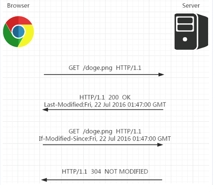

但是 Last-Modified 存在一些弊端：  
如果本地打开缓存文件，即使没有对文件进行修改，但还是会造成 Last-Modified 被修改，服务端不能命中缓存导致发送相同的资源.  
因为 Last-Modified 只能以秒计时，如果在不可感知的时间内修改完成文件，那么服务端会认为资源还是命中了，不会返回正确的资源.  
既然根据文件修改时间来决定是否缓存尚有不足，能否可以直接根据文件内容是否修改来决定缓存策略？所以在 HTTP / 1.1 出现了 ETag 和If-None-Match.  

#### 9.4.2. ETag和If-None-Match

[node.js 缓存验证Last-Modified和Etag的使用](https://www.jianshu.com/p/4987fa77446f)  

Etag是服务器响应请求时，返回当前资源文件的一个唯一标识(由服务器生成)，只要资源有变化，Etag就会重新生成。浏览器在下一次加载资源向服务器发送请求时，会将上一次返回的Etag值放到request header里的If-None-Match里，服务器只需要比较客户端传来的If-None-Match跟自己服务器上该资源的ETag是否一致，就能很好地判断资源相对客户端而言是否被修改过了。如果服务器发现ETag匹配不上，那么直接以常规GET 200回包形式将新的资源（当然也包括了新的ETag）发给客户端；如果ETag是一致的，则直接返回304知会客户端直接使用本地缓存即可。  

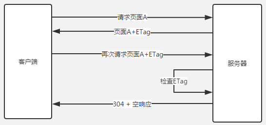

两者之间对比：  
首先在精确度上，Etag要优于Last-Modified。  
Last-Modified的时间单位是秒，如果某个文件在1秒内改变了多次，那么他们的Last-Modified其实并没有体现出来修改，但是Etag每次都会改变确保了精度；如果是负载均衡的服务器，各个服务器生成的Last-Modified也有可能不一致。  

第二在性能上，Etag要逊于Last-Modified，毕竟Last-Modified只需要记录时间，而Etag需要服务器通过算法来计算出一个hash值。  
第三在优先级上，服务器校验优先考虑Etag.  

### 9.5. 缓存机制

强制缓存优先于协商缓存进行，若强制缓存(Expires和Cache-Control)生效则直接使用缓存，若不生效则进行协商缓存(Last-Modified / If-Modified-Since和Etag / If-None-Match)，协商缓存由服务器决定是否使用缓存，若协商缓存失效，那么代表该请求的缓存失效，返回200，重新返回资源和缓存标识，再存入浏览器缓存中；生效则返回304，继续使用缓存。具体流程图如下  


如果什么缓存策略都没设置，那么浏览器会怎么处理？  

对于这种情况，浏览器会采用一个启发式的算法，通常会取响应头中的 Date 减去 Last-Modified 值的 10% 作为缓存时间。  

### 9.6. 实际场景应用缓存策略

#### 9.6.1. 频繁变动的资源

Cache-Control: no-cache  

对于频繁变动的资源，首先需要使用Cache-Control: no-cache 使浏览器每次都请求服务器，然后配合 ETag 或者 Last-Modified 来验证资源是否有效。这样的做法虽然不能节省请求数量，但是能显著减少响应数据大小。

#### 9.6.2. 不常变化的资源

Cache-Control: max-age=31536000  

通常在处理这类资源时，给它们的 Cache-Control 配置一个很大的 max-age=31536000 (一年)，这样浏览器之后请求相同的 URL 会命中强制缓存。而为了解决更新的问题，就需要在文件名(或者路径)中添加 hash， 版本号等动态字符，之后更改动态字符，从而达到更改引用 URL 的目的，让之前的强制缓存失效 (其实并未立即失效，只是不再使用了而已)。  
在线提供的类库 (如 jquery-3.3.1.min.js, lodash.min.js 等) 均采用这个模式。  

### 9.7. 用户行为对浏览器缓存的影响

所谓用户行为对浏览器缓存的影响，指的就是用户在浏览器如何操作时，会触发怎样的缓存策略。主要有 3 种：  

打开网页，地址栏输入地址： 查找 disk cache 中是否有匹配。如有则使用；如没有则发送网络请求。  
普通刷新 (F5)：因为 TAB 并没有关闭，因此 memory cache 是可用的，会被优先使用(如果匹配的话)。其次才是 disk cache。  
强制刷新 (Ctrl + F5)：浏览器不使用缓存，因此发送的请求头部均带有 Cache-control: no-cache(为了兼容，还带了 Pragma: no-cache),服务器直接返回 200 和最新内容。  

参考资料：[深入理解浏览器的缓存机制](https://github.com/ljianshu/Blog/issues/23)  

## 10. https http1 http2 http3

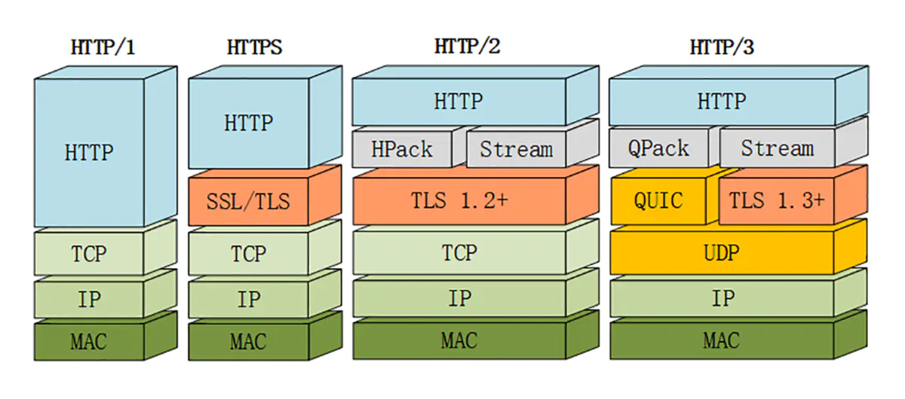

### 10.1. http1.x

HTTP1.0最早在网页中使用是在1996年，那个时候只是使用一些较为简单的网页上和网络请求上，而HTTP1.1则在1999年才开始广泛应用于现在的各大浏览器网络请求中，同时HTTP1.1也是当前使用最为广泛的HTTP协议。 主要区别主要体现在：  

- 缓存处理，在HTTP1.0中主要使用header里的If-Modified-Since,Expires来做为缓存判断的标准，HTTP1.1则引入了更多的缓存控制策略例如Entity tag，If-Unmodified-Since, If-Match, If-None-Match等更多可供选择的缓存头来控制缓存策略。

- 带宽优化及网络连接的使用，HTTP1.0中，存在一些浪费带宽的现象，例如客户端只是需要某个对象的一部分，而服务器却将整个对象送过来了，并且不支持断点续传功能，HTTP1.1则在请求头引入了range头域，它允许只请求资源的某个部分，即返回码是206（Partial Content），这样就方便了开发者自由的选择以便于充分利用带宽和连接。

- 错误通知的管理，在HTTP1.1中新增了24个错误状态响应码，如409（Conflict）表示请求的资源与资源的当前状态发生冲突；410（Gone）表示服务器上的某个资源被永久性的删除。

- Host头处理，在HTTP1.0中认为每台服务器都绑定一个唯一的IP地址，因此，请求消息中的URL并没有传递主机名（hostname）。但随着虚拟主机技术的发展，在一台物理服务器上可以存在多个虚拟主机（Multi-homed Web Servers），并且它们共享一个IP地址。HTTP1.1的请求消息和响应消息都应支持Host头域，且请求消息中如果没有Host头域会报告一个错误（400 Bad Request）。

- 长连接，HTTP 1.1支持长连接（PersistentConnection）和请求的流水线（Pipelining）处理，在一个TCP连接上可以传送多个HTTP请求和响应，减少了建立和关闭连接的消耗和延迟，在HTTP1.1中默认开启Connection： keep-alive，一定程度上弥补了HTTP1.0每次请求都要创建连接的缺点。  

2012年google如一声惊雷提出了SPDY的方案，优化了HTTP1.X的请求延迟，解决了HTTP1.X的安全性，具体如下：  

1. 降低延迟，针对HTTP高延迟的问题，SPDY优雅的采取了多路复用（multiplexing）。多路复用通过多个请求stream共享一个tcp连接的方式，解决了HOL blocking的问题，降低了延迟同时提高了带宽的利用率。

2. 请求优先级（request prioritization）。多路复用带来一个新的问题是，在连接共享的基础之上有可能会导致关键请求被阻塞。SPDY允许给每个request设置优先级，这样重要的请求就会优先得到响应。比如浏览器加载首页，首页的html内容应该优先展示，之后才是各种静态资源文件，脚本文件等加载，这样可以保证用户能第一时间看到网页内容。

3. header压缩。前面提到HTTP1.x的header很多时候都是重复多余的。选择合适的压缩算法可以减小包的大小和数量。

4. 基于HTTPS的加密协议传输，大大提高了传输数据的可靠性。

5. 服务端推送（server push），采用了SPDY的网页，例如我的网页有一个sytle.css的请求，在客户端收到sytle.css数据的同时，服务端会将sytle.js的文件推送给客户端，当客户端再次尝试获取sytle.js时就可以直接从缓存中获取到，不用再发请求了。  

> 总结：HTTP/1.x 有连接无法复用、队头阻塞、协议开销大和安全因素等多个缺陷；  

### 10.2. http2

HTTP2 基于 SPDY，专注于性能，最大的一个目标是在用户和网站间只用一个连接。  

新增特性：

#### 10.2.1. 二进制传输  

HTTP/2 采用二进制格式传输数据，而非 HTTP 1.x 的文本格式，二进制协议解析起来更高效。HTTP / 1 的请求和响应报文，都是由起始行，首部和实体正文（可选）组成，各部分之间以文本换行符分隔。HTTP/2 将请求和响应数据分割为更小的帧，并且它们采用二进制编码。  

- 流：流是连接中的一个虚拟信道，可以承载双向的消息；每个流都有一个唯一的整数标识符（1、2…N）；
- 消息：是指逻辑上的 HTTP 消息，比如请求、响应等，由一或多个帧组成；
- 帧：HTTP 2.0 通信的最小单位，每个帧包含帧首部，至少也会标识出当前帧所属的流，承载着特定类型的数据，如 HTTP 首部、负荷等等。  

HTTP/2 中，同域名下所有通信都在单个连接上完成，该连接可以承载任意数量的双向数据流。每个数据流都以消息的形式发送，而消息又由一个或多个帧组成。多个帧之间可以乱序发送，根据帧首部的流标识可以重新组装。  

#### 10.2.2. 多路复用

多路复用很好的解决了浏览器限制同一个域名下的请求数量的问题，同时也接更容易实现全速传输，毕竟新开一个 TCP 连接都需要慢慢提升传输速度。  

在 HTTP/2 中，有了二进制分帧之后，HTTP /2 不再依赖 TCP 链接去实现多流并行了，在 HTTP/2中：

- 同域名下所有通信都在单个连接上完成；  
- 单个连接可以承载任意数量的双向数据流；  
- 数据流以消息的形式发送，而消息又由一个或多个帧组成，多个帧之间可以乱序发送，因为根据帧首部的流标识可以重新组装。  

这一特性，使性能有了极大提升：

- 同个域名只需要占用一个 TCP 连接，使用一个连接并行发送多个请求和响应,消除了因多个 TCP 连接而带来的延时和内存消耗；
- 并行交错地发送多个请求，请求之间互不影响；
- 并行交错地发送多个响应，响应之间互不干扰；
- 在HTTP/2中，每个请求都可以带一个31bit的优先值，0表示最高优先级， 数值越大优先级越低。有了这个优先值，客户端和服务器就可以在处理不同的流时采取不同的策略，以最优的方式发送流、消息和帧。

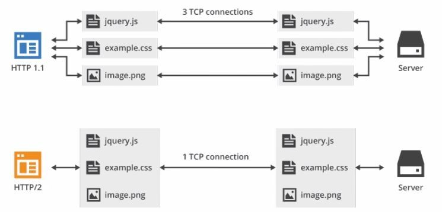

#### 10.2.3. Header 压缩

在 HTTP/1 中，我们使用文本的形式传输 header，在 header 携带 cookie 的情况下，可能每次都需要重复传输几百到几千的字节。  

为了减少这块的资源消耗并提升性能， HTTP/2对这些首部采取了压缩策略：  

- HTTP/2在客户端和服务器端使用“首部表”来跟踪和存储之前发送的键－值对，对于相同的数据，不再通过每次请求和响应发送；
- 首部表在HTTP/2的连接存续期内始终存在，由客户端和服务器共同渐进地更新；
- 每个新的首部键－值对要么被追加到当前表的末尾，要么替换表中之前的值。  

例如下图中的两个请求，请求一发送了所有的头部字段，第二个请求则只需要发送差异数据，这样可以减少冗余数据，降低开销。  

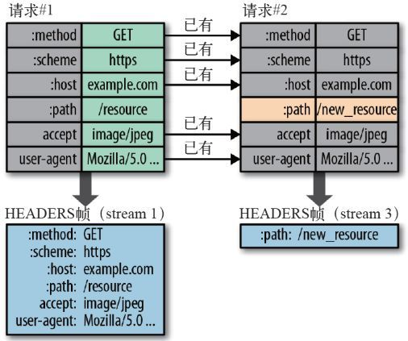

#### 10.2.4. Server Push

Server Push即服务端能通过push的方式将客户端需要的内容预先推送过去，也叫“cache push”。  

服务端可以主动推送，客户端也有权利选择是否接收。如果服务端推送的资源已经被浏览器缓存过，浏览器可以通过发送RST_STREAM帧来拒收。主动推送也遵守同源策略，换句话说，服务器不能随便将第三方资源推送给客户端，而必须是经过双方确认才行。  

> 总结：HTTP/2 通过多路复用、二进制流、Header 压缩等等技术，极大地提高了性能，但是还是存在着问题的；  

### 10.3. http3

HTTP/2 使用了多路复用，一般来说同一域名下只需要使用一个 TCP 连接。但当这个连接中出现了丢包的情况，那就会导致 HTTP/2 的表现情况反倒不如 HTTP/1 了。  

因为在出现丢包的情况下，整个 TCP 都要开始等待重传，也就导致了后面的所有数据都被阻塞了。但是对于 HTTP/1.1 来说，可以开启多个 TCP 连接，出现这种情况反到只会影响其中一个连接，剩余的 TCP 连接还可以正常传输数据。  

基于这个原因，Google 就更起炉灶搞了一个基于 UDP 协议的 QUIC 协议，并且使用在了 HTTP/3 上，HTTP/3 之前名为 HTTP-over-QUIC，从这个名字中我们也可以发现，HTTP/3 最大的改造就是使用了 QUIC。QUIC 虽然基于 UDP，但是在原本的基础上新增了很多功能.  

#### 10.3.1. QUIC

1. 0-RTT

通过使用类似 TCP 快速打开的技术，缓存当前会话的上下文，在下次恢复会话的时候，只需要将之前的缓存传递给服务端验证通过就可以进行传输了。0RTT 建连可以说是 QUIC 相比 HTTP2 最大的性能优势。那什么是 0RTT 建连呢？  

这里面有两层含义:  

- 传输层 0RTT 就能建立连接。  
- 加密层 0RTT 就能建立加密连接。  

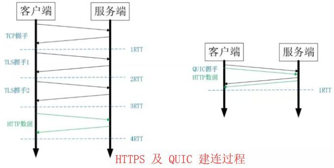

上图左边是 HTTPS 的一次完全握手的建连过程，需要 3 个 RTT。就算是会话复用也需要至少 2 个 RTT。  

而 QUIC 呢？由于建立在 UDP 的基础上，同时又实现了 0RTT 的安全握手，所以在大部分情况下，只需要 0 个 RTT 就能实现数据发送，在实现前向加密的基础上，并且 0RTT 的成功率相比 TLS 的会话记录单要高很多。  

2. 多路复用

虽然 HTTP/2 支持了多路复用，但是 TCP 协议终究是没有这个功能的。QUIC 原生就实现了这个功能，并且传输的单个数据流可以保证有序交付且不会影响其他的数据流，这样的技术就解决了之前 TCP 存在的问题。  

同HTTP2.0一样，同一条 QUIC连接上可以创建多个stream，来发送多个HTTP请求，但是，QUIC是基于UDP的，一个连接上的多个stream之间没有依赖。比如下图中stream2丢了一个UDP包，不会影响后面跟着 Stream3 和 Stream4，不存在 TCP 队头阻塞。虽然stream2的那个包需要重新传，但是stream3、stream4的包无需等待，就可以发给用户。  


另外QUIC 在移动端的表现也会比 TCP 好。因为 TCP 是基于 IP 和端口去识别连接的，这种方式在多变的移动端网络环境下是很脆弱的。但是 QUIC 是通过 ID 的方式去识别一个连接，不管你网络环境如何变化，只要 ID 不变，就能迅速重连上。  

3. 加密认证的报文  

TCP 协议头部没有经过任何加密和认证，所以在传输过程中很容易被中间网络设备篡改，注入和窃听。比如修改序列号、滑动窗口。这些行为有可能是出于性能优化，也有可能是主动攻击。  

但是 QUIC 的 packet 可以说是武装到了牙齿。除了个别报文比如 PUBLIC_RESET 和 CHLO，所有报文头部都是经过认证的，报文 Body 都是经过加密的。这样只要对 QUIC 报文任何修改，接收端都能够及时发现，有效地降低了安全风险。  

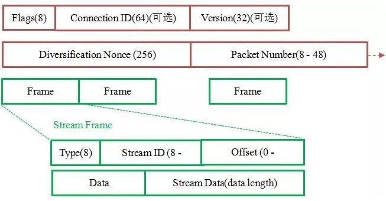

红色部分是 Stream Frame 的报文头部，有认证。绿色部分是报文内容，全部经过加密。  

4. 向前纠错机制

QUIC协议有一个非常独特的特性，称为向前纠错 (Forward Error Correction，FEC)，每个数据包除了它本身的内容之外，还包括了部分其他数据包的数据，因此少量的丢包可以通过其他包的冗余数据直接组装而无需重传。向前纠错牺牲了每个数据包可以发送数据的上限，但是减少了因为丢包导致的数据重传，因为数据重传将会消耗更多的时间（包括确认数据包丢失、请求重传、等待新数据包等步骤的时间消耗）。  

假如说这次我要发送三个包，那么协议会算出这三个包的异或值并单独发出一个校验包，也就是总共发出了四个包。当出现其中的非校验包丢包的情况时，可以通过另外三个包计算出丢失的数据包的内容。当然这种技术只能使用在丢失一个包的情况下，如果出现丢失多个包就不能使用纠错机制了，只能使用重传的方式了。  

> 总结：QUIC 基于 UDP 实现，是 HTTP/3 中的底层支撑协议，该协议基于 UDP，又取了 TCP 中的精华，实现了即快又可靠的协议。  

### 10.4. https

HTTPS 协议之所以是安全的是因为 HTTPS 协议会对传输的数据进行加密，而加密过程是使用了非对称加密实现。但其实，HTTPS 在内容传输的加密上使用的是对称加密，非对称加密只作用在证书验证阶段。  

HTTPS的整体过程分为证书验证和数据传输阶段，具体的交互过程如下：


**证书验证阶段**  

1. 浏览器发起 HTTPS 请求  
2. 服务端返回 HTTPS 证书  
3. 客户端验证证书是否合法，如果不合法则提示告警  

**数据传输阶段**  

1. 当证书验证合法后，在本地生成随机数  
2. 通过公钥加密随机数，并把加密后的随机数传输到服务端  
3. 服务端通过私钥对随机数进行解密  
4. 服务端通过客户端传入的随机数构造对称加密算法，对返回结果内容进行加密后传输  

1. 为什么数据传输是用对称加密？  

首先，非对称加密的加解密效率是非常低的，而 http 的应用场景中通常端与端之间存在大量的交互，非对称加密的效率是无法接受的；另外，在 HTTPS 的场景中只有服务端保存了私钥，一对公私钥只能实现单向的加解密，所以 HTTPS 中内容传输加密采取的是对称加密，而不是非对称加密。  

2. 为什么需要 CA 认证机构颁发证书？  

HTTP 协议被认为不安全是因为传输过程容易被监听者勾线监听、伪造服务器，而 HTTPS 协议主要解决的便是网络传输的安全性问题。首先我们假设不存在认证机构，任何人都可以制作证书，这带来的安全风险便是经典的“中间人攻击”问题。“中间人攻击”的具体过程如下：  


过程原理：

1. 本地请求被劫持（如DNS劫持等），所有请求均发送到中间人的服务器
2. 中间人服务器返回中间人自己的证书
3. 客户端创建随机数，通过中间人证书的公钥对随机数加密后传送给中间人，然后凭随机数构造对称加密对传输内容进行加密传输
4. 中间人因为拥有客户端的随机数，可以通过对称加密算法进行内容解密
5. 中间人以客户端的请求内容再向正规网站发起请求
6. 因为中间人与服务器的通信过程是合法的，正规网站通过建立的安全通道返回加密后的数据
7. 中间人凭借与正规网站建立的对称加密算法对内容进行解密
8. 中间人通过与客户端建立的对称加密算法对正规内容返回的数据进行加密传输
9. 客户端通过与中间人建立的对称加密算法对返回结果数据进行解密  

浏览器是如何确保 CA 证书的合法性?  

1. 证书包含什么信息？  
颁发机构信息  
公钥  
公司信息  
域名  
有效期  
指纹  
……  

2. 证书的合法性依据是什么？  

首先，权威机构是要有认证的，不是随便一个机构都有资格颁发证书，不然也不叫做权威机构。另外，证书的可信性基于信任制，权威机构需要对其颁发的证书进行信用背书，只要是权威机构生成的证书，我们就认为是合法的。所以权威机构会对申请者的信息进行审核，不同等级的权威机构对审核的要求也不一样，于是证书也分为免费的、便宜的和贵的。  

3. 浏览器如何验证证书的合法性？

浏览器发起 HTTPS 请求时，服务器会返回网站的 SSL 证书，浏览器需要对证书做以下验证：

- 验证域名、有效期等信息是否正确。证书上都有包含这些信息，比较容易完成验证；
- 判断证书来源是否合法。每份签发证书都可以根据验证链查找到对应的根证书，操作系统、浏览器会在本地存储权威机构的根证书，利用本地根证书可以对对应机构签发证书完成来源验证；  
- 判断证书是否被篡改。需要与 CA 服务器进行校验；
- 判断证书是否已吊销。通过CRL（Certificate Revocation List 证书注销列表）和 OCSP（Online Certificate Status Protocol 在线证书状态协议）实现，其中 OCSP 可用于第3步中以减少与 CA 服务器的交互，提高验证效率  

参考资料：[HTTP1.0、HTTP1.1 和 HTTP2.0 的区别](https://www.cnblogs.com/heluan/p/8620312.html)  
[一文读懂 HTTP/1HTTP/2HTTP/3](https://zhuanlan.zhihu.com/p/102561034)  
[QUIC网络协议简介](https://cloud.tencent.com/developer/article/1405624)  
[HTTP3 为什么比 HTTP2 靠谱](https://www.sohu.com/a/299243519_115128)  
[深入解读HTTP3的原理及应用](https://netsecurity.51cto.com/art/202005/616624.htm)  

## 11. 浏览器渲染原理

浏览器渲染过程

1. 解析HTML，构建DOM树（这里遇到外链，此时会发起请求）
2. 解析CSS，生成CSS规则树
3. 合并DOM树和CSS规则，生成render树
4. 布局render树（Layout/reflow），负责各元素尺寸、位置的计算
5. 绘制render树（paint），绘制页面像素信息
6. 浏览器会将各层的信息发送给GPU，GPU将各层合成（composite），显示在屏幕上

### 11.1. 构建DOM树

```html
<html>
  <head>
    <meta name="viewport" content="width=device-width,initial-scale=1" />
    <link href="./style.css" rel="stylesheet" />
    <title>Critical Path</title>
  </head>
  <body>
    <p>Hello <span>web performance</span> OO!</p>
    <div></div>
  </body>
</html>
```

无论是DOM还是CSSOM，都是要经过Bytes → characters → tokens → nodes → object model(字节 → 字符 → 令牌 → 节点 → 对象模型。)这个过程。  

DOM树构建过程：当前节点的所有子节点都构建好后才会去构建当前节点的下一个兄弟节点。  


1. 转换：浏览器从磁盘或网络读取 HTML 的原始字节，并根据文件的指定编码（例如 UTF-8）将它们转换成各个字符。
2. 令牌化：浏览器将字符串转换成 W3C HTML5 标准规定的各种令牌，例如，“<html>”、“<body>”，以及其他尖括号内的字符串。每个令牌都具有特殊含义和一组规则。
3. 词法分析：发出的令牌转换成定义其属性和规则的“对象”。
4. DOM 构建：由于 HTML 标记定义不同标记之间的关系（一些标记包含在其他标记内），创建的对象链接在一个树数据结构内，此结构也会捕获原始标记中定义的父项-子项关系：HTML 对象是 body 对象的父项，body 是 paragraph 对象的父项，依此类推。

### 11.2. 构建CSSOM树

CSS 字节转换成字符，接着转换成令牌和节点，最后链接到一个称为“CSS 对象模型”(CSSOM) 的树结构内：  


CSSOM 为何具有树结构？为页面上的任何对象计算最后一组样式时，浏览器都会先从适用于该节点的最通用规则开始（例如，如果该节点是 body 元素的子项，则应用所有 body 样式），然后通过应用更具体的规则（即规则“向下级联”）以递归方式优化计算的样式。  

### 11.3. 生成render树


DOM树从根节点开始遍历可见节点，这里之所以强调了“可见”，是因为如果遇到设置了类似display: none;的不可见节点，在render过程中是会被跳过的（但visibility: hidden; opacity: 0这种仍旧占据空间的节点不会被跳过render），保存各个节点的样式信息及其余节点的从属关系。  

### 11.4. Layout 布局

当渲染对象被创建并添加到树中，它们并没有位置和大小，计算这些值的过程称为layout或reflow。  

Html使用基于流的布局模型，意味着大部分时间，可以以单一的途径进行几何计算。流中靠后的元素并不会影响前面元素的几何特性，所以布局可以在文档中从右向左、自上而下的进行。也存在一些例外，比如html tables。  

坐标系统相对于根frame，使用top和left坐标。  

布局是一个递归的过程，由根渲染对象开始，它对应html文档元素，布局继续递归的通过一些或所有的frame层级，为每个需要几何信息的渲染对象进行计算。  

根渲染对象的位置是0,0，它的大小是viewport－浏览器窗口的可见部分。  

所有的渲染对象都有一个layout或reflow方法，每个渲染对象调用需要布局的children的layout方法。  

layout一般有下面这几个部分：

1. parent渲染对象决定它的宽度

2. parent渲染对象读取chilidren，并：

a. 放置child渲染对象（设置它的x和y）  
b. 在需要时（它们当前为dirty或是处于全局layout或者其他原因）调用child渲染对象的layout，这将计算child的高度  
c. parent渲染对象使用child渲染对象的累积高度，以及margin和padding的高度来设置自己的高度－这将被parent渲染对象的parent使用  
d. 将dirty标识设置为false  

> Dirty bit系统  
为了不因为每个小变化都全部重新布局，浏览器使用一个dirty bit系统，一个渲染对象发生了变化或是被添加了，就标记它及它的children为dirty——需要layout。存在两个标识——dirty及children are dirty，children are dirty说明即使这个渲染对象可能没问题，但它至少有一个child需要layout。  

### 11.5. Paint 绘制

第一次出现的节点称为first meaningful paint。在绘制或光栅化阶段，浏览器将在布局阶段计算的每个框转换为屏幕上的实际像素。绘画包括将元素的每个可视部分绘制到屏幕上，包括文本、颜色、边框、阴影和替换的元素（如按钮和图像）。浏览器需要非常快地完成这项工作。  

为了确保平滑滚动和动画，占据主线程的所有内容，包括计算样式，以及回流和绘制，必须让浏览器在16.67毫秒内完成。在2048x 1536，iPad有超过314.5万像素将被绘制到屏幕上。那是很多像素需要快速绘制。为了确保重绘的速度比初始绘制的速度更快，屏幕上的绘图通常被分解成数层。如果发生这种情况，则需要进行合成。  

绘制可以将布局树中的元素分解为多个层。将内容提升到GPU上的层（而不是CPU上的主线程）可以提高绘制和重新绘制性能。有一些特定的属性和元素可以实例化一个层，包括<video>和<canvas>，任何CSS属性为opacity、3D转换、will-change的元素，还有一些其他元素。这些节点将与子节点一起绘制到它们自己的层上，除非子节点由于上述一个（或多个）原因需要自己的层。  

层确实可以提高性能，但是它以内存管理为代价，因此不应作为web性能优化策略的一部分过度使用。  

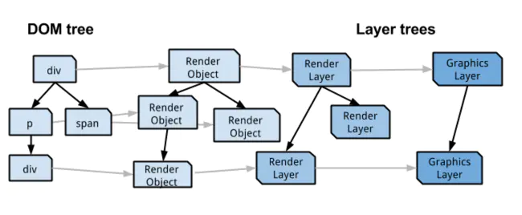

在 Chrome 中其实有几种不同的层类型：  

RenderLayers 渲染层，这是负责对应 DOM 子树.  
GraphicsLayers 图形层，这是负责对应 RenderLayers 子树。  

每个 GraphicsLayer 都有一个 GraphicsContext，GraphicsContext 会负责输出该层的位图，位图是存储在共享内存中，作为纹理上传到 GPU 中，最后由 GPU 将多个位图进行合成，然后 draw 到屏幕上，此时，我们的页面也就展现到了屏幕上。  

GraphicsContext 绘图上下文的责任就是向屏幕进行像素绘制(这个过程是先把像素级的数据写入位图中，然后再显示到显示器)，在chrome里，绘图上下文是包裹了的 Skia（chrome 自己的 2d 图形绘制库） 某些特殊的渲染层会被认为是合成层（Compositing Layers），合成层拥有单独的 GraphicsLayer，而其他不是合成层的渲染层，则和其第一个拥有 GraphicsLayer 父层公用一个。  

### 11.6. Compositing 合成

在 DOM 树中每个节点都会对应一个 LayoutObject，当他们的 LayoutObject 处于相同的坐标空间时，就会形成一个 RenderLayers ，也就是渲染层。RenderLayers 来保证页面元素以正确的顺序合成，这时候就会出现层合成（composite），从而正确处理透明元素和重叠元素的显示。  

> 合成层创建标准  

- 3D 或透视变换(perspective transform) CSS 属性
- 使用加速视频解码的 <video> 元素 拥有 3D
- (WebGL) 上下文或加速的 2D 上下文的 <canvas> 元素
- 对自己的 opacity 做 CSS动画或使用一个动画变换的元素
- 拥有加速 CSS 过滤器的元素
- 元素有一个包含复合层的后代节点(换句话说，就是一个元素拥有一个子元素，该子元素在自己的层里)
- 元素有一个z-index较低且包含一个复合层的兄弟元素(换句话说就是该元素在复合层上面渲染)  

> 合成层的优点:一旦renderLayer提升为了合成层就会有自己的绘图上下文，并且会开启硬件加速，有利于性能提升

- 合成层的位图，会交由 GPU 合成，比 CPU 处理要快
- 当需要 repaint 时，只需要 repaint 本身，不会影响到其他的层
- 对于 transform 和 opacity 效果，不会触发 layout 和 paint  

> 性能优化点  

1. 提升动画效果的元素 合成层的好处是不会影响到其他元素的绘制，因此，为了减少动画元素对其他元素的影响，从而减少paint，我们需要把动画效果中的元素提升为合成层。 提升合成层的最好方式是使用 CSS 的 will-change属性。从上一节合成层产生原因中，可以知道 will-change 设置为opacity、transform、top、left、bottom、right 可以将元素提升为合成层。

2. 使用 transform 或者 opacity 来实现动画效果, 这样只需要做合成层的合并就好了。

3. 减少绘制区域 对于不需要重新绘制的区域应尽量避免绘制，以减少绘制区域，比如一个 fix 在页面顶部的固定不变的导航header，在页面内容某个区域 repaint 时，整个屏幕包括 fix 的 header 也会被重绘。而对于固定不变的区域，我们期望其并不会被重绘，因此可以通过之前的方法，将其提升为独立的合成层。减少绘制区域，需要仔细分析页面，区分绘制区域，减少重绘区域甚至避免重绘。

> 利用合成层可能踩到的坑  

1. 合成层占用内存的问题

2. 层爆炸，由于某些原因可能导致产生大量不在预期内的合成层，虽然有浏览器的层压缩机制，但是也有很多无法进行压缩的情况，这就可能出现层爆炸的现象（简单理解就是，很多不需要提升为合成层的元素因为某些不当操作成为了合成层）。解决层爆炸的问题，最佳方案是打破 overlap 的条件，也就是说让其他元素不要和合成层元素重叠。简单直接的方式：使用3D硬件加速提升动画性能时，最好给元素增加一个z-index属性，人为干扰合成的排序，可以有效减少chrome创建不必要的合成层，提升渲染性能，移动端优化效果尤为明显。  

3. 使用类似 translateZ(0)等属性来进行所谓的硬件加速，以提升性能，达到优化页面动态效果的目的，但还是要注意凡事过犹不及，应用硬件加速的同时也要注意到千万别踩坑。  

### 11.7. Reflowing and Repainting

reflow(回流): 根据Render Tree布局(几何属性)，意味着元素的内容、结构、位置或尺寸发生了变化，需要重新计算样式和渲染树；  
repaint(重绘): 意味着元素发生的改变只影响了节点的一些样式（背景色，边框颜色，文字颜色等），只需要应用新样式绘制这个元素就可以了；  
reflow回流的成本开销要高于repaint重绘，一个节点的回流往往回导致子节点以及同级节点的回流；  

> 引起reflow回流  

1. 页面第一次渲染（初始化）
2. DOM树变化（如：增删节点）
3. Render树变化（如：padding改变）
4. 浏览器窗口resize
5. 获取元素的某些属性：  
浏览器为了获得正确的值也会提前触发回流，这样就使得浏览器的优化失效了，这些属性包括offsetLeft、offsetTop、offsetWidth、offsetHeight、 scrollTop/Left/Width/Height、clientTop/Left/Width/Height、调用了getComputedStyle()或者IE的currentStyle  

> 引起repaint重绘  

1. reflow回流必定引起repaint重绘，重绘可以单独触发
2. 背景色、颜色、字体改变（注意：字体大小发生变化时，会触发回流）  

> 优化reflow、repaint触发次数  

1. 避免逐个修改节点样式，尽量一次性修改
2. 使用DocumentFragment将需要多次修改的DOM元素缓存，最后一次性append到真实DOM中渲染
3. 可以将需要多次修改的DOM元素设置display: none，操作完再显示。（因为隐藏元素不在render树内，因此修改隐藏元素不会触发回流重绘）
4. 避免多次读取某些属性（见上）
5. 将复杂的节点元素脱离文档流，降低回流成本

参考资料：[DOM操作成本到底高在哪儿](https://segmentfault.com/a/1190000014070240)  
[DOM和CSSDOM树渲染过程](https://www.jianshu.com/p/61b3409bc3a4)  
[详谈层合成（composite）](https://juejin.cn/post/6844903502678867981)  
[Populating the page: how browsers work](https://developer.mozilla.org/en-US/docs/Web/Performance/How_browsers_work)  
[CSS GPU Animation: Doing It Right](https://www.smashingmagazine.com/2016/12/gpu-animation-doing-it-right/)  

## 12. webpack5

### 12.1. 功能清除

1. 语法废弃
  
require.include已被废弃，使用时默认会发出警告。  

可以通过 Rule.parser.requireInclude 将行为改为允许、废弃或禁用。  

2. 不再为 Node.js 模块 自动引用 Polyfills

在实际构建时，如果遇到类似于const {Buffer} = require('buffer')的代码，会提示新版本不会再对它进行自动的兼容，由你来选择是否安装相应的库并通过resolve.alias配置：  

```js
{
    resolve: {
        alias: {
            buffer: 'buffer',
        },
    },
}
```

但是，Webpack只解决引入模块的代码， 不解决全局变量的检测，这是和之前版本最大的区别。比如有代码是这样的：

```js
exports.isBuffer = Buffer.isBuffer;
```

Webpack 5并不会认为这里用到了Buffer这个对象需要处理兼容性，而是正常地进行打包，也不提示开发者。直到系统运行时，才会出现Buffer is not defined这样的错误。同时，由于内置的NodeSourcePlugin已经修改了实现，现在只会处理global这一个变量，所以即便把这个插件找回来也不会再帮你修复这些全局变量的使用了.  

在这里推荐babel-plugin-import-globals这个babel插件，它可以找到相关的全局变量并进行处理。

```js
{
    loader: require.resolve('babel-loader'),
    options: {
        sourceType: 'unambiguous', // 这个一定要配，自动处理es和js模块
        compact: false, // 这个建议配，能提升性能
        plugins: [
            [
                require.resolve('babel-plugin-import-globals'),
                {
                    'process': require.resolve('process'),
                    'Buffer': {moduleName: require.resolve('buffer'), exportName: 'Buffer'},
                },
            ],
        ],
    },
}
```

将这个配置加到node_modules下的JavaScript文件上就行，如：

```js
{
    test: /\/jsx?$/,
    include: /node_modules/,
    use: [loader],
}
```

当然这会让所有第三方的代码也过babel的处理（虽然只有一个插件），会被babel解析，一定程度上会影响构建的速度。babel处理的速度与原来的NodeSourcePlugin的处理孰优孰劣我也无法再做比较了。

除此之外，在resolve.alias下也需要配上对应的一些兼容库：

```js
{
    crypto: 'crypto-browserify',
    stream: 'stream-browserify',
    vm: 'vm-browserify',
}
```

### 12.2. 长期缓存

1. 确定的 Chunk、模块 ID 和导出名称

新增了长期缓存的算法。这些算法在生产模式下是默认启用的。  

chunkIds: "deterministic" moduleIds: "deterministic" mangleExports: "deterministic"  

该算法以确定性的方式为模块和分块分配短的（3 或 5 位）数字 ID， 这是包大小和长期缓存之间的一种权衡。  

moduleIds/chunkIds/mangleExports: false 禁用默认行为，你可以通过插件提供一个自定义算法。请注意，在 webpack 4 中，moduleIds/chunkIds: false 如果没有自定义插件，则可以正常运行，而在 webpack 5 中，你必须提供一个自定义插件。  

2. 真正的内容哈希

当使用 [contenthash] 时，Webpack 5 将使用真正的文件内容哈希值。之前它 "只" 使用内部结构的哈希值。 当只有注释被修改或变量被重命名时，这对长期缓存会有积极影响。这些变化在压缩后是不可见的。  

### 12.3. 持久缓存

```js
module.exports = {
  cache: {
    // 1. 将缓存类型设置为文件系统
    type: 'filesystem',

    buildDependencies: {
      // 2. 将你的 config 添加为 buildDependency，以便在改变 config 时获得缓存无效
      config: [__filename],

      // 3. 如果你有其他的东西被构建依赖，你可以在这里添加它们
      // 注意，webpack、加载器和所有从你的配置中引用的模块都会被自动添加
    },
  },
};
```

但这样打开后，缓存会过于固定，引起一系列问题：  

- mode之类的变化无法响应，缓存不会变。
- 如果根据不同的场景，有不同的babel配置等，也同样不会感知，依然会用旧的缓存。
- 使用DefinePlugin注入的动态内容，全部不会变化。

而要处理这些“动态性”，我们需要2个东西。  

第一个是cache.version的配置，这个配置可以告诉webpack内容有了变化，需要重新处理缓存，如mode或babel配置之类的，可以通过不同的version隔离开来。  

最简单的cache.version的算法是webpack.config.js和node_modules/.yarn-integrity做一下哈希，但我们封装了webpack的能力，所以并不存在一个固定的webpack.config.js，就必须手动实现它，我们当前的算法是：  

```js
const computeCacheKey = (entry: BuildEntry): string => {
    const hash = crypto.createHash('sha1');
    hash.update(entry.usage); // 使用场景，如build、dev等
    hash.update(entry.mode);
    hash.update(entry.hostPackageName); // 主包名，会用在一些import语句上
    hash.update(fs.readFileSync(path.join(entry.cwd, 'settings.js'))); // 用户的定制化配置
    hash.update(fs.readFileSync(path.join(entry.cwd, 'node_modules', '.yarn-integrity'))); // 依赖信息
    return hash.digest('hex');
};
```

### 12.4. 模块联邦 Module Federation

多个独立的构建可以组成一个应用程序，这些独立的构建之间不应该存在依赖关系，因此可以单独开发和部署它们。  

官方demo: https://github.com/module-federation/module-federation-examples  

```js
const HtmlWebpackPlugin = require("html-webpack-plugin");
const ModuleFederationPlugin = require("webpack/lib/container/ModuleFederationPlugin");

module.exports = {
  // other webpack configs...
  plugins: [
    new ModuleFederationPlugin({
      name: "app_one_remote",
      remotes: {
        app_two: "app_two_remote",
        app_three: "app_three_remote"
      },
      exposes: {
        AppContainer: "./src/App"
      },
      shared: ["react", "react-dom", "react-router-dom"]
    }),
    new HtmlWebpackPlugin({
      template: "./public/index.html",
      chunks: ["main"]
    })
  ]
};
```

模块联邦本身是一个普通的 Webpack 插件 ModuleFederationPlugin，插件有几个重要参数：

1. name 当前应用名称，需要全局唯一。
2. remotes 可以将其他项目的 name 映射到当前项目中。
3. exposes 表示导出的模块，只有在此申明的模块才可以作为远程依赖被使用。
4. shared 是非常重要的参数，制定了这个参数，可以让远程加载的模块对应依赖改为使用本地项目的 React 或 ReactDOM。  

比如设置了 remotes: { app_tw0: "app_two_remote" }，在代码中就可以直接利用以下方式直接从对方应用调用模块：  

```js
import { Search } from "app_two/Search";
```

这个 app_two/Search 来自于 app_two 的配置：

```js
// app_two 的 webpack 配置
export default {
  plugins: [
    new ModuleFederationPlugin({
      name: "app_two",
      library: { type: "var", name: "app_two" },
      filename: "remoteEntry.js",
      exposes: {
        Search: "./src/Search"
      },
      shared: ["react", "react-dom"]
    })
  ]
};
```

正是因为 Search 在 exposes 被导出，我们因此可以使用 [name]/[exposes_name] 这个模块，这个模块对于被引用应用来说是一个本地模块。  

参考资料：[Webpack 5 release (2020-10-10)](https://webpack.js.org/blog/2020-10-10-webpack-5-release/)  
[从构建进程间缓存设计 谈 Webpack5 优化和工作原理](https://zhuanlan.zhihu.com/p/110995118)  
[Webpack 5 升级实验](https://zhuanlan.zhihu.com/p/81122986)  
[Webpack 5 Module Federation: A game-changer in JavaScript architecture](https://indepth.dev/posts/1173/webpack-5-module-federation-a-game-changer-in-javascript-architecture)  

## 13. react

### 13.1 原理（virtual DOM, Diff算法, fiber）

React 框架内部的运作可以分为 3 层：  

Virtual DOM 层，描述页面长什么样。  
Reconciler 层，负责调用组件生命周期方法，进行 Diff 运算等, 也叫Fiber Reconciler。  
Renderer 层，根据不同的平台，渲染出相应的页面，比较常见的是 ReactDOM 和 ReactNative。  

#### 13.1.1. Virtual DOM 和Diff算法

官网：https://reactjs.org/docs/reconciliation.html  

Virtual DOM 算法。包括几个步骤：  

1. 用 JavaScript 对象结构表示 DOM 树的结构；然后用这个树构建一个真正的 DOM 树，插到文档当中  
2. 当状态变更的时候，重新构造一棵新的对象树。然后用新的树和旧的树进行比较，记录两棵树差异  
3. 把2所记录的差异应用到步骤1所构建的真正的DOM树上，视图就更新了  

Virtual DOM 本质上就是在 JS 和 DOM 之间做了一个缓存。  

传统 diff 算法通过循环递归对节点进行依次对比，效率低下，算法复杂度达到 O(n^3)，其中 n 是树中节点的总数。O(n^3) 到底有多可怕，这意味着如果要展示1000个节点，就要依次执行上十亿次的比较。React 将 O(n^3) 复杂度的问题转换成 O(n) 复杂度的问题。  

> diff 策略  

1. Web UI 中 DOM 节点跨层级的移动操作特别少，可以忽略不计。
2. 拥有相同类的两个组件将会生成相似的树形结构，拥有不同类的两个组件将会生成不同的树形结构。
3. 对于同一层级的一组子节点，它们可以通过唯一 id 进行区分。

基于以上三个前提策略，React 分别对 tree diff、component diff 以及 element diff 进行算法优化，事实也证明这三个前提策略是合理且准确的，它保证了整体界面构建的性能。

- tree diff
- component diff
- element diff  

> 1. tree diff

对树进行分层比较，两棵树只会对同一层次的节点进行比较。  

既然 DOM 节点跨层级的移动操作少到可以忽略不计，针对这一现象，React 通过 updateDepth 对 Virtual DOM 树进行层级控制，只会对相同颜色方框内的 DOM 节点进行比较，即同一个父节点下的所有子节点。当发现节点已经不存在，则该节点及其子节点会被完全删除掉，不会用于进一步的比较。这样只需要对树进行一次遍历，便能完成整个 DOM 树的比较。  


```js
updateChildren: function(nextNestedChildrenElements, transaction, context) {
  updateDepth++;
  var errorThrown = true;
  try {
    this._updateChildren(nextNestedChildrenElements, transaction, context);
    errorThrown = false;
  } finally {
    updateDepth--;
    if (!updateDepth) {
      if (errorThrown) {
        clearQueue();
      } else {
        processQueue();
      }
    }
  }
}
```

如下图，A 节点（包括其子节点）整个被移动到 D 节点下，由于 React 只会简单的考虑同层级节点的位置变换，而对于不同层级的节点，只有创建和删除操作。当根节点发现子节点中 A 消失了，就会直接销毁 A；当 D 发现多了一个子节点 A，则会创建新的 A（包括子节点）作为其子节点。此时，React diff 的执行情况：create A -> create B -> create C -> delete A。  

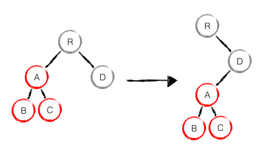

当出现节点跨层级移动时，并不会出现想象中的移动操作，而是以 A 为根节点的树被整个重新创建，这是一种影响 React 性能的操作，因此 React 官方建议不要进行 DOM 节点跨层级的操作。  

**注意：在开发组件时，保持稳定的 DOM 结构会有助于性能的提升。例如，可以通过 CSS 隐藏或显示节点，而不是真的移除或添加 DOM 节点。**  

> 2. component diff  

如果是同一类型的组件，按照原策略继续比较 virtual DOM tree。  

如果不是，则将该组件判断为 dirty component，从而替换整个组件下的所有子节点。  

对于同一类型的组件，有可能其 Virtual DOM 没有任何变化，如果能够确切的知道这点那可以节省大量的 diff 运算时间，因此 React 允许用户通过 shouldComponentUpdate() 来判断该组件是否需要进行 diff。  

如下图，当 component D 改变为 component G 时，即使这两个 component 结构相似，一旦 React 判断 D 和 G 是不同类型的组件，就不会比较二者的结构，而是直接删除 component D，重新创建 component G 以及其子节点。虽然当两个 component 是不同类型但结构相似时，React diff 会影响性能，但正如 React 官方博客所言：不同类型的 component 是很少存在相似 DOM tree 的机会，因此这种极端因素很难在实现开发过程中造成重大影响的。


> 3. element diff  

当节点处于同一层级时，React diff 提供了三种节点操作，分别为：INSERT_MARKUP（插入）、MOVE_EXISTING（移动）和 REMOVE_NODE（删除）。  

- INSERT_MARKUP，新的 component 类型不在老集合里， 即是全新的节点，需要对新节点执行插入操作。

- MOVE_EXISTING，在老集合有新 component 类型，且 element 是可更新的类型，generateComponentChildren 已调用 receiveComponent，这种情况下 prevChild=nextChild，就需要做移动操作，可以复用以前的 DOM 节点。

- REMOVE_NODE，老 component 类型，在新集合里也有，但对应的 element 不同则不能直接复用和更新，需要执行删除操作，或者老 component 不在新集合里的，也需要执行删除操作。  

如下图，老集合中包含节点：A、B、C、D，更新后的新集合中包含节点：B、A、D、C，此时新老集合进行 diff 差异化对比，发现 B != A，则创建并插入 B 至新集合，删除老集合 A；以此类推，创建并插入 A、D 和 C，删除 B、C 和 D。  

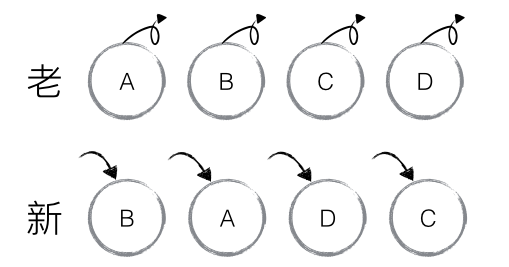

针对这一现象，React 提出优化策略：允许开发者对同一层级的同组子节点，添加唯一 key 进行区分，虽然只是小小的改动，性能上却发生了翻天覆地的变化！  

新老集合所包含的节点，如下图所示，新老集合进行 diff 差异化对比，通过 key 发现新老集合中的节点都是相同的节点，因此无需进行节点删除和创建，只需要将老集合中节点的位置进行移动，更新为新集合中节点的位置，此时 React 给出的 diff 结果为：B、D 不做任何操作，A、C 进行移动操作，即可。  


首先对新集合的节点进行循环遍历，for (name in nextChildren)，通过唯一 key 可以判断新老集合中是否存在相同的节点，if (prevChild === nextChild)，如果存在相同节点，则进行移动操作，但在移动前需要将当前节点在老集合中的位置与 lastIndex 进行比较，if (child._mountIndex < lastIndex)，则进行节点移动操作，否则不执行该操作。这是一种顺序优化手段，lastIndex 一直在更新，表示访问过的节点在老集合中最右的位置（即最大的位置），如果新集合中当前访问的节点比 lastIndex 大，说明当前访问节点在老集合中就比上一个节点位置靠后，则该节点不会影响其他节点的位置，因此不用添加到差异队列中，即不执行移动操作，只有当访问的节点比 lastIndex 小时，才需要进行移动操作。  

如果新集合中有新加入的节点且老集合存在需要删除的节点, 以下图为例：


1. 从新集合中取得 B，判断老集合中存在相同节点 B，由于 B 在老集合中的位置 B._mountIndex = 1，此时lastIndex = 0，因此不对 B 进行移动操作；更新 lastIndex ＝ 1，并将 B 的位置更新为新集合中的位置B._mountIndex = 0，nextIndex++进入下一个节点的判断。

2. 从新集合中取得 E，判断老集合中不存在相同节点 E，则创建新节点 E；更新 lastIndex ＝ 1，并将 E 的位置更新为新集合中的位置，nextIndex++进入下一个节点的判断。

3. 从新集合中取得 C，判断老集合中存在相同节点 C，由于 C 在老集合中的位置C._mountIndex = 2，lastIndex = 1，此时 C._mountIndex > lastIndex，因此不对 C 进行移动操作；更新 lastIndex ＝ 2，并将 C 的位置更新为新集合中的位置，nextIndex++ 进入下一个节点的判断。

4. 从新集合中取得 A，判断老集合中存在相同节点 A，由于 A 在老集合中的位置A._mountIndex = 0，lastIndex = 2，此时 A._mountIndex < lastIndex，因此对 A 进行移动操作；更新 lastIndex ＝ 2，并将 A 的位置更新为新集合中的位置，nextIndex++ 进入下一个节点的判断。

5. 当完成新集合中所有节点 diff 时，最后还需要对老集合进行循环遍历，判断是否存在新集合中没有但老集合中仍存在的节点，发现存在这样的节点 D，因此删除节点 D，到此 diff 全部完成。  

#### 13.1.2. Fiber Reconciler

fiber: https://github.com/spiderT/tt-blog/blob/master/notes/react-fiber-reconciler.md

### 13.2. react hooks

### 13.3.  react router

前端路由本质就是监听 URL 的变化，然后匹配路由规则，显示相应的页面，并且无须刷新页面。

几个关键点：

- 监听URL的改变
- 改变react-router里面的current变量
- 监视current变量
- 获取对应的组件
- render新组件  

目前前端使用的路由就只有两种实现方式

- Hash 模式
- History 模式  

从React-Router源码（"version": "5.2.0"）的来看实现机制：  

#### 13.3.1. Router

组件的源码路径：packages/react-router/modules/Router.js  

获取当前路由并通过Context API将它传递下去：  

```js
static computeRootMatch(pathname) {
    return { path: "/", url: "/", params: {}, isExact: pathname === "/" };
  }

  constructor(props) {
    super(props);

    this.state = {
      location: props.history.location
    };

    // This is a bit of a hack. We have to start listening for location
    // changes here in the constructor in case there are any <Redirect>s
    // on the initial render. If there are, they will replace/push when
    // they mount and since cDM fires in children before parents, we may
    // get a new location before the <Router> is mounted.
    this._isMounted = false;
    this._pendingLocation = null;

    if (!props.staticContext) {
      this.unlisten = props.history.listen(location => {
        if (this._isMounted) {
          this.setState({ location });
        } else {
          this._pendingLocation = location;
        }
      });
    }
  }

  componentDidMount() {
    this._isMounted = true;

    if (this._pendingLocation) {
      this.setState({ location: this._pendingLocation });
    }
  }

  componentWillUnmount() {
    if (this.unlisten) {
      this.unlisten();
      this._isMounted = false;
      this._pendingLocation = null;
    }
  }

  render() {
    return (
      <RouterContext.Provider
        value={{
          history: this.props.history,
          location: this.state.location,
          match: Router.computeRootMatch(this.state.location.pathname),
          staticContext: this.props.staticContext
        }}
      >
        <HistoryContext.Provider
          children={this.props.children || null}
          value={this.props.history}
        />
      </RouterContext.Provider>
    );
  }
}
```

render的内容就是两个context  
一个是路由的相关属性，包括history和location等  
一个只包含history信息，同时将子组件通过children渲染出来  

#### 13.3.2. Link

组件的源码路径：packages/react-router-native/Link.js  

就是一个跳转，浏览器上要实现一个跳转，可以用a标签，但是如果直接使用a标签可能会导致页面刷新，所以不能直接使用它，而应该使用history API  

```js
export default class Link extends React.Component {
  static defaultProps = {
    component: TouchableHighlight,
    replace: false
  };

  handlePress = (event, history) => {
    if (this.props.onPress) this.props.onPress(event);

    if (!event.defaultPrevented) {
      const { to, replace } = this.props;

      if (replace) {
        history.replace(to);
      } else {
        history.push(to);
      }
    }
  };

  render() {
    const { component: Component, to, replace, ...rest } = this.props;

    return (
      <HistoryContext.Consumer>
        {history => (
          <Component
            {...rest}
            onPress={event => this.handlePress(event, history)}
          />
        )}
      </HistoryContext.Consumer>
    );
  }
}
```

直接使用a标签会导致页面刷新, 只是使用event.preventDefault禁止了默认行为  

#### 13.3.3. Switch

组件的源码路径：packages/react-router/modules/Switch.js  

Switch组件的功能只有一个，就是即使多个Route的path都匹配上了当前路由，也只渲染第一个匹配上的组件。把Switch的children拿出来循环，找出第一个匹配的child，给它添加一个标记属性computedMatch，顺便把其他的child全部干掉，然后修改下Route的渲染逻辑，先检测computedMatch，如果没有这个再使用matchPath自己去匹配：  

```js
class Switch extends React.Component {
  render() {
    return (
      <RouterContext.Consumer>
        {context => {
          invariant(context, "You should not use <Switch> outside a <Router>");

          const location = this.props.location || context.location;

          let element, match;

          // We use React.Children.forEach instead of React.Children.toArray().find()
          // here because toArray adds keys to all child elements and we do not want
          // to trigger an unmount/remount for two <Route>s that render the same
          // component at different URLs.
          React.Children.forEach(this.props.children, child => {
            if (match == null && React.isValidElement(child)) {
              element = child;

              const path = child.props.path || child.props.from;

              match = path
                ? matchPath(location.pathname, { ...child.props, path })
                : context.match;
            }
          });

          // 最终组件的返回值只是匹配子元素的一个拷贝，其他子元素被忽略了
          // match属性会被塞给拷贝元素的computedMatch
          // 如果一个都没匹配上，返回null
          return match
            ? React.cloneElement(element, { location, computedMatch: match })
            : null;
        }}
      </RouterContext.Consumer>
    );
  }
}
```

HashRouter,他的基本结构跟BrowserRouter是一样的，只是他会调用history的createHashHistory，createHashHistory里面不仅仅会去监听popstate，某些浏览器在hash变化的时候不会触发popstate，所以还需要监听hashchange事件。  

源码路径：packages/react-router-dom/modules/HashRouter.js  


### 13.4. 常见用法

#### 13.4.1. Error Boundaries

ErrorBoundary可以在任务子组件中捕获js错误，只需在根组件中定义一次，即可捕获所有子组件的错误。  
然有以下4种错误除外：  

1. 事件处理函数中使用try catch  
2. 异步函数（setTimeout）  
3. 服务端渲染  
4. 当前ErrorBoundary抛出的错误  

```js
class ErrorBoundary extends React.Component {
  constructor(props) {
    super(props);
    this.state = { hasError: false };
  }

  static getDerivedStateFromError(error) {
    // Update state so the next render will show the fallback UI.
    return { hasError: true };
  }

  componentDidCatch(error, errorInfo) {
    // You can also log the error to an error reporting service
    logErrorToMyService(error, errorInfo);
  }

  render() {
    if (this.state.hasError) {
      // You can render any custom fallback UI
      return <h1>Something went wrong.</h1>;
    }

    return this.props.children; 
  }
}
```

```js
<ErrorBoundary>
  <MyWidget />
</ErrorBoundary>
```

#### 13.4.2. React.Lazy和React.Suspense

通过 import()、React.lazy 和 Suspense 共同一起实现了 React 的懒加载，也就是我们常说了运行时动态加载，即 OtherComponent 组件文件被拆分打包为一个新的包（bundle）文件，并且只会在 OtherComponent 组件渲染时，才会被下载到本地。  

```js
const OtherComponent = React.lazy(() => import('./OtherComponent'));

function MyComponent() {
  return (
    // Displays <Spinner> until OtherComponent loads
    <React.Suspense fallback={<Spinner />}>
      <OtherComponent />
    </React.Suspense>
  );
}

```

##### 13.4.2.1. import原理

import() 函数是由TS39提出的一种动态加载模块的规范实现，其返回是一个 promise。

```js
function importModule(url) {
  return new Promise((resolve, reject) => {
    const script = document.createElement("script");
    const tempGlobal = "__tempModuleLoadingVariable" + Math.random().toString(32).substring(2);
    script.type = "module";
    script.textContent = `import * as m from "${url}"; window.${tempGlobal} = m;`;

    script.onload = () => {
      resolve(window[tempGlobal]);
      delete window[tempGlobal];
      script.remove();
    };

    script.onerror = () => {
      reject(new Error("Failed to load module script with URL " + url));
      delete window[tempGlobal];
      script.remove();
    };

    document.documentElement.appendChild(script);
  });
}
```

当 Webpack 解析到该import()语法时，会自动进行代码分割。

##### 13.4.2.2. React.Lazy原理

17.0.2版本的源码  

```js
export function lazy<T>(
  ctor: () => Thenable<{default: T, ...}>,
): LazyComponent<T, Payload<T>> {
  const payload: Payload<T> = {
    // We use these fields to store the result.
    _status: -1,
    _result: ctor,
  };

  const lazyType: LazyComponent<T, Payload<T>> = {
    $$typeof: REACT_LAZY_TYPE,
    _payload: payload,
    _init: lazyInitializer,
  };

  if (__DEV__) {
    // In production, this would just set it on the object.
    let defaultProps;
    let propTypes;
    // $FlowFixMe
    Object.defineProperties(lazyType, {
      defaultProps: {
        configurable: true,
        get() {
          return defaultProps;
        },
        set(newDefaultProps) {
          console.error(
            'React.lazy(...): It is not supported to assign `defaultProps` to ' +
              'a lazy component import. Either specify them where the component ' +
              'is defined, or create a wrapping component around it.',
          );
          defaultProps = newDefaultProps;
          // Match production behavior more closely:
          // $FlowFixMe
          Object.defineProperty(lazyType, 'defaultProps', {
            enumerable: true,
          });
        },
      },
      propTypes: {
        configurable: true,
        get() {
          return propTypes;
        },
        set(newPropTypes) {
          console.error(
            'React.lazy(...): It is not supported to assign `propTypes` to ' +
              'a lazy component import. Either specify them where the component ' +
              'is defined, or create a wrapping component around it.',
          );
          propTypes = newPropTypes;
          // Match production behavior more closely:
          // $FlowFixMe
          Object.defineProperty(lazyType, 'propTypes', {
            enumerable: true,
          });
        },
      },
    });
  }

  return lazyType;
}
```

LazyComponent  

```js
export type LazyComponent<T, P> = {
  $$typeof: Symbol | number,
  _payload: P,
  _init: (payload: P) => T,
};
```

对于最初 React.lazy() 所返回的 LazyComponent 对象，其 _status 默认是 -1，所以首次渲染时，会进入 readLazyComponentType 函数中的 default 的逻辑，这里才会真正异步执行 import(url)操作，由于并未等待，随后会检查模块是否 Resolved，如果已经Resolved了（已经加载完毕）则直接返回moduleObject.default（动态加载的模块的默认导出），否则将通过 throw  抛出到上层。  

为什么要 throw 它？这就要涉及到 Suspense 的工作原理.  

```js
// const Uninitialized = -1;
// const Pending = 0;
// const Resolved = 1;
// const Rejected = 2;
function lazyInitializer<T>(payload: Payload<T>): T {
  if (payload._status === Uninitialized) {
    const ctor = payload._result;
    const thenable = ctor();
    // Transition to the next state.
    const pending: PendingPayload = (payload: any);
    pending._status = Pending;
    pending._result = thenable;
    thenable.then(
      moduleObject => {
        if (payload._status === Pending) {
          const defaultExport = moduleObject.default;
          if (__DEV__) {
            if (defaultExport === undefined) {
              console.error(
                'lazy: Expected the result of a dynamic import() call. ' +
                  'Instead received: %s\n\nYour code should look like: \n  ' +
                  // Break up imports to avoid accidentally parsing them as dependencies.
                  'const MyComponent = lazy(() => imp' +
                  "ort('./MyComponent'))",
                moduleObject,
              );
            }
          }
          // Transition to the next state.
          const resolved: ResolvedPayload<T> = (payload: any);
          resolved._status = Resolved;
          resolved._result = defaultExport;
        }
      },
      error => {
        if (payload._status === Pending) {
          // Transition to the next state.
          const rejected: RejectedPayload = (payload: any);
          rejected._status = Rejected;
          rejected._result = error;
        }
      },
    );
  }
  if (payload._status === Resolved) {
    return payload._result;
  } else {
    throw payload._result;
  }
}
```

##### 13.4.2.3. React.Suspense原理

React 捕获到异常之后，会判断异常是不是一个 thenable，如果是则会找到 SuspenseComponent ，如果 thenable 处于 pending 状态，则会将其 children 都渲染成 fallback 的值，一旦 thenable 被 resolve 则 SuspenseComponent 的子组件会重新渲染一次。  

实现一个简单版的 Suspense:

```js
class Suspense extends React.Component {
  state = {
    promise: null
  }

  componentDidCatch(e) {
    if (e instanceof Promise) {
      this.setState({
        promise: e
      }, () => {
        e.then(() => {
          this.setState({
            promise: null
          })
        })
      })
    }
  }

  render() {
    const { fallback, children } = this.props
    const { promise } = this.state
    return <>
      { promise ? fallback : children }
    </>
  }
}
```

#### 13.4.3. ReactDOM.createPortal

Portal 提供了一种将子节点渲染到存在于父组件以外的 DOM 节点的优秀的方案。https://reactjs.org/docs/portals.html  

```js
// These two containers are siblings in the DOM
const appRoot = document.getElementById('app-root');
const modalRoot = document.getElementById('modal-root');

class Modal extends React.Component {
  constructor(props) {
    super(props);
    this.el = document.createElement('div');
  }

  componentDidMount() {
    // The portal element is inserted in the DOM tree after
    // the Modal's children are mounted, meaning that children
    // will be mounted on a detached DOM node. If a child
    // component requires to be attached to the DOM tree
    // immediately when mounted, for example to measure a
    // DOM node, or uses 'autoFocus' in a descendant, add
    // state to Modal and only render the children when Modal
    // is inserted in the DOM tree.
    modalRoot.appendChild(this.el);
  }

  componentWillUnmount() {
    modalRoot.removeChild(this.el);
  }

  render() {
    return ReactDOM.createPortal(
      this.props.children,
      this.el
    );
  }
}

class Parent extends React.Component {
  constructor(props) {
    super(props);
    this.state = {clicks: 0};
    this.handleClick = this.handleClick.bind(this);
  }

  handleClick() {
    // This will fire when the button in Child is clicked,
    // updating Parent's state, even though button
    // is not direct descendant in the DOM.
    this.setState(state => ({
      clicks: state.clicks + 1
    }));
  }

  render() {
    return (
      <div onClick={this.handleClick}>
        <p>Number of clicks: {this.state.clicks}</p>
        <p>
          Open up the browser DevTools
          to observe that the button
          is not a child of the div
          with the onClick handler.
        </p>
        <Modal>
          <Child />
        </Modal>
      </div>
    );
  }
}

function Child() {
  // The click event on this button will bubble up to parent,
  // because there is no 'onClick' attribute defined
  return (
    <div className="modal">
      <button>Click</button>
    </div>
  );
}

ReactDOM.render(<Parent />, appRoot);
```

#### 13.4.4. HOC


### 13.5. redux


### 13.6. mobx


参考资料：[Reconciliation](https://reactjs.org/docs/reconciliation.html)
[React Fiber 原理介绍](https://segmentfault.com/a/1190000018250127)  
[import()](https://github.com/tc39/proposal-dynamic-import)  
[React Fiber 源码解析](https://segmentfault.com/a/1190000023573713)  
[React 源码剖析系列 － 不可思议的 react diff](https://zhuanlan.zhihu.com/p/20346379)  

## 14. 设计模式

参考书籍：[JavaScript设计模式与开发实践](https://book.douban.com/subject/26382780/)  

**设计原则**  

> 单一职责原则（SRP）  

一个对象或方法只做一件事情。如果一个方法承担了过多的职责，那么在需求的变迁过程中，需要改写这个方法的可能性就越大。  
应该把对象或方法划分成较小的粒度.  

> 最少知识原则（LKP）  

一个软件实体应当 尽可能少地与其他实体发生相互作用.  
应当尽量减少对象之间的交互。如果两个对象之间不必彼此直接通信，那么这两个对象就不要发生直接的 相互联系，可以转交给第三方进行处理.  

> 开放-封闭原则（OCP）  

软件实体（类、模块、函数）等应该是可以 扩展的，但是不可修改.  
当需要改变一个程序的功能或者给这个程序增加新功能的时候，可以使用增加代码的方式，尽量避免改动程序的源代码，防止影响原系统的稳定.  

### 14.1. 单例模式

保证一个类仅有一个实例，并提供一个访问它的全局访问点  

```js
function SetManager(name) {
  this.manager = name;
}

SetManager.prototype.getName = function () {
  console.log(this.manager);
};

const SingletonSetManager = (function () {
  let manager = null;

  return function (name) {
    if (!manager) {
      manager = new SetManager(name);
    }

    return manager;
  };
})();
```

### 14.2. 策略模式

定义一系列的算法，把它们一个个封装起来，并且使它们可以相互替换。  

一个基于策略模式的程序至少由两部分组成：  

第一个部分是一组策略类，策略类封装了具体的算法，并负责具体的计算过程。  
第二个部分是环境类Context，Context接受客户的请求，随后把请求委托给某一个策略类。要做到这点，说明Context 中要维持对某个策略对象的引用.  

策略模式可以用于组合一系列算法，也可用于组合一系列业务规则.  

```js
// 在组合业务规则方面，比较经典的是表单的验证方法。

// 错误提示
const errorMsgs = {
  default: "输入数据格式不正确",
  minLength: "输入数据长度不足",
  isNumber: "请输入数字",
  required: "内容不为空",
};

// 规则集
const rules = {
  minLength: function (value, length, errorMsg) {
    if (value.length < length) {
      return errorMsg || errorMsgs["minLength"];
    }
  },
  isNumber: function (value, errorMsg) {
    if (!/\d+/.test(value)) {
      return errorMsg || errorMsgs["isNumber"];
    }
  },
  required: function (value, errorMsg) {
    if (value === "") {
      return errorMsg || errorMsgs["required"];
    }
  },
};

// 校验器
function Validator() {
  this.items = [];
}

Validator.prototype = {
  constructor: Validator,

  // 添加校验规则
  add: function (value, rule, errorMsg) {
    var arg = [value];

    if (rule.indexOf("minLength") !== -1) {
      var temp = rule.split(":");
      arg.push(temp[1]);
      rule = temp[0];
    }

    arg.push(errorMsg);

    this.items.push(function () {
      // 进行校验
      return rules[rule].apply(this, arg);
    });
  },

  // 开始校验
  start: function () {
    for (var i = 0; i < this.items.length; ++i) {
      var ret = this.items[i]();

      if (ret) {
        console.log(ret);
        // return ret;
      }
    }
  },
};

// 测试数据
function testTel(val) {
  return val;
}

const validate = new Validator();

validate.add(testTel("ccc"), "isNumber", "只能为数字"); // 只能为数字
validate.add(testTel(""), "required"); // 内容不为空
validate.add(testTel("123"), "minLength:5", "最少5位"); // 最少5位
validate.add(testTel("12345"), "minLength:5", "最少5位"); // undefined

const ret = validate.start();

console.log(ret);
```

### 14.3. 代理模式

为一个对象提供一个代用品或占位符，以便控制对它的访问  

当客户不方便直接访问一个 对象或者不满足需要的时候，提供一个替身对象 来控制对这个对象的访问，客户实际上访问的是 替身对象。  

替身对象对请求做出一些处理之后， 再把请求转交给本体对象。  
代理和本体的接口具有一致性，本体定义了关键功能，而代理是提供或拒绝对它的访问，或者在访问本体之前做一 些额外的事情。  

代理模式主要有三种：保护代理、虚拟代理、缓存代理。  

1. 保护代理  

保护代理主要实现了访问主体的限制行为，以过滤字符作为简单的例子  

```js
// 保护代理主要实现了访问主体的限制行为，以过滤字符作为简单的例子
// 主体，发送消息
function sendMsg(msg) {
  console.log(msg);
}

// 代理，对消息进行过滤
function proxySendMsg(msg) {
  // 无消息则直接返回
  if (typeof msg === "undefined") {
    console.log("deny");
    return;
  }

  // 有消息则进行过滤
  msg = ("" + msg).replace(/泥/g, "");

  sendMsg(msg);
}

sendMsg("泥煤呀泥 煤呀"); // 泥煤呀泥 煤呀
proxySendMsg("泥煤呀泥 煤"); // 煤呀 煤
proxySendMsg(); // deny
```

2. 虚拟代理  

虚拟代理在控制对主体的访问时，加入了一些额外的操作  
在滚动事件触发的时候，也许不需要频繁触发，我们可以引入函数节流，这是一种虚拟代理的实现  

```js
function debounce(fn, delay) {
  delay = delay || 200;
  let timer = null;

  return function () {
    const arg = arguments;

    // 每次操作时，清除上次的定时器
    clearTimeout(timer);
    timer = null;

    // 定义新的定时器，一段时间后进行操作
    timer = setTimeout(function () {
      fn.apply(this, arg);
    }, delay);
  };
}

let count = 0;

// 主体
function scrollHandle(e) {
  console.log(e.type, ++count); // scroll
}

// 代理
var proxyScrollHandle = (function () {
  return debounce(scrollHandle, 500);
})();

window.onscroll = proxyScrollHandle;
```

3. 缓存代理  

缓存代理可以为一些开销大的运算结果提供暂时的缓存，提升效率  

```js
const proxyAdd = (function () {
  const cache = [];

  return function () {
    const arg = [].slice.call(arguments).join(",");

    // 如果有，则直接从缓存返回
    if (cache[arg]) {
      return cache[arg];
    } else {
      const ret = add.apply(this, arguments);
      cache[arg] = ret;
      return ret;
    }
  };
})();

console.log(
  proxyAdd(10, 20, 30, 40),
  proxyAdd(10, 20, 30, 40)
); // 10 10 100 100
```

### 14.4. 迭代器模式

迭代器模式是指提供一种方法顺序访问一个聚合对象中的各个元素，而又不需要暴露该对象的内部表示。  

在使用迭代器模式之后，即使不关心对象的内部构造，也可以按顺序访问其中的每个元素.  

```js
// 封装 对象和数组的遍历
function each(obj, cb) {
  let value;

  if (Array.isArray(obj)) {
    for (let i = 0; i < obj.length; ++i) {
      value = cb.call(obj[i], i, obj[i]);

      if (value === false) {
        break;
      }
    }
  } else {
    for (let i in obj) {
      value = cb.call(obj[i], i, obj[i]);

      if (value === false) {
        break;
      }
    }
  }
}
```

### 14.5. 发布-订阅模式

也称作观察者模式，定义了对象间的一种一对多的依赖关系，当一个对象的状态发 生改变时，所有依赖于它的对象都将得到通知.  

> 优点  

一为时间上的解耦，二为对象之间的解耦。可以用在异步编程中与MV*框架中  

> 缺点  

创建订阅者本身要消耗一定的时间和内存，订阅的处理函数不一定会被执行，驻留内存有性能开销  
弱化了对象之间的联系，复杂的情况下可能会导致程序难以跟踪维护和理解  

```js
// 小A在公司C完成了笔试及面试，小B也在公司C完成了笔试。他们焦急地等待结果，每隔半天就电话询问公司C，导致公司C很不耐烦。一种解决办法是 AB直接把联系方式留给C，有结果的话C自然会通知AB这里的“询问”属于显示调用，“留给”属于订阅，“通知”属于发布

// 观察者
const observer = {
  // 订阅集合
  subscribes: [],

  // 订阅
  subscribe: function (type, fn) {
    if (!this.subscribes[type]) {
      this.subscribes[type] = [];
    }

    // 收集订阅者的处理
    typeof fn === "function" && this.subscribes[type].push(fn);
  },

  // 发布  可能会携带一些信息发布出去
  publish: function () {
    const type = [].shift.call(arguments),
      fns = this.subscribes[type];

    // 不存在的订阅类型，以及订阅时未传入处理回调的
    if (!fns || !fns.length) {
      return;
    }

    // 挨个处理调用
    for (let i = 0; i < fns.length; ++i) {
      fns[i].apply(this, arguments);
    }
  },

  // 删除订阅
  remove: function (type, fn) {
    // 删除全部
    if (typeof type === "undefined") {
      this.subscribes = [];
      return;
    }

    const fns = this.subscribes[type];

    // 不存在的订阅类型，以及订阅时未传入处理回调的
    if (!fns || !fns.length) {
      return;
    }

    if (typeof fn === "undefined") {
      fns.length = 0;
      return;
    }

    // 挨个处理删除
    for (let i = 0; i < fns.length; ++i) {
      if (fns[i] === fn) {
        fns.splice(i, 1);
      }
    }
  },
};

// 订阅岗位列表
function jobListForA(jobs) {
  console.log("A", jobs);
}

function jobListForB(jobs) {
  console.log("B", jobs);
}

observer.subscribe("job", jobListForA);
observer.subscribe("job", jobListForB);


observer.publish("job", ["前端", "后端", "测试"]); // 输出A和B的岗位

// A都取消订阅了岗位
observer.remove("job", jobListForA);

observer.publish("job", ["前端", "后端", "测试"]); // 输出B的岗位
```

### 14.6. 命令模式

用一种松耦合的方式来设计程序，使得请求发送者和请求接收者能够消除彼此之间的耦合关系  
命令（command）指的是一个执行某些特定事情的指令  

核心: 命令中带有execute执行、undo撤销、redo重做等相关命令方法，建议显示地指示这些方法名  

```js
function IncrementCommand() {
  // 当前值
  this.val = 0;
  // 命令栈
  this.stack = [];
  // 栈指针位置
  this.stackPosition = -1;
}

IncrementCommand.prototype = {
  constructor: IncrementCommand,

  // 执行
  execute: function () {
    this._clearRedo();

    // 定义执行的处理
    const command = function () {
      this.val += 1;
    }.bind(this);

    // 执行并缓存起来
    command();

    this.stack.push(command);

    this.stackPosition++;

    this.getValue();
  },

  canUndo: function () {
    return this.stackPosition >= 0;
  },

  canRedo: function () {
    return this.stackPosition < this.stack.length - 1;
  },

  // 撤销
  undo: function () {
    if (!this.canUndo()) {
      return;
    }

    this.stackPosition--;

    // 命令的撤销，与执行的处理相反
    const command = function () {
      this.val -= 1;
    }.bind(this);

    // 撤销后不需要缓存
    command();

    this.getValue();
  },

  // 重做
  redo: function () {
    if (!this.canRedo()) {
      return;
    }

    // 执行栈顶的命令
    this.stack[++this.stackPosition]();

    this.getValue();
  },

  // 在执行时，已经撤销的部分不能再重做
  _clearRedo: function () {
    this.stack = this.stack.slice(0, this.stackPosition + 1);
  },

  // 获取当前值
  getValue: function () {
    console.log(this.val);
  },
};
```

### 14.7. 组合模式

是用小的子对象来构建更大的 对象，而这些小的子对象本身也许是由更小 的“孙对象”构成的。  

**核心**: 可以用树形结构来表示这种“部分- 整体”的层次结构。调用组合对象 的execute方法，程序会递归调用组合对象 下面的叶对象的execute方法.  

```js
```

### 14.8. 模板方法模式

模板方法模式由两部分结构组成，第一部分是抽象父类，第二部分是具体的实现子类。  

> 核心  

在抽象父类中封装子类的算法框架，它的 init方法可作为一个算法的模板，指导子类以何种顺序去执行哪些方法。  
由父类分离出公共部分，要求子类重写某些父类的（易变化的）抽象方法。  

```js
```

### 14.9. 享元模式

享元（flyweight）模式是一种用于性能优化的模式，它的目标是尽量减少共享对象的数量。

> 核心  

运用共享技术来有效支持大量细粒度的对象。  
强调将对象的属性划分为内部状态（属性）与外部状态（属性）。内部状态用于对象的共享，通常不变；而外部状态则剥离开来，由具体的场景决定。  

> 实现  

在程序中使用了大量的相似对象时，可以利用享元模式来优化，减少对象的数量

```js
```

### 14.10. 职责链模式

### 14.11. 中介者模式

所有的相关 对象都通过中介者对象来通信，而不是互相引用，所以当一个对象发生改变时，只需要通知中介者对象即可.  

> 核心  

使网状的多对多关系变成了相对简单的一对多关系（复杂的调度处理都交给中介者）  

```js
```

### 14.12. 装饰者模式

以动态地给某个对象添加一些额外的职责，而不会影响从这个类中派生的其他对象。  
是一种“即用即付”的方式，能够在不改变对象自身的基础上，在程序运行期间给对象动态地添加职责。  

> 核心  

是为对象动态加入行为，经过多重包装，可以形成一条装饰链.  

```js
// The constructor to decorate
function MacBook() {
  this.cost = function () {
    return 997;
  };
  this.screenSize = function () {
    return 11.6;
  };
}

// Decorator 1
function Memory(macbook) {
  const v = macbook.cost();
  macbook.cost = function () {
    return v + 75;
  };
}

// Decorator 2
function Engraving(macbook) {
  const v = macbook.cost();
  macbook.cost = function () {
    return v + 200;
  };
}

// Decorator 3
function Insurance(macbook) {
  const v = macbook.cost();
  macbook.cost = function () {
    return v + 250;
  };
}

const mb = new MacBook();
Memory(mb);
Engraving(mb);
Insurance(mb);

console.log(mb.cost()); // Outputs: 1522
console.log(mb.screenSize()); // Outputs: 11.6
```

### 14.13. 外观模式

为子系统中的一组接口提供一个一致的界面，定义一个高层接口，这个接口使子系统更加容易使用.  

```js
// 安全和跨浏览器兼容方案
const addMyEvent = function (el, ev, fn) {
  if (el.addEventListener) {
    el.addEventListener(ev, fn, false);
  } else if (el.attachEvent) {
    el.attachEvent("on" + ev, fn);
  } else {
    el["on" + ev] = fn;
  }
};
```

## 15. 常见数据结构

### 15.1. 栈

> 概念  

栈是一个线性结构，在计算机中是一个相当常见的数据结构。  
栈的特点是只能在某一端添加或删除数据，遵循先进后出的原则.  

> 实现  

使用数组来实现  

```js
class Stack {
  constructor() {
    this.stack = [];
  }
  push(item) {
    this.stack.push(item);
  }
  pop() {
    this.stack.pop();
  }
  peek() {
    return this.stack[this.getCount() - 1];
  }
  getCount() {
    return this.stack.length;
  }
  isEmpty() {
    return this.getCount() === 0;
  }
}
```

> 应用: LeetCode 上序号为 20 的题目, 题意是匹配括号，可以通过栈的特性来完成这道题目  

```js
const isValid = function (s) {
  let map = {
    "(": -1,
    ")": 1,
    "[": -2,
    "]": 2,
    "{": -3,
    "}": 3,
  };
  let stack = [];
  for (let i = 0; i < s.length; i++) {
    if (map[s[i]] < 0) {
      stack.push(s[i]);
    } else {
      let last = stack.pop();
      if (map[last] + map[s[i]] != 0) return false;
    }
  }
  if (stack.length > 0) return false;
  return true;
};

const s1 = "[()]{}";
const s2 = "([)]";

console.log(isValid(s1)); // true
console.log(isValid(s2)); // false
```

### 15.2. 队列

> 概念  

队列是一个线性结构，特点是在某一端添加数据，在另一端删除数据，遵循先进先出的原则。  

> 实现  

这里会讲解两种实现队列的方式，分别是单链队列和循环队列。  

因为单链队列在出队操作的时候需要 O(n) 的时间复杂度，所以引入了循环队列。循环队列的出队操作平均是 O(1) 的时间复杂度。  

```js
// 单链队列
class Queue {
  constructor() {
    this.queue = [];
  }
  enQueue(item) {
    this.queue.push(item);
  }
  deQueue() {
    return this.queue.shift();
  }
  getHeader() {
    return this.queue[0];
  }
  getLength() {
    return this.queue.length;
  }
  isEmpty() {
    return this.getLength() === 0;
  }
}
```

```js
// 循环队列
class SqQueue {
  constructor(length) {
    this.queue = new Array(length + 1);
    // 队头
    this.first = 0;
    // 队尾
    this.last = 0;
    // 当前队列大小
    this.size = 0;
  }
  enQueue(item) {
    // 判断队尾 + 1 是否为队头
    // 如果是就代表需要扩容数组
    // % this.queue.length 是为了防止数组越界
    if (this.first === (this.last + 1) % this.queue.length) {
      this.resize(this.getLength() * 2 + 1);
    }
    this.queue[this.last] = item;
    this.size++;
    this.last = (this.last + 1) % this.queue.length;
  }
  deQueue() {
    if (this.isEmpty()) {
      throw Error("Queue is empty");
    }
    let r = this.queue[this.first];
    this.queue[this.first] = null;
    this.first = (this.first + 1) % this.queue.length;
    this.size--;
    // 判断当前队列大小是否过小
    // 为了保证不浪费空间，在队列空间等于总长度四分之一时
    // 且不为 2 时缩小总长度为当前的一半
    if (this.size === this.getLength() / 4 && this.getLength() / 2 !== 0) {
      this.resize(this.getLength() / 2);
    }
    return r;
  }
  getHeader() {
    if (this.isEmpty()) {
      throw Error("Queue is empty");
    }
    return this.queue[this.first];
  }
  getLength() {
    return this.queue.length - 1;
  }
  isEmpty() {
    return this.first === this.last;
  }
  resize(length) {
    let q = new Array(length);
    for (let i = 0; i < length; i++) {
      q[i] = this.queue[(i + this.first) % this.queue.length];
    }
    this.queue = q;
    this.first = 0;
    this.last = this.size;
  }
}
```

### 15.3. 链表

> 概念  

链表是一个线性结构，同时也是一个天然的递归结构。链表结构可以充分利用计算机内存空间，实现灵活的内存动态管理。但是链表失去了数组随机读取的优点，同时链表由于增加了结点的指针域，空间开销比较大。

> 实现  

单向链表

```js
// 单向链表
class Node {
  constructor(v, next) {
    this.value = v;
    this.next = next;
  }
}
class LinkList {
  constructor() {
    // 链表长度
    this.size = 0;
    // 虚拟头部
    this.dummyNode = new Node(null, null);
  }
  find(header, index, currentIndex) {
    if (index === currentIndex) return header;
    return this.find(header.next, index, currentIndex + 1);
  }
  addNode(v, index) {
    this.checkIndex(index);
    // 当往链表末尾插入时，prev.next 为空
    // 其他情况时，因为要插入节点，所以插入的节点
    // 的 next 应该是 prev.next
    // 然后设置 prev.next 为插入的节点
    let prev = this.find(this.dummyNode, index, 0);
    prev.next = new Node(v, prev.next);
    this.size++;
    return prev.next;
  }
  insertNode(v, index) {
    return this.addNode(v, index);
  }
  addToFirst(v) {
    return this.addNode(v, 0);
  }
  addToLast(v) {
    return this.addNode(v, this.size);
  }
  removeNode(index, isLast) {
    this.checkIndex(index);
    index = isLast ? index - 1 : index;
    let prev = this.find(this.dummyNode, index, 0);
    let node = prev.next;
    prev.next = node.next;
    node.next = null;
    this.size--;
    return node;
  }
  removeFirstNode() {
    return this.removeNode(0);
  }
  removeLastNode() {
    return this.removeNode(this.size, true);
  }
  checkIndex(index) {
    if (index < 0 || index > this.size) throw Error("Index error");
  }
  getNode(index) {
    this.checkIndex(index);
    if (this.isEmpty()) return;
    return this.find(this.dummyNode, index, 0).next;
  }
  isEmpty() {
    return this.size === 0;
  }
  getSize() {
    return this.size;
  }
}
```

### 15.4. 树

#### 15.4.1. 二叉树

二叉树拥有一个根节点，每个节点至多拥有两个子节点，分别为：左节点和右节点。树的最底部节点称之为叶节点，当一颗树的叶数量数量为满时，该树可以称之为满二叉树。  

#### 15.4.2. 二分搜索树

二分搜索树也是二叉树，拥有二叉树的特性。但是区别在于二分搜索树每个节点的值都比他的左子树的值大，比右子树的值小。  

这种存储方式很适合于数据搜索。当需要查找 6 的时候，因为需要查找的值比根节点的值大，所以只需要在根节点的右子树上寻找，大大提高了搜索效率。  

```js
// 二分搜索树
class Node {
  constructor(value) {
    this.value = value;
    this.left = null;
    this.right = null;
  }
}
class BST {
  constructor() {
    this.root = null;
    this.size = 0;
  }
  getSize() {
    return this.size;
  }
  isEmpty() {
    return this.size === 0;
  }
  addNode(v) {
    this.root = this._addChild(this.root, v);
  }
  // 添加节点时，需要比较添加的节点值和当前
  // 节点值的大小
  _addChild(node, v) {
    if (!node) {
      this.size++;
      return new Node(v);
    }
    if (node.value > v) {
      node.left = this._addChild(node.left, v);
    } else if (node.value < v) {
      node.right = this._addChild(node.right, v);
    }
    return node;
  }
}
```

#### 15.4.3. 实现树的遍历

对于树的遍历来说，有三种遍历方法，分别是先序遍历、中序遍历、后序遍历。三种遍历的区别在于何时访问节点。在遍历树的过程中，每个节点都会遍历三次，分别是遍历到自己，遍历左子树和遍历右子树。如果需要实现先序遍历，那么只需要第一次遍历到节点时进行操作即可。

```js
// 先序遍历可用于打印树的结构
  // 先序遍历先访问根节点，然后访问左节点，最后访问右节点。
  preTraversal() {
    this._pre(this.root);
  }
  _pre(node) {
    if (node) {
      console.log(node.value);
      this._pre(node.left);
      this._pre(node.right);
    }
  }
  // 中序遍历可用于排序
  // 对于 BST 来说，中序遍历可以实现一次遍历就得到有序的值
  // 中序遍历表示先访问左节点，然后访问根节点，最后访问右节点。
  midTraversal() {
    this._mid(this.root);
  }
  _mid(node) {
    if (node) {
      this._mid(node.left);
      console.log(node.value);
      this._mid(node.right);
    }
  }
  // 后序遍历可用于先操作子节点, 再操作父节点的场景
  // 后序遍历表示先访问左节点，然后访问右节点，最后访问根节点。
  backTraversal() {
    this._back(this.root);
  }
  _back(node) {
    if (node) {
      this._back(node.left);
      this._back(node.right);
      console.log(node.value);
    }
  }
```

#### 15.4.4. AVL树

> 定义  

1. AVL树是一颗二叉查找树。
2. AVL树是一棵空树或它的左右两个子树的高度差的绝对值不超过1，并且左右两个子树都是一棵AVL树。  

树上某结点的左子树与右子树的高度（深度）差即为该结点的平衡因子（Balance Factor），那么AVL树的所有结点的平衡因子只可能是 [公式] ， [公式] 或 [公式] 中的一个。  

对于 AVL 树来说，添加节点会有四种情况

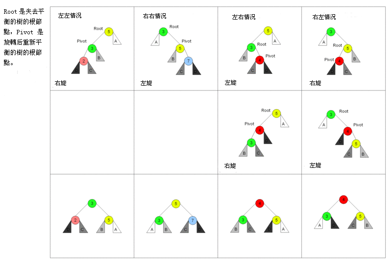

对于左左情况来说，新增加的节点位于节点 2 的左侧，这时树已经不平衡，需要旋转。因为搜索树的特性，节点比左节点大，比右节点小，所以旋转以后也要实现这个特性。  

AVL树中插入一个节点后失衡的情况可以分为以下四种：  

1. 新节点在失衡节点左子树左子树中，此种情况需要关于失衡节点进行一次右旋操作。
2. 新节点在失衡节点右子树右子树中，此种情况需要关于失衡节点进行一次左旋操作。
3. 新节点在失衡节点左子树右子树中，此种情况需要关于失衡节点左儿子进行一次左旋操作，使得失衡节点左儿子变为失衡节点左儿子的右儿子的左儿子，也就是变为第一种情况，然后再关于失衡节点进行一次右旋操作。
4. 新节点在失衡节点右子树左子树中，此种情况需要关于失衡节点右儿子进行一次右旋操作，使得失衡节点右儿子变为失衡节点右儿子的左儿子的右儿子，也就是变为第二种情况，然后再关于失衡节点进行一次左旋操作。  

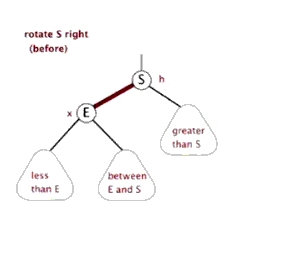

```js
class Node {
  constructor(value) {
    this.value = value;
    this.left = null;
    this.right = null;
    this.height = 1;
  }
}

class AVL {
  constructor() {
    this.root = null;
  }
  addNode(v) {
    this.root = this._addChild(this.root, v);
  }
  _addChild(node, v) {
    if (!node) {
      return new Node(v);
    }
    if (node.value > v) {
      node.left = this._addChild(node.left, v);
    } else if (node.value < v) {
      node.right = this._addChild(node.right, v);
    } else {
      node.value = v;
    }
    node.height =
      1 + Math.max(this._getHeight(node.left), this._getHeight(node.right));
    let factor = this._getBalanceFactor(node);
    // 当需要右旋时，根节点的左树一定比右树高度高
    if (factor > 1 && this._getBalanceFactor(node.left) >= 0) {
      return this._rightRotate(node);
    }
    // 当需要左旋时，根节点的左树一定比右树高度矮
    if (factor < -1 && this._getBalanceFactor(node.right) <= 0) {
      return this._leftRotate(node);
    }
    // 左右情况
    // 节点的左树比右树高，且节点的左树的右树比节点的左树的左树高
    if (factor > 1 && this._getBalanceFactor(node.left) < 0) {
      node.left = this._leftRotate(node.left);
      return this._rightRotate(node);
    }
    // 右左情况
    // 节点的左树比右树矮，且节点的右树的右树比节点的右树的左树矮
    if (factor < -1 && this._getBalanceFactor(node.right) > 0) {
      node.right = this._rightRotate(node.right);
      return this._leftRotate(node);
    }

    return node;
  }
  _getHeight(node) {
    if (!node) return 0;
    return node.height;
  }
  _getBalanceFactor(node) {
    return this._getHeight(node.left) - this._getHeight(node.right);
  }
  // 节点右旋
  //           5                    2
  //         /   \                /   \
  //        2     6   ==>       1      5
  //       /  \               /       /  \
  //      1    3             new     3    6
  //     /
  //    new
  _rightRotate(node) {
    // 旋转后新根节点
    let newRoot = node.left;
    // 需要移动的节点
    let moveNode = newRoot.right;
    // 节点 2 的右节点改为节点 5
    newRoot.right = node;
    // 节点 5 左节点改为节点 3
    node.left = moveNode;
    // 更新树的高度
    node.height =
      1 + Math.max(this._getHeight(node.left), this._getHeight(node.right));
    newRoot.height =
      1 +
      Math.max(this._getHeight(newRoot.left), this._getHeight(newRoot.right));

    return newRoot;
  }
  // 节点左旋
  //           4                    6
  //         /   \                /   \
  //        2     6   ==>       4      7
  //             /  \         /   \      \
  //            5     7      2     5      new
  //                   \
  //                    new
  _leftRotate(node) {
    // 旋转后新根节点
    let newRoot = node.right;
    // 需要移动的节点
    let moveNode = newRoot.left;
    // 节点 6 的左节点改为节点 4
    newRoot.left = node;
    // 节点 4 右节点改为节点 5
    node.right = moveNode;
    // 更新树的高度
    node.height =
      1 + Math.max(this._getHeight(node.left), this._getHeight(node.right));
    newRoot.height =
      1 +
      Math.max(this._getHeight(newRoot.left), this._getHeight(newRoot.right));

    return newRoot;
  }
}
```

### 15.5. Trie 字典树

trie，又称前缀树或字典树，是一种有序树，用于保存关联数组，其中的键通常是字符串。这个结构的作用大多是为了方便搜索字符串，该树有以下几个特点  

1. 根节点代表空字符串，每个节点都有 N（假如搜索英文字符，就有 26 条） 条链接，每条链接代表一个字符
2. 节点不存储字符，只有路径才存储，这点和其他的树结构不同
3. 从根节点开始到任意一个节点，将沿途经过的字符连接起来就是该节点对应的字符串

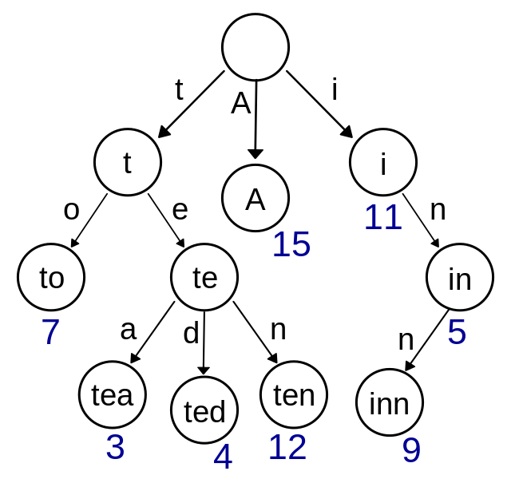

```js
// 以搜索英文字符为例
class TrieNode {
  constructor() {
    // 代表每个字符经过节点的次数
    this.path = 0;
    // 代表到该节点的字符串有几个
    this.end = 0;
    // 链接
    this.next = new Array(26).fill(null);
  }
}
class Trie {
  constructor() {
    // 根节点，代表空字符
    this.root = new TrieNode();
  }
  // 插入字符串
  insert(str) {
    if (!str) return;
    let node = this.root;
    for (let i = 0; i < str.length; i++) {
      // 获得字符先对应的索引
      let index = str[i].charCodeAt() - "a".charCodeAt();
      // 如果索引对应没有值，就创建
      if (!node.next[index]) {
        node.next[index] = new TrieNode();
      }
      node.path += 1;
      node = node.next[index];
    }
    node.end += 1;
  }
  // 搜索字符串出现的次数
  search(str) {
    if (!str) return;
    let node = this.root;
    for (let i = 0; i < str.length; i++) {
      let index = str[i].charCodeAt() - "a".charCodeAt();
      // 如果索引对应没有值，代表没有需要搜素的字符串
      if (!node.next[index]) {
        return 0;
      }
      node = node.next[index];
    }
    return node.end;
  }
  // 删除字符串
  delete(str) {
    if (!this.search(str)) return;
    let node = this.root;
    for (let i = 0; i < str.length; i++) {
      let index = str[i].charCodeAt() - "a".charCodeAt();
      // 如果索引对应的节点的 Path 为 0，代表经过该节点的字符串
      // 已经一个，直接删除即可
      if (--node.next[index].path == 0) {
        node.next[index] = null;
        return;
      }
      node = node.next[index];
    }
    node.end -= 1;
  }
}
```

### 15.6. 并查集

并查集是一种特殊的树结构，用于处理一些不交集的合并及查询问题。该结构中每个节点都有一个父节点，如果只有当前一个节点，那么该节点的父节点指向自己。  

这个结构中有两个重要的操作，分别是：  

Find：确定元素属于哪一个子集。它可以被用来确定两个元素是否属于同一子集。  
Union：将两个子集合并成同一个集合。  

```js
class DisjointSet {
  // 初始化样本
  constructor(count) {
    // 初始化时，每个节点的父节点都是自己
    this.parent = new Array(count)
    // 用于记录树的深度，优化搜索复杂度
    this.rank = new Array(count)
    for (let i = 0; i < count; i++) {
      this.parent[i] = i
      this.rank[i] = 1
    }
  }
  find(p) {
    // 寻找当前节点的父节点是否为自己，不是的话表示还没找到
    // 开始进行路径压缩优化
    // 假设当前节点父节点为 A
    // 将当前节点挂载到 A 节点的父节点上，达到压缩深度的目的
    while (p != this.parent[p]) {
      this.parent[p] = this.parent[this.parent[p]]
      p = this.parent[p]
    }
    return p
  }
  isConnected(p, q) {
    return this.find(p) === this.find(q)
  }
  // 合并
  union(p, q) {
    // 找到两个数字的父节点
    let i = this.find(p)
    let j = this.find(q)
    if (i === j) return
    // 判断两棵树的深度，深度小的加到深度大的树下面
    // 如果两棵树深度相等，那就无所谓怎么加
    if (this.rank[i] < this.rank[j]) {
      this.parent[i] = j
    } else if (this.rank[i] > this.rank[j]) {
      this.parent[j] = i
    } else {
      this.parent[i] = j
      this.rank[j] += 1
    }
  }
}
```

### 15.7. 堆

参考资料：https://blog.csdn.net/weixin_44213940/article/details/112725667  

> 定义  

Heap是一种数据结构具有以下的特点：  
1）完全二叉树；  
2）heap中存储的值是偏序；  

Min-heap: 父节点的值小于或等于子节点的值；  
Max-heap: 父节点的值大于或等于子节点的值；  

大根堆就是每个最大的数字在每个子树的最上方，及大根堆pop值为最大值，小根堆反之.  

> 堆的存储  

堆的存储一般由数组表示，由于堆的实质就是完全二叉树.  

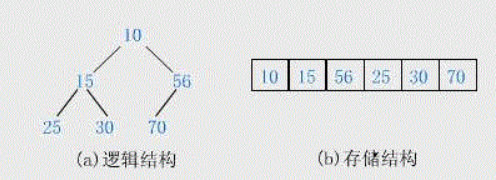

堆的每个节点的左边子节点索引是 i * 2 + 1，右边是 i * 2 + 2，父节点是 (i - 1) /2。  

堆有两个核心的操作，分别是 siftUp 和 siftDown 。前者用于添加元素，后者用于删除根节点。  

siftUp 的核心思路是一路将节点与父节点对比大小，如果比父节点大，就和父节点交换位置。  

siftDown 的核心思路是先将根节点和末尾交换位置，然后移除末尾元素。接下来循环判断父节点和两个子节点的大小，如果子节点大，就把最大的子节点和父节点交换。  

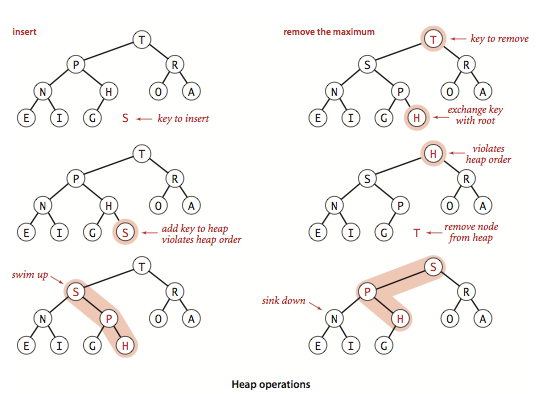


## 16. 常见算法

### 16.1. 深度优先遍历（DFS）和广度优先遍历（BFS）

深度优先遍历(Depth First Search, 简称 DFS) 与广度优先遍历(Breath First Search)是图论中两种非常重要的算法，生产上广泛用于拓扑排序，寻路(走迷宫)，搜索引擎，爬虫等。  

以下算法，demo遍历的是dom节点，主要对应react的diff算法。  

#### 16.1.1. 深度优先遍历（DFS）

主要思路是从图中一个未访问的顶点 V 开始，沿着一条路一直走到底，然后从这条路尽头的节点回退到上一个节点，再从另一条路开始走到底...，不断递归重复此过程，直到所有的顶点都遍历完成，它的特点是不撞南墙不回头，先走完一条路，再换一条路继续走。  

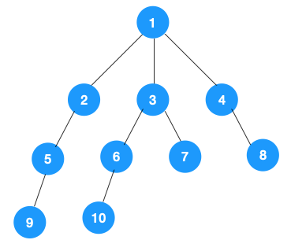

1. 我们从根节点 1 开始遍历，它相邻的节点有 2，3，4，先遍历节点 2，再遍历 2 的子节点 5，然后再遍历 5 的子节点 9.

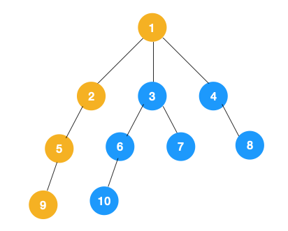

2. 上图中一条路已经走到底了(9是叶子节点，再无可遍历的节点)，此时就从 9 回退到上一个节点 5，看下节点 5 是否还有除 9 以外的节点，没有继续回退到 2，2 也没有除 5 以外的节点，回退到 1，1 有除 2 以外的节点 3，所以从节点 3 开始进行深度优先遍历，如下：

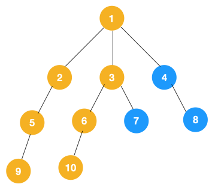

3. 同理从 10 开始往上回溯到 6, 6 没有除 10 以外的子节点，再往上回溯，发现 3 有除 6 以外的子点 7，所以此时会遍历 7。

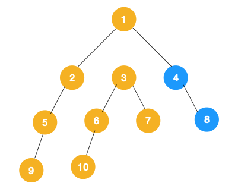

5. 从 7 往上回溯到 3， 1，发现 1 还有节点 4 未遍历，所以此时沿着 4， 8 进行遍历,这样就遍历完成了。


> 1、递归实现  

由于是前序遍历，所以我们依次遍历当前节点，左节点，右节点即可，对于左右节点来说，依次遍历它们的左右节点即可，依此不断递归下去，直到叶节点(递归终止条件),递归的表达性很好，也很容易理解，不过如果层级过深，很容易导致栈溢出.  

```js
function deepFirstSearch(node, nodeList) {
  if (node) {
    nodeList.push(node);
    var children = node.children;
    for (var i = 0; i < children.length; i++)
      //每次递归的时候将 需要遍历的节点 和 节点所存储的数组传下去
      deepFirstSearch(children[i], nodeList);
  }
  return nodeList;
}
```

> 2、非递归实现  

对于每个节点来说，先遍历当前节点，然后把右节点压栈，再压左节点(这样弹栈的时候会先拿到左节点遍历，符合深度优先遍历要求)。弹栈，拿到栈顶的节点，如果节点不为空，重复步骤 1，如果为空，结束遍历。  

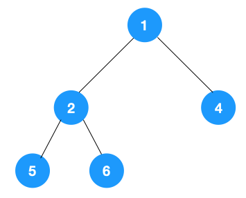

整体动图如下：


```js
function deepFirstSearch2(node) {
  var nodes = [];
  if (node != null) {
    var stack = [];
    stack.push(node);
    while (stack.length != 0) {
      var item = stack.pop();
      nodes.push(item);
      var children = item.children;
      for (var i = children.length - 1; i >= 0; i--) stack.push(children[i]);
    }
  }
  return nodes;
}
```

#### 16.1.2. 广度优先遍历（BFS）

广度优先遍历，指的是从图的一个未遍历的节点出发，先遍历这个节点的相邻节点，再依次遍历每个相邻节点的相邻节点。  

广度优先遍历也叫层序遍历，先遍历第一层(节点 1)，再遍历第二层(节点 2，3，4)，第三层(5，6，7，8)，第四层(9，10)。  

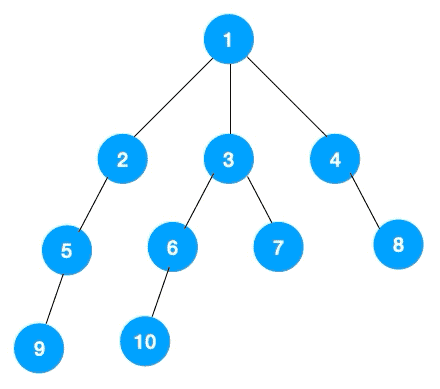

递归版本

```js
function breadthFirstSearch(node, res) {
  if (res.indexOf(node) === -1) {
    res.push(node); // 存入根节点
  }
  const childrens = node.children;
  const len = childrens.length;
  for (let i = 0; i < len; i++) {
    if (childrens[i] !== null) {
      res.push(childrens[i]); // 存入当前节点的所有子元素
    }
  }
  for (let j = 0; j < len; j++) {
    breadthFirstSearch(childrens[j], res); // 对每个子元素递归
  }
  return res;
}
```

非递归版本: 广度优先遍历要用队列来实现


```js
function breadthFirstSearch2(node) {
  const nodes = [];
  if (node) {
    const queue = [];
    queue.unshift(node);
    while (queue.length != 0) {
      const item = queue.shift();
      nodes.push(item);
      const children = item.children;
      for (let i = 0; i < children.length; i++) queue.push(children[i]);
    }
  }
  return nodes;
}
```

### 16.2. 动态规划

动态规划（Dynamic Programming，DP）是一种将复杂问题分解成更小的子问题来解决的优化算法。  

> 例1：最少硬币找零  

给定一组硬币的面额，以及要找零的钱数，计算出符合找零钱数的最少硬币数量。例如，美国硬币面额有1、5、10、25这四种面额，如果要找36美分的零钱，则得出的最少硬币数应该是1个25美分、1个10美分和1个1美分共三个硬币。  

```js
function minCoinChange(coins, amount) {
  let result = null;
  if (!amount) return result;

  const makeChange = (index, value, min) => {
    let coin = coins[index];
    let newAmount = Math.floor(value / coin);
    if (newAmount) min[coin] = newAmount;
    if (value % coin !== 0) {
      makeChange(--index, value - coin * newAmount, min);
    }
  };

  const arr = [];
  for (let i = 0; i < coins.length; i++) {
    const cache = {};
    makeChange(i, amount, cache);
    arr.push(cache);
  }

  console.log(arr);
  let newMin = 0;
  arr.forEach((item) => {
    let min = 0;
    for (let v in item) min += item[v];
    if (!newMin || min < newMin) {
      newMin = min;
      result = item;
    }
  });
  return result;
}
```

> 例2：背包问题  

背包问题是一个组合优化问题，它被描述为：给定一个具有固定容量的背包capacity，以及一组具有价值（value）和重量（weight）的物品，找出一个最优方案，使得装入背包的物品的总重量不超过capacity，且总价值最大。  

假设我们有以下物品，且背包的总容量为5：  

| 物品 | 重量 | 价值 |
| --- | --- | --- |
| 1 | 2 | 3 |
| 2 | 3 | 4 |
| 3 | 4 | 5 |

```js
function knapSack(capacity, weights, values) {
  const n = values.length;
  let load = 0;
  let val = 0;
  for (let i = 0; i < n && load < capacity; i++) {
    if (weights[i] <= capacity - load) {
      val += values[i];
      load += weights[i];
      console.log(`物品${i + 1}，重量：${weights[i]}，价值：${values[i]}`);
    } else {
      const r = (capacity - load) / weights[i];
      val += r * values[i];
      load += weights[i];
      console.log(`物品${i + 1}的${r}，重量：${r * weights[i]}，价值：${val}`);
    }
  }

  return val;
}
```

> 例3：最长公共子序列（LCS）  

找出两个字符串序列的最长子序列的长度。所谓最长子序列，是指两个字符串序列中以相同顺序出现，但不要求连续的字符串序列。例如下面两个字符串：  

字符串1：acbaed  
字符串2：abcadf  
则LCS为acad。  

```js
function printSolution(solution, wordX, m, n) {
  let a = m;
  let b = n;
  let x = solution[a][b];
  let answer = "";
  while (x !== "0") {
    if (solution[a][b] === "diagonal") {
      answer = wordX[a - 1] + answer;
      a--;
      b--;
    } else if (solution[a][b] === "left") {
      b--;
    } else if (solution[a][b] === "top") {
      a--;
    }
    x = solution[a][b];
  }
  return answer;
}

function lcs(wordX, wordY) {
  const m = wordX.length;
  const n = wordY.length;
  const l = [];
  const solution = [];
  for (let i = 0; i <= m; i++) {
    l[i] = [];
    solution[i] = [];
    for (let j = 0; j <= n; j++) {
      l[i][j] = 0;
      solution[i][j] = "0";
    }
  }
  for (let i = 0; i <= m; i++) {
    for (let j = 0; j <= n; j++) {
      if (i === 0 || j === 0) {
        l[i][j] = 0;
      } else if (wordX[i - 1] === wordY[j - 1]) {
        l[i][j] = l[i - 1][j - 1] + 1;
        solution[i][j] = "diagonal";
      } else {
        const a = l[i - 1][j];
        const b = l[i][j - 1];
        l[i][j] = Math.max(a, b);
        solution[i][j] = l[i][j] === l[i - 1][j] ? "top" : "left";
      }
    }
  }

  return printSolution(solution, wordX, m, n);
}
```

### 16.3. 贪心算法

贪心算法(Greedy Algorithm, GA )遵循一种近似解决问题的技术，期盼通过每个阶段的局部最优选择，从而达到全局的最优。  

> 例1：最少硬币找零  

给定一组硬币的面额，以及要找零的钱数，计算出符合找零钱数的最少硬币数量。

```js
function minCoinChange(coins, amount) {
  const change = [];
  let total = 0;
  for (let i = coins.length - 1; i >= 0; i--) {
    const coin = coins[i];
    while (total + coin <= amount) {
      change.push(coin);
      total += coin;
    }
  }
  return change;
}

const result = minCoinChange([1, 2, 5, 9, 10], 18);
console.log(result); // [ 10, 5, 2, 1 ]
```

给出的结果[10, 5, 2, 1]并不是最优方案，最优方案应该是[9, 9]。  

与动态规划相比，贪心算法更简单、效率更高。但是其结果并不总是最理想的。但是综合看来，它相对执行时间来说，输出一个可以接受的结果。

> 例2：背包问题  

```js
function knapSack(capacity, weights, values) {
  const n = values.length;
  let load = 0;
  let val = 0;
  for (let i = 0; i < n && load < capacity; i++) {
    if (weights[i] <= capacity - load) {
      val += values[i];
      load += weights[i];
      console.log(`物品${i + 1}，重量：${weights[i]}，价值：${values[i]}`);
    } else {
      const r = (capacity - load) / weights[i];
      val += r * values[i];
      load += weights[i];
      console.log(`物品${i + 1}的${r}，重量：${r * weights[i]}，价值：${val}`);
    }
  }

  return val;
}
```

> 例3：最长公共子序列（LCS）  

```js
function lcs(wordX, wordY, m = wordX.length, n = wordY.length) {
  if (m === 0 || n === 0) {
    return 0;
  }
  if (wordX[m - 1] === wordY[n - 1]) {
    return 1 + lcs(wordX, wordY, m - 1, n - 1);
  }
  const a = lcs(wordX, wordY, m, n - 1);
  const b = lcs(wordX, wordY, m - 1, n);
  return a > b ? a : b;
}

const wordX = ["a", "c", "b", "a", "e", "d"];
const wordY = ["a", "b", "c", "a", "d", "f"];
console.log(lcs(wordX, wordY)); // 4
```

### 16.4. 分治算法

分治算法(Divide Conquer)不是简单的递归，而是将大的问题递归解决较小的问题，然后从子问题的解构建原问题的解。  

分治算法的递归实现中，每一层递归都会涉及这样三个操作：  

- 分解：将原问题分解成一系列子问题；  
- 解决：递归地求解各个子问题，若子问题足够小，则直接求解；  
- 合并：将子问题的结果合并成原问题。  

> 例1：求一组数据的逆序对个数  

在数组中的两个数字，如果前面一个数字大于后面的数字，则这两个数字组成一个逆序对。输入一个数组,求出这个数组中的逆序对的总数P。  

> 解法一：  

拿每个数字跟它后面的数字比较，看有几个比它小的。把比它小的数字个数记作 k，通过这样的方式，把每个数字都考察一遍之后，然后对每个数字对应的 k 值求和，最后得到的总和就是逆序对个数。  

时间复杂度是O(n^2)。  

> 解法二：  

套用分治的思想来求数组 A 的逆序对个数。可以将数组分成前后两半 A1 和 A2，分别计算 A1 和 A2 的逆序对个数 K1 和 K2， 然后再计算 A1 与 A2 之间的逆序对个数 K3。那数组 A 的逆序对个数就等于 K1 + K2 + K3。  

时间复杂度O(nlogn)，空间复杂度O(n)  

```js
function InversePairs(data = []) {
  let len = data.length;
  if (len === 0) return 0;
  const copy = data.concat([]);
  let count = InversePairsHelp(data, copy, 0, len - 1);
  return count;
  function InversePairsHelp(data, copy, start, end) {
    if (start === end) {
      copy[start] = data[start];
      return 0;
    }
    let mid = Math.floor((end - start) / 2);
    let left = InversePairsHelp(copy, data, start, start + mid);
    let right = InversePairsHelp(copy, data, start + mid + 1, end);
    let i = start + mid;
    let j = end;
    let count = 0;
    let indexCopy = end;
    while (i >= start && j >= start + mid + 1) {
      if (data[i] > data[j]) {
        copy[indexCopy--] = data[i--];
        count = count + j - start - mid;
      } else {
        copy[indexCopy--] = data[j--];
      }
    }
    for (; i >= start; i--) copy[indexCopy--] = data[i];
    for (; j >= start + mid + 1; j--) copy[indexCopy--] = data[j];
    return left + right + count;
  }
}
```

### 16.5. 回溯算法

Backtracking Algorithm 相当于穷举搜索的巧妙实现，对比蛮力的穷举搜索，回溯算法可以对一些不符合要求的或者是重复的情况进行裁剪，不再对其进行搜索，以减少搜索的工作量提高效率。  

比如，在图运用回溯算法的深度优先搜索遍历中，会对已搜索遍历过的顶点进行标记，避免下次的回溯搜索中对再次出现的该顶点进行重复遍历。  

> 例1：0-1背包  

有一个背包，背包总的承载重量是 W。现在有 n 个物品，每个物品的重量不等，并且不可分割。 现在期望选择几件物品，装载到背包中。在不超过背包所能装载重量的前提下，如何让背包中物品的总重量最大？  

可以把物品依次排列，整个问题就分解为了 n 个阶段，每个阶段对应一个物品怎么选择。先对第一个物品进行处理，选择装进去或者不装进去，然后再递归地处理剩下的物品。

```js
let maxW = 0;
/**
 * @param i 考察到哪个物品了
 * @param curW 当前已经装进去的物品重量和
 * @param weight 物品重量数组
 * @param n  物品个数
 * @param w  背包可承载重量
 */
function knapsack(i, curW, weight, n, w) {
  if (curW === w || i === n) {
    if (curW > maxW) {
      maxW = curW;
    }
    return;
  }
  knapsack(i + 1, curW, weight, n, w); //选择不装第i个物品
  if (curW + weight[i] <= w) {
    knapsack(i + 1, curW + weight[i], weight, n, w); //选择装第i个物品
  }
}

const a = [2, 2, 4, 6, 3];
knapsack(0, 0, a, 5, 9);
console.log(maxW);
// 9
```

> 例2：n皇后  

n 皇后问题研究的是如何将 n 个皇后放置在 n×n 的棋盘上，并且使皇后彼此之间不能相互攻击。  

有一个 8x8 的棋盘，希望往里放 8 个棋子（皇后），每个棋子所在的行、列、对角线都不能有另一个棋子。八皇后问题就是期望找到所有满足这种要求的放棋子方式。  

步骤：  

1. 把这个问题划分成 8 个阶段，依次将 8 个棋子放到第一行、第二行、第三行……第八行。  
2. 在放置的过程中，不停地检查当前的方法，是否满足要求。如果满足，则跳到下一行继续放置棋子；如果不满足，那就再换一种方法，继续尝试。  

```js
let counter = 0;

function calcQueens(row, result = []) {
  if (row === 8) {
    counter++;
    console.log("第" + counter + "种：");
    printQueens(result);
    console.log("-----------------------");
    return;
  }
  for (let col = 0; col < 8; ++col) {
    if (isOk(row, col, result)) {
      result[row] = col;
      calcQueens(row + 1, result);
    }
  }
}

function isOk(row, col, result) {
  let leftup = col - 1;
  let rightup = col + 1;
  for (let i = row - 1; i >= 0; i--) {
    if (result[i] === col) {
      return false;
    }
    if (leftup >= 0) {
      if (result[i] === leftup) {
        return false;
      }
    }
    if (leftup < 8) {
      if (result[i] === rightup) {
        return false;
      }
    }
    leftup--;
    rightup++;
  }
  return true;
}

function printQueens(arr, counter = 0) {
  counter++;
  for (let row = 0; row < 8; row++) {
    let line = "";
    for (let col = 0; col < 8; col++) {
      if (arr[row] === col) {
        line += " Q ";
      } else {
        line += " * ";
      }
    }
    console.log(line);
  }
  return counter;
}

calcQueens(0);
// 92种摆法
```

## 17. 源码学习

### 17.1. react

### 17.2. react router

### 17.3. antd design

### 17.4. qiankun

## 18. 前端多项目管理工具lerna

官网：https://lernajs.bootcss.com/  

```text
// 用 npm 将 Lerna 安装到全局环境中：
npm install --global lerna

// 创建一个新的 git 代码仓库：
git init lerna-repo && cd lerna-repo

// 将上述仓库转变为一个 Lerna 仓库：
lerna init
```

代码仓库目前应该是如下结构：

```text
lerna-repo/
  packages/
  package.json
  lerna.json
```


