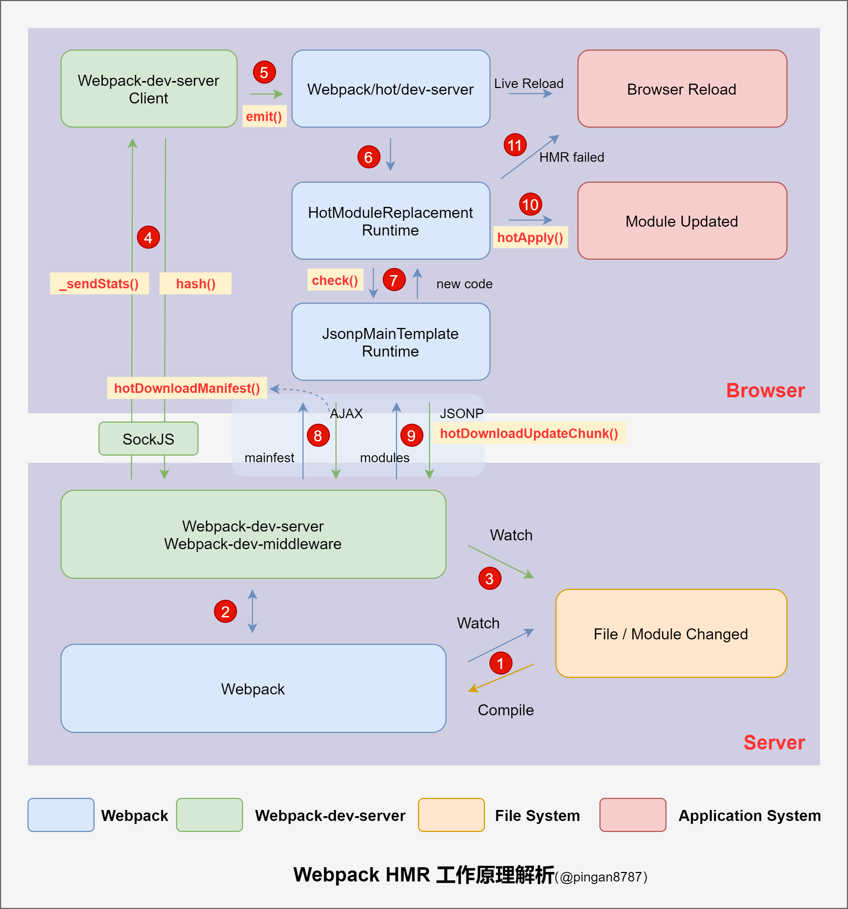

# webpack HMR

版本  

```text
 "webpack": "^5.4.0",
  "webpack-cli": "^3.3.12",
  "webpack-dev-server": "^3.11.0"
```

Hot Module Replacement是 Webpack 提供的一个非常有用的功能，它允许在 JavaScript 运行时更新各种模块，而无需完全刷新.

## 1. HMR 的工作原理图解



## 2. Webpack-dev-server: 监控代码变化，重新编译打包

启动 Webpack-dev-server 启动本地服务器并进入 Webpack 的 watch 模式，然后初始化 Webpack-dev-middleware ，在 Webpack-dev-middleware 中通过调用 startWatch() 方法对文件系统进行 watch：  

1. 启动本地服务器  
webpack-dev-server\bin\webpack-dev-server.js Line 106  

```js
server = new Server(compiler, options, log);
```

2. 初始化 Webpack-dev-middleware  
webpack-dev-server\lib\Server.js Line 207

```js
// middleware for serving webpack bundle
this.middleware = webpackDevMiddleware(
  this.compiler,
  Object.assign({}, this.options, { logLevel: this.log.options.level })
);
```

3. 开始 watch 文件系统  
webpack-dev-middleware\index.js Line 40  

```js
// start watching
  if (!options.lazy) {
    context.watching = compiler.watch(options.watchOptions, (err) => {
      if (err) {
        context.log.error(err.stack || err);
        if (err.details) {
          context.log.error(err.details);
        }
      }
    });
  } else {
    if (typeof options.filename === 'string') {
      const filename = options.filename
        .replace(/[\-\[\]\/\{\}\(\)\*\+\?\.\\\^\$\|]/g, '\\$&') // eslint-disable-line no-useless-escape
        .replace(/\\\[[a-z]+\\\]/gi, '.+');

      options.filename = new RegExp(`^[/]{0,1}${filename}$`);
    }

    context.state = true;
  }  
```

## 3. Webpack 将编译结果保存在内存中

发现在 output.path 指定的 dist 目录并没有保存编译结果的文件,Webpack 将编译结果保存在内存中，因为访问内存中的代码比访问文件系统中的文件快，这样可以减少代码写入文件的开销。  

Webpack 能将代码保存到内存中，需要归功于 Webpack-dev-middleware 的 memory-fs 依赖库，它将原本 outputFileSystem  替换成了 MemoryFileSystem  的实例，便实现代码输出到内存中。  

webpack-dev-middleware\lib\fs.js Line 107

```js
const MemoryFileSystem = require('memory-fs');
let fileSystem;

// store our files in memory
const isConfiguredFs = context.options.fs;
const isMemoryFs =
  !isConfiguredFs &&
  !compiler.compilers &&
  compiler.outputFileSystem instanceof MemoryFileSystem;

if (isConfiguredFs) {
  // eslint-disable-next-line no-shadow
  const { fs } = context.options;

  if (typeof fs.join !== 'function') {
    // very shallow check
    throw new Error(
      'Invalid options: options.fs.join() method is expected'
    );
  }

  // eslint-disable-next-line no-param-reassign
  compiler.outputFileSystem = fs;
  fileSystem = fs;
} else if (isMemoryFs) {
  fileSystem = compiler.outputFileSystem;
} else {
  fileSystem = new MemoryFileSystem();

  // eslint-disable-next-line no-param-reassign
  compiler.outputFileSystem = fileSystem;
}
```

## 4.监控文件变化，刷新浏览器

当我们在配置文件中配置了 devServer.watchContentBase 为 true ，Webpack-dev-server 会监听配置文件夹中静态文件的变化，发生变化时，通知浏览器端对应用进行浏览器刷新，这与 HMR 不一样。  

webpack-dev-server\lib\Server.js  

1. 读取参数： Line 573

```js
if (this.options.watchContentBase) {
      runnableFeatures.push('watchContentBase');
    }
```

2. 定义watch方法： Line 1014

```js
_watch(watchPath) {
  // ...
  const watcher = chokidar.watch(watchPath, watchOptions);
  // disabling refreshing on changing the content
  if (this.options.liveReload !== false) {
    watcher.on('change', () => {
      this.sockWrite(this.sockets, 'content-changed');
    });
  }
  this.contentBaseWatchers.push(watcher);
}
```

3. 执行 _watch() 监听文件变化:  Line 435

```js
setupWatchStaticFeature() {
  const contentBase = this.options.contentBase;

  if (isAbsoluteUrl(String(contentBase)) || typeof contentBase === 'number') {
    throw new Error('Watching remote files is not supported.');
  } else if (Array.isArray(contentBase)) {
    contentBase.forEach((item) => {
      if (isAbsoluteUrl(String(item)) || typeof item === 'number') {
        throw new Error('Watching remote files is not supported.');
      }
      this._watch(item);
    });
  } else {
    this._watch(contentBase);
  }
}
```

## 5. 建立 WS，同步编译阶段状态

Webpack-dev-server 中处理，主要通过 sockjs（Webpack-dev-server 的依赖），在 Webpack-dev-server 的浏览器端（Client）和服务器端（Webpack-dev-middleware）之间建立 WebSocket 长连接。  

然后将 Webpack 编译打包的各个阶段状态信息同步到浏览器端。其中有两个重要步骤：  

1. 发送状态: Webpack-dev-server 通过 Webpack API 监听 compile 的 done 事件，当 compile 完成后，Webpack-dev-server 通过 _sendStats 方法将编译后新模块的 hash 值用 socket 发送给浏览器端。  

2. 保存状态: 浏览器端将_sendStats 发送过来的 hash 保存下来，它将会用到后模块热更新。  


webpack-dev-server\lib\Server.js  

定义 _sendStats 方法 Line 968  

```js
// send stats to a socket or multiple sockets
_sendStats(sockets, stats, force) {
  const shouldEmit =
    !force &&
    stats &&
    (!stats.errors || stats.errors.length === 0) &&
    stats.assets &&
    stats.assets.every((asset) => !asset.emitted);

  if (shouldEmit) {
    return this.sockWrite(sockets, 'still-ok');
  }

  this.sockWrite(sockets, 'hash', stats.hash);

  if (stats.errors.length > 0) {
    this.sockWrite(sockets, 'errors', stats.errors);
  } else if (stats.warnings.length > 0) {
    this.sockWrite(sockets, 'warnings', stats.warnings);
  } else {
    this.sockWrite(sockets, 'ok');
  }
}
```

监听 done 事件 Line 171  

```js
setupHooks() {
  // Listening for events
  const invalidPlugin = () => {
    this.sockWrite(this.sockets, 'invalid');
  };

  const addHooks = (compiler) => {
    const { compile, invalid, done } = compiler.hooks;

    compile.tap('webpack-dev-server', invalidPlugin);
    invalid.tap('webpack-dev-server', invalidPlugin);
      done.tap('webpack-dev-server', (stats) => {
        this._sendStats(this.sockets, this.getStats(stats));
        this._stats = stats;
      });
  };

  if (this.compiler.compilers) {
    this.compiler.compilers.forEach(addHooks);
  } else {
    addHooks(this.compiler);
  }
}
```

保存 hash 值 webpack-dev-server\client\index.js Line 63  

```js
var onSocketMessage = {
  hash: function hash(_hash) {
    status.currentHash = _hash;
  },
}
```

## 6. 浏览器端发布消息

当 hash 消息发送完成后，socket 还会发送一条 ok 的消息告知 Webpack-dev-server，由于客户端（Client）并不请求热更新代码，也不执行热更新模块操作，因此通过 emit 一个 "webpackHotUpdate" 消息，将工作转交回 Webpack。  

webpack-dev-server\client\index.js  

1. 处理ok消息 Line 107  

```js
ok: function ok() {
  sendMessage('Ok');

  if (options.useWarningOverlay || options.useErrorOverlay) {
    overlay.clear();
  }

  if (options.initial) {
    return options.initial = false;
  } // eslint-disable-line no-return-assign


  reloadApp(options, status);
},
```

2. 处理刷新 APP  webpack-dev-server\client\reloadApp.js  Line 18  

```js
if (hot) {
  log.info('[WDS] App hot update...');

  var hotEmitter = require('webpack/hot/emitter');

  hotEmitter.emit('webpackHotUpdate', currentHash);

  if (typeof self !== 'undefined' && self.window) {
    // broadcast update to window
    self.postMessage("webpackHotUpdate".concat(currentHash), '*');
  }
}
```

## 7. 传递 hash 到 HMR

Webpack/hot/dev-server 监听浏览器端 webpackHotUpdate 消息，将新模块 hash 值传到客户端 HMR 核心中枢的 HotModuleReplacement.runtime ，并调用 check 方法检测更新，判断是浏览器刷新还是模块热更新。如果是浏览器刷新的话，则没有后续步骤.  

1. 监听 webpackHotUpdate webpack\hot\dev-server.js Line 50

```js
var hotEmitter = require("./emitter");
hotEmitter.on("webpackHotUpdate", function (currentHash) {
  lastHash = currentHash;
  if (!upToDate() && module.hot.status() === "idle") {
    log("info", "[HMR] Checking for updates on the server...");
    check();
  }
});
```

2. check 方法 webpack\hot\dev-server.js Line 12  

```js
var check = function check() {
  module.hot
    .check(true)
    .then(function (updatedModules) {
      if (!updatedModules) {
        log("warning", "[HMR] Cannot find update. Need to do a full reload!");
        log(
          "warning",
          "[HMR] (Probably because of restarting the webpack-dev-server)"
        );
        window.location.reload();
        return;
      }

      if (!upToDate()) {
        check();
      }

      require("./log-apply-result")(updatedModules, updatedModules);

      if (upToDate()) {
        log("info", "[HMR] App is up to date.");
      }
    })
    .catch(function (err) {
      var status = module.hot.status();
      if (["abort", "fail"].indexOf(status) >= 0) {
        log(
          "warning",
          "[HMR] Cannot apply update. Need to do a full reload!"
        );
        log("warning", "[HMR] " + log.formatError(err));
        window.location.reload();
      } else {
        log("warning", "[HMR] Update failed: " + log.formatError(err));
      }
    });
};
```

3. 调用 HotModuleReplacement.runtime 定义的 check 方法  webpack\lib\hmr\HotModuleReplacement.runtime.js  Line 234  

```js
function hotCheck(applyOnUpdate) {
  if (currentStatus !== "idle") {
    throw new Error("check() is only allowed in idle status");
  }
  setStatus("check");
  return $hmrDownloadManifest$().then(function (update) {
    if (!update) {
      setStatus(applyInvalidatedModules() ? "ready" : "idle");
      return null;
    }

    setStatus("prepare");

    var updatedModules = [];
    blockingPromises = [];
    currentUpdateApplyHandlers = [];

    return Promise.all(
      Object.keys($hmrDownloadUpdateHandlers$).reduce(function (
        promises,
        key
      ) {
        $hmrDownloadUpdateHandlers$[key](
          update.c,
          update.r,
          update.m,
          promises,
          currentUpdateApplyHandlers,
          updatedModules
        );
        return promises;
      },
      [])
    ).then(function () {
      return waitForBlockingPromises(function () {
        if (applyOnUpdate) {
          return internalApply(applyOnUpdate);
        } else {
          setStatus("ready");

          return updatedModules;
        }
      });
    });
  });
}
```

## 8. 检测是否存在更新

1. 调用 HotModuleReplacement.runtime 定义 hotDownloadUpdateChunk 方法  
webpack\lib\hmr\HotModuleReplacement.runtime.jsLine 234

```js
function hotCheck(applyOnUpdate) {
  if (currentStatus !== "idle") {
    throw new Error("check() is only allowed in idle status");
  }
  setStatus("check");
  return $hmrDownloadManifest$().then(function (update) {
    if (!update) {
      setStatus(applyInvalidatedModules() ? "ready" : "idle");
      return null;
    }

    setStatus("prepare");

    var updatedModules = [];
    blockingPromises = [];
    currentUpdateApplyHandlers = [];

    return Promise.all(
      Object.keys($hmrDownloadUpdateHandlers$).reduce(function (
        promises,
        key
      ) {
        $hmrDownloadUpdateHandlers$[key](
          update.c,
          update.r,
          update.m,
          promises,
          currentUpdateApplyHandlers,
          updatedModules
        );
        return promises;
      },
      [])
    ).then(function () {
      return waitForBlockingPromises(function () {
        if (applyOnUpdate) {
          return internalApply(applyOnUpdate);
        } else {
          setStatus("ready");

          return updatedModules;
        }
      });
    });
  });
}
```

## 9. 请求更新最新文件列表

通过向服务端发起 AJAX 请求获取是否有更新文件，如果有的话将 mainfest 返回给浏览器端。  

## 10.请求更新最新模块代码

通过 JSONP 请求最新的模块代码，并将代码返回给 HMR runtime 。  

然后 HMR runtime 会将新代码进一步处理，判断是浏览器刷新还是模块热更新。  


参考：https://xie.infoq.cn/article/b102685ca1cbda3b8228cb1f3  
但该文的webpack版本与本文的不一致，所以源码也不一致  
