# 网络协议

程序是如何工作的  

当一个网络包从一个网口经过的时候，你看到了，首先先看看要不要请进来，处理一把。有的网口配置了混杂模式，凡是经过的，全部拿进来。  

拿进来以后，就要交给一段程序来处理。于是，你调用 process_layer2(buffer)。从 Buffer 中，摘掉二层的头，看一看，应该根据头里面的内容做什么操作。  

假设你发现这个包的 MAC 地址和你的相符，那说明就是发给你的，于是需要调用 process_layer3(buffer)。这个时候，Buffer 里面往往就没有二层的头了，因为已经在上一个函数的处理过程中拿掉了，或者将开始的偏移量移动了一下。在这个函数里面，摘掉三层的头.  

如果 IP 地址不是自己的，那就应该转发出去；如果 IP 地址是自己的，那就是发给自己的。根据 IP 头里面的标示，拿掉三层的头，进行下一层的处理，到底是调用 process_tcp(buffer) 呢，还是调用 process_udp(buffer) 呢？  

假设这个地址是 TCP 的，则会调用 process_tcp(buffer)。这时候，Buffer 里面没有三层的头，就需要查看四层的头，看这是一个发起，还是一个应答，又或者是一个正常的数据包，然后分别由不同的逻辑进行处理。如果是发起或者应答，接下来可能要发送一个回复包；如果是一个正常的数据包，就需要交给上层了。交给谁呢？是不是有 process_http(buffer) 函数呢？  

没有的，如果你是一个网络包处理程序，你不需要有 process_http(buffer)，而是应该交给应用去处理。交给哪个应用呢？在四层的头里面有端口号，不同的应用监听不同的端口号。如果发现浏览器应用在监听这个端口，那你发给浏览器就行了。  

## 物理层

### 物理层的基本概念

物理层的主要任务描述为确定与传输媒体的接口的一些特性，即：  
**机械特性**   指明接口所用接线器的形状和尺寸、引线数目和排列、固定和锁定装置等等。  
**电气特性**   指明在接口电缆的各条线上出现的电压的范围。  
**功能特性**   指明某条线上出现的某一电平的电压表示何种意义。  
**过程特性**   指明对于不同功能的各种可能事件的出现顺序。  

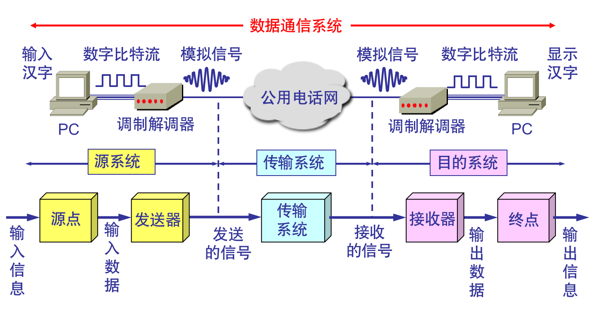

几个术语  

数据(data)——运送消息的实体。  
信号(signal)——数据的电气的或电磁的表现。  
“模拟的”(analogous)——代表消息的参数的取值是连续的。  
“数字的”(digital)——代表消息的参数的取值是离散的。  
码元(code)——在使用时间域（或简称为时域）的波形表示数字信号时，代表不同离散数值的基本波形。  

有关信号的几个基本概念  

单向通信（单工通信）——只能有一个方向的通信而没有反方向的交互。  
双向交替通信（半双工通信）——通信的双方都可以发送信息，但不能双方同时发送(当然也就不能同时接收)。  
双向同时通信（全双工通信）——通信的双方可以同时发送和接收信息。  

基带信号（即基本频带信号）——来自信源的信号。像计算机输出的代表各种文字或图像文件的数据信号都属于基带信号。  
基带信号往往包含有较多的低频成分，甚至有直流成分，而许多信道并不能传输这种低频分量或直流分量。因此必须对基带信号进行调制(modulation)。  
通带信号——把基带信号经过载波调制后，把信号的频率范围搬移到较高的频段以便在信道中传输（即仅在一段频率范围内能够通过信道）。  

基带信号(baseband)就是将数字信号 1 或 0 直接用两种不同的电压来表示，然后送到线路上去传输。  
宽带信号(broadband)则是将基带信号进行调制后形成的频分复用模拟信号。  
通带信号(passband)被搬移到某个更大频率范围的信号。  

几种最基本的调制方法  
  
基带信号往往包含有较多的低频成分，甚至有直流成分，而许多信道并不能传输这种低频分量或直流分量。为了解决这一问题，就必须对基带信号进行调制(modulation)。  
最基本的二元制调制方法有以下几种：  
调幅(AM)：载波的振幅随基带数字信号而变化。  
调频(FM)：载波的频率随基带数字信号而变化。  
调相(PM) ：载波的初始相位随基带数字信号而变化。  

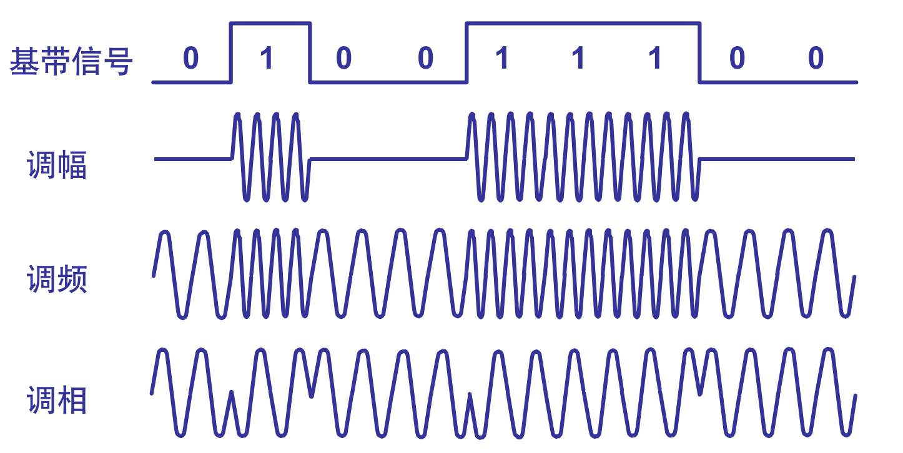

所谓调制就是进行波形变换。或者更严格地讲，是进行频谱变换，将基带数字信号的频谱变换成为适合于在模拟信道中传输的频谱。最基本的调制方法有以下几种：  
(1)调幅(AM) 即载波的振幅随基带数字信号而变化。例如，0对应于无载波输出，而1对应于有载波输出。  
(2)调频(FM) 即载波的频率随基带数字信号而变化。例如，0对应于频率f1，而1对应于频率f2。  
(3)调相(PM) 即载波的初始相位随基带数字信号而变化。例如，0对应于相位0o，而1对应于180o。  

根据载波 Asin(t + )的三个特性：幅度、频率、相位，产生常用的三种调制技术：  
幅移键控法 Amplitude-shift keying (ASK)  
频移键控法 Frequency-shift keying (FSK)  
相移键控法 Phase-shift keying (PSK)  

调制解调器的速率  

目前调制解调器的信息传输速率已很接近于香农的信道容量极限了。  
要提高信息传输速率，只能设法提高信噪比。  
在电话的用户线上，最大的噪声来自模拟到数字的模数转换所带来的量化噪声。  

调制解调器使用异步通信方式  

数据通信可分为同步通信和异步通信两大类：  
同步通信要求接收端时钟频率和发送端时钟频率一致。发送端发送连续的比特流。  
异步通信时不要求接收端时钟和发送端时钟同步。发送端发送完一个字节后，可经过任意长的时间间隔再发送下一个字节。  
异步通信的通信开销较大，但接收端可使用廉价的、具有一般精度的时钟来进行数据通信。  

数字传输系统  

现在的数字传输系统均采用脉码调制 PCM (Pulse Code Modulation)体制。  
PCM最初并不是为传送计算机数据用的。它是为了使电话局之间一条中继线不是只传送一路电话而是可以传送几十路的电话。由于历史上的原因，PCM有两个互不兼容的国际标准，即北美的24路PCM(简称为T1)和欧洲的30路PCM(简称为E1)。  
T1的速率是1.544 Mb/s，E1的速率是2.048 Mb/s。  

脉码调制PCM  
  
为了将模拟电话信号转变为数字信号，必须先对电话信号进行取样。根据取样定理，只要：取样频率不低于电话信号最高频率的2倍，就可以从取样脉冲信号无失真地恢复出原来的电话信号。标准的电话信号的最高频率为3.4kHz，为方便起见，取样频率就定为8kHz，相当于取样周期为125 s。  

PCM的基本原理  

T为取样周期。连续的电话信号经取样后成为如图中(a)所示的离散脉冲信号，其振幅对应于取样时刻电话信号的数值。  
下一步就是编码。为简单起见,图(c)将不同振幅的脉冲编为4位二进制码元。在我国使用的PCM体制中，电话信号是采用8 bit编码,也就是说,将取样后的模拟的电话信号量化为256个不同等级中的一个。模拟信号转换为数字信号后就进行传输。  
在接收端进行解码的过程与编码过程相反。经滤波后最后得出恢复后的模拟电话信号图中的(e)。  

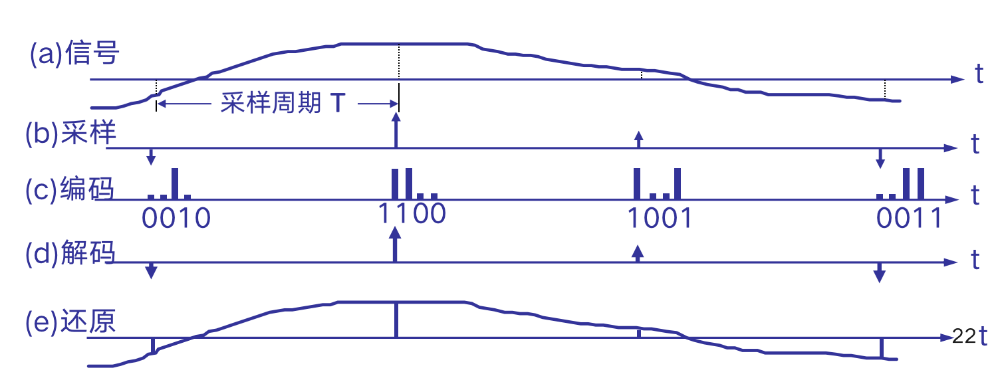

这样，一个话路的模拟电话信号，经模数变换后，就变成为每秒8000个脉冲信号，每个脉冲信号再编为8位二进制码元。因此一个标准话路的PCM信号速率为64 kb/s。  
以kb/s的速率是最早制订出的话音编码的标准速率。  
随着话音编码技术的不断发展，人们可以用更低的数据率来传送同样质量的话音信号。现在已经能够用32kb/s，16kb/s或甚至低到8kb/s(或更低)的数据率来传送一路话音信号。  

### 时分复用

为了有效地利用传输线路，可将多个话路的PCM 信号用时分复用 TDM (Time Division Multiplexing)的方法装成时分复用帧，然后发送到线路上。  
中国采用欧洲体制，以 E1 为一次群。  
美国和日本等国采用北美体制，以 T1 为一次群。  

E1的一个时分复用帧(其长度T＝125s)共划分为32相等的时隙，时隙的编号为CH0-CH31。时隙CH0用作帧同步用，时隙CH16用来传送信令(如用户的拨号信令)。可供用户使用的话路是时隙CH1-CH15和CH17-CH31，共30个时隙用作30个话路。每个时隙共传送8 bit。因此整个的32个时隙共用256bit。每秒传送8000个帧，因此PCM一次群E1的数据率就是2.048Mb/s。  
北美使用的T1系统共有24个话路。每个话路的取样脉冲用7bit编码，然后再加上1位信令码元，因此一个话路也是占用8bit。帧同步码是在24路的编码之后加上1bit，这样每帧共有193bit。因此T1一次群的数据率为1.544Mb/s。  

E1 的时分复用帧  

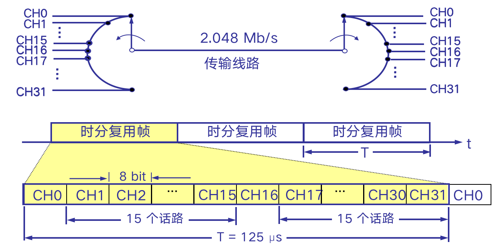

信道的极限容量  

任何实际的信道都不是理想的，在传输信号时会产生各种失真以及带来多种干扰。  
码元(时间轴上的一个信号编码单元)传输的速率越高，或信号传输的距离越远，在信道的输出端的波形的失真就越严重。  

数字信号通过实际的信道  

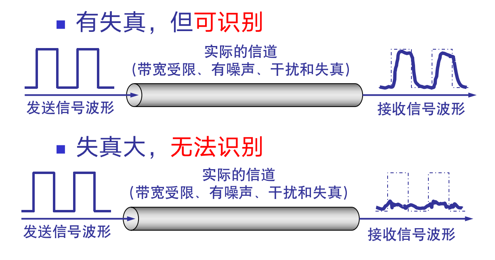

1924年，尼奎斯特（H. Nyquist）推导出理想低通信道的最高码元传输速率 = 2H Baud  

每赫带宽的理想低通信道的最高码元传输速率是每秒 2  个码元。  
Baud 是波特，是码元传输速率的单位，1 波特为每秒传送 1 个码元。  

实际的信道所能传输的最高码元速率，要明显地低于尼氏准则给出上限数值。  
当信号电平分为Ｖ级，尼奎斯特（H. Nyquist）无噪声有限带宽信道的最大数据传输率公式表示为：最大数据传输率 = 2Hlog2V (bps)  
这说明，任意信号通过一个带宽为Ｈ的低通滤波器，则每秒采样2Ｈ次就能完整地重现该信号。  
例如，V=2（只有两级），无噪声的3k Hz信道传输二进制最高的速率是6000 bps。  

波特(Baud)和比特(bit)是两个完全不同的概念。  
波特是码元传输的速率单位（每秒传多少个码元）。码元传输速率也称为调制速率、波形速率或符号速率。  
比特是信息量的单位。  
信息的传输速率“比特/秒”与码元的传输速率“波特”在数量上却有一定的关系。  
若1个码元只携带 1 bit 的信息量，则“比特/秒”和“波特”在数值上相等。  
若1个码元携带n bit 的信息量，则 M Baud的码元传输速率所对应的信息传输速率为M*n b/s。  

波特率（baud）和比特率（bit）的关系  

波特率：信号每秒钟变化的次数，也称调制速率。  
比特率：每秒钟传送的二进制位数。  
波特率与比特率的关系取决于信号值与比特位的关系。  
例：每个信号值可表示３位，则比特率是波特率的３倍；每个信号值可表示１位，则比特率和波特率相同。  
例如，有一个带宽为3kHz的理想低通信道，其最高码元传输速率为6000 Baud(即每秒传6000个码元)。若1个码元能携带3bit的信息量，则最高信息传输速率为18000 b/s。  

### 信噪比

香农(Shannon)用信息论的理论推导出了带宽受限且有高斯白噪声干扰的信道的极限、无差错的信息传输速率。  
信道的极限信息传输速率 C 可表达为 C = W log2(1+S/N)  b/s  
W 为信道的带宽（以 Hz 为单位）；  
S 为信道内所传信号的平均功率；  
N 为信道内部的高斯噪声功率。  

热噪声出现的大小用信噪比（信号功率与噪声功率之比: 用S/N或SNR表示）来衡量。  
 S：信号功率，N：噪声功率  
 10log10S/N, 单位：分贝（dB）  
 即，人们常说的信噪比，是指10log10S/N值  
如信噪比10分贝，实际上S/N=10  
如信噪比20分贝，实际上S/N=100  
如信噪比30分贝，实际上S/N=1000  

香农公式表明  

信道的带宽或信道中的信噪比越大，则信息的极限传输速率就越高。  
只要信息传输速率低于信道的极限信息传输速率，就一定可以找到某种办法来实现无差错的传输。  
若信道带宽 W 或信噪比 S/N 没有上限（当然实际信道不可能是这样的），则信道的极限信息传输速率 C 也就没有上限。  
实际信道上能够达到的信息传输速率要比香农的极限传输速率低不少。  

### 物理层下面的传输媒体

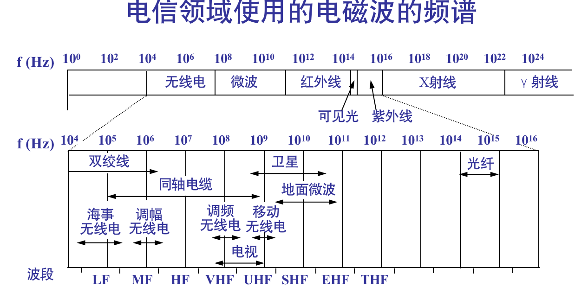

导引型传输媒体  

1. 双裸线  
2. 双绞线  

- 屏蔽双绞线 STP (Shielded Twisted Pair)  
- 无屏蔽双绞线 UTP (Unshielded Twisted Pair)  

3. 同轴电缆  

- 50  同轴电缆  
- 75  同轴电缆  

4. 光缆  

### 信道复用技术

复用(multiplexing)是通信技术中的基本概念。  

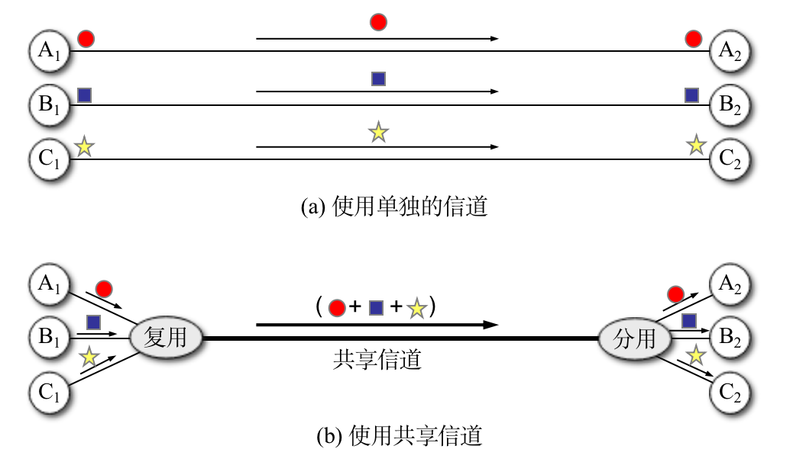

#### 频分复用 FDM(Frequency Division Multiplexing)

用户在分配到一定的频带后，在通信过程中自始至终都占用这个频带。  
频分复用的所有用户在同样的时间占用不同的带宽资源（请注意，这里的“带宽”是频率带宽而不是数据的发送速率）。  

#### 时分复用TDM(Time Division Multiplexing)

时分复用则是将时间划分为一段段等长的时分复用帧（TDM 帧）。每一个时分复用的用户在每一个 TDM 帧中占用固定序号的时隙。  
每一个用户所占用的时隙是周期性地出现（其周期就是 TDM  帧的长度）。  
TDM 信号也称为等时(isochronous)信号。  
时分复用的所有用户是在不同的时间占用同样的频带宽度。  

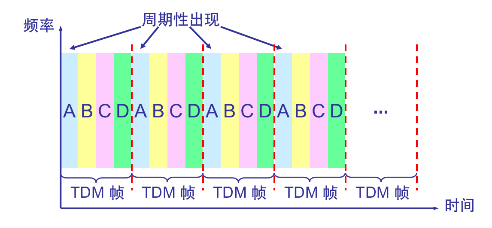

时分复用可能会造成线路资源的浪费  

使用时分复用系统传送计算机数据时，由于计算机数据的突发性质，用户对分配到的子信道的利用率一般是不高的。  

#### 统计时分复用 STDM(Statistic TDM)  

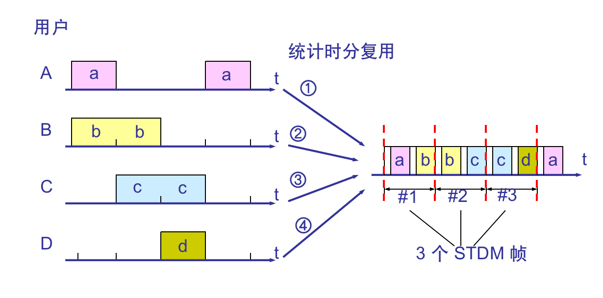

#### 波分复用 WDM(Wavelength Division Multiplexing)  

波分复用就是光的频分复用。  

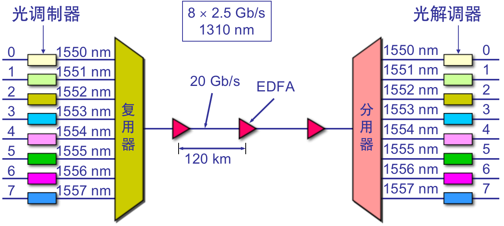

#### 码分复用 CDM(Code Division Multiplexing)  

常用的名词是码分多址 CDMA (Code Division Multiple Access)。  
各用户使用经过特殊挑选的不同码型，因此彼此不会造成干扰。  
这种系统发送的信号有很强的抗干扰能力，其频谱类似于白噪声，不易被敌人发现。  
每一个比特时间划分为 m 个短的间隔，称为码片(chip)。  

#### 码片序列(chip sequence)

每个站被指派一个唯一的 m bit 码片序列。  
如发送比特 1，则发送自己的 m bit 码片序列。  
如发送比特 0，则发送该码片序列的二进制反码。  
例如，S 站的 8 bit 码片序列是 00011011。  
发送比特 1 时，就发送序列 00011011，  
发送比特 0 时，就发送序列 11100100。  
S 站的码片序列：(–1 –1 –1 +1 +1 –1 +1 +1)  

### 物理层设备

中继器/转发器(RP，Repeater)  
工作在物理层上的连接设备。  
适用于完全相同的两类网络的互连，主要功能是通过对数据信号的重新发送或者转发，来扩大网络传输的距离。  
中继器是对信号进行再生和还原的网络设备，用于扩展局域网网段的长度（仅用于连接相同的局域网网段）  

集线器  
主要功能是对接收到的信号进行再生整形放大，以扩大网络的传输距离，同时把所有节点集中在以它为中心的节点上。  
它工作于OSI(开放系统互联参考模型)参考模型第一层，即“物理层”。  
集线器每个接口简单的收发比特，收到1就转发1，收到0就转发0，不进行碰撞检测。  

## 数据链路层

数据链路层使用的信道主要有以下两种类型：  
点对点信道。这种信道使用一对一的点对点通信方式。  
广播信道。这种信道使用一对多的广播通信方式，因此过程比较复杂。广播信道上连接的主机很多，因此必须使用专用的共享信道协议来协调这些主机的数据发。  

数据链路层的简单模型

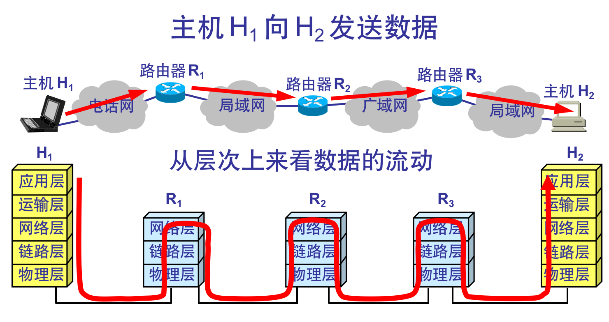

链路(link)是一条无源的点到点的物理线路段，中间没有任何其他的交换结点。  
一条链路只是一条通路的一个组成部分。  
数据链路(data link) 除了物理线路外，还必须有通信协议来控制这些数据的传输。若把实现这些协议的硬件和软件加到链路上，就构成了数据链路。  
现在最常用的方法是使用适配器（即网卡）来实现这些协议的硬件和软件。  
一般的适配器都包括了数据链路层和物理层这两层的功能。  

数据链路层传送的是帧

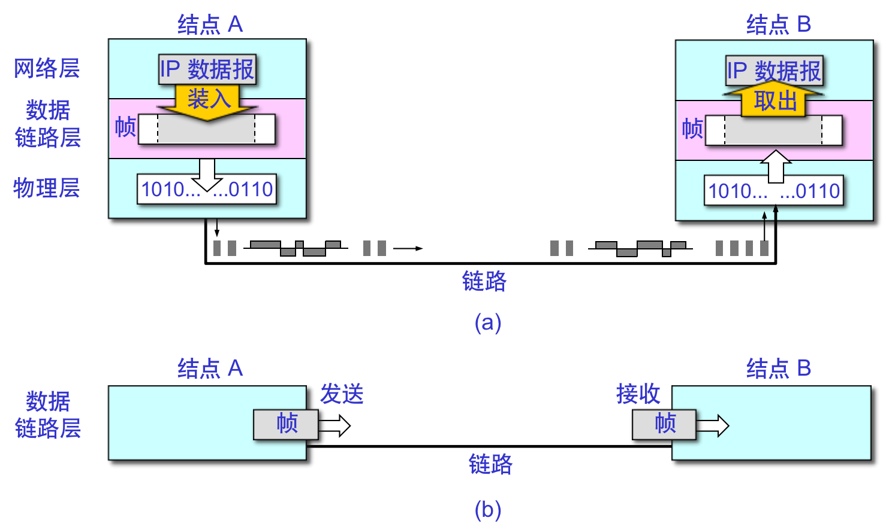

数据链路层像个数字管道  
常常在两个对等的数据链路层之间画出一个数字管道，而在这条数字管道上传输的数据单位是帧。  

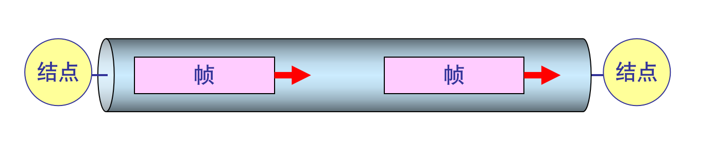

早期的数据通信协议曾叫作通信规程(procedure)。因此在数据链路层，规程和协议是同义语。  

### 封装成帧

封装成帧(framing)就是在一段数据的前后分别添加首部和尾部，然后就构成了一个帧。确定帧的界限。  
首部和尾部的一个重要作用就是进行帧定界。  

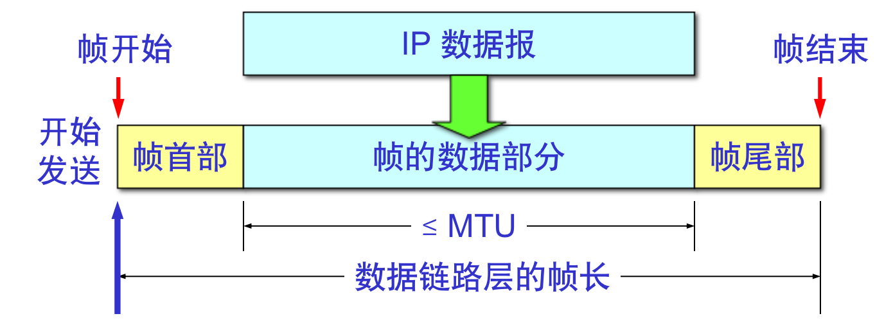

#### 透明传输

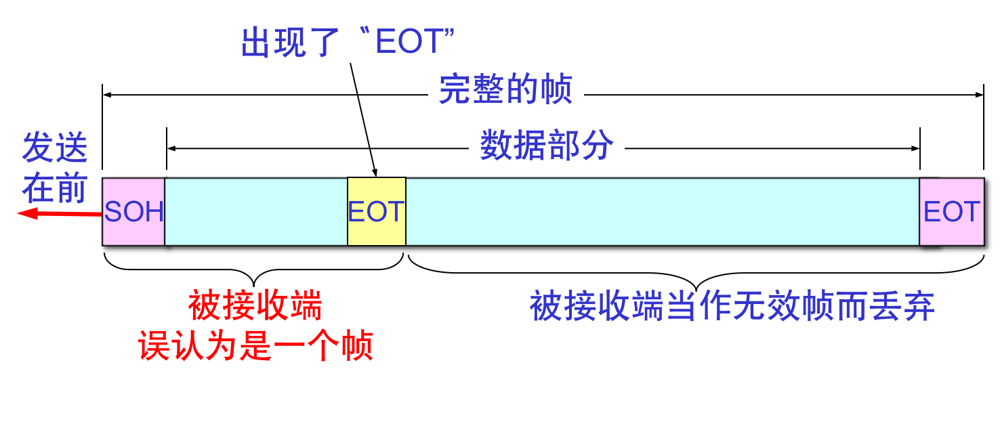

解决透明传输问题  

发送端的数据链路层在数据中出现控制字符“SOH”或“EOT”的前面插入一个转义字符“ESC”(其十六进制编码是 1B)。  
字节填充(byte stuffing)或字符填充(character stuffing)——接收端的数据链路层在将数据送往网络层之前删除插入的转义字符。  
如果转义字符也出现数据当中，那么应在转义字符前面插入一个转义字符。当接收端收到连续的两个转义字符时，就删除其中前面的一个。  

用字节填充法解决透明传输的问题  

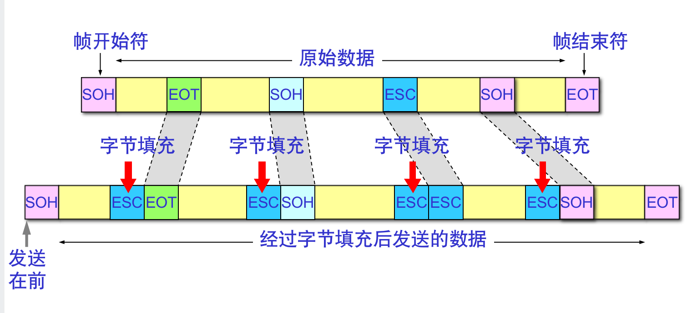

#### 错误检测和纠正

差错出现的特点：随机，连续突发（burst）  
处理差错的两种基本策略  
使用纠错码：发送方在每个数据块中加入足够的冗余信息，使得接收方能够判断接收到的数据是否有错，并能纠正错误。  
使用检错码：发送方在每个数据块中加入足够的冗余信息，使得接收方能够判断接收到的数据是否有错，但不能判断哪里有错。  

##### 纠错码

码字（codeword）：一个帧包括m个数据位，r个校验位，n = m + r，则此n比特单元称为n位码字。  
海明距离（Hamming distance）：两个码字之间不同的比特(对应)位数目。  
例：0000000000 与0000011111的海明距离为5  
如果两个码字的海明距离为d，则需要d个单比特错就可以把一个码字转换成另一个码字；  
对于n位码字的集合，只有2m个码字是有效的。也就是说，通常并未使用所有2n个码字。  

[关于海明码的原理和计算](https://www.jianshu.com/p/54d1adc74314)

纠正码字中的单个数据位错误

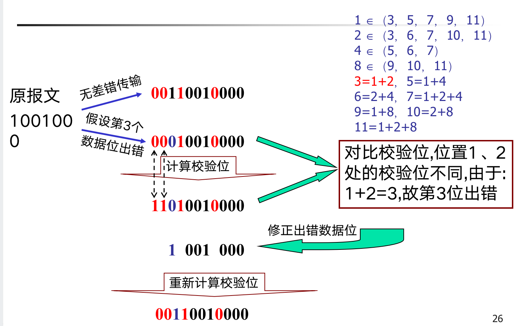
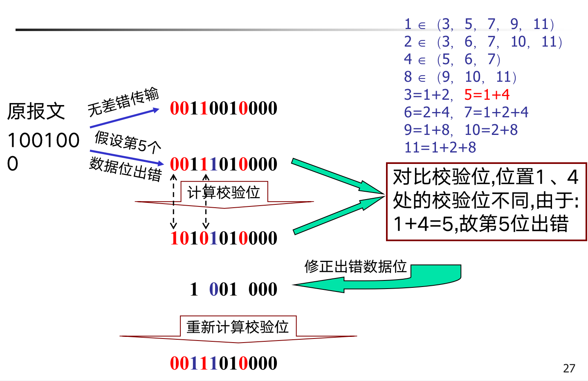
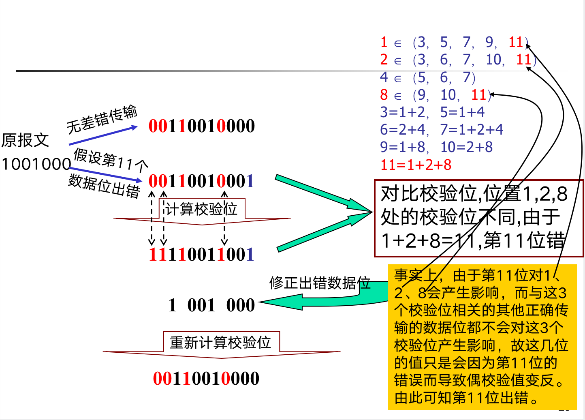
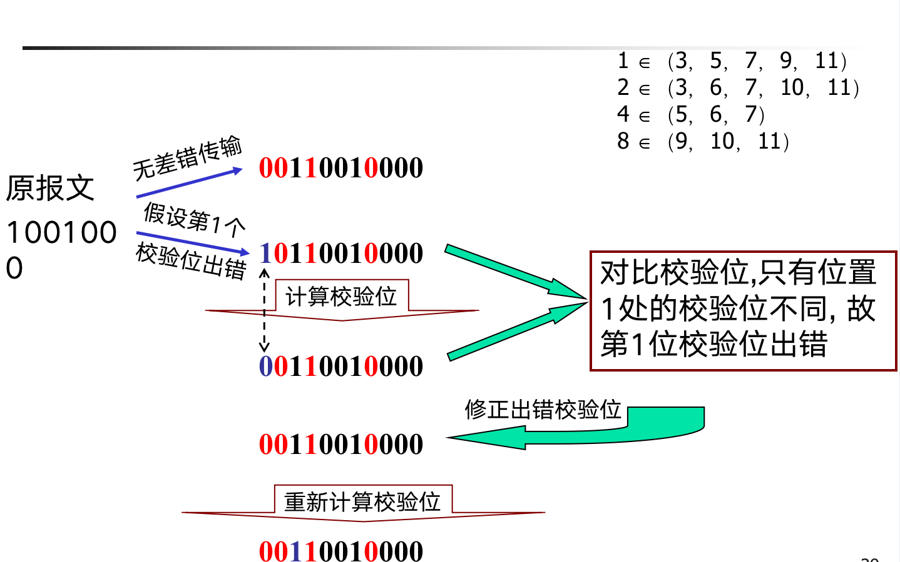

在实际通信中使用纠错码好还是检错码好呢？  
例如：假设一个信道误码率是10-6，且出错是孤立产生的（即只有单比特错），数据块长度为1000比特，如果采用纠错编码，需要10个校验位（210>1011），传送1M数据需要10000个校验位；如果采用检错编码，每个数据块只需一个奇偶校验位，传送1M数据只需1000个校验位和一个重传的数据1001位，共需要2001比特的额外开销。  
在多数通信中采用检错编码，但在单工信道中需要纠错编码。  

##### 改进的奇偶校验

将数据位组成一个n位宽，K位高的长方形距阵来发送，然后对每一列单独计算奇偶位，并附在最后一行作为冗余位。  

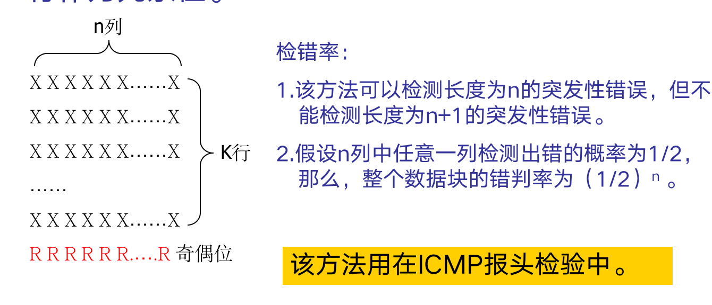

##### 检错码

使用纠错码传数据，效率低，适用于不可能重传的场合；大多数情况采用检错码加重传。  
循环冗余码（CRC码，多项式编码）  
110001，表示成多项式 x^5 + x^4 + 1  
生成多项式G(x)  
发方、收方事前商定；  
生成多项式的高位和低位必须为1  
生成多项式必须比传输信息对应的多项式短。  

CRC码基本思想  
校验和（checksum）加在帧尾，使带校验和的帧的多项式能被G(x)除尽；收方接收时，用G(x)去除它，若有余数，则传输出错。  
校验和计算算法  
设G(x)为 r 阶，在帧的末尾加 r 个0，使帧为m+r位，相应多项式为xrM(x)；  
按模2除法用对应于G(x)的位串去除对应于xrM(x)的位串；  
按模2减法从对应于xrM(x)的位串中减去余数(等于或小于r位)，结果就是要传送的带校验和的多项式T(x)。  

多项式编码校验和计算示例  

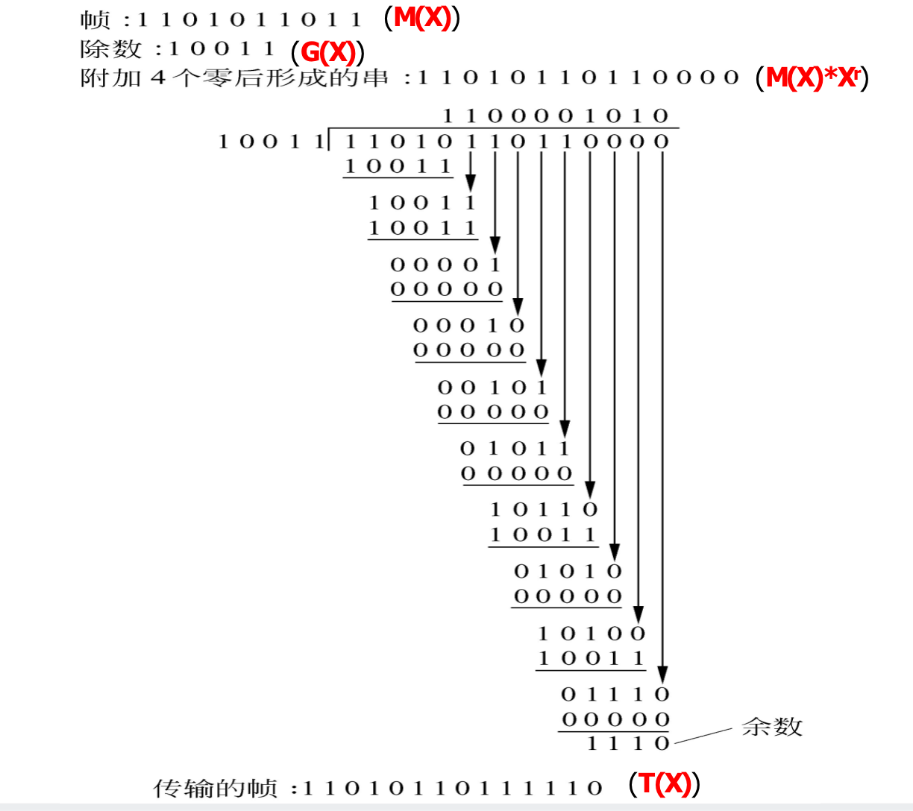

CRC的检错能力  
发送：T(x)；接收：T(x) + E(x), E(x) 不等于 0；  
余数((T(x) + E(x)) / G(x)) = 0 + 余数(E(x) / G(x))  
若余数(E(x) / G(x)) = 0，则差错不能发现；否则，可以发现。  

CRC检错能力的几种情况分析  
如果只有单比特错，即E(x) = x^i，而G(x)中至少有两项，余数(E(x) / G(x)) 不等于 0，所以可以查出单比特错；  
如果发生两个孤立单比特错，即E(x) = xi + xj = xj (xi-j + 1)，假定G(x)不能被x整除，那么能够发现两个比特错的充分条件是：xk + 1不能被G(x)整除 (k =< i - j)；  
如果有奇数个比特错，即E(x)包括奇数个项，G(x)选(x + 1)的倍数就能查出奇数个比特错；  

#### 帧检验序列 FCS

在数据后面添加上的冗余码称为帧检验序列 FCS (Frame Check Sequence)。  
循环冗余检验 CRC 和帧检验序列 FCS并不等同。  
CRC 是一种常用的检错方法，而 FCS 是添加在数据后面的冗余码。  
FCS 可以用 CRC 这种方法得出，但 CRC 并非用来获得 FCS 的惟一方法。  

只要得出的余数R 不为0，就表示检测到了差错。  
但这种检测方法并不能确定究竟是哪一个或哪几个比特出现了差错。  
一旦检测出差错，就丢弃这个出现差错的帧。  
只要经过严格的挑选，并使用位数足够多的除数P，那么出现检测不到的差错的概率就很小很小。  

仅用循环冗余检验 CRC 差错检测技术只能做到无差错接受(accept)。  
“无差错接受”是指：“凡是接受的帧（即不包括丢弃的帧），我们都能以非常接近于 1 的概率认为这些帧在传输过程中没有产生差错”。  
也就是说：“凡是接受的帧都没有传输差错”（有差错的帧就丢弃而不接受）。  
要做到“可靠传输”（即发送什么就收到什么）就必须再加上确认和重传机制。  

### 点对点协议 PPP

现在全世界使用得最多的数据链路层协议是点对点协议 PPP (Point-to-Point Protocol)。  
用户使用拨号电话线接入因特网时，一般都是使用 PPP 协议。  

PPP 协议应满足的需求  

- 简单——这是首要的要求
- 封装成帧
- 透明性
- 多种网络层协议
- 多种类型链路
- 差错检测
- 检测连接状态
- 最大传送单元
- 网络层地址协商
- 数据压缩协商  

PPP 协议不需要的功能

- 纠错
- 流量控制
- 序号
- 多点线路
- 半双工或单工链路

PPP 协议有三个组成部分  

1. 一个将 IP 数据报封装到串行链路的方法。
2. 链路控制协议 LCP (Link Control Protocol)。
3. 网络控制协议 NCP (Network Control Protocol)。  

PPP 协议的帧格式  

标志字段 F = 0x7E （符号“0x”表示后面的字符是用十六进制表示。十六进制的 7E 的二进制表示是 01111110）。  
地址字段 A 只置为 0xFF。地址字段实际上并不起作用。  
控制字段 C 通常置为 0x03。  
PPP 是面向字节的，所有的 PPP 帧的长度都是整数字节。  

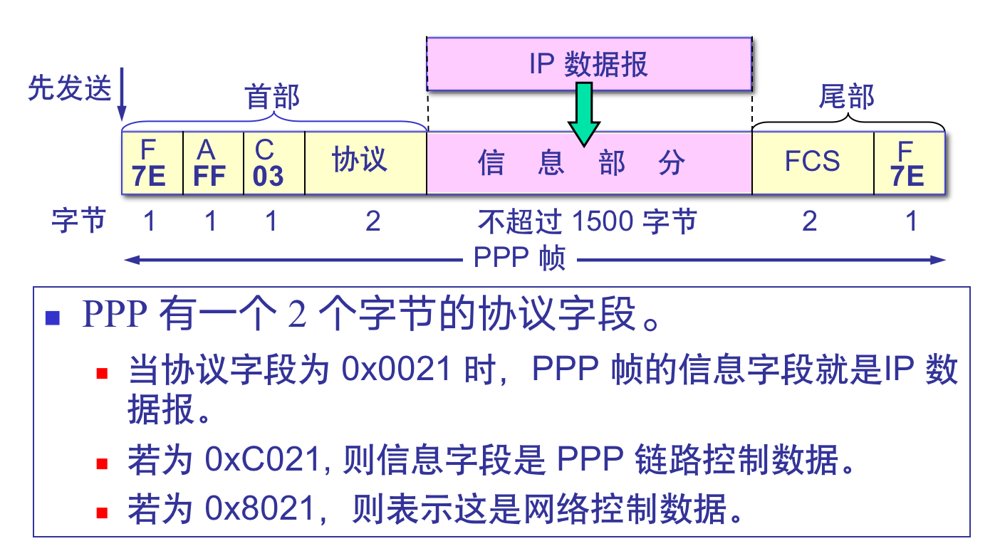

当 PPP 用在同步传输链路时，协议规定采用硬件来完成比特填充（和 HDLC 的做法一样）。  
当 PPP 用在异步传输时，就使用一种特殊的字符填充法。  

#### 字符填充

将信息字段中出现的每一个 0x7E 字节转变成为 2 字节序列(0x7D, 0x5E)。  
若信息字段中出现一个 0x7D 的字节, 则将其转变成为 2 字节序列(0x7D, 0x5D)。  
若信息字段中出现 ASCII 码的控制字符（即数值小于 0x20 的字符），则在该字符前面要加入一个 0x7D 字节，同时将该字符的编码加以改变。  

#### 零比特填充

PPP 协议用在 SONET/SDH 链路时，是使用同步传输（一连串的比特连续传送）。这时 PPP 协议采用零比特填充方法来实现透明传输。  
在发送端，只要发现有 5 个连续 1，则立即填入一个 0。接收端对帧中的比特流进行扫描。每当发现 5 个连续1时，就把这 5 个连续 1 后的一个 0 删除。  

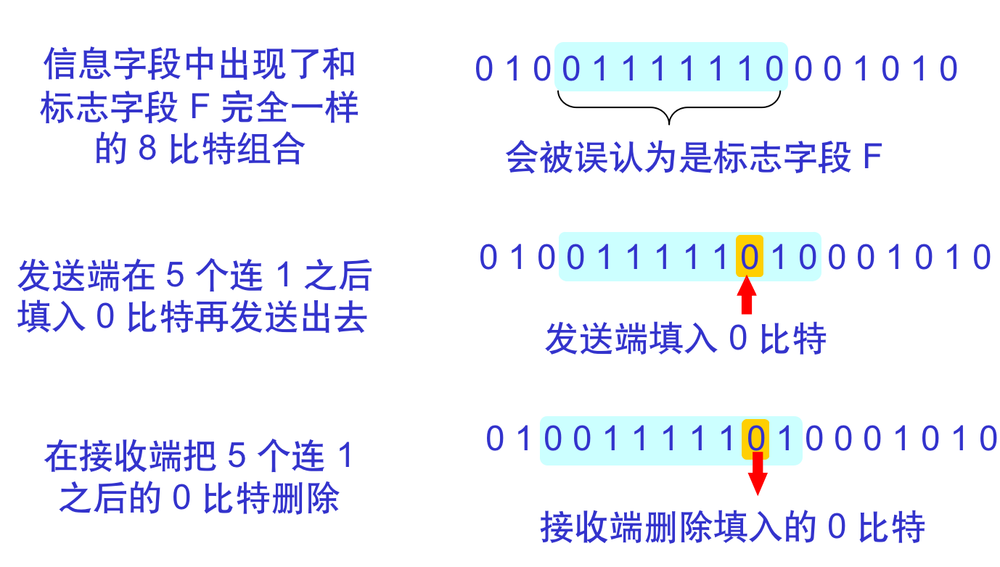

PPP 协议之所以不使用序号和确认机制是出于以下的考虑：

- 在数据链路层出现差错的概率不大时，使用比较简单的 PPP 协议较为合理。
- 在因特网环境下，PPP 的信息字段放入的数据是 IP 数据报。数据链路层的可靠传输并不能够保证网络层的传输也是可靠的。
- 帧检验序列 FCS 字段可保证无差错接受。  

PPP 协议的工作状态  

当用户拨号接入 ISP 时，路由器的调制解调器对拨号做出确认，并建立一条物理连接。  
PC 机向路由器发送一系列的 LCP 分组（封装成多个 PPP 帧）。  
这些分组及其响应选择一些 PPP 参数，和进行网络层配置，NCP 给新接入的 PC机分配一个临时的 IP 地址，使 PC 机成为因特网上的一个主机。  
通信完毕时，NCP 释放网络层连接，收回原来分配出去的 IP 地址。接着，LCP 释放数据链路层连接。最后释放的是物理层的连接。  

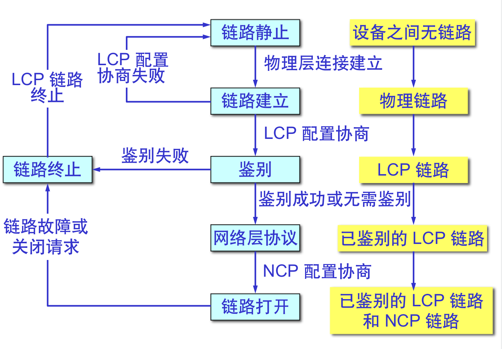

### 使用广播信道的数据链路层

#### 局域网的数据链路层

局域网最主要的特点是：网络为一个单位所拥有，且地理范围和站点数目均有限。  
局域网具有如下的一些主要优点：  
具有广播功能，从一个站点可很方便地访问全网。局域网上的主机可共享连接在局域网上的各种硬件和软件资源。  
便于系统的扩展和逐渐地演变，各设备的位置可灵活调整和改变。  
提高了系统的可靠性、可用性和残存性。  

局域网的拓扑

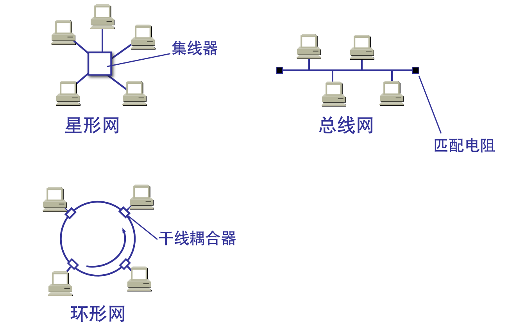

#### 数据链路层的两个子层

为了使数据链路层能更好地适应多种局域网标准，802 委员会就将局域网的数据链路层拆成两个子层：  
逻辑链路控制 LLC (Logical Link Control)子层  
媒体接入控制 MAC (Medium Access Control)子层。  
与接入到传输媒体有关的内容都放在 MAC子层，而 LLC 子层则与传输媒体无关，不管采用何种协议的局域网对 LLC 子层来说都是透明的  

#### 适配器的作用  

网络接口板又称为通信适配器(adapter)或网络接口卡 NIC (Network Interface Card)，或“网卡”。  
适配器的重要功能：  
进行串行/并行转换。  
对数据进行缓存。  
在计算机的操作系统安装设备驱动程序。  
实现以太网协议。  

以太网发送的数据都使用曼彻斯特(Manchester)编码  

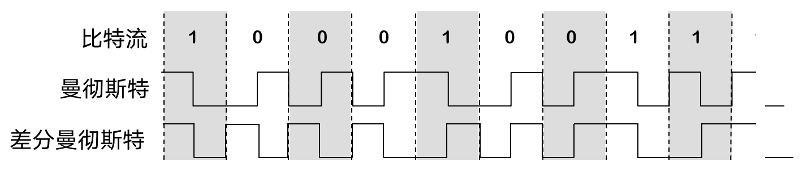

曼彻斯特编码中，每一位的中间有一跳变，位中间的跳变既作时钟信号，又作数据信号；从高到低跳变表示" 1"，从低到高跳变表示" 0"。  
差分曼彻斯特编码，每位中间的跳变仅提供时钟定时，而用每位开始时有无跳变表示"0"或"1"，有跳变为"0"，无跳变为"1"。  
两种曼彻斯特编码是将时钟和数据包含在数据流中，在传输代码信息的同时，也将时钟同步信号一起传输到对方，每位编码中有一跳变，不存在直流分量，因此具有自同步能力和良好的抗干扰性能。但每一个码元都被调成两个电平，所以数据传输速率只有调制速率的1/2。  

#### 载波监听多点接入/碰撞检测  CSMA/CD

CSMA/CD 表示 Carrier Sense Multiple Access with Collision Detection。  
“多点接入”表示许多计算机以多点接入的方式连接在一根总线上。  
“载波监听”是指每一个站在发送数据之前先要检测一下总线上是否有其他计算机在发送数据，如果有，则暂时不要发送数据，以免发生碰撞。  
总线上并没有什么“载波”。因此， “载波监听”就是用电子技术检测总线上有没有其他计算机发送的数据信号。  

#### 碰撞检测

“碰撞检测”就是计算机边发送数据边检测信道上的信号电压大小。  
当几个站同时在总线上发送数据时，总线上的信号电压摆动值将会增大（互相叠加）。  
当一个站检测到的信号电压摆动值超过一定的门限值时，就认为总线上至少有两个站同时在发送数据，表明产生了碰撞。  
所谓“碰撞”就是发生了冲突。因此“碰撞检测”也称为“冲突检测”。  

在发生碰撞时，总线上传输的信号产生了严重的失真，无法从中恢复出有用的信息来。  
每一个正在发送数据的站，一旦发现总线上出现了碰撞，就要立即停止发送，免得继续浪费网络资源，然后等待一段随机时间后再次发送。  

重要特性  

- 使用 CSMA/CD 协议的以太网不能进行全双工通信而只能进行双向交替通信（半双工通信）。  
- 每个站在发送数据之后的一小段时间内，存在着遭遇碰撞的可能性。  
- 这种发送的不确定性使整个以太网的平均通信量远小于以太网的最高数据率。  

最先发送数据帧的站，在发送数据帧后至多经过时间 2 （两倍的端到端往返时延）就可知道发送的数据帧是否遭受了碰撞。  
以太网的端到端往返时延 2 称为争用期，或碰撞窗口。  
经过争用期这段时间还没有检测到碰撞，才能肯定这次发送不会发生碰撞。  

#### 二进制指数类型退避算法 (truncated binary exponential type)

发生碰撞的站在停止发送数据后，要推迟（退避）一个随机时间才能再发送数据。  
基本退避时间取为争用期 2T。  
从整数集合[0,1,…, (2^k-1)]中随机地取出一个数，记为 r。重传所需的时延就是 r 倍的基本退避时间。  
参数 k 按下面的公式计算：  
                 k = Min[重传次数, 10]  
当 k =< 10 时，参数 k 等于重传次数。  
当重传达 16 次仍不能成功时即丢弃该帧，并向高层报告。  

以太网取 51.2 us 为争用期的长度。  
对于 10 Mb/s 以太网，在争用期内可发送512 bit，即 64 字节。  
以太网在发送数据时，若前 64 字节没有发生冲突，则后续的数据就不会发生冲突。  

如果发生冲突，就一定是在发送的前 64 字节之内。  
由于一检测到冲突就立即中止发送，这时已经发送出去的数据一定小于 64 字节。  
以太网规定了最短有效帧长为 64 字节，凡长度小于 64 字节的帧都是由于冲突而异常中止的无效帧。  

当发送数据的站一旦发现发生了碰撞时：  
立即停止发送数据；  
再继续发送若干比特的人为干扰信号(jamming signal)，以便让所有用户都知道现在已经发生了碰撞。  

以太网的信道被占用的情况：  
争用期长度为 2，即端到端传播时延的两倍。检测到碰撞后不发送干扰信号。  
帧长为 L (bit)，数据发送速率为 C (b/s)，因而帧的发送时间为 L/C = T0 (s)。  

信道利用率的最大值 Smax  

在理想化的情况下，以太网上的各站发送数据都不会产生碰撞（这显然已经不是 CSMA/CD，而是需要使用一种特殊的调度方法），即总线一旦空闲就有某一个站立即发送数据。  
发送一帧占用线路的时间是 T0 + ，而帧本身的发送时间是 T0。于是我们可计算出理想情况下的极限信道利用率 Smax为：  

Smax = T0/(TO+T) = 1/(1+a)

#### 以太网的 MAC 层

在局域网中，硬件地址又称为物理地址，或 MAC 地址。  
802 标准所说的“地址”严格地讲应当是每一个站的“名字”或标识符。  

适配器从网络上每收到一个 MAC 帧就首先用硬件检查 MAC 帧中的 MAC 地址.  
如果是发往本站的帧则收下，然后再进行其他的处理。  
否则就将此帧丢弃，不再进行其他的处理。  
“发往本站的帧”包括以下三种帧：  
单播(unicast)帧（一对一）  
广播(broadcast)帧（一对全体）  
多播(multicast)帧（一对多）  

常用的以太网MAC帧格式有两种标准 ：  
DIX Ethernet V2 标准  
IEEE 的 802.3 标准  
最常用的 MAC 帧是以太网 V2 的格式。  

以太网的 MAC 帧格式  

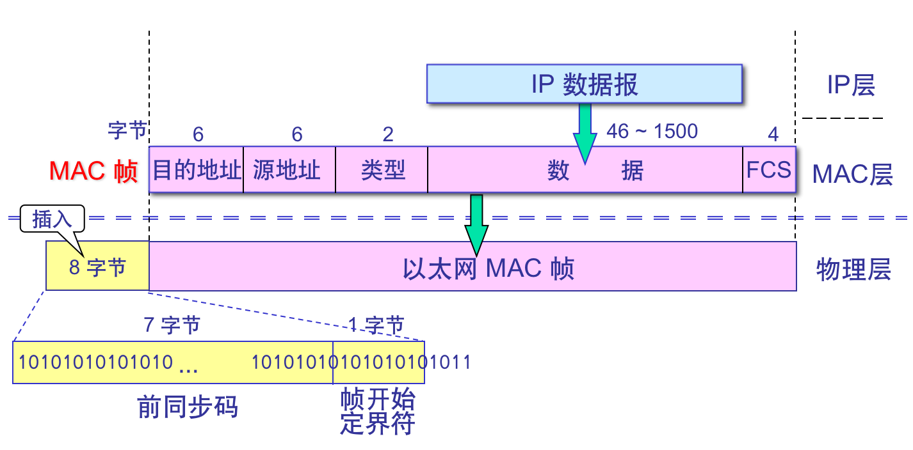

无效的 MAC 帧  

- 数据字段的长度与长度字段的值不一致；  
- 帧的长度不是整数个字节；  
- 用收到的帧检验序列 FCS 查出有差错；  
- 数据字段的长度不在 46 ~ 1500 字节之间。  
- 有效的 MAC 帧长度为 64 ~ 1518 字节之间。  
- 对于检查出的无效 MAC 帧就简单地丢弃。以太网不负责重传丢弃的帧。  

帧间最小间隔  

帧间最小间隔为 9.6 us，相当于 96 bit 的发送时间。  
一个站在检测到总线开始空闲后，还要等待 9.6 us 才能再次发送数据。  
这样做是为了使刚刚收到数据帧的站的接收缓存来得及清理，做好接收下一帧的准备。  

### 在数据链路层扩展局域网

在数据链路层扩展局域网是使用网桥。  
网桥工作在数据链路层，它根据 MAC 帧的目的地址对收到的帧进行转发。  
网桥具有过滤帧的功能。当网桥收到一个帧时，并不是向所有的接口转发此帧，而是先检查此帧的目的 MAC 地址，然后再确定将该帧转发到哪一个接口  

网桥的内部结构

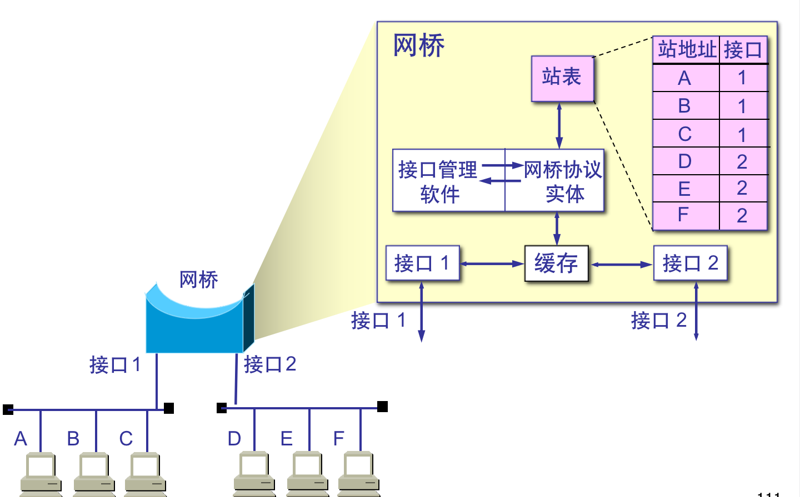

使用网桥带来的好处  

- 过滤通信量。
- 扩大了物理范围。
- 提高了可靠性。
- 可互连不同物理层、不同 MAC 子层和不同速率（如10 Mb/s 和 100 Mb/s 以太网）的局域网。  

网桥使各网段成为隔离开的碰撞域  

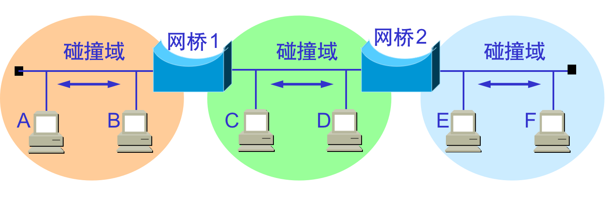

使用网桥带来的缺点

- 存储转发增加了时延。  
- 在MAC 子层并没有流量控制功能。  
- 具有不同 MAC 子层的网段桥接在一起时时延更大。  
- 网桥只适合于用户数不太多(不超过几百个)和通信量不太大的局域网，否则有时还会因传播过多的广播信息而产生网络拥塞。这就是所谓的广播风暴。  

网桥和集线器（或转发器）不同  

集线器在转发帧时，不对传输媒体进行检测。  
网桥在转发帧之前必须执行 CSMA/CD 算法。若在发送过程中出现碰撞，就必须停止发送和进行退避。  

目前使用得最多的网桥是透明网桥(transparent bridge)。  
“透明”是指局域网上的站点并不知道所发送的帧将经过哪几个网桥，因为网桥对各站来说是看不见的。  
透明网桥是一种即插即用设备，其标准是 IEEE 802.1D。  

网桥应当按照以下自学习算法处理收到的帧和建立转发表  

- 若从 A 发出的帧从接口 x 进入了某网桥，那么从这个接口出发沿相反方向一定可把一个帧传送到 A。  
- 网桥每收到一个帧，就记下其源地址和进入网桥的接口，作为转发表中的一个项目。  
- 在建立转发表时是把帧首部中的源地址写在“地址”这一栏的下面。  
- 在转发帧时，则是根据收到的帧首部中的目的地址来转发的。这时就把在“地址”栏下面已经记下的源地址当作目的地址，而把记下的进入接口当作转发接口。  

网桥在转发表中登记以下三个信息  

在网桥的转发表中写入的信息除了地址和接口外，还有帧进入该网桥的时间。  
这是因为以太网的拓扑可能经常会发生变化，站点也可能会更换适配器（这就改变了站点的地址）。另外，以太网上的工作站并非总是接通电源的。  
把每个帧到达网桥的时间登记下来，就可以在转发表中只保留网络拓扑的最新状态信息。这样就使得网桥中的转发表能反映当前网络的最新拓扑状态。  

网桥的自学习和转发帧的步骤归纳  

网桥收到一帧后先进行自学习。查找转发表中与收到帧的源地址有无相匹配的项目。如没有，就在转发表中增加一个项目（源地址、进入的接口和时间）。如有，则把原有的项目进行更新。  
转发帧。查找转发表中与收到帧的目的地址有无相匹配的项目。  

- 如没有，则通过所有其他接口（但进入网桥的接口除外）按进行转发。
- 如有，则按转发表中给出的接口进行转发。
- 若转发表中给出的接口就是该帧进入网桥的接口，则应丢弃这个帧（因为这时不需要经过网桥进行转发）。  

## 网络层

### 虚拟互连网络

所谓虚拟互连网络也就是逻辑互连网络，它的意思就是互连起来的各种物理网络的异构性本来是客观存在的，但是我们利用 IP 协议就可以使这些性能各异的网络从用户看起来好像是一个统一的网络。  
使用 IP 协议的虚拟互连网络可简称为 IP 网。  
使用虚拟互连网络的好处是：当互联网上的主机进行通信时，就好像在一个网络上通信一样，而看不见互连的各具体的网络异构细节。  

### 分类的 IP 地址

IP 地址就是给每个连接在因特网上的主机（或路由器）分配一个在全世界范围是唯一的 32 位的标识符。  
IP 地址现在由因特网名字与号码指派公司ICANN (Internet Corporation for Assigned Names and Numbers)进行分配  

每一类地址都由两个固定长度的字段组成，其中一个字段是网络号 net-id，它标志主机（或路由器）所连接到的网络，而另一个字段则是主机号 host-id，它标志该主机（或路由器）。  
两级的 IP 地址可以记为：  

IP 地址 ::= { <网络号>, <主机号>}  

::= 代表“定义为”  

IP 地址中的网络号字段和主机号字段  

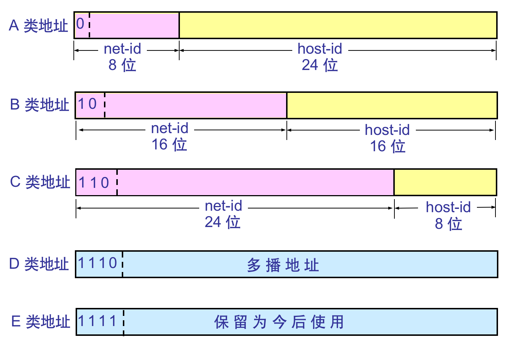

点分十进制记法  

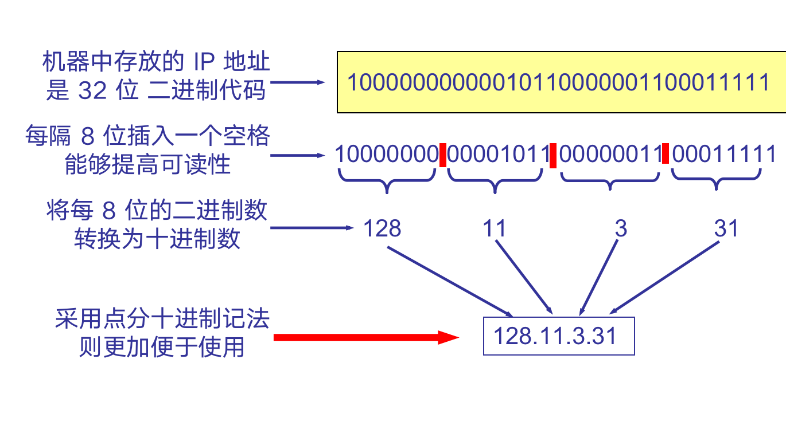

常用的三种类别的 IP 地址

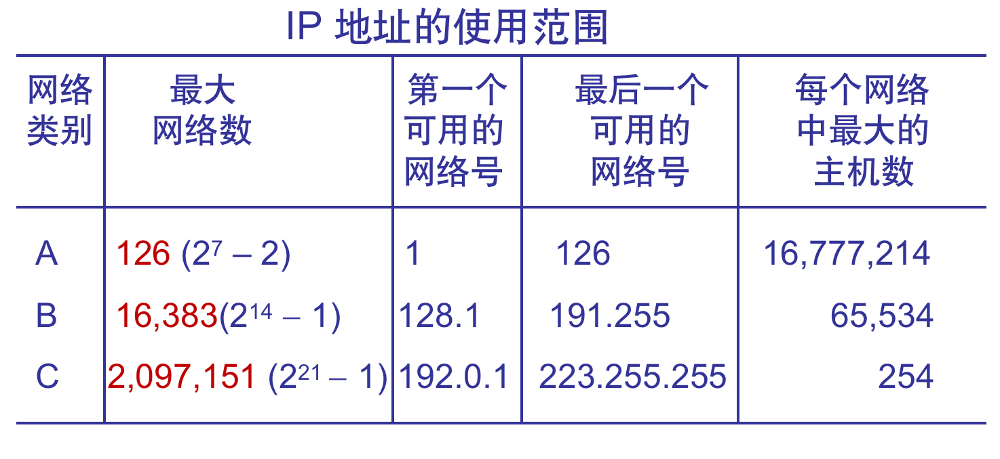

(1) IP 地址是一种分等级的地址结构。分两个等级的好处是：  
第一，IP 地址管理机构在分配 IP 地址时只分配网络号，而剩下的主机号则由得到该网络号的单位自行分配。这样就方便了 IP 地址的管理。  
第二，路由器仅根据目的主机所连接的网络号来转发分组（而不考虑目的主机号），这样就可以使路由表中的项目数大幅度减少，从而减小了路由表所占的存储空间。  

(2) 实际上 IP 地址是标志一个主机（或路由器）和一条链路的接口。  
当一个主机同时连接到两个网络上时，该主机就必须同时具有两个相应的 IP 地址，其网络号 net-id 必须是不同的。这种主机称为多归属主机(multihomed host)。  
由于一个路由器至少应当连接到两个网络（这样它才能将 IP 数据报从一个网络转发到另一个网络），因此一个路由器至少应当有两个不同的 IP 地址。  

(3) 用转发器或网桥连接起来的若干个局域网仍为一个网络，因此这些局域网都具有同样的网络号 net-id。  
(4) 所有分配到网络号 net-id 的网络，无论是范围很小的局域网，还是覆盖很大地理范围的广域网，都是平等的。  

#### 特殊地址

特殊IP地址  
0.0.0.0：			本主机  
00…00主机：		本网中的主机  
255.255.255.255：		局域网中的广播  
网络11…11：		对一个远程网的广播  
127.x.y.z：			回路测试或C/S环境S的地址  
A、B、C类三段私有地址：  
10.0.0.0~10.255.255.255/8；172.16.0.0~172.31.255.255/12； 192.168.0.0 ~255.255/16  

### IP 地址与硬件地址

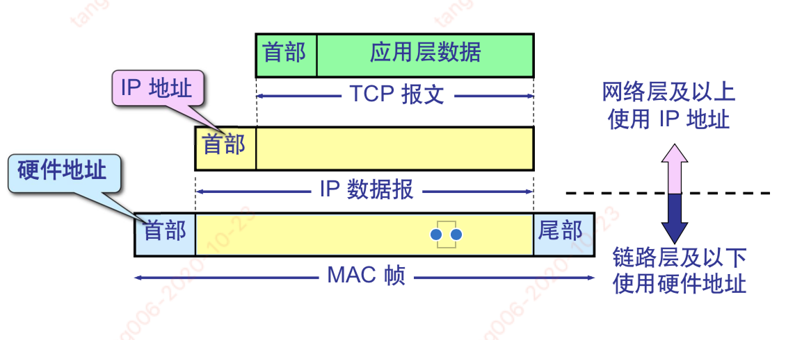

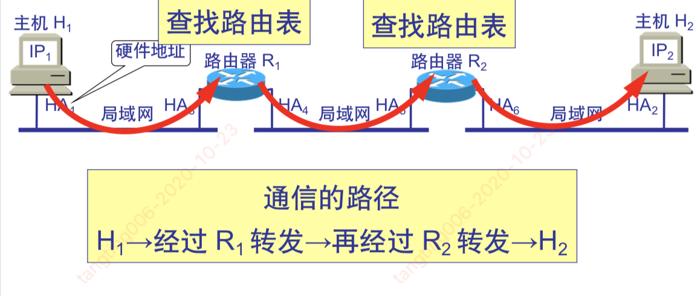

### 地址解析协议 ARP

不管网络层使用的是什么协议，在实际网络的链路上传送数据帧时，最终还是必须使用硬件地址。  
每一个主机都设有一个 ARP 高速缓存(ARP cache)，里面有所在的局域网上的各主机和路由器的 IP 地址到硬件地址的映射表。  
当主机 A 欲向本局域网上的某个主机 B 发送 IP 数据报时，就先在其 ARP 高速缓存中查看有无主机 B 的 IP 地址。如有，就可查出其对应的硬件地址，再将此硬件地址写入 MAC 帧，然后通过局域网将该 MAC 帧发往此硬件地址。  

ARP 高速缓存的作用  

- 为了减少网络上的通信量，主机 A 在发送其 ARP 请求分组时，就将自己的 IP 地址到硬件地址的映射写入 ARP 请求分组。  

- 当主机 B 收到 A 的 ARP 请求分组时，就将主 机 A 的这一地址映射写入主机 B 自己的 ARP 高速缓存中。这样，以后主机 B 向 A 发送数据报时就直接使用该缓存中的记录，不必每次都要发送查询请求了。  

应当注意的问题  

- ARP 是解决同一个局域网上的主机或路由器的IP 地址和硬件地址的映射问题。  

- 如果所要找的主机和源主机不在同一个局域网上，那么就要通过 ARP 找到一个位于本局域网上的某个路由器的硬件地址，然后把分组发送给这个路由器，让这个路由器把分组转发给下一个网络。剩下的工作就交由下一个网络来做。  

- 从IP地址到硬件地址的解析是自动进行的，主机的用户对这种地址解析过程是不知道的。

- 只要主机或路由器要和本网络上的另一个已知 IP 地址的主机或路由器进行通信，ARP 协议就会自动地将该 IP 地址解析为链路层所需要的硬件地址。

#### 使用 ARP 的四种典型情况

1. 发送方是主机，要把IP数据报发送到本网络上的另一个主机。这时用 ARP 找到目的主机的硬件地址。
2. 发送方是主机，要把 IP 数据报发送到另一个网络上的一个主机。这时用 ARP 找到本网络上的一个路由器的硬件地址。剩下的工作由这个路由器来完成。
3. 发送方是路由器，要把 IP 数据报转发到本网络上的一个主机。这时用 ARP 找到目的主机的硬件地址。
4. 发送方是路由器，要把 IP 数据报转发到另一个网络上 的一个主机。这时用 ARP 找到本网络上另一个路由器 的硬件地址。剩下的工作由这个路由器来完成。

### IP 数据报的格式

- 一个 IP 数据报由首部和数据两部分组成。
- 首部的前一部分是固定长度，共 20 字节，是所有IP数据报必须具有的。
- 在首部的固定部分的后面是一些可选字段，其长度是可变的。

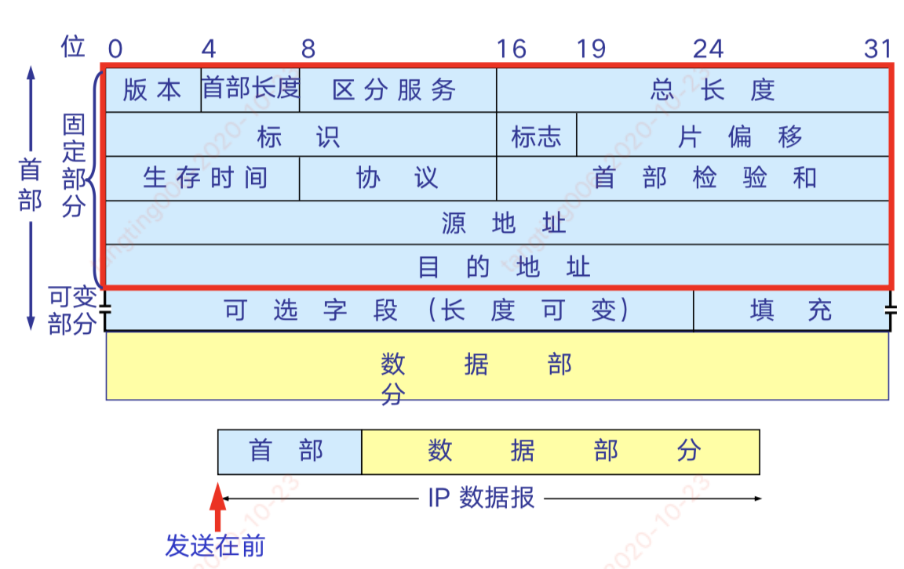

### 划分子网

划分子网纯属一个单位内部的事情。单位对外仍然表现为没有划分子网的网络。  
从主机号借用若干个位作为子网号 subnet-id，而主 机号 host-id 也就相应减少了若干个位。  

IP地址 ::= {<网络号>, <子网号>, <主机号>}  

当没有划分子网时，IP 地址是两级结构。  
划分子网后 IP 地址就变成了三级结构。  
划分子网只是把 IP 地址的主机号 host-id 这部分进行再划分，而不改变 IP 地址原来的网络号 net-id。  

#### 子网掩码的概述及作用

子网掩码是一个应用于TCP/IP网络的32位二进制值，每节8位，必须结合IP地址对应使用。 （常见的 255.255.255.0 等）

子网掩码32位都与IP地址32位对应，如果某位是网络地址，则子网掩码为1，否则为0。 (11111111.11111111.11111111.0)

子网掩码可以通过与IP地址 “与”计算，分离出IP地址中的网络地址和主机地址，用于判断该IP地址是在局域网上，还是在广域网上。

子网掩码一般用于将网络进一步划分为若干子网，以避免主机过多而拥堵或过少而IP浪费。

#### 为什么要使用子网掩码

子网掩码可以分离出IP地址中的网络地址和主机地址，那为什么要分离呢？

因为两台计算机要通讯，首先要判断是否处于同一个广播域内，即网络地址是否相同。如果网络地址相同，表明接受方在本网络上，那么可以把数据包直接发送到目标主机，否则就需要路由网关将数据包转发送到目的地。

比如说我们本机ip与子网掩码计算出一个网络地址为 x.x.x.x

另一个ip地址与子网掩码计算出一个网络地址为 y.y.y.y

如果 x.x.x.x 与 y.y.y.y 相等，那么这两个主机可以ping通

#### 子网掩码的分类

##### 缺省子网掩码

(未划分子网)

子网掩码32位与IP地址32位对应,如果某位是网络地址，则子网掩码为1，否则为0。例如A类IP地址，第一节为网络地址，其余三节为主机地址，故掩码为“11111111.00000000.00000000.00000000”  

A类网络缺省子网掩码：255.0.0.0  
B类网络缺省子网掩码：255.255.0.0  
C类网络缺省子网掩码：255.255.255.0  

##### 自定义子网掩码

(用于划分子网)

将一个网络划分为若干子网，希望每个子网拥有不同的网络地址或子网地址。因为 IP 是有限的，实际上我们是将主机地址分为两个部分：子网网络地址、子网主机地址。形式如下：

未做子网划分的ip地址：网络地址＋主机地址  
做子网划分后的ip地址：网络地址＋（子网网络地址＋子网主机地址）  

#### 子网掩码和ip地址的关系

子网掩码是用来判断任意两台计算机的IP地址是否属于同一子网络的根据。具体说就是两台计算机各自的IP地址与子网掩码进行“与”运算后，如果得出的结果是相同的，则说明这两台计算机是处于同一个子网络上的，可以进行直接的通讯。

例如：设IP地址为192.168.10.2，子网掩码为255.255.255.240，那么子网掩码是怎样来区分网络地址和主机地址的呢。

主机地址为：0.0.0.2（将掩码取反，然后与运算）

#### 为什么要要划分子网

例如：在A类IP地址中，每个A类网络可能有16，777，214台主机，它们处于同一广播域。在同一广播域中有这么多主机是不可能的，网络会因为广播通信而饱和。另一方面，IP地址资源越来越少。为实现更小的广播域，就需要进一步分成更小的网络。划分子网后，通过使用掩码，把子网隐藏起来，使得从外部看网络没有变化，这就是子网掩码。

#### 子网划分

子网划分是通过借用IP地址中若干位主机地址来充当子网的网络地址，从而将原网络划分为若干子网。

划分子网时，随着子网地址借用主机位数的增多，子网的数目随之增加，但每个子网中的可用主机数逐渐减少。

如C类地址，原有8位主机位，​-2即254个主机地址，默认子网掩码255.255.255.0。(全0或全1不可用） 借用1位主机位，产生​2个子网，每个子网有2^7个主机地址； 借用2位主机位，产生​4个子网，每个子网有2^6个主机地址; …… 根据子网ID借用的主机位数，我们可以计算出划分的子网数、掩码、每个子网主机数，列表如下：

C 类IP 地址子网划分  

|借用位数 | 子网掩码 | 子网个数 | 每个子网中主机数 |
| --- | --- | --- | --- |
| 1 | 255.255.255.128 | | 2^(8-1) - 2 = 126 |
| 2 | 255.255.255.192 | | 2^(8-2) - 2 = 62 |
| 3 | 255.255.255.224 | | 30 |
| 4 | 255.255.255.240 | | 14 |
| 5 | 255.255.255.248 | | 6 |
| 6 | 255.255.255.252 | | 2 |
| 7 | 255.255.255.254 | | 0 |

B类IP 地址子网划分

|借用位数 | 子网掩码 | 子网个数 | 每个子网中主机数 |
| --- | --- | --- | --- |
| 1 | 255.255.128.0 | | 2^(16-1) - 2 = 32768-2=32766 |
| 2 | 255.255.192.0 | | 2^(16-2) - 2 = 16382 |
| 3 | 255.255.224.0 | | 8190 |
| 4 | 255.255.240.0 | | 4094 |
| 5 | 255.255.248.0 | | 2046 |
| 6 | 255.255.252.0 | | 1022 |
| 7 | 255.255.254.0 | | 510 |
| 8 | 255.255.254.0 | | 254 |

A类IP地址子网划分

|借用位数 | 子网掩码 | 子网个数 | 每个子网中主机数 |
| --- | --- | --- | --- |
| 2 | 255.192.0.0 | | 4194302 |
| 3 | 255.224.0.0 | | 2097150 |
| 4 | 255.240.0.0 | | 1048574 |
| 5 | 255.248.0.0 | | 524286 |
| 6 | 255.252.0.0 | | 262142 |
| 7 | 255.254.0.0 | | 131070 |
| 8 | 255.254.0.0 | | 65534 |

#### 子网掩码计算

##### 1、利用子网数来计算

1) 将子网数目转化为二进制来表示  
2) 取得该二进制的位数，为 N  
3) 取得该 IP地址的类子网掩码，将其主机地址部分的的前N位置 1 即得出该IP地址划分子网的子网掩码。  

如欲将C类IP地址192.168.10.0划分成4个子网：  
1)4=100  
2)该二进制为三位数，N = 3  
3)将A类地址的子网掩码255.255.255.0的主机地址前3位置 1，得到子网掩码255.255.255.224。(具体见下图）

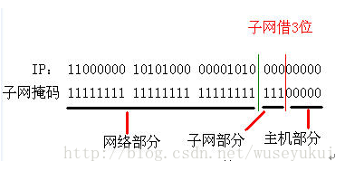

##### 2、利用主机数来计算

1) 将主机数目转化为二进制来表示  
2) 如果主机数小于或等于254（注意去掉保留的两个IP地址），则取得该主机的二进制位数。  
3) 将该类IP地址的主机地址位数全部置1，然后从后向前的将N位全部置为 0，即为子网掩码值。  

如欲将B类IP地址192.168.10.0划分成若干子网，每个子网内有主机25台： 1) 25=11001 2)该二进制为十位数，N = 5 3)将该B类地址的子网掩码 255.255.255.0的主机地址全部置 1，得到255.255.255.255，然后再从后向前将后5位置0，即为：11111111.11111111.11111111.11100000，即255.255.252.224。

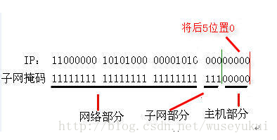

### 无分类编址 CIDR

无类域间路由（Classless Inter-Domain Routing，CIDR）可以将路由集中起来，在路由表中更灵活地定义地址。它不区分 A 类、B 类、C 类地址，而是使用 CIDR 前缀的值指定地址中作为网络 ID 的位数。  

CIDR使用各种长度的“网络前缀”(network- prefix)来代替分类地址中的网络号和子网号。  
IP 地址从三级编址(使用子网掩码)又回到了两级编址。  

无分类的两级编址的记法是:  
IP地址 ::= {<网络前缀>, <主机号>}  

nCIDR 还使用“斜线记法”(slash notation)，它又称为 CIDR记法，即在 IP 地址面加上一个斜线“/”，然后写上网络前缀所占的位数(这个数值对应于三级编址中子网掩码中 1 的个数)。  

CIDR 把网络前缀都相同的连续的 IP 地址组成 “CIDR 地址块”。  

CIDR 把网络前缀都相同的连续的 IP 地址组成“CIDR 地址块”。  

128.14.32.0/20 表示的地址块共有 212 个地址(因为斜线后面的 20 是网络前缀的位数，所以这个地址的机号是 12 位)。  
这个地址块的起始地址是 128.14.32.0。  
在不需要指出地址块的起始地址时，也可将这样的地址块简称为“/20 地址块”。  
128.14.32.0/20 地址块的最小地址:128.14.32.0  
128.14.32.0/20 地址块的最大地址:128.14.47.255 n 全 0 和全 1 的主机号地址一般不使用。  

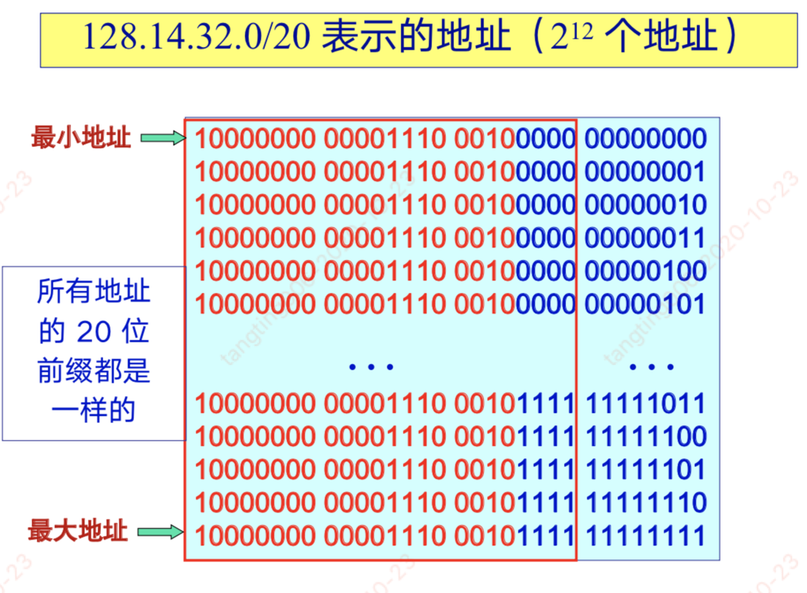

常用的 CIDR 地址块

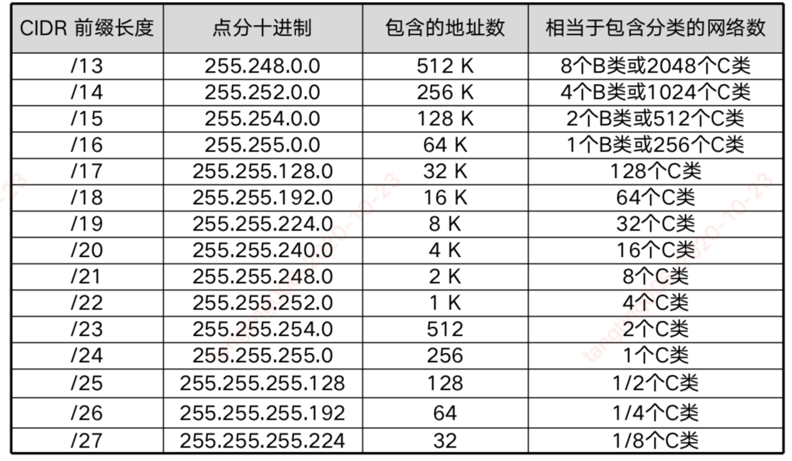

### 网际控制报文协议  

#### ICMP协议是一个网络层协议

一个新搭建好的网络，往往需要先进行一个简单的测试，来验证网络是否畅通；但是IP协议并不提供可靠传输。如果丢包了，IP协议并不能通知传输层是否丢包以及丢包的原因。  
所以我们就需要一种协议来完成这样的功能——ICMP协议。  
ICMP 报文作为 IP 层数据报的数据，加上数据报的首部，组成 IP 数据报发送出去。  
ICMP只能搭配IPv4使用，如果是IPv6的情况下, 需要是用ICMPv6。  

#### ICMP协议的功能

1. 确认IP包是否成功到达目标地址
2. 通知在发送过程中IP包被丢弃的原因

#### ICMP 报文的种类

ICMP 报文的种类有两种，即 ICMP 差错报告报文和ICMP 询问报文。  
ICMP 报文的前 4 个字节是统一的格式，共有三个字段:即类型、代码和检验和。接着的 4 个字节的内容与 ICMP 的类型有关。  

#### ICMP 差错报告报文共有 5 种

终点不可达  
源点抑制(Source quench)  
时间超过  
参数问题  
改变路由(重定向)(Redirect)  

#### 不应发送 ICMP 差错报告报文的几种情况

对 ICMP 差错报告报文不再发送 ICMP 差错报告报文。  
对第一个分片的数据报片的所有后续数据报片都不发送 ICMP 差错报告报文。  
对具有多播地址的数据报都不发送 ICMP 差错报告报文。  
对具有特殊地址(如127.0.0.0 或 0.0.0.0)的数据报 不发送 ICMP 差错报告报文。  

ICMP 询问报文有两种  

1. 回送请求和回答报文
2. 时间戳请求和回答报文

ICMP的应用举例 PING (Packet InterNet Groper 网际包探测器)  
PING 用来测试两个主机之间的连通性。  
PING 使用了 ICMP 回送请求与回送回答报文。  
PING 是应用层直接使用网络层 ICMP 的例子，它没有通过运输层的 TCP 或UDP。  

### 自治系统 AS(Autonomous System)

1. 一组共享相似路由策略并在单一管理域中运行的路由器的集合

2. 可以是运营相同协议的路由器集合，也可以是运行不同路由协议但属于同一个组织机构的路由器集合

3. 每个自治系统都有一个唯一的自治系统编号，由lANA分配

4. 自治系统的编号范围是1-65535,1-65411是注册的Internet编号，65412-65535是专用网络编号

### 内部网关协议 RIP (Routing Information Protocol)

1. 工作原理

路由信息协议 RIP 是内部网关协议 IGP中最先得到广泛使用的协议。  
RIP 是一种分布式的基于距离向量的路由选择协议。  
RIP 协议要求网络中的每一个路由器都要维护从它自己到其他每一个目的网络的距离记录。  

 “距离”的定义  

从一路由器到直接连接的网络的距离定义为1。  
从一个路由器到非直接连接的网络的距离定义 为所经过的路由器数加 1。  
RIP协议中的“距离”也称为“跳数”(hop count)，因为每经过一个路由器，跳数就加1。  
这里的“距离”实际上指的是“最短距离”.  
RIP 认为一个好的路由就是它通过的路由器的数目少，即“距离短”。  
RIP 允许一条路径最多只能包含 15 个路由器。  
“距离”的最大值为16 时即相当于不可达。可见 RIP 只适用于小型互联网。  
RIP 不能在两个网络之间同时使用多条路由。RIP 选择一个具有最少路由器的路由(即最短路由)，哪怕还存在另一条高速(低时延)但路由器较多的路由。  

RIP 协议的三个要点  

仅和相邻路由器交换信息。  
交换的信息是当前本路由器所知道的全部信息 即自己的路由表。  
按固定的时间间隔交换路由信息，例如，每隔 30 秒。  

RIP 协议的优缺点  

RIP 存在的一个问题是当网络出现故障时，要经过比较长的时间才能将此信息传送到所有的路由器。  
RIP 协议最大的优点就是实现简单，开销较小。  
RIP 限制了网络的规模，它能使用的最大距离为 15 (16 表示不可达)。  
路由器之间交换的路由信息是路由器中的完整路由表， 因而随着网络规模的扩大，开销也就增加。  

### OSPF

Open Shortest Path First，开放最短路径优先  

#### OSPF协议基本原理

工作过程：邻居发现、路由交换、路由计算、路由维护

1. 邻居表：记录所有建立了邻居关系的路由器，包括相关描述和邻居状态。会定期的相互发送hello报文来维护，若在一定的周期内没有收到领居回应的hello报文，则认为邻居路由器失效，将它从邻居表中删除

2. 链路状态数据库表（LSDB）：此表里包含了网络拓扑中链路状态的通告。每台路由器在同一个区域内LSDB表一样

3. 路由表：在获得完整LSDB表后，进行SPF算法，形成最优路由加入路由表

#### OSPF 直接用 IP 数据报传送

OSPF 不用 UDP 而是直接用 IP 数据报传送。  
OSPF 构成的数据报很短。这样做可减少路由信息的通信量。  
数据报很短的另一好处是可以不必将长的数据报分片传送。分片传送的数据报只要丢失一个，就无法组装成原来的数据报，而整个数据报就必须重传。  

OSPF 的五种分组类型  
类型1，问候(Hello)分组。  
类型2，数据库描述(Database Description)分组。  
类型3，链路状态请求(Link State Request)分组。  
类型4，链路状态更新(Link State Update)分组，用洪泛法对全网更新链路状态。  
类型5，链路状态确认(Link State Acknowledgment) 分组。  

### 外部网关协议 BGP

BGP全称是Border Gateway Protocol, 边界网关协议.  

BGP 是不同自治系统的路由器之间交换路由信息的协议。  
BGP 较新版本是 2006 年 1 月发表的 BGP-4(BGP第 4 个版本)，即 RFC 4271 ~ 4278。  
可以将 BGP-4 简写为 BGP。  

### 网际组管理协议 IGMP

IGMP协议（Internet Group Management Protocol），用于主机（组播成员）和最后一跳路由器之间，主机通过IGMP向路由器请求加入退出组播组，路由器通过IGMP查询网段中是否还有组播成员；IGMP协议共有三个版本，即IGMPv1、v2 和v3（v1基本以淘汰，我们主要学习v2版本），采用IP封装，协议号为2，TTL值通常为1；  

### 网络地址转换 NAT

Network Address Translation  

当在专用网内部的一些主机本来已经分配到了本地IP地址（即仅在本专用网内使用的专用地址），但现在又想和因特网上的主机通信（并不需要加密）时，可使用NAT方法。  

这种方法需要在专用网连接到因特网的路由器上安装NAT软件。装有NAT软件的路由器叫做NAT路由器，它至少有一个有效的外部全球IP地址。这样，所有使用本地地址的主机在和外界通信时，都要在NAT路由器上将其本地地址转换成全球IP地址，才能和因特网连接。  

NAT的功能：  

NAT不仅能解决了IP地址不足的问题，而且还能够有效地避免来自网络外部的攻击，隐藏并保护网络内部的计算机。把内网的私有地址，转化成外网的公有地址。使得内部网络上的（被设置为私有IP地址的）主机可以访问Internet。  

### IPv6

主要变化如下:

- 更大的地址空间。IPv6 将地址从 IPv4 的 32 位 增 大到了 128 位。  
- 扩展的地址层次结构。  
- 灵活的首部格式。 IPv6 定义了许多可选的扩展首部。  
- 改进的选项。 IPv6 允许数据报包含有选项的控制 信息，其选项放在有效载荷中。  
- 允许协议继续扩充。
- 支持即插即用(即自动配置)。因此 IPv6 不需要 使用 DHCP。
- 支持资源的预分配。 IPv6 支持实时视像等要求， 保证一定的带宽和时延的应用。
- IPv6 首部改为 8 字节对齐。首部长度必须是 8 字 节的整数倍。原来的 IPv4 首部是 4 字节对齐。

IPv6数据报由两大部分组成:  

- 基本首部 (base header)
- 有效载荷 (payload)。有效载荷也称为净负荷。有效载荷允许有 零个或多个扩展首部(extension header)，再后面是数据部分。

IPv6 将首部长度变为固定的 40 字节，称为基本首部。  
把首部中不必要的功能取消了，使得 IPv6 首部的字段数减 少到只有 8 个。  

## 运输层

运输层为应用进程之间提供端到端的逻辑通信。  

### 运输层的主要功能

运输层还要对收到的报文进行差错检测。  
运输层需要有两种不同的运输协议，即面向连接的 TCP 和无连接的 UDP。  

TCP/IP 的运输层有两个不同的协议：  
(1) 用户数据报协议 UDP  (User Datagram Protocol)  
(2) 传输控制协议 TCP (Transmission Control Protocol)  

两个对等运输实体在通信时传送的数据单位叫作运输协议数据单元 TPDU (Transport Protocol Data Unit)。  
TCP 传送的数据单位协议是 TCP 报文段(segment)  
UDP 传送的数据单位协议是 UDP 报文或用户数据报。  

### 用户数据报协议 UDP

UDP 是无连接的，即发送数据之前不需要建立连接。  
UDP 使用尽最大努力交付，即不保证可靠交付，同时也不使用拥塞控制。  
UDP 是面向报文的。UDP 没有拥塞控制，很适合多媒体通信的要求。  
UDP 支持一对一、一对多、多对一和多对多的交互通信。  
UDP 的首部开销小，只有 8 个字节。  

### 面向报文的 UDP

发送方 UDP 对应用程序交下来的报文，在添加首部后就向下交付 IP 层。UDP 对应用层交下来的报文，既不合并，也不拆分，而是保留这些报文的边界。  
应用层交给 UDP 多长的报文，UDP 就照样发送，即一次发送一个报文。  
接收方 UDP 对 IP 层交上来的 UDP 用户数据报，在去除首部后就原封不动地交付上层的应用进程，一次交付一个完整的报文。  
应用程序必须选择合适大小的报文。  

UDP 是面向报文的  

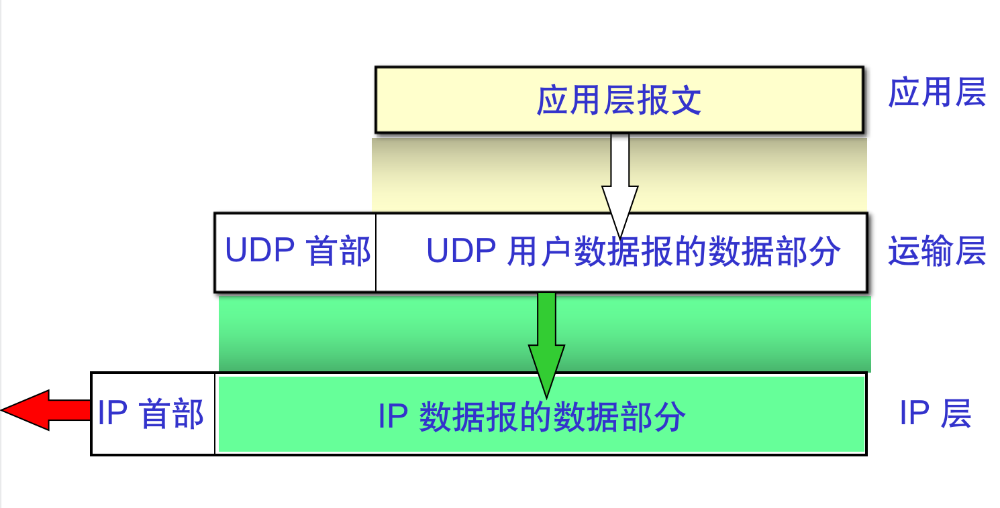

UDP 的首部格式  

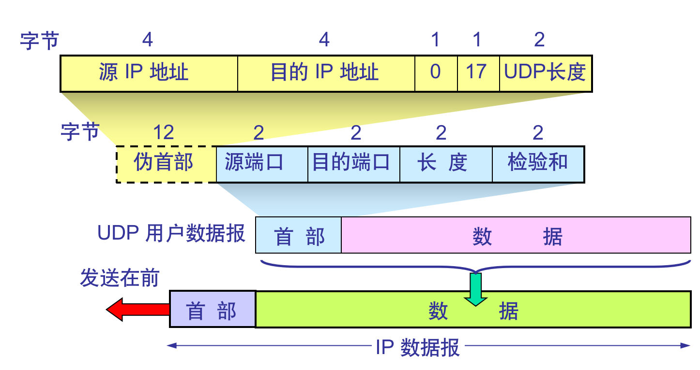

### 传输控制协议 TCP

TCP 是面向连接的运输层协议。  
每一条 TCP 连接只能有两个端点(endpoint)，每一条 TCP 连接只能是点对点的（一对一）。  
TCP 提供可靠交付的服务。  
TCP 提供全双工通信。  
面向字节流。  

TCP 面向流的概念

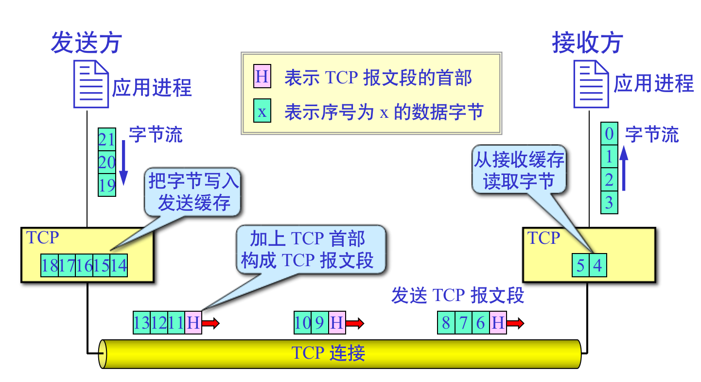

TCP 把连接作为最基本的抽象。  
每一条 TCP 连接有两个端点。  
TCP 连接的端点不是主机，不是主机的IP 地址，不是应用进程，也不是运输层的协议端口。TCP 连接的端点叫做套接字(socket)或插口。  
端口号拼接到(contatenated with) IP 地址即构成了套接字。  

套接字 socket = (IP地址: 端口号)  

每一条 TCP 连接唯一地被通信两端的两个端点（即两个套接字）所确定。即：  

TCP 连接 ::= {socket1, socket2} = {(IP1: port1), (IP2: port2)}  

### 自动重传请求ARQ (Automatic Repeat reQuest)

ARQ 表明重传的请求是自动进行的。接收方不需要请求发送方重传某个出错的分组。  

### 信道利用率

停止等待协议的优点是简单，但缺点是信道利用率太低。

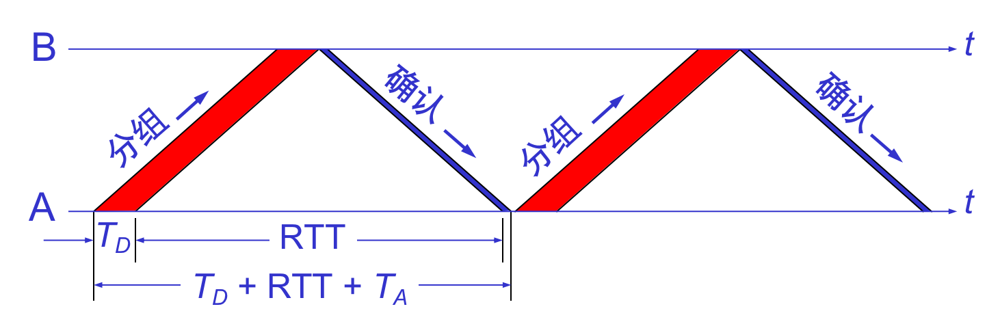

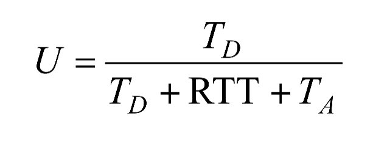

### 连续 ARQ 协议

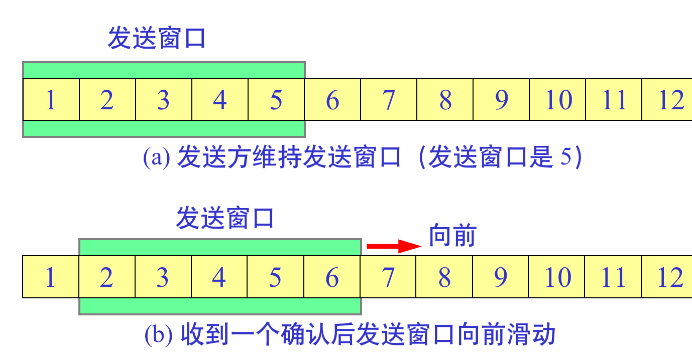

#### 累积确认

接收方一般采用累积确认的方式。即不必对收到的分组逐个发送确认，而是对按序到达的最后一个分组发送确认，这样就表示：到这个分组为止的所有分组都已正确收到了。  
累积确认有的优点是：容易实现，即使确认丢失也不必重传。  
缺点是：不能向发送方反映出接收方已经正确收到的所有分组的信息。  

#### Go-back-N（回退 N）

如果发送方发送了前 5 个分组，而中间的第 3 个分组丢失了。这时接收方只能对前两个分组发出确认。发送方无法知道后面三个分组的下落，而只好把后面的三个分组都再重传一次。  
这就叫做 Go-back-N（回退 N），表示需要再退回来重传已发送过的 N 个分组。  
可见当通信线路质量不好时，连续 ARQ 协议会带来负面的影响。  

#### TCP 可靠通信的具体实现

1. TCP 连接的每一端都必须设有两个窗口——一个发送窗口和一个接收窗口。
2. TCP 的可靠传输机制用字节的序号进行控制。TCP 所有的确认都是基于序号而不是基于报文段。
3. TCP 两端的四个窗口经常处于动态变化之中。
4. TCP连接的往返时间 RTT 也不是固定不变的。需要使用特定的算法估算较为合理的重传时间。  

TCP 报文段的首部格式

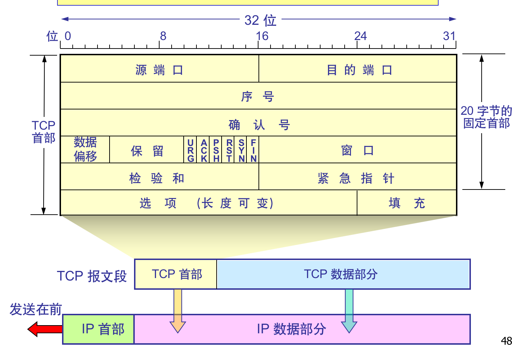

源端口和目的端口字段——各占 2 字节。端口是运输层与应用层的服务接口。运输层的复用和分用功能都要通过端口才能实现。  

序号字段——占 4 字节。TCP 连接中传送的数据流中的每一个字节都编上一个序号。序号字段的值则指的是本报文段所发送的数据的第一个字节的序号。  

确认号字段——占 4 字节，是期望收到对方的下一个报文段的数据的第一个字节的序号。  

数据偏移（即首部长度）——占 4 位，它指出 TCP 报文段的数据起始处距离 TCP 报文段的起始处有多远。“数据偏移”的单位是 32 位字（以 4 字节为计算单位）。  

保留字段——占 6 位，保留为今后使用，但目前应置为 0。  

紧急 URG —— 当 URG = 1 时，表明紧急指针字段有效。它告诉系统此报文段中有紧急数据，应尽快传送(相当于高优先级的数据)。  

确认 ACK —— 只有当 ACK = 1 时确认号字段才有效。当 ACK = 0 时，确认号无效。  

推送 PSH (PuSH) —— 接收 TCP 收到 PSH = 1 的报文段，就尽快地交付接收应用进程，而不再等到整个缓存都填满了后再向上交付。  

复位 RST (ReSeT) —— 当 RST = 1 时，表明 TCP 连接中出现严重差错（如由于主机崩溃或其他原因），必须释放连接，然后再重新建立运输连接。  

同步 SYN —— 同步 SYN = 1 表示这是一个连接请求或连接接受报文。  

终止 FIN (FINis) —— 用来释放一个连接。FIN = 1 表明此报文段的发送端的数据已发送完毕，并要求释放运输连接。  

窗口字段 —— 占 2 字节，用来让对方设置发送窗口的依据，单位为字节。  

检验和 —— 占 2 字节。检验和字段检验的范围包括首部和数据这两部分。在计算检验和时，要在 TCP 报文段的前面加上 12 字节的伪首部。  

紧急指针字段 —— 占 16 位，指出在本报文段中紧急数据共有多少个字节（紧急数据放在本报文段数据的最前面）。  

选项字段 —— 长度可变。TCP 最初只规定了一种选项，即最大报文段长度 MSS。MSS 告诉对方 TCP：“我的缓存所能接收的报文段的数据字段的最大长度是 MSS 个字节。”  

窗口扩大选项 ——占 3 字节，其中有一个字节表示移位值 S。新的窗口值等于TCP 首部中的窗口位数增大到(16 + S)，相当于把窗口值向左移动 S 位后获得实际的窗口大小。  

时间戳选项——占10 字节，其中最主要的字段时间戳值字段（4 字节）和时间戳回送回答字段（4 字节）。  

填充字段 —— 这是为了使整个首部长度是 4 字节的整数倍。  

#### 需要强调三点

A 的发送窗口并不总是和 B 的接收窗口一样大（因为有一定的时间滞后）。  
TCP 标准没有规定对不按序到达的数据应如何处理。通常是先临时存放在接收窗口中，等到字节流中所缺少的字节收到后，再按序交付上层的应用进程。  
TCP 要求接收方必须有累积确认的功能，这样可以减小传输开销。  

### 超时重传时间的选择

重传机制是 TCP 中最重要和最复杂的问题之一。  
TCP 每发送一个报文段，就对这个报文段设置一次计时器。只要计时器设置的重传时间到但还没有收到确认，就要重传这一报文段。  

#### 选择确认 SACK(Selective ACK)

接收方收到了和前面的字节流不连续的两个字节块。  
如果这些字节的序号都在接收窗口之内，那么接收方就先收下这些数据，但要把这些信息准确地告诉发送方，使发送方不要再重复发送这些已收到的数据。  

### TCP 的流量控制

#### 利用滑动窗口实现流量控制

流量控制(flow control)就是让发送方的发送速率不要太快，既要让接收方来得及接收，也不要使网络发生拥塞。  
利用滑动窗口机制可以很方便地在 TCP 连接上实现流量控制。  

流量控制举例

### TCP的拥塞控制

在某段时间，若对网络中某资源的需求超过了该资源所能提供的可用部分，网络的性能就要变坏——产生拥塞(congestion)。
出现资源拥塞的条件：  
             对资源需求的总和 > 可用资源  
若网络中有许多资源同时产生拥塞，网络的性能就要明显变坏，整个网络的吞吐量将随输入负荷的增大而下降。  

#### 拥塞控制与流量控制的关系

拥塞控制所要做的都有一个前提，就是网络能够承受现有的网络负荷。  
拥塞控制是一个全局性的过程，涉及到所有的主机、所有的路由器，以及与降低网络传输性能有关的所有因素。  
流量控制往往指在给定的发送端和接收端之间的点对点通信量的控制。  
流量控制所要做的就是抑制发送端发送数据的速率，以便使接收端来得及接收。  

#### 几种拥塞控制方法

##### 慢开始和拥塞避免

发送方维持一个叫做拥塞窗口 cwnd (congestion window)的状态变量。拥塞窗口的大小取决于网络的拥塞程度，并且动态地在变化。发送方让自己的发送窗口等于拥塞窗口。如再考虑到接收方的接收能力，则发送窗口还可能小于拥塞窗口。  

发送方控制拥塞窗口的原则是：只要网络没有出现拥塞，拥塞窗口就再增大一些，以便把更多的分组发送出去。但只要网络出现拥塞，拥塞窗口就减小一些，以减少注入到网络中的分组数。  

##### 慢开始算法的原理

在主机刚刚开始发送报文段时可先设置拥塞窗口 cwnd = 1，即设置为一个最大报文段 MSS 的数值。  
在每收到一个对新的报文段的确认后，将拥塞窗口加 1，即增加一个 MSS 的数值。  
用这样的方法逐步增大发送端的拥塞窗口 cwnd，可以使分组注入到网络的速率更加合理。  

##### 传输轮次(transmission round)

使用慢开始算法后，每经过一个传输轮次，拥塞窗口 cwnd 就加倍。  
一个传输轮次所经历的时间其实就是往返时间 RTT。  
“传输轮次”更加强调：把拥塞窗口 cwnd 所允许发送的报文段都连续发送出去，并收到了对已发送的最后一个字节的确认。  
例如，拥塞窗口 cwnd = 4，这时的往返时间 RTT 就是发送方连续发送 4 个报文段，并收到这 4 个报文段的确认，总共经历的时间。  

##### 设置慢开始门限状态变量ssthresh

慢开始门限 ssthresh 的用法如下：  
当 cwnd < ssthresh 时，使用慢开始算法。  
当 cwnd > ssthresh 时，停止使用慢开始算法而改用拥塞避免算法。  
当 cwnd = ssthresh 时，既可使用慢开始算法，也可使用拥塞避免算法。  
拥塞避免算法的思路是让拥塞窗口 cwnd 缓慢地增大，即每经过一个往返时间 RTT 就把发送方的拥塞窗口 cwnd 加 1，而不是加倍，使拥塞窗口 cwnd 按线性规律缓慢增长。  

无论在慢开始阶段还是在拥塞避免阶段，只要发送方判断网络出现拥塞（其根据就是没有按时收到确认），就要把慢开始门限 ssthresh 设置为出现拥塞时的发送方窗口值的一半（但不能小于2）。  
然后把拥塞窗口 cwnd 重新设置为 1，执行慢开始算法。  
这样做的目的就是要迅速减少主机发送到网络中的分组数，使得发生拥塞的路由器有足够时间把队列中积压的分组处理完毕。  

慢开始和拥塞避免算法的实现举例

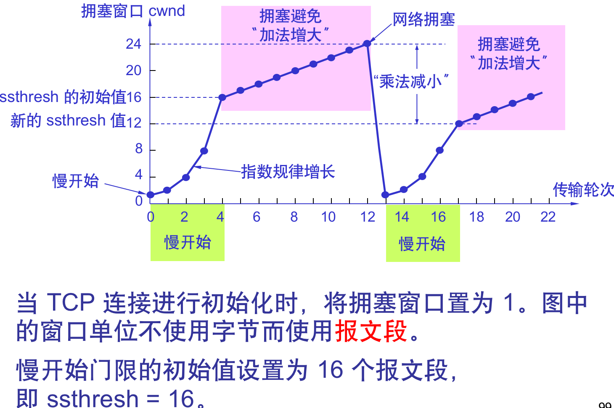

#### 乘法减小(multiplicative decrease)

“乘法减小“是指不论在慢开始阶段还是拥塞避免阶段，只要出现一次超时（即出现一次网络拥塞），就把慢开始门限值 ssthresh 设置为当前的拥塞窗口值乘以 0.5。  
当网络频繁出现拥塞时，ssthresh 值就下降得很快，以大大减少注入到网络中的分组数。  

#### 加法增大(additive increase)

“加法增大”是指执行拥塞避免算法后，在收到对所有报文段的确认后（即经过一个往返时间），就把拥塞窗口 cwnd增加一个 MSS 大小，使拥塞窗口缓慢增大，以防止网络过早出现拥塞。  

#### 快重传和快恢复

快重传算法首先要求接收方每收到一个失序的报文段后就立即发出重复确认。这样做可以让发送方及早知道有报文段没有到达接收方。  
发送方只要一连收到三个重复确认就应当立即重传对方尚未收到的报文段。  
不难看出，快重传并非取消重传计时器，而是在某些情况下可更早地重传丢失的报文段。  

#### 快恢复算法

(1) 当发送端收到连续三个重复的确认时，就执行“乘法减小”算法，把慢开始门限 ssthresh 减半。但接下去不执行慢开始算法。  
(2)由于发送方现在认为网络很可能没有发生拥塞，因此现在不执行慢开始算法，即拥塞窗口 cwnd 现在不设置为 1，而是设置为慢开始门限 ssthresh 减半后的数值，然后开始执行拥塞避免算法（“加法增大”），使拥塞窗口缓慢地线性增大。  

## 应用层

### DNS

#### 域名的解析过程

主机向本地域名服务器的查询一般都是采用递归查询。如果主机所询问的本地域名服务器不知道被查询域名的 IP 地址，那么本地域名服务器就以 DNS 客户的身份，向其他根域名服务器继续发出查询请求报文。  
本地域名服务器向根域名服务器的查询通常是采用迭代查询。当根域名服务器收到本地域名服务器的迭代查询请求报文时，要么给出所要查询的 IP 地址，要么告诉本地域名服务器：“你下一步应当向哪一个域名服务器进行查询”。然后让本地域名服务器进行后续的查询。  

#### 名字的高速缓存

每个域名服务器都维护一个高速缓存，存放最近用过的名字以及从何处获得名字映射信息的记录。  
高速缓存可大大减轻根域名服务器的负荷，使因特网上的 DNS 查询请求和回答报文的数量大为减少。  
为保持高速缓存中的内容正确，域名服务器应为每项内容设置计时器，并处理超过合理时间的项（例如，每个项目只存放两天）。  
当权限域名服务器回答一个查询请求时，在响应中都指明绑定有效存在的时间值。增加此时间值可减少网络开销，而减少此时间值可提高域名转换的准确性。  

### 文件传送协议 FTP  

文件传送协议 FTP (File Transfer Protocol) 是因特网上使用得最广泛的文件传送协议。  
FTP 提供交互式的访问，允许客户指明文件的类型与格式，并允许文件具有存取权限。  
FTP 屏蔽了各计算机系统的细节，因而适合于在异构网络中任意计算机之间传送文件。  
RFC 959 很早就成为了因特网的正式标准。  

#### FTP 的基本工作原理

文件传送协议 FTP 只提供文件传送的一些基本的服务，它使用 TCP 可靠的运输服务。  
FTP 的主要功能是减少或消除在不同操作系统下处理文件的不兼容性。  
FTP 使用客户服务器方式。一个 FTP 服务器进程可同时为多个客户进程提供服务。FTP 的服务器进程由两大部分组成：一个主进程，负责接受新的请求；另外有若干个从属进程，负责处理单个请求。  

#### 主进程的工作步骤如下

打开熟知端口（端口号为 21），使客户进程能够连接上。  
等待客户进程发出连接请求。  
启动从属进程来处理客户进程发来的请求。从属进程对客户进程的请求处理完毕后即终止，但从属进程在运行期间根据需要还可能创建其他一些子进程。  
回到等待状态，继续接受其他客户进程发来的请求。主进程与从属进程的处理是并发地进行。  

控制连接在整个会话期间一直保持打开，FTP 客户发出的传送请求通过控制连接发送给服务器端的控制进程，但控制连接不用来传送文件。  
实际用于传输文件的是“数据连接”。服务器端的控制进程在接收到 FTP 客户发送来的文件传输请求后就创建“数据传送进程”和“数据连接”，用来连接客户端和服务器端的数据传送进程。  
数据传送进程实际完成文件的传送，在传送完毕后关闭“数据传送连接”并结束运行。  

当客户进程向服务器进程发出建立连接请求时，要寻找连接服务器进程的熟知端口(21)，同时还要告诉服务器进程自己的另一个端口号码，用于建立数据传送连接。  
接着，服务器进程用自己传送数据的熟知端口(20)与客户进程所提供的端口号码建立数据传送连接。  
由于 FTP 使用了两个不同的端口号，所以数据连接与控制连接不会发生混乱。  

### 远程终端协议 TELNET

TELNET 是一个简单的远程终端协议，也是因特网的正式标准。  
用户用 TELNET 就可在其所在地通过 TCP 连接注册（即登录）到远地的另一个主机上（使用主机名或 IP 地址）。  
TELNET 能将用户的击键传到远地主机，同时也能将远地主机的输出通过 TCP 连接返回到用户屏幕。这种服务是透明的，因为用户感觉到好像键盘和显示器是直接连在远地主机上。  

### 电子邮件

发送邮件的协议：SMTP  
SMTP 的全称是“Simple Mail Transfer Protocol”，即简单邮件传输协议.它是一组用于从源地址到目的地址传输邮件的规范，通过它来控制邮件的中转方式。SMTP 协议属于 TCP/IP 协议簇，它帮助每台计算机在发送或中转信件时找到下一个目的地。SMTP 服务器就是遵循 SMTP 协议的发送邮件服务器。  

读取邮件的协议：POP3 和 IMAP  
POP3是Post Office Protocol 3的简称，即邮局协议的第3个版本,它规定怎样将个人计算机连接到Internet的邮件服务器和下载电子邮件的电子协议.  
IMAP全称是Internet Mail Access Protocol，即交互式邮件存取协议，它是跟POP3类似邮件访问标准协议之一。  

IMAP 的特点  

- IMAP 最大的好处就是用户可以在不同的地方使用不同的设备（手机、平板电脑、PC机等）随时上网阅读和处理自己的邮件。
- IMAP 还允许收件人只读取邮件中的某一个部分。例如，收到了一个带有视像附件（此文件可能很大）的邮件。为了节省时间，可以先下载邮件的正文部分，待以后有时间再读取或下载这个很长的附件。
- IMAP 的缺点是如果用户没有将邮件复制到自己的 PC 上，则邮件一直是存放在 IMAP 服务器上。因此用户需要经常与 IMAP 服务器建立连接。  

POP3和IMAP的异同  

共同点

1. POP3和IMAP都是接收协议。可以在邮件客户端和电子邮件服务器之间用来访问消息。
2. 二者均可以使用Outlook等客户端邮件程序来管理邮件。  

区别

1. IMAP总是与邮件服务器同步，以便在邮件客户端（Outlook，Foxmail）中做出的任何更改都会立即出现在Webmail收件箱中。
2. 在POP中，邮件客户端帐户和邮件服务器不同步。这意味着在邮件客户端中对电子邮件帐户进行的任何更改都不会被转移到Webmail收件箱。
3. POP3 更容易丢失邮件或多次下载相同的邮件
4. POP3从服务器下载邮件到邮件客户端，并可以配置消息的状态（删除服务器上的消息，或者在指定时间在服务器上保留。
5. 由于IMAP能够在邮件客户端和服务器之间同步消息和文件夹，这在多台计算机和设备上特别有用。比如，在手机上可以查看邮件，在PC上也可以查看邮件，跟踪消息状态。

### 协议配置

在协议软件中给这些参数赋值的动作叫做协议配置。  
一个软件协议在使用之前必须是已正确配置的。  
具体的配置信息有哪些则取决于协议栈。  

需要配置的项目  
   (1) IP 地址  
   (2) 子网掩码  
   (3) 默认路由器的 IP 地址  
   (4) 域名服务器的 IP 地址  
这些信息通常存储在一个配置文件中，计算机在引导过程中可以对这个文件进行存取。  

#### 动态主机配置协议 DHCP(Dynamic Host Configuration Protocol)  

动态主机配置协议 DHCP 提供了即插即用连网(plug-and-play networking)的机制。  
这种机制允许一台计算机加入新的网络和获取IP地址而不用手工参与。  

#### 简单网络管理协议 SNMP

网络管理包括对硬件、软件和人力的使用、综合与协调，以便对网络资源进行监视、测试、配置、分析、评价和控制，这样就能以合理的价格满足网络的一些需求，如实时运行性能，服务质量等。网络管理常简称为网管。  
网络管理并不是指对网络进行行政上的管理。  

## 网络安全

计算机网络上的通信面临以下两大类威胁：

1. 被动攻击。主要是截获，即从网络上窃听他人的通信内容。
2. 主动攻击，主要有：

- 篡改——故意篡改网络上传送的报文。
- 恶意程序—— 包括计算机病毒、计算机蠕虫、特洛伊木马和逻辑炸弹等。
- 拒绝服务——包括分布式拒绝服务。