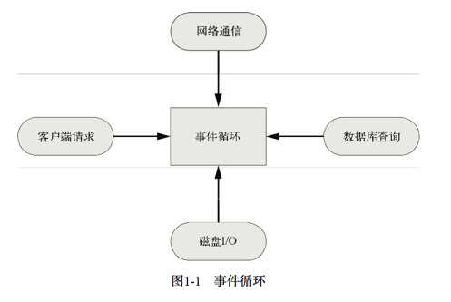

# node

## 0. introduction

- Node，是一个可以让 JavaScript 运行在服务器端的平台。

- 采用了单线程、异步式I/O、事件驱动式的程序设计模型。这些 特性不仅带来了巨大的性能提升，还减少了多线程程序设计的复杂性，进而提高了开发效率。

- Node.js 的 JavaScript 引擎是 V8，来自 Google Chrome 项目。V8 号称是目前世界上最快 的 JavaScript 引擎，经历了数次引擎革命，它的 JIT(Just-in-time Compilation，即时编译) 执行速度已经快到了接近本地代码的执行速度。

- Node.js 能做什么

    + 具有复杂逻辑的网站;
    + 基于社交网络的大规模 Web 应用;
    + Web Socket 服务器;
    + TCP/UDP 套接字应用程序; 
    + 命令行工具;
    + 交互式终端程序;
    + 带有图形用户界面的本地应用程序;
    + 单元测试工具;
    + 客户端 JavaScript 编译器。

### 0.1. 异步式 I/O 与事件驱动

- 传统多线程:为每个业务逻辑提供一个系统线程，通过系统线程切 换来弥补同步式 I/O 调用时的时间开销。

- 对于 高并发的访问，一方面线程长期阻塞等待，另一方面为了应付新请求而不断增加线程，因此 会浪费大量系统资源，同时线程的增多也会占用大量的 CPU 时间来处理内存上下文切换， 而且还容易遭受低速连接攻击。

- Node.js 使用的是单线程模型，对于所有 I/O 都采用 异步式的请求方式，避免了频繁的上下文切换。

- Node.js 在执行的过程中会维护一个事件队 列，程序在执行时进入事件循环等待下一个事件到来，每个异步式 I/O 请求完成后会被推送 到事件队列，等待程序进程进行处理。

- Node.js 的异步机制是基于事件的，所有的磁盘 I/O、网络通信、数据库查询都以非阻塞的方式请求，返回的结果由事件循环来处理。

- Node.js 进程在同一时 刻只会处理一个事件，完成后立即进入事件循环检查并处理后面的事件。这样做的好处是， CPU 和内存在同一时间集中处理一件事，同时尽可能让耗时的 I/O 操作并行执行。对于低速 连接攻击，Node.js 只是在事件队列中增加请求，等待操作系统的回应，因而不会有任何多 线程开销，很大程度上可以提高 Web 应用的健壮性，防止恶意攻击。




> Example

```js
const http = require('http');

http.createServer(function (req,res) {
    res.writeHead(200,{'Content-Type':'text/html'})
    res.write('<h1>hello</h1>')
    res.end('<p>world</p>')


}).listen(3000);

console.log('http server is running at port 3000');
```


