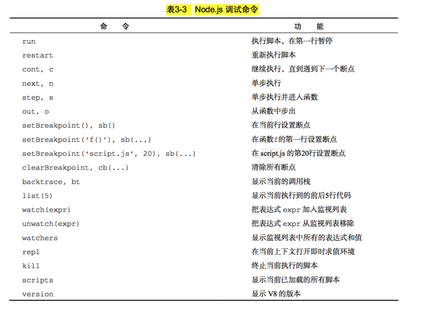

# node

## 0. introduction

### 0.3 调试

#### 0.3.1 命令行调试

- 在命令行下执行 node debug debug.js，将会启动调试工具:



#### 0.3.2 远程调试

- V8 提供的调试功能是基于 TCP 协议的，因此 Node.js 可以轻松地实现远程调试。

- 在命令行下使用以下两个语句之一可以打开调试服务器:

```js
node --debug[=port] script.js 
node --debug-brk[=port] script.js
```
- node --debug 命令选项可以启动调试服务器，默认情况下调试端口是 5858，也可以 使用 --debug=1234 指定调试端口为 1234。

- 使用 --debug 选项运行脚本时，脚本会正常 执行，但不会暂停，在执行过程中调试客户端可以连接到调试服务器。

- 如果要求脚本暂停执 行等待客户端连接，则应该使用 --debug-brk 选项。这时调试服务器在启动后会立刻暂停 执行脚本，等待调试客户端连接。

#### 0.3.3 使用 Eclipse 调试 Node.js

#### 0.3.4 使用 node-inspector 调试 Node.js

- node-inspector 是一个完全基于 Node.js 的开源在线调试工具，提供了强大的调试功能和友好 的用户界面，它的使用方法十分简便。

-  npm install -g node-inspector 命令安装

- 
首先，使用 npm install -g node-inspector 命令安装 node-inspector，然后在终 端中通过 node --debug-brk=5858 debug.js 命令连接你要除错的脚本的调试服务器， 启动 node-inspector:

- 启动 node-inspector:node-inspector

- 在浏览器中打开 http://127.0.0.1:8080/debug?port=5858，即可显示出优雅的 Web 调试工 具


