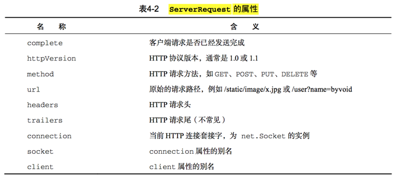

# node

## 0. introduction

### 0.8 HTTP 服务器与客户端

- Node.js 标准库提供了 http 模块，其中 装了一个高 的 HTTP 服务器和一个简易的 HTTP   端。http.Server 是一个基于事件的 HTTP 服务器，它的核心由 Node.js 下层 C++ 部分实现，而接口由 JavaScript  装，兼 了高性能与简易性。http.request 则是一个 HTTP   端工具，用于  HTTP 服务器发 请求.

#### 0.8.1 HTTP 服务器

>Example

```js
const http = require('http');

http.createServer((req,res)=>{
    res.writeHead(200,{'Content-Type':'text/html'});
    res.write('<h1>hello world</h1>')
    res.end('<p>hello node</p>')
}).listen(3000);

console.log('http server is listening at port 3000');
```

**1. http.Server的事件**

- http.Server 是一个基于事件的 HTTP 服务器，所有的请求都被封装为独立的事件， 开发者只需要对它的事件编写响应函数即可实现 HTTP 服务器的所有功能。它继承自 EventEmitter，提供了以下几个事件。

  + request: 当客户端请求到来时，该事件被触发，提供两个参数 req 和res，分别是 http.ServerRequest和http.ServerResponse 的实例，表示请求和响应信息。
  + connection: 当TCP连接建立时，该事件被触发，提供一个参数 socket，为 net.Socket 的实例。connection 事件的粒度要大于 request，因为客户端在 Keep-Alive 模式下可能会在同一个 连接内发送多次请求。
  + close : 服务器关闭时，该事件被触发。注意不是在用户连接断开时。
  
>Example
  
```js
const http = require('http');

const server = new http.Server();

server.on('request',(req,res)=>{
    res.writeHead(200,{'Content-Type':'text/html'});
    res.write('<h1>hello world1</h1>')
    res.end('<p>hello node1</p>')
}).listen(3000);
console.log('http server is listening at port 3000');
```  

**2. http.ServerRequest**

- http.ServerRequest 是 HTTP 请求的信息

- HTTP 请求一般可以分为两部分:请求头(Request Header)和请求体(Requset Body)。 以上内容由于长度较短都可以在请求头解析完成后立即读取。而请求体可能相对较长， 需要一定的时间传输，因此 http.ServerRequest 提供了以下3个事件用于控制请求体传输。

  + data :当请求体数据到来时，该事件被触发。该事件提供一个参数 chunk，表示接收到的数据。如果该事件没有被监听，那么请求体将会被抛弃。该事件可能会被调用多次。
  + end : 请求体数据传输完成时，该事件被触发，此后将不会再有数据到来。
  + close: 用户当前请求结束时，该事件被触发。不同于 end，如果用户强制终止了传输，也还是调用close。
  


**3. 获取GET请求内容**

- 由于 GET 请求直接被嵌入在路径中，URL是完整的请求路径，包括了 ? 后面的部分，因此你可以手动解析后面的内容作为 GET 请求的参数。Node.js 的 url 模块中的 parse 函数提供了这个功能。

>Example 

```js
const http = require('http');
const url = require('url');
const util = require('util');

http.createServer((req,res)=>{
    res.writeHead(200,{'Content-Type':'text/plain'});
    res.end(util.inspect(url.parse(req.url,true)));
}).listen(3000);
//浏览器中输入http://localhost:3000/mail?sid=j4K1GWc-mi_9V38m,2&r=151470e2aaa0e4b36409aa30b64a3817
/*
Url {
    protocol: null,
        slashes: null,
        auth: null,
        host: null,
        port: null,
        hostname: null,
        hash: null,
        search: '?sid=j4K1GWc-mi_9V38m,2&r=151470e2aaa0e4b36409aa30b64a3817',
        query:
    { sid: 'j4K1GWc-mi_9V38m,2',
        r: '151470e2aaa0e4b36409aa30b64a3817' },
    pathname: '/mail',
        path: '/mail?sid=j4K1GWc-mi_9V38m,2&r=151470e2aaa0e4b36409aa30b64a3817',
        href: '/mail?sid=j4K1GWc-mi_9V38m,2&r=151470e2aaa0e4b36409aa30b64a3817' }*/

```

- 通过 url.parse1，原始的 path 被解析为一个对象，其中 query 就是我们所谓的 GET 请求的内容，而路径则是 pathname。

**4.获取POST请求内容**

- POST 请求的内容全部都在请求体中。 http.ServerRequest 并没有一个属性内容为请求体，原因是等待请求体传输可能是一件耗时的工作，譬如上传文件。

- 而很多时候我们可能并不需要理会请求体的内容，恶意的 POST 请求会大大消耗服务器的资源。所以 Node.js默认是不会解析请求体的，当你需要的时候， 需要手动来做。

**5. http.ServerResponse**

- http.ServerResponse 是返回给客户端的信息，决定了用户最终能看到的结果。它也是由 http.Server 的 request 事件发送的，作为第二个参数传递，一般简称为 response 或 res。

- http.ServerResponse 有3个重要的成员函数，用于返回响应头、 响应内容以及结束请求。
  + response.writeHead(statusCode, [headers]): 向请求的客户端发响应头。 statusCode 是 HTTP状态码，如 200 (请求成功)、404 ( 找到)等。headers 是一个类似关联数组的对象，表示响应头的每个属性。该函数在一个请求内最多只能调用一次，如果不调用，则会自动生成一个响应头。
  + response.write(data, [encoding]): 请求的客户端发送响应内容。data 是 一个 Buffer 或字符串，表示要发送的内容。如果 data 是字符床，那么需要指定 encoding 来说明它的编码方式，默认是 utf-8。在 response.end 调用之前， response.write 可以被多次调用。
  + response.end([data], [encoding]):结束响应，告知客户端所有发送已经完成。 当所有要返回的内容发送完毕的时侯，该函数必须被调用一次。它接受两个可选参数，意义和 response.write相同。如果不调用该函数，客户端将永远处于等待状态。
  
  
#### 0.8.2 HTTP 客户端

- http 模块提供了两个函数 http.request 和 http.get，功能是作为客户端向HTTP 服务器发送请求。

- http.request(options, callback) 发起HTTP 请求。接受两个参数，option 是一个类似关联数组的对象，表示请求的参数，callback 是请求的回调函数。option 常用的参数如下所示。

    + host :请求网站的域名或 IP 地址。
    + port :请求网站的端口，默认80。
    + method :请求方法，默认是 GET。
    + path:请求的相对于根的路径，默认是 / 。QueryString 应该包含在其中。
    + headers:一个关联数组对象，为请求头的内容。
    
- callback 传递一个参数，为http.ClientResponse的实例。
- http.request  返回一个http.ClientRequest的实例。
    
>Example

```js
const http = require('http');
const querystring = require('querystring');

const contents = querystring.stringify({
    name: 'abc',
    email: '133@11.com',
    address: '南京西路699号',
})

const options = {
    host: 'www.baidu.com',
    path: '/application/node/post.php',
    method: 'POST',
    headers: {
        'Content-Type': 'application/x-www-form-urlencoded',
        'Content-Length': contents.length
    }
}

let req = http.request(options, res => {
    res.setEncoding('utf8');
    res.on('data', data => {
        console.log(data);
    })
});

req.write(contents);
req.end();

/*<!DOCTYPE HTML PUBLIC "-//IETF//DTD HTML 2.0//EN">
<html><head>
<title>302 Found</title>
</head><body>
<h1>Found</h1>
<p>The document has moved <a href="http://www.baidu.com/search/error.html">here</a>.</p>
</body></html>*/
```   
- http.get(options, callback) http 模块还提供了一个更加简便的方法用于处理GET请求:http.get。它是 http.request 的简化版，唯一的区别在于http.get自动将请求方法设为了 GET 请求，同时不需要手动调用 req.end()。

>Example

```js
const http= require('http');

http.get({host:'www.baidu.com'},res=>{
    res.setEncoding('utf8');
    res.on('data',function (data) {
        console.log(data);
    })
})
```

**1. http.ClientRequest**

- http.ClientRequest 是由 http.request 或 http.get 返回产生的对象，表示一个已经产生而且正在进行中的 HTTP 请求。它提供一个 response 事件，即 http.request 或 http.get 第二个参数指定的回调函数的绑定对象。我们也可以显式地绑定这个事件的监听函数:

- http.ClientRequest像http.ServerResponse 一样也提供了 write 和 end 函数，用于向服务器发送请求体，通常用于 POST、PUT 等操作。所有写结束以后必须调用 end 函数以通知服务器， 则请求无效。http.ClientRequest 还提供了以下函数。

    + request.abort():终 正在发 的请求。
    + request.setTimeout(timeout, [callback]):设置请求超时时间，timeout 为毫秒数。 请求超时以后，callback 将会被调用。

**2. http.ClientResponse**

- http.ClientResponse 与 http.ServerRequest相似，提供了三个事件 data、end和 close，分别在数据到达、传输结束和连接结束时触发，其中 data 事件传递一个参数 chunk，表示接收到的数据。

- ClientResponse的属性

    + statusCode HTTP状态码，如 200、404、500 
    + httpVersion HTTP 协议版本，通常是 1.0 或 1.1
    + headers  HTTP 请求头
    + trailers  HTTP 请求尾 (不常见)
    
- http.ClientResponse 还提供了以下几个特殊的函数。
    + response.setEncoding([encoding]):设置默认的编码，当data 事件被触发时，数据将会以 encoding 编码。默认值是 null，即不编码，以 Buffer 的形式存储，常用编码为 utf8。
    + response.pause(): 暂停接收数据和发送事件，方便实现下载功能。
    + response.resume():从暂停的状态中恢复。    
     
     
     


 
 