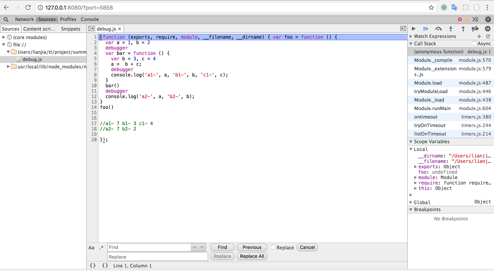

## 1. node debug

### 1.1. 打日志

1. console.log()
2. console.error()


### 1.2. [Node.js的调试器 debugger](https://nodejs.org/api/debugger.html)

Nodejs提供了一个内建调试器来帮助开发者调试应用程序。想要开启调试器我们需要在代码中加入debugger标签，当Nodejs执行到debugger标签时会自动暂停

> 使用方法：

- 在程序中添加断点：在行中添加debugger;

- 运行程序的方式是：在执行命令中添加debug:例如：node debug debug.js
  
代码debug.js

```js
var foo = function () {
  var a = 1, b = 2
  debugger
  var bar = function () {
    var b = 3, c = 4
    a =  b + c;
    debugger
    console.log('a1-', a, 'b1-', b, 'c1-', c);
  }
  bar()
  debugger
  console.log('a2-', a, 'b2-', b);
}
foo()
```

执行命令：首先在执行命令中添加debug，如node debug debug.js;首先执行cont，进入第一个断点，然后运行命令repl，后就可以对变量的值进行查询;然后可使用ctrl+c, 退出此次的查询，然后在用cont，进入下一个断点，输入repl，依然可以查询第二个断点之前的变量的值，然后依次类推，进入到程序结束

运行结果

```node
node git:(master) ✗ node debug debug.js
< Debugger listening on [::]:5858
connecting to 127.0.0.1:5858 ... ok
break in debug.js:1
> 1 var foo = function () {
  2   var a = 1, b = 2
  3   debugger
debug> cont
break in debug.js:3
  1 var foo = function () {
  2   var a = 1, b = 2
> 3   debugger
  4   var bar = function () {
  5     var b = 3, c = 4
debug> repl
Press Ctrl + C to leave debug repl
debug> 
(To exit, press ^C again or type .exit)
debug> cont
break in debug.js:7
  5     var b = 3, c = 4
  6     a =  b + c;
> 7     debugger
  8     console.log('a1-', a, 'b1-', b, 'c1-', c);
  9   }
debug> repl
Press Ctrl + C to leave debug repl
debug> 
(To exit, press ^C again or type .exit)
debug> cont
< a1- 7 b1- 3 c1- 4
break in debug.js:11
  9   }
 10   bar()
>11   debugger
 12   console.log('a2-', a, 'b2-', b);
 13 }
debug> repl
Press Ctrl + C to leave debug repl
debug> 
(To exit, press ^C again or type .exit)
debug> cont
< a2- 7 b2- 2
```

> nodeJS 调试命令

|可选项|	用途|
| - | :-: |
|run	|执行脚本,在第一行暂停|
|restart|	重新执行脚本|
|cont, c|	继续执行,直到遇到下一个断点|
|next, n	|单步执行|
|step, s|	单步执行并进入函数|
|out, o	|从函数中步出|
|setBreakpoint(), sb()	|当前行设置断点|
|setBreakpoint(‘f()’), sb(...)	|在函数f的第一行设置断点|
|setBreakpoint(‘script.js’, 20), sb(...)|	在 script.js 的第20行设置断点|
|clearBreakpoint, cb(...)	|清除所有断点|
|backtrace, bt	|显示当前的调用栈|
|list(5)	|显示当前执行到的前后5行代码|
|watch(expr)	|把表达式 expr 加入监视列表|
|unwatch(expr)	|把表达式 expr 从监视列表移除|
|watchers	|显示监视列表中所有的表达式和值|
|repl	|在当前上下文打开即时求值环境|
|kill	|终止当前执行的脚本|
|scripts	|显示当前已加载的所有脚本|
|version	|显示v8版本|

### 1.3. node inspector

全局安装

```
npm install -g node-inspector
```
启动Node Inspector的过程分为两部分：

1. 运行：node --debug-brk debug.js

2. 再开一个终端运行： node-inspector

如果成功，会输出一行信息

```
Node Inspector v1.1.2

Visit http://127.0.0.1:8080/?port=5858 to start debugging.
```
然后在浏览器中访问http://127.0.0.1:8080/?port=5858，就可以debug了


