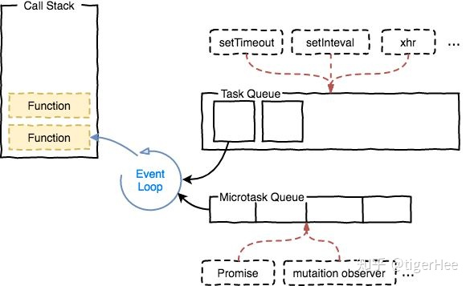
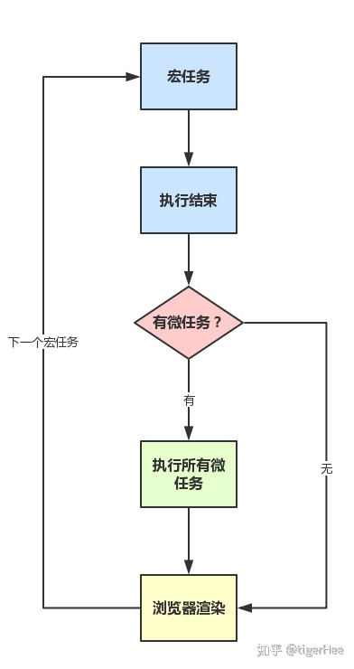
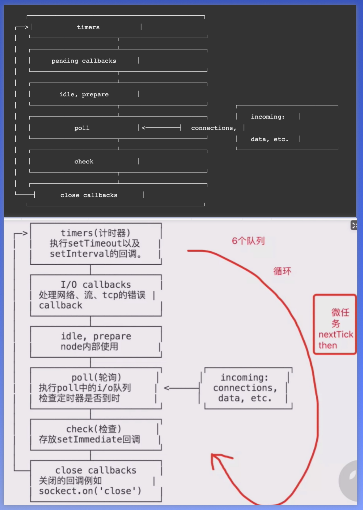

# js 宏任务和微任务

JavaScript 语言的一大特点就是单线程，也就是说，同一个时间只能做一件事。为了协调事件、用户交互、脚本、UI 渲染和网络处理等行为，防止主线程的不阻塞，Event Loop 的方案应用而生。每一个 JavaScript 运行的"线程环境"都有一个独立的 Event Loop，每一个 Web Worker 也有一个独立的 Event Loop。  

事件循环是通过任务队列的机制来进行协调的。一个 Event Loop 中，可以有一个或者多个任务队列(task queue)，一个任务队列便是一系列有序任务(task)的集合；每个任务都有一个任务源(task source)，源自同一个任务源的 task 必须放到同一个任务队列，从不同源来的则被添加到不同队列。setTimeout/Promise 等API便是任务源，而进入任务队列的是他们指定的具体执行任务。  



- JS分为同步任务和异步任务
- 同步任务都在主线程上执行，形成一个执行栈
- 主线程之外，事件触发线程管理着一个任务队列，只要异步任务有了运行结果，就在任务队列之中放置一个事件。
- 一旦执行栈中的所有同步任务执行完毕（此时JS引擎空闲），系统就会读取任务队列，将可运行的异步任务添加到可执行栈中，开始执行。

## 宏任务

浏览器为了能够使得JS内部(macro)task与DOM任务能够有序的执行，会在一个(macro)task执行结束后，在下一个(macro)task 执行开始前，对页面进行重新渲染，流程如下：  

(macro)task->渲染->(macro)task->...  

宏任务包含：  

- script(整体代码)
- setTimeout
- setInterval
- I/O
- UI交互事件
- postMessage
- MessageChannel
- setImmediate(Node.js 环境)

## 微任务

microtask,可以理解是在当前 task 执行结束后立即执行的任务。也就是说，在当前task任务后，下一个task之前，在渲染之前。  

微任务包含：

- Promise.then
- Object.observe
- MutaionObserver
- process.nextTick(Node.js 环境)

## 运行机制

在事件循环中，每进行一次循环操作称为 tick，每一次 tick 的任务处理模型是比较复杂的，但关键步骤如下：

- 执行一个宏任务（栈中没有就从事件队列中获取）
- 执行过程中如果遇到微任务，就将它添加到微任务的任务队列中
- 宏任务执行完毕后，立即执行当前微任务队列中的所有微任务（依次执行）
- 当前宏任务执行完毕，开始检查渲染，然后GUI线程接管渲染
- 渲染完毕后，JS线程继续接管，开始下一个宏任务（从事件队列中获取）



```js
setTimeout( () => console.log(4))

new Promise(resolve => {
  resolve()
  console.log(1)
}).then( () => {
  console.log(3)
})

Promise.resolve(5).then(() => console.log(5))

console.log(2)
```

上面这段代码的运行结果

```text
1
2
3
5
4
```

原因：第一行的 setTimeout 是异步代码，跳过，来到了 new Promise(...) 这一段代码。前面提到过，这种方式是一个构造函数，是一个同步代码，所以执行同步代码里面的函数，即 console.log(1)，接下来是一个 then 的异步，跳过。在往下，是一个Promise.then() 的异步，跳过。最后一个是一段同步代码 console.log(2)。所以，这一轮中我们知道打印了1, 2两个值。接下来进入下一步，即之前我们跳过的异步的代码。从上午下，第一个是 setTimeout，还有两个是 Promise.then()。setTimeout 是宏任务的异步，Promise.then()是微任务的异步，微任务是优先于宏任务执行的，所以，此时会先跳过 setTimeout 任务，执行两个 Promise.then() 的微任务。所以此时会执行 console.log(3) 和 console.log(5) 两个函数。最后就只剩下 setTimeout 函数没有执行，所以最后执行 console.log(4)。  

```js
<div class="outer">
      outer
    <div class="inner">inner</div>
  </div>
  <script>
    var outer = document.querySelector('.outer');
    var inner = document.querySelector('.inner');

    //监听element属性变化
    new MutationObserver(function () {
      console.log('mutate');
    }).observe(outer, {
      attributes: true
    });

    function onClick() {
      console.log('click');

      setTimeout(function () {
        console.log('timeout');
      }, 0);

      Promise.resolve().then(function () {
        console.log('promise');
      });

      outer.setAttribute('data-random', Math.random());
    }

    inner.addEventListener('click', onClick);
    outer.addEventListener('click', onClick);
  </script>
```

inner点击结果如下：

```text
click
promise
mutate
click
promise
mutate
timeout
timeout
```

分发click event是一个宏任务，Mutation observer和promise都会进入微任务队列，setTimeout回调是一个宏任务  

## NodeJS中的EventLoop

虽然NodeJS中的JavaScript运行环境也是V8，也是单线程，但是，还是有一些与浏览器中的表现是不一样的。



```js
setTimeout( () => {
  new Promise(resolve => {
    resolve()
    console.log(4)
  }).then(() => {
    console.log(7)
  })
})

new Promise(resolve => {
  resolve()
  console.log(1)
}).then( () => {
  console.log(3)
})

setTimeout( () => {
  Promise.resolve(6).then(() => console.log(6))
  new Promise(resolve => {
    resolve()
    console.log(8)
  }).then(() => {
    console.log(9)
  })
})

Promise.resolve(5).then(() => console.log(5))

console.log(2)
```

他的执行结果是：1，2，3，5，4，8，7，6，9。  
与浏览器的1，2，3，5，4，7，8，6，9不同。  

### 对比浏览器与NodeJS的不同

在大部分情况下，浏览器与NodeJS的运行没有区别，唯一有区别的是在第二轮事件执行的时候，如果有多个宏任务(setTimeout)，浏览器会依次的执行宏任务，上一个宏任务执行完成了在执行下一个宏任务。在NodeJS中，则是相当于并行执行，相当于把所有的宏任务组合到一个宏任务中，再在这个组合后宏任务中，依次执行同步代码 --> 微任务 --> 宏任务。  

参考：https://cloud.tencent.com/developer/article/1476737  
https://jakearchibald.com/2015/tasks-microtasks-queues-and-schedules/?utm_source=html5weekly  
