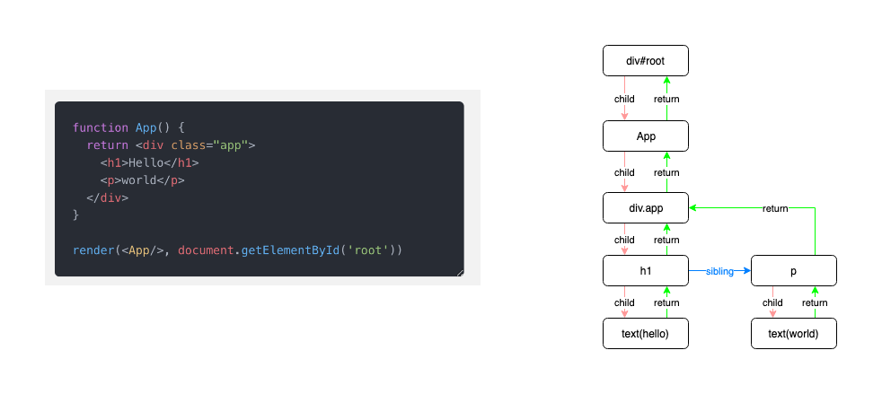
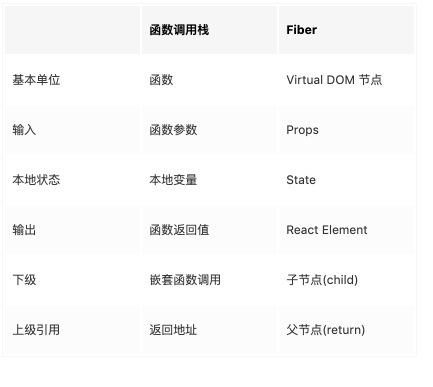
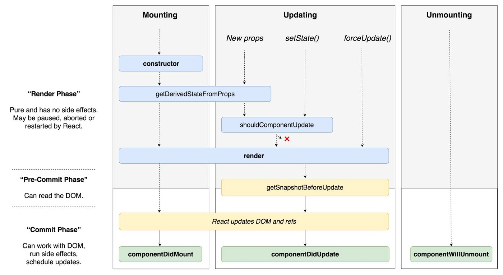
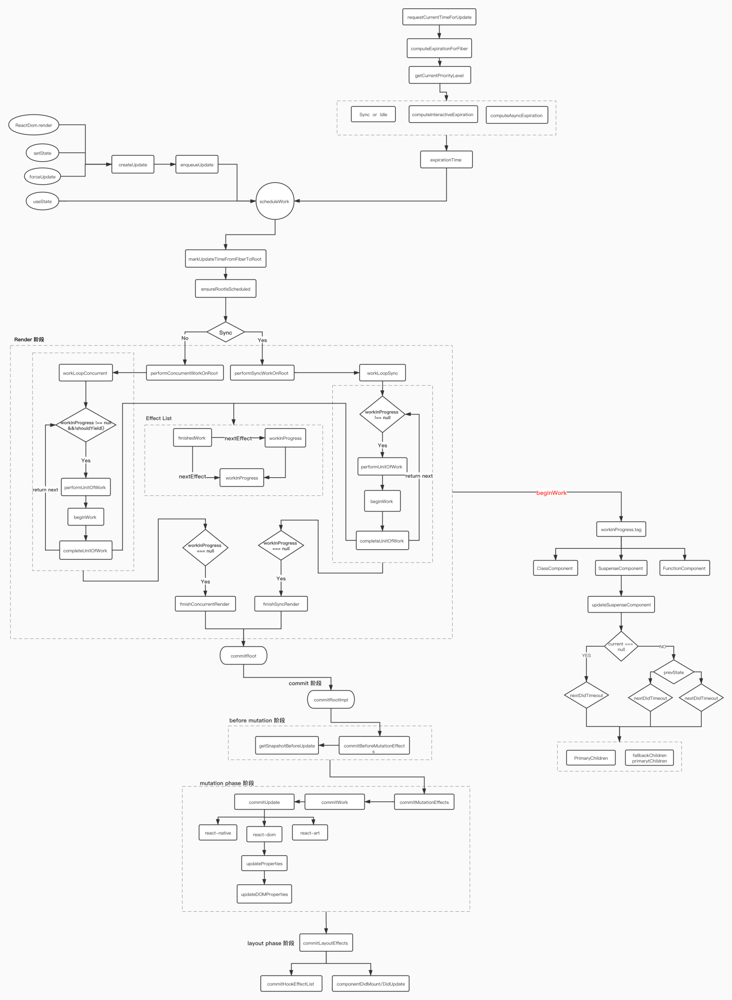

# react fiber reconciler

参考：https://blog.ag-grid.com/inside-fiber-an-in-depth-overview-of-the-new-reconciliation-algorithm-in-react/  

## 为什么需要Fiber

reconsiler的一大功能就是大家熟知的diff，他会计算出应该更新哪些页面节点，然后将需要更新的节点虚拟DOM传递给renderer，renderer负责将这些节点渲染到页面上。但是这个流程有个问题，虽然React的diff算法是经过优化的，但是他却是同步的，renderer负责操作DOM的appendChild等API也是同步的，也就是说如果有大量节点需要更新，JS线程的运行时间可能会比较长，在这段时间浏览器是不会响应其他事件的，因为JS线程和GUI线程是互斥的，JS运行时页面就不会响应，这个时间太长了，用户就可能看到卡顿，特别是动画的卡顿会很明显。  

Fiber所做的就是需要分解渲染任务，然后根据优先级使用API调度，异步执行指定任务：

1. 低优先级任务由requestIdleCallback处理；
2. 高优先级任务，如动画相关的由requestAnimationFrame处理；
3. requestIdleCallback可以在多个空闲期调用空闲期回调，执行任务；
4. requestIdleCallback方法提供deadline，即任务执行限制时间，以切分任务，避免长时间执行，阻塞UI渲染而导致掉帧；

为了避免任务被饿死，可以设置一个超时时间. 这个超时时间不是死的，低优先级的可以慢慢等待, 高优先级的任务应该率先被执行.   

- Immediate(-1) - 这个优先级的任务会同步执行, 或者说要马上执行且不能中断
- UserBlocking(250ms) 这些任务一般是用户交互的结果, 需要即时得到反馈
- Normal (5s) 应对哪些不需要立即感受到的任务，例如网络请求
- Low (10s) 这些任务可以放后，但是最终应该得到执行. 例如分析通知
- Idle (没有超时时间) 一些没有必要做的任务 (e.g. 比如隐藏的内容), 可能会被饿死


## fiber 对象

要的属性如下所示：

```js
Fiber = {
    // 标识 fiber 类型的标签，详情参看下述 WorkTag
    tag: WorkTag,

    // 指向父节点
    return: Fiber | null,

    // 指向子节点
    child: Fiber | null,

    // 指向兄弟节点
    sibling: Fiber | null,

    // 在开始执行时设置 props 值
    pendingProps: any,

    // 在结束时设置的 props 值
    memoizedProps: any,

    // 当前 state
    memoizedState: any,

    // Effect 类型，详情查看以下 effectTag
    effectTag: SideEffectTag,

    // effect 节点指针，指向下一个 effect
    nextEffect: Fiber | null,

    // effect list 是单向链表，第一个 effect
    firstEffect: Fiber | null,

    // effect list 是单向链表，最后一个 effect
    lastEffect: Fiber | null,

    // work 的过期时间，可用于标识一个 work 优先级顺序
    expirationTime: ExpirationTime,
};
```

Fiber 包含的属性可以划分为 5 个部分:

- 结构信息 - Fiber 使用链表的形式来表示节点在树中的定位

- 节点类型信息 - tag表示节点的分类、type 保存具体的类型值，如div、MyComp

- 节点的状态 - 节点的组件实例、props、state等，它们将影响组件的输出

- 副作用 - 这个也是新东西. 在 Reconciliation 过程中发现的'副作用'(变更需求)就保存在节点的effectTag 中(想象为打上一个标记).
那么怎么将本次渲染的所有节点副作用都收集起来呢？ 这里也使用了链表结构，在遍历过程中React会将所有有‘副作用’的节点都通过nextEffect连接起来

- 替身 - React 在 Reconciliation 过程中会构建一颗新的树(官方称为workInProgress tree，WIP树)，可以认为是一颗表示当前工作进度的树。还有一颗表示已渲染界面的旧树，React就是一边和旧树比对，一边构建WIP树的。 alternate 指向旧树的同等节点。



React Fiber 也被称为虚拟栈帧(Virtual Stack Frame), 可以拿它和函数调用栈类比一下, 两者结构非常像:



### tag

文件位置：/packages/shared/ReactWorkTags.js  

用于标识一个 React 元素的类型  

```js
export const FunctionComponent = 0;
export const ClassComponent = 1;
export const IndeterminateComponent = 2; // Before we know whether it is function or class
export const HostRoot = 3; // Root of a host tree. Could be nested inside another node.
export const HostPortal = 4; // A subtree. Could be an entry point to a different renderer.
export const HostComponent = 5;
export const HostText = 6;
export const Fragment = 7;
export const Mode = 8;
export const ContextConsumer = 9;
export const ContextProvider = 10;
export const ForwardRef = 11;
export const Profiler = 12;
export const SuspenseComponent = 13;
export const MemoComponent = 14;
export const SimpleMemoComponent = 15;
export const LazyComponent = 16;
export const IncompleteClassComponent = 17;
export const DehydratedSuspenseComponent = 18;
export const EventComponent = 19;
export const EventTarget = 20;
export const SuspenseListComponent = 21;
```

### EffectTag

文件位置：/packages/shared/ReactSideEffectTags.js  

每一个 fiber 节点都有一个和它相关联的 effectTag 值。  

```js
export const NoEffect = /*              */ 0b000000000000;
export const PerformedWork = /*         */ 0b000000000001;

export const Placement = /*             */ 0b000000000010;
export const Update = /*                */ 0b000000000100;
export const PlacementAndUpdate = /*    */ 0b000000000110;
export const Deletion = /*              */ 0b000000001000;
export const ContentReset = /*          */ 0b000000010000;
export const Callback = /*              */ 0b000000100000;
export const DidCapture = /*            */ 0b000001000000;
export const Ref = /*                   */ 0b000010000000;
export const Snapshot = /*              */ 0b000100000000;
export const Passive = /*               */ 0b001000000000;

export const LifecycleEffectMask = /*   */ 0b001110100100;
export const HostEffectMask = /*        */ 0b001111111111;

export const Incomplete = /*            */ 0b010000000000;
export const ShouldCapture = /*         */ 0b100000000000;
```

### memoizedState

当前 state

### memoizedProps

在结束时设置的 props 值

### pendingProps

在开始执行时设置 props 值

## 算法

执行的两个主要阶段: render阶段 和 commit阶段.  

这是 React 团队作者 Dan Abramov 画的一张生命周期阶段图，他把 React 的生命周期主要分为两个阶段：render 阶段和 commit 阶段。其中 commit 阶段又可以细分为 pre-commit 阶段和 commit 阶段，如下图所示：



从 v16.3 版本开始，在 render 阶段，以下几个生命周期被认为是不安全的，它们将在未来的版本中被移除，可以看到这些生命周期在上图中未被包括进去，如下所示：  

[UNSAFE_]componentWillMount (deprecated)  
[UNSAFE_]componentWillReceiveProps (deprecated)  
[UNSAFE_]componentWillUpdate (deprecated)  

### render阶段

在 render 阶段，React 可以根据当前可用的时间片处理一个或多个 fiber 节点，并且得益于 fiber 对象中存储的元素上下文信息以及指针域构成的链表结构，使其能够将执行到一半的工作保存在内存的链表中。当 React 停止并完成保存的工作后，让出时间片去处理一些其他优先级更高的事情。之后，在重新获取到可用的时间片后，它能够根据之前保存在内存的上下文信息通过快速遍历的方式找到停止的 fiber 节点并继续工作。由于在此阶段执行的工作并不会导致任何用户可见的更改，因为并没有被提交到真实的 DOM。所以，我们说是 fiber 让调度能够实现暂停、中止以及重新开始等增量渲染的能力。  

#### Current 树和 WorkInProgress 树

首次渲染之后，React 会生成一个对应于 UI 渲染的 fiber 树，称之为 current 树。实际上，React 在调用生命周期钩子函数时就是通过判断是否存在 current 来区分何时执行 componentDidMount 和 componentDidUpdate。当 React 遍历 current 树时，它会为每一个存在的 fiber 节点创建了一个替代节点，这些节点构成一个 workInProgress 树。后续所有发生 work 的地方都是在 workInProgress 树中执行，如果该树还未创建，则会创建一个 current 树的副本，作为 workInProgress 树。当 workInProgress 树被提交后将会在 commit 阶段的某一子阶段被替换成为 current 树。

增加两个树的主要原因是为了避免更新的丢失。比如，如果我们只增加更新到 workInProgress 树，当 workInProgress 树通过从 current 树中克隆而重新开始时，一些更新可能会丢失。同样的，如果我们只增加更新到 current 树，当 workInProgress 树被提交后会被替换为 current 树，更新也会被丢失。通过在两个队列都保持更新，可以确保更新始终是下一个 workInProgress 树的一部分。并且，因为 workInProgress 树被提交成为 current 树，并不会出现相同的更新而被重复应用两次的情况。  

effect list 可以理解为是一个存储 effectTag 副作用列表容器。它是由 fiber 节点和指针 nextEffect 构成的单链表结构，这其中还包括第一个节点 firstEffect，和最后一个节点 lastEffect。如下图所示：


React 采用深度优先搜索算法，在 render 阶段遍历 fiber 树时，把每一个有副作用的 fiber 筛选出来，最后构建生成一个只带副作用的 effect list 链表。  
在 commit 阶段，React 拿到 effect list 数据后，通过遍历 effect list，并根据每一个 effect 节点的 effectTag 类型，从而对相应的 DOM 树执行更改。  

有4个主要功能用于遍历树和启动或完成工作:  

- performUnitOfWork
- beginWork
- completeUnitOfWork
- completeWork


#### performUnitOfWork & beginWork

文件位置：react-reconciler/src/ReactFiberWorkLoop.js  

所有的 fiber 节点都在 workLoop 方法处理。协调过程总是从最顶层的 hostRoot 节点开始进行 workInProgress 树的遍历。但是，React 会跳过已经处理过的 fiber 节点，直到找到还未完成工作的节点。例如，如果在组件树的深处调用 setState，React 将从顶部开始，但会快速跳过父节点，直到到达调用了 setState 方法的组件。整个过程采用的是深度优先搜索算法，处理完当前 fiber 节点后，workInProgress 将包含对树中下一个 fiber 节点的引用，如果下一个节点为 null 不存在，则认为执行结束退出 workLoop 循环并准备进行一次提交更改。  

方法调用栈如下：  
performUnitOfWork  -->  beginWork -->  updateClassComponent --> finishedComponent --> completeUnitOfWork  

```js
function performUnitOfWork(workInProgress) {
    let next = beginWork(workInProgress);
    if (next === null) {
        next = completeUnitOfWork(workInProgress);
    }
    return next;
}

function beginWork(workInProgress) {
    console.log('work performed for ' + workInProgress.name);
    return workInProgress.child;
}
```

#### completeUnitOfWork & completeWork

文件位置：react-reconciler/src/completeUnitOfWork.js  
在 completeUnitOfWork 方法中构建 effect-list 链表  

```js
function completeUnitOfWork(workInProgress) {
    while (true) {
        let returnFiber = workInProgress.return;
        let siblingFiber = workInProgress.sibling;

        nextUnitOfWork = completeWork(workInProgress);

        if (siblingFiber !== null) {
            // If there is a sibling, return it
            // to perform work for this sibling
            return siblingFiber;
        } else if (returnFiber !== null) {
            // If there's no more work in this returnFiber,
            // continue the loop to complete the parent.
            workInProgress = returnFiber;
            continue;
        } else {
            // We've reached the root.
            return null;
        }
    }
}

function completeWork(workInProgress) {
    console.log('work completed for ' + workInProgress.name);
    return null;
}
```

因为使用了链表结构，即使处理流程被中断了，我们随时可以从上次未处理完的Fiber继续遍历下去。  

整个迭代顺序和之前递归的一样, 下图假设在 div.app 进行了更新：  


### Commit 阶段

commit 阶段是 React 更新真实 DOM 并调用 pre-commit phase 和 commit phase 生命周期方法的地方。与 render 阶段不同，commit 阶段的执行始终是同步的，它将依赖上一个 render 阶段构建的 effect list 链表来完成。  

在提交阶段运行的主要功能是commitRoot。基本是以下几点:  

- Calls the getSnapshotBeforeUpdate lifecycle method on nodes tagged with the Snapshot effect
- Calls the componentWillUnmount lifecycle method on nodes tagged with the Deletion effect
- Performs all the DOM insertions, updates and deletions
- Sets the finishedWork tree as current
- Calls componentDidMount lifecycle method on nodes tagged with the Placement effect
- Calls componentDidUpdate lifecycle method on nodes tagged with the Update effect

```js
function commitRoot(root, finishedWork) {
    commitBeforeMutationLifecycles()
    commitAllHostEffects();
    root.current = finishedWork;
    commitAllLifeCycles();
}

function commitBeforeMutationLifecycles() {
    while (nextEffect !== null) {
        const effectTag = nextEffect.effectTag;
        if (effectTag & Snapshot) {
            const current = nextEffect.alternate;
            commitBeforeMutationLifeCycles(current, nextEffect);
        }
        nextEffect = nextEffect.nextEffect;
    }
}
```

fiber 调用链路  


