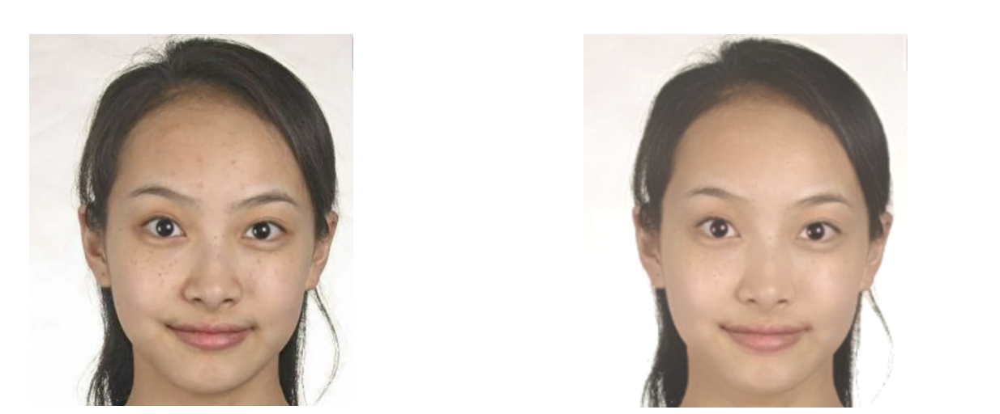

# opencv.js

官网：https://docs.opencv.org/3.4/d5/d10/tutorial_js_root.html

> 磨皮美颜功能

主要函数

1. 实现矩阵加减cv.add(), cv.subtract()
2. 实现矩阵乘 cv.addWeighted()
3. 双边滤波cv.bilateralFilter()
4. 高斯模糊cv.GaussianBlur()

