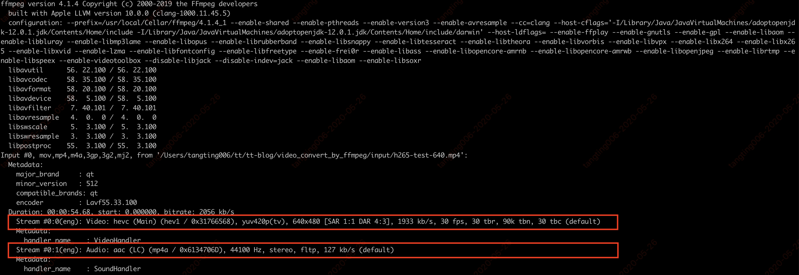
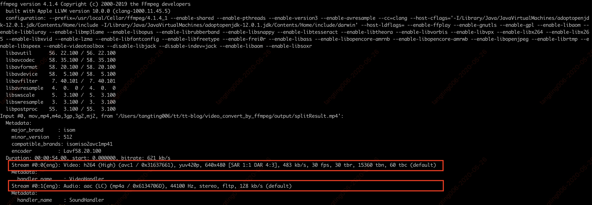

# 使用FFmpeg和WebAssembly实现前端视频转码

参考资料：[HEVC（H.265）与AVC（H.264）的区别与联系](https://blog.csdn.net/fireroll/article/details/77827156)

以chrome浏览器来说，视频video标签，一共支持三种格式： Ogg、MPEG4、WebM。  

MP4 = MPEG 4文件使用 H264 视频编解码器和AAC音频编解码器  
WebM = WebM 文件使用 VP8 视频编解码器和 Vorbis 音频编解码器  
Ogg = Ogg 文件使用 Theora 视频编解码器和 Vorbis音频编解码器  

但现在很多手机设备拍摄的视频是H265格式，浏览器对于H.265支持的并不是很友好,在web上无法播放。

![h265浏览器支持度](images/h265_0.png

## 1. HEVC（H.265）与AVC（H.264）的区别与联系

H.265是相对于H.264的一个升级版，是在原有H.264标准上的一个拓展和优化。H.265旨在在有限带宽下传输更高质量的网络视频，仅需原先的一半带宽即可播放相同质量的视频。H.265标准也同时支持4K（4096×2160）和8K（8192×4320）超高清视频。  

H.265/HEVC视频编码与H.264/AVC使用相同的方法，包括画面帧预测、变换编码、量化等。但H.265/HEVC包括编码单元（CUS）、预测单元（PU）和变换单元（TUS）。  

H.265可提供更好的编码效率，比H.264比特流减少51%～74%。  

### 1.1. H.265与H.264的关联

H.265与H.264同属于ITU-T VCEG（国际视频解码专家组）所制定的视频编码标准，都属于目前世界上最重要的视频解码标准，广泛应用于视频储存、广播电视、网络等各类视频传输流中（在H.265出现之前，H.264几乎是最著名的编解码标准 —— 所有蓝光播放器都必须能解码H.264）。  

H.265是基于H.264技术加以优化后的视频编码标准，在保留H.264技术特性的同时，进一步改善了码流、编码质量、延时和数据算法之间的关系，性能相对更强。  

### 1.2. H.265和H.264的区别

1. H.265是新的编码协议，也即是H.264的升级版。H.265标准保留H.264原来的某些技术，同时对一些相关的技术加以改进。新技术使用先进的技术用以改善码流、编码质量、延时和算法复杂度之间的关系，达到最优化设置。  

2. H.265相比H.264最主要的改变是采用了块的四叉树划分结构，采用了从64×64～8×8像素的自适应块划分，并基于这种块划分结构采用一系列自适应的预测和变换等编码技术。  

3. H.264由于算法优化，可以低于1Mbps的速度实现标清数字图像传送；H.265则可以实现利用1~2Mbps的传输速度传送720P（分辨率1280×720）普通高清音视频传送。  

4. 同样的画质和同样的码率，H.265比H2.64 占用的存储空间要少理论50%。  

5. 比起H.264/AVC，H.265/HEVC提供了更多不同的工具来降低码率，以编码单位来说，H.264中每个宏块（macroblock/MB）大小都是固定的16×16像素，而H.265的编码单位可以选择从最小的8×8到最大的64×64。

6. 在相同的图象质量下，相比于H.264，通过H.265编码的视频大小将减少大约39～44%. 通过主观视觉测试得出的数据显示，在码率减少51～74%的情况下，H.265编码视频的质量还能与H.264编码视频近似甚至更好，其本质上说是比预期的信噪比（PSNR）要好。  

### 1.3. H.265的优势

1. H.265/HEVC的编码架构大致上和H.264/AVC的架构相似，主要也包含，帧内预测（intra prediction）、帧间预测（inter prediction）、转换（transform）、量化（quantization）、去区块滤波器（deblocking filter）、熵编码（entropy coding）等模块。  

但在HEVC编码架构中，整体被分为了三个基本单位，分别是编码单位（coding unit, CU）、预测单位（predict unit, PU）和转换单位（transform unit, TU）。    

基本细节：各功能块的内部细节有很多差异  

并行工具：增加了Tile以及WPP等并行工具集以提高编码速度  

滤波器：在去块滤波之后增加了SAO（sample adaptive offset）滤波模块  


2. 比起H.264/AVC，H.265/HEVC提供了更多不同的工具来降低码率，以编码单位来说，H.264中每个宏块（macroblock/MB）大小都是固定的16x16像素，而H.265的编码单位可以选择从最小的8×8到最大的64×64.同时，采用了更加灵活的编码结构来提高编码效率，包括编码单元（CodingUnit）、预测单元（PredictUnit）和变换单元（TransformUnit）。  


其中:

编码单元类似于H.264/AVC中的宏块的概念，用于编码的过程。  
预测单元是进行预测的基本单元，  
变换单元是进行变换和量化的基本单元。  

这三个单元的分离，使得变换、预测和编码各个处理环节更加灵活，有利于各环节的划分更加符合视频图像的纹理特征，有利于各个单元更优化的完成各自的功能。 


3.  帧内预测模式,本质上H.265是在H.264的预测方向基础上增加了更多的预测方向, H.265：所有尺寸的CU块，亮度有35种预测方向，色度有5种预测方向, H.264：亮度 4x4块9个方向，8x8块9个方向，16x16块4种方向，色度4种方向.


4. 帧间预测  
本质上H.265是在H.264基础上增加插值的抽头系数个数，改变抽头系数值以及增加运动矢量预测值的候选个数，以达到减少预测残差的目的。H.265与H.264一样插值精度都是亮度到1/4，色度到1/8精度，但插值滤波器抽头长度和系数不同.H.265的增加了运动矢量预测值候选的个数，而H.264预测值只有一个.  

5. 去块滤波  
本质上H.265的去块滤波与H.264的去块滤波及流程是一致的，做了如下最显著的改变：  
滤波边界： H.264最小到4x4边界滤波；而H.265适应最新的CU、PU和TU划分结构的滤波边缘，最小滤波边界为8x8，  

滤波顺序：H264先宏块内采用垂直边界，再当前宏块内水平边界；而H.265先整帧的垂直边界，再整帧的水平边界   

6. 采样点自适应偏移（Sample AdaptiveOffset）滤波  

SAO(sample adaptive offset)滤波其实就是对去块滤波后的重建像素按照不同的模板进行分类，并对每一种分类像素进行补偿, 分类模板分为BO(Band offset)和EO(Edge offset)。  

SAO在编解码环路内，位于Deblock之后，通过对重建图像的分类，对每一类图像像素值加减一个偏移，达到减少失真的目的，从而提高压缩率，减少码流。  

采用SAO后，平均可以减少2%~6%的码流,而编码器和解码器的性能消耗仅仅增加了约2%。  

7. Tile  

Tile：将图像分割为矩形区域。其主要目的是增强并行处理性能。  

每个tile区域相当于一幅子图像，可独立的以LCU块为单位进行编解码。  

一个Tile块为基本的并行单元，每个Tile为一个子码流。  

8. WPP  

全称为wavefront  parallel process，以LCU行为基本的编码单位。以一行LCU块为基本的并行单元，每一行LCU为一个子码流。  

9. Dependent slice  

该技术可以理解为对原先Slice NALU的数据划分，使其可以适合更加灵活的打包方式。  

10. 其他相关技术  

Transform_skip模式：transform_skip_flag，该模式不进行变换，但是要进行量化，该模式对文本桌面视频有较好效果。  

内部比特深度增加：为了保证中间预测、变换以及量化过程中的内部比特精度，以达到更好的压缩性能。  

## 2. [FFmpeg介绍](https://ffmpeg.org/)

使用ffmpeg -i input.mp4命令查看视频编码信息





上面2个图分别是h265和h264的视频。  

### 2.1. 常用命令

1. 主要参数

```text
-i 设定输入流 
-f 设定输出格式 
-ss 开始时间 
```

2. 视频参数

```text
-b 设定视频流量(码率)，默认为200Kbit/s 
-r 设定帧速率，默认为25 
-s 设定画面的宽与高 
-aspect 设定画面的比例 
-vn 不处理视频 
-vcodec 设定视频编解码器，未设定时则使用与输入流相同的编解码器 
```

3. 音频参数

```text
-ar 设定采样率 
-ac 设定声音的Channel数 
-acodec 设定声音编解码器，未设定时则使用与输入流相同的编解码器 
-an 不处理音频
```

### 2.2. 视频格式转换

1. 视频格式转换  

例如一个avi文件，想转为mp4

```text
ffmpeg -i input.avi output.mp4
```

2. 提取音频  

只要声音，不要画面

```text
// -an 不处理音频
ffmpeg -i input.mp4 -acodec copy -vn output.aac
```

3. 提取视频  

提取纯视频文件  

```text
// -vn 不处理视频 
ffmpeg -i input.mp4 -vcodec copy -an output.mp4
```

4. 视频剪切  

-ss表示开始切割的时间，-t表示要切多少。

```text
// 从10s开始，截30s的视频
ffmpeg -ss 00:00:10 -t 00:00:30 -i input.mp4 -vcodec copy -acodec copy output.mp4
```

5. 码率控制  

bitrate = file size / duration  码率控制对于在线视频比较重要。因为在线视频需要考虑其能提供的带宽。  

比如一个文件20M，时长1分钟，那么，码率就是：  biterate = 20M bit/60s = 20*1024*1024*8 bit/60s= 2796Kbps  

一般音频的码率只有固定几种，比如是128Kbps， 那么，video的就是  video biterate = 2796Kbps -128Kbps = 2668Kbps。  
ffmpg控制码率有3种选择，-minrate -b:v -maxrate  

- -b:v主要是控制平均码率。 比如一个视频源的码率太高了，有10Mbps，文件太大，想把文件弄小一点，但是又不破坏分辨率。 ffmpeg -i input.mp4 -b:v 2000k output.mp4上面把码率从原码率转成2Mbps码率，这样其实也间接让文件变小了。目测接近一半。  

不过，ffmpeg官方wiki比较建议，设置b:v时，同时加上 -bufsize  

- -bufsize 用于设置码率控制缓冲器的大小，设置的好处是，让整体的码率更趋近于希望的值，减少波动。（简单来说，比如1 2的平均值是1.5， 1.49 1.51 也是1.5, 当然是第二种比较好）   
ffmpeg -i input.mp4 -b:v 2000k -bufsize 2000k output.mp4  

- -minrate -maxrate就简单了，在线视频有时候，希望码率波动，不要超过一个阈值，可以设置maxrate。  
ffmpeg -i input.mp4 -b:v 2000k -bufsize 2000k -maxrate 2500k output.mp4    

6. 视频编码格式转换  

比如一个视频想用H264编码  ffmpeg -i input.mp4 -vcodec h264 output.mp4  

7. 为视频添加logo  

./ffmpeg -i input.mp4 -i logo.png -filter_complex overlay output.mp4  

### 2.3. node+ffmpeg进行视频格式转换（转换成h264）

用到的是ffmpeg库，可以在npm下载，查看[API文档](https://www.npmjs.com/package/ffmpeg)。   

视频格式转换  

```js
convertVideo(videoPath, type, outVideoPath) {
    const process = new ffmpeg(videoPath)
    return process.then((video) => {
      video
        .setVideoCodec(type)
        .save(outVideoPath, function (error, file) {
          if (!error) {
            console.log('convertVideo file: ' + file)
          }
        })
    }, (err) => {
      console.log('convertVideo Error: ' + err)
    })
  }
```

方法调用

```js
await FfmpegOpObj.convertVideo(videoPath, 'h264', outputPath + 'convertVideo.mp4');
```

获取视频的第一帧画面，用作视频封面  

```js
getVideoSceenshots(videoPath, outPutPath, frameRate, frameCount) {
  const process = new ffmpeg(videoPath);
  return process.then((video) => {
    video.fnExtractFrameToJPG(outPutPath, {
      frame_rate: frameRate,
      number: frameCount,
      file_name: 'video_frame_%t_%s'
    }, (error, files) => {
      if (!error)
        console.log('Frames: ' + files)
    })
  }, function (err) {
    console.log('Error: ' + err)
  })
}
```


## 3. WebAssembly介绍  


