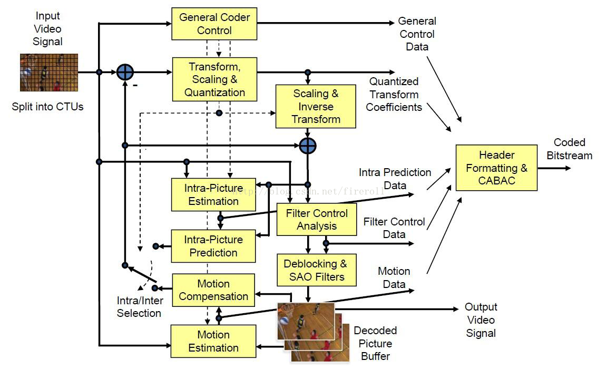
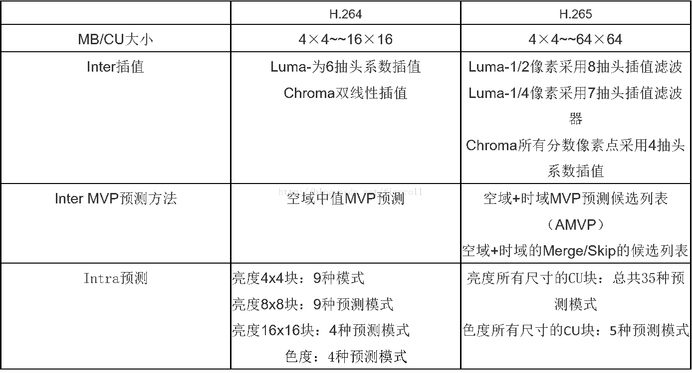
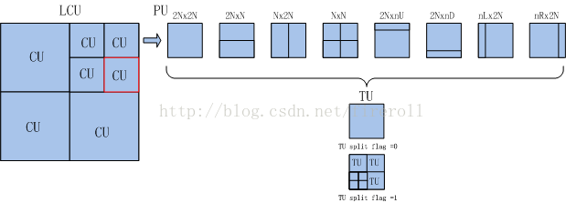
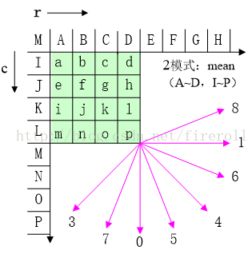

# 使用FFmpeg和WebAssembly实现前端视频转码

参考资料：[HEVC（H.265）与AVC（H.264）的区别与联系](https://blog.csdn.net/fireroll/article/details/77827156)

以chrome浏览器来说，视频video标签，一共支持三种格式： Ogg、MPEG4、WebM。  

MP4 = MPEG 4文件使用 H264 视频编解码器和AAC音频编解码器  
WebM = WebM 文件使用 VP8 视频编解码器和 Vorbis 音频编解码器  
Ogg = Ogg 文件使用 Theora 视频编解码器和 Vorbis音频编解码器  

但现在很多手机设备拍摄的视频是H265格式，在web上无法播放

## 1. HEVC（H.265）与AVC（H.264）的区别与联系

H.265是相对于H.264的一个升级版，是在原有H.264标准上的一个拓展和优化。H.265旨在在有限带宽下传输更高质量的网络视频，仅需原先的一半带宽即可播放相同质量的视频。H.265标准也同时支持4K（4096×2160）和8K（8192×4320）超高清视频。  

H.265/HEVC视频编码与H.264/AVC使用相同的方法，包括画面帧预测、变换编码、量化等。但H.265/HEVC包括编码单元（CUS）、预测单元（PU）和变换单元（TUS）。  

H.265可提供更好的编码效率，比H.264比特流减少51%～74%。  

### 1.1. H.265与H.264的关联

H.265与H.264同属于ITU-T VCEG（国际视频解码专家组）所制定的视频编码标准，都属于目前世界上最重要的视频解码标准，广泛应用于视频储存、广播电视、网络等各类视频传输流中（在H.265出现之前，H.264几乎是最著名的编解码标准 —— 所有蓝光播放器都必须能解码H.264）。  

H.265是基于H.264技术加以优化后的视频编码标准，在保留H.264技术特性的同时，进一步改善了码流、编码质量、延时和数据算法之间的关系，性能相对更强。  

### 1.2. H.265和H.264的区别

1. H.265是新的编码协议，也即是H.264的升级版。H.265标准保留H.264原来的某些技术，同时对一些相关的技术加以改进。新技术使用先进的技术用以改善码流、编码质量、延时和算法复杂度之间的关系，达到最优化设置。  

2. H.265相比H.264最主要的改变是采用了块的四叉树划分结构，采用了从64×64～8×8像素的自适应块划分，并基于这种块划分结构采用一系列自适应的预测和变换等编码技术。  

3. H.264由于算法优化，可以低于1Mbps的速度实现标清数字图像传送；H.265则可以实现利用1~2Mbps的传输速度传送720P（分辨率1280×720）普通高清音视频传送。  

4. 同样的画质和同样的码率，H.265比H2.64 占用的存储空间要少理论50%。  

5. 比起H.264/AVC，H.265/HEVC提供了更多不同的工具来降低码率，以编码单位来说，H.264中每个宏块（macroblock/MB）大小都是固定的16×16像素，而H.265的编码单位可以选择从最小的8×8到最大的64×64。

6. 在相同的图象质量下，相比于H.264，通过H.265编码的视频大小将减少大约39～44%. 通过主观视觉测试得出的数据显示，在码率减少51～74%的情况下，H.265编码视频的质量还能与H.264编码视频近似甚至更好，其本质上说是比预期的信噪比（PSNR）要好。  

### 1.3. H.265的优势

1. H.265/HEVC的编码架构大致上和H.264/AVC的架构相似，主要也包含，帧内预测（intra prediction）、帧间预测（inter prediction）、转换（transform）、量化（quantization）、去区块滤波器（deblocking filter）、熵编码（entropy coding）等模块。  

但在HEVC编码架构中，整体被分为了三个基本单位，分别是编码单位（coding unit, CU）、预测单位（predict unit, PU）和转换单位（transform unit, TU）。    

基本细节：各功能块的内部细节有很多差异  

并行工具：增加了Tile以及WPP等并行工具集以提高编码速度  

滤波器：在去块滤波之后增加了SAO（sample adaptive offset）滤波模块  

2. 比起H.264/AVC，H.265/HEVC提供了更多不同的工具来降低码率，以编码单位来说，H.264中每个宏块（macroblock/MB）大小都是固定的16x16像素，而H.265的编码单位可以选择从最小的8×8到最大的64×64.同时，采用了更加灵活的编码结构来提高编码效率，包括编码单元（CodingUnit）、预测单元（PredictUnit）和变换单元（TransformUnit）。  

其中:

编码单元类似于H.264/AVC中的宏块的概念，用于编码的过程。  
预测单元是进行预测的基本单元，  
变换单元是进行变换和量化的基本单元。  

这三个单元的分离，使得变换、预测和编码各个处理环节更加灵活，有利于各环节的划分更加符合视频图像的纹理特征，有利于各个单元更优化的完成各自的功能。 

3.  帧内预测模式,本质上H.265是在H.264的预测方向基础上增加了更多的预测方向, H.265：所有尺寸的CU块，亮度有35种预测方向，色度有5种预测方向, H.264：亮度 4x4块9个方向，8x8块9个方向，16x16块4种方向，色度4种方向.

4. 帧间预测  
本质上H.265是在H.264基础上增加插值的抽头系数个数，改变抽头系数值以及增加运动矢量预测值的候选个数，以达到减少预测残差的目的。H.265与H.264一样插值精度都是亮度到1/4，色度到1/8精度，但插值滤波器抽头长度和系数不同.H.265的增加了运动矢量预测值候选的个数，而H.264预测值只有一个.  

5. 去块滤波  
本质上H.265的去块滤波与H.264的去块滤波及流程是一致的，做了如下最显著的改变：  
滤波边界： H.264最小到4x4边界滤波；而H.265适应最新的CU、PU和TU划分结构的滤波边缘，最小滤波边界为8x8，  

滤波顺序：H264先宏块内采用垂直边界，再当前宏块内水平边界；而H.265先整帧的垂直边界，再整帧的水平边界  

6. 采样点自适应偏移（Sample AdaptiveOffset）滤波  

